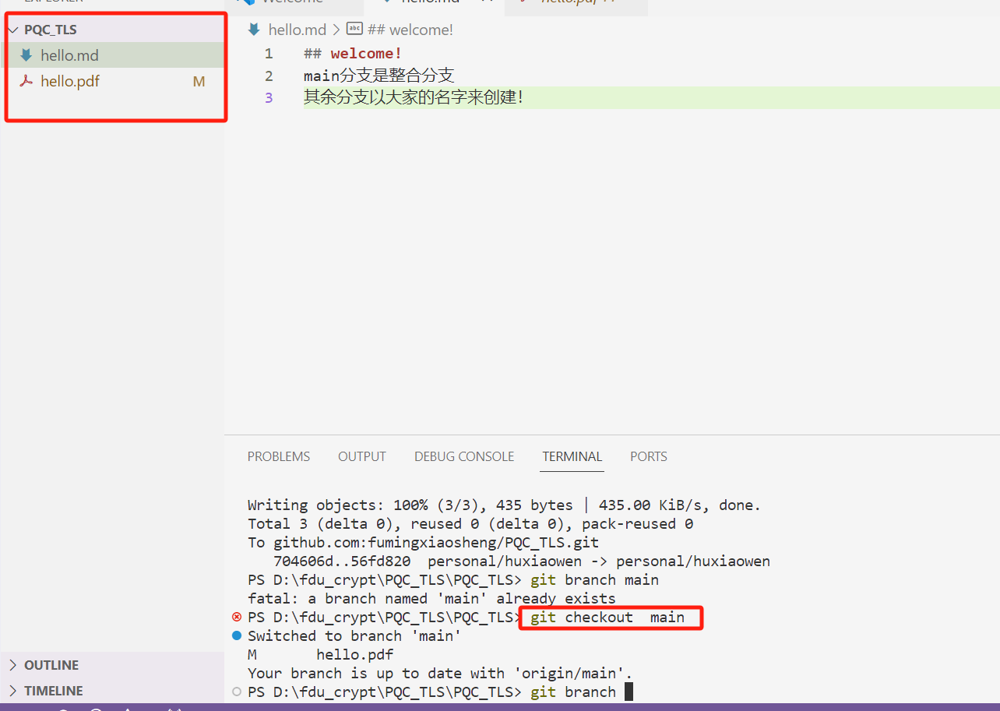
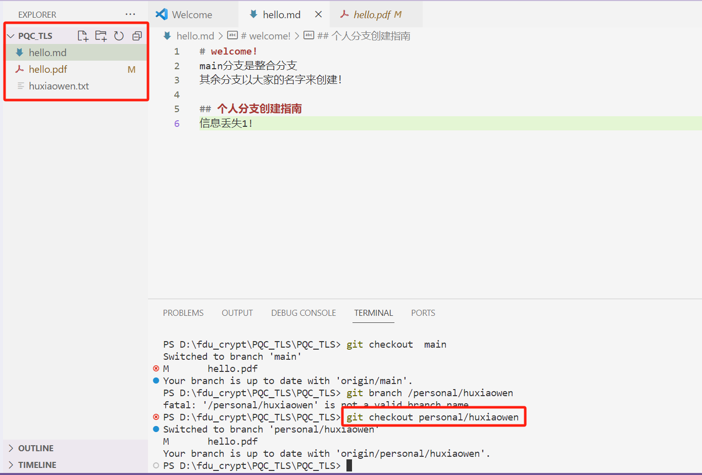

## welcome!
main分支是整合分支
其余分支以大家的名字来创建！

## 分支切换



## 上传代码
``` bash
git add [x可以是待上传的代码文件，或者是文件夹]
git commit -m "[提交的说明信息]"
git push 
```
举例，切换到main分支后，上传更新好的hello.md
``` bash
git add hello.md
git commit -m "read me first"
git push
```