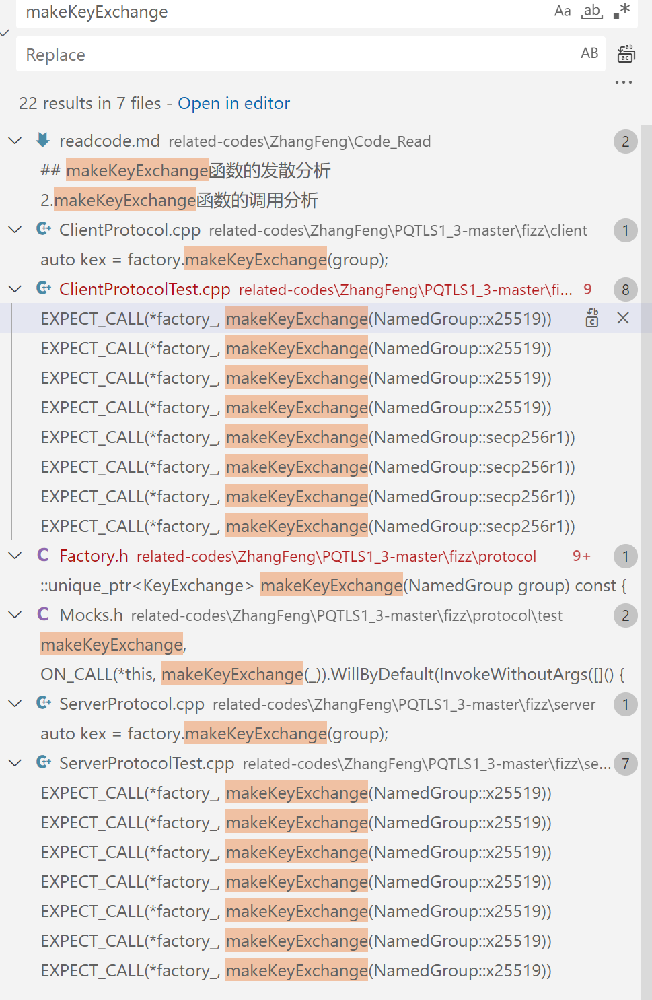

# 后量子轨迹查找
## kex类的查找与使用

1.OQSKeyExchange()类的位置
related-codes\ZhangFeng\PQTLS1_3-master\fizz\crypto\exchange\OQSKeyExchange.h
2.AKCNKeyExchange()类的位置
related-codes\ZhangFeng\PQTLS1_3-master\fizz\crypto\exchange\AKCNKeyExchange.h
3.HybridKeyExchange的位置
related-codes\ZhangFeng\PQTLS1_3-master\fizz\crypto\exchange\HybridKeyExchange.h

这些类都是从KeyExchange类中继承得到的，KeyExchange类的位置在
related-codes\ZhangFeng\PQTLS1_3-master\fizz\crypto\exchange\KeyExchange.h
keyExchange类只是定义了几个需要被

对二者进行比较，发现多出来了红框中的新类


>注意在具体的实现上，也是不一样的，现在的问题是，那些模板参数传递进去之后，是如何被使用的呢？

### X25519类的实现
X25519类的实现位置为related-codes\ZhangFeng\PQTLS1_3-master\fizz\crypto\exchange\X25519.cpp
其中主要用到了libsodium中的这两个函数来实现X25519算法
```cpp
crypto_box_curve25519xsalsa20poly1305_keypair()
crypto_scalarmult()
```

### OQSKeyExchange类的实现
首先在related-codes\ZhangFeng\PQTLS1_3-master\fizz\crypto\exchange\OQSKeyExchange-inl.h 中定义了每种后量子算法在liboqs中对应的编号


然后会定义每一个模板函数，模板函数中的T对应了后量子算法的名称和类型，进一步地，定义了T::OQS_ID来指示该后量子算法在liboqs中的编号，然后后调用liboqs中的函数来实现真正的功能，并将其进行封装传递给上层的统一接口。

### AKCNKeyExchange类的实现
todo:
1.akcn的实现是否已经被封装在了一个库中呢？
2.如果是自己实现的，那么应该如何进行调用呢？

观察下图，比较重要的keygen、enc和dec函数并没有在代码中被实现，因此猜测其你可能在其他的库中被实例化了,gpt上说这是一个外部函数


在最外层的CmakeLists.txt中，显示似乎这些支持应该是由自己提供的


## makeKeyExchange函数的发散分析
重新定义了新的命名空间


1.NamedGroup的跟踪  **NamedGroup的具体的定义，即能够取哪些值，是在哪里找到的呢?**

将字符串解析为NamedGroup枚举值的函数inline NamedGroup parse(folly::StringPiece s)位于
related-codes\ZhangFeng\PQTLS1_3-master\fizz\util\Parse-inl.h

2.makeKeyExchange函数的调用分析
直观来看，对于该函数的调用基本上都位于客户端、服务端的测试代码中


客户端和服务端的代码都是基于gmock来实现的，而gmock的配置是由related-codes\ZhangFeng\PQTLS1_3-master\build\fbcode_builder\CMake\FindGMock.cmake来实现的
>总体而言，gmock 不是在这个项目代码中实现的，而是通过 CMake 脚本来配置项目，以使用 GTest 和 GMock 库进行单元测试。项目本身可能会包含测试代码，而 gmock提供了在这些测试中使用模拟对象的能力。

TODO:2023-12-1 (stuck!!!)
1.gmock是如何进行使用的呢？
2.整体的一个测试流程是什么样的呢？

```cpp
class ClientProtocolTest : public ProtocolTest<ClientTypes, Actions> ///ClientProtocolTest是从类ProtocolTest中继承得到的 related-codes\ZhangFeng\PQTLS1_3-master\fizz\client\test\ClientProtocolTest.cpp
template <typename SM, typename Actions> class ProtocolTest : public testing::Test///ProtocolTest是从Test类中继承得到的 related-codes\ZhangFeng\PQTLS1_3-master\fizz\protocol\test\ProtocolTest.h
```
## 环境配置问题总结
1.出现了一些报错->可能原因是openssl版本过低

解决办法1:把signature的cmake选项给去掉

进一步地阅读CmakeList.txt,发现相应的被修改的依赖都没有给出


解决办法2:跟着论文里的步骤完成相应OID的注册


但是存在的问题是，代码中似乎没有给出相应的对于openssl库的修改


## C++相关使用函数记录
### make_unique
在C++中，std::make_unique是一个用于创建动态分配的std::unique_ptr对象的函数模板。std::unique_ptr是C++11引入的智能指针，用于管理动态分配的对象生命周期，避免内存泄漏和手动释放的问题。

std::make_unique的作用是通过参数传递给构造函数来创建一个新的对象，并返回一个std::unique_ptr，这个指针拥有该对象的唯一所有权。使用std::make_unique相比直接使用new操作符或std::unique_ptr的构造函数更加安全和便捷，因为它可以避免内存泄漏，同时也可以提高代码的可读性。

以下是一个简单的示例，演示了使用std::make_unique的情况：
```cpp
#include <memory>

class MyClass {
public:
    MyClass(int value) : value_(value) {
        // 构造函数的实现
    }

    void someFunction() {
        // 类的成员函数实现
    }

private:
    int value_;
};

int main() {
    // 使用 std::make_unique 创建 std::unique_ptr
    std::unique_ptr<MyClass> myObject = std::make_unique<MyClass>(42);

    // 使用 std::unique_ptr 操作对象
    myObject->someFunction();

    // 不需要手动释放内存，当 myObject 超出作用域时，会自动释放对象
    return 0;
}
```
### 类模板
在C++中，你可以使用模板来创建模板类（class template），并通过继承来派生自类模板。下面是一个简单的示例，演示了如何继承类模板：
```cpp
#include <iostream>

// 基类模板
template <typename T>
class BaseTemplate {
public:
    BaseTemplate(T value) : data_(value) {}

    void display() {
        std::cout << "BaseTemplate: " << data_ << std::endl;
    }

protected:
    T data_;
};

// 派生类模板
template <typename T>
class DerivedTemplate : public BaseTemplate<T> {
public:
    DerivedTemplate(T value, T additionalValue) : BaseTemplate<T>(value), additionalData_(additionalValue) {}

    void displayDerived() {
        // 可以访问基类的 protected 成员
        std::cout << "DerivedTemplate: " << this->data_ << ", Additional: " << additionalData_ << std::endl;
    }

private:
    T additionalData_;
};

int main() {
    // 使用类模板
    DerivedTemplate<int> derivedObject(42, 10);

    // 调用基类模板的成员函数
    derivedObject.display();

    // 调用派生类模板的成员函数
    derivedObject.displayDerived();

    return 0;
}
```
在这个例子中，BaseTemplate是一个模板类，它有一个模板参数 T。DerivedTemplate 类通过 : public BaseTemplate<T> 表示它继承自 BaseTemplate。通过这种方式，DerivedTemplate 可以访问 BaseTemplate 中的成员变量和成员函数。

需要注意的是，由于模板的特殊性，对于继承类模板，需要在继承时显式提供模板参数。在 main 函数中，我们创建了一个 DerivedTemplate<int> 类的对象，并调用了基类和派生类的成员函数。

这里要注意的是，在派生类中，为了访问基类的成员变量 data_，我们使用了 this->data_ 或者直接 BaseTemplate<T>::data_，因为在模板中，名称查找可能会更加复杂。

### namespace
在C++中，namespace是用于组织代码并防止命名冲突的一种机制。它允许将代码的各个部分分组到一个逻辑单元中，从而提高代码的模块化和可维护性。namespace可以包含变量、函数、类等。

**含义：**

作用域分隔： namespace提供了一个作用域（或命名空间），在其中你可以定义变量、函数、类等，而这些定义对于其他命名空间是不可见的，除非通过特定的语法引入。

避免命名冲突： 它有助于防止不同代码单元之间的命名冲突。当你在不同的库或模块中使用相同的名称时，将它们放入不同的命名空间可以防止名称冲突。

```cpp
// 定义一个命名空间
namespace MyNamespace {
    int myVariable;  // 变量 此时已经为myVariable分配了内存空间，注意和类进行区别
    void myFunction();  // 函数

    class MyClass {
        // 类
    };
}

// 在使用时，通过作用域运算符(::)来访问命名空间中的成员
int main() {
    MyNamespace::myVariable = 42;  // 访问变量
    MyNamespace::myFunction();  // 调用函数

    MyNamespace::MyClass obj;  // 创建类的实例

    return 0;
}

```
>1.在namespace中声明的变量，其实已经被分配内存空间了，而不是说像类一样，需要实例化一个类之后，才会有对于该变量的内存分配
>2.声明不会触发内存分配，只有定义才会
>```cpp
>// 声明命名空间
>namespace MyNamespace {
>    extern int myVariable;  // 声明 myVariable 变量，关键字 'extern' 表示这是一个声明而不是定义
>}
>// 在其他文件或同一文件的其他位置定义 myVariable 变量
>int MyNamespace::myVariable = 42;
>int main() {
>    // 访问 myVariable 变量
>    int value = MyNamespace::myVariable;
>    return 0;
>}
>```

### 模板特化和模板函数
模板特化（Template Specialization）和模板函数（Function Template）是C++中泛型编程的两个关键概念，它们有以下主要区别：

定义：

模板函数： 是使用 template <typename T> 或 template <class T> 声明的泛型函数，能够适用于多种类型。通用实现对于多种类型都是一样的。
模板特化： 是对泛型模板的特殊情况提供专门实现的过程。为特定的类型或特定的值提供特定的实现。
实现：

模板函数： 通常具有通用的实现，适用于多种类型。模板函数的主体代码是一致的，不依赖于特定的类型。
模板特化： 提供了针对特定类型或值的具体实现。当模板函数需要特殊处理某些类型时，可以通过特化来提供专门的逻辑。
语法：

模板函数： 通过 template <typename T> 或 template <class T> 声明，并在函数体中使用模板参数 T。
模板特化： 使用 template <> 语法，指定了特化的模板类型或值，然后提供了具体的实现。
适用范围：

模板函数： 通常用于通用实现适用于多种类型的情况，代码可以在不同类型上共享。
模板特化： 用于为某些特殊的类型或值提供个性化的实现，以覆盖通用实现。
示例：

模板函数示例：
```cpp
template <typename T>
T Max(T a, T b) {
    return a > b ? a : b;
}
```
模板特化示例：
```cpp
template <>
int Max<int>(int a, int b) {
    return a > b ? a : b;
}
```
总体而言，模板函数是泛型编程的基础，提供通用的实现；而模板特化则允许在特定情况下提供个性化的实现，增强了泛型代码的灵活性。
