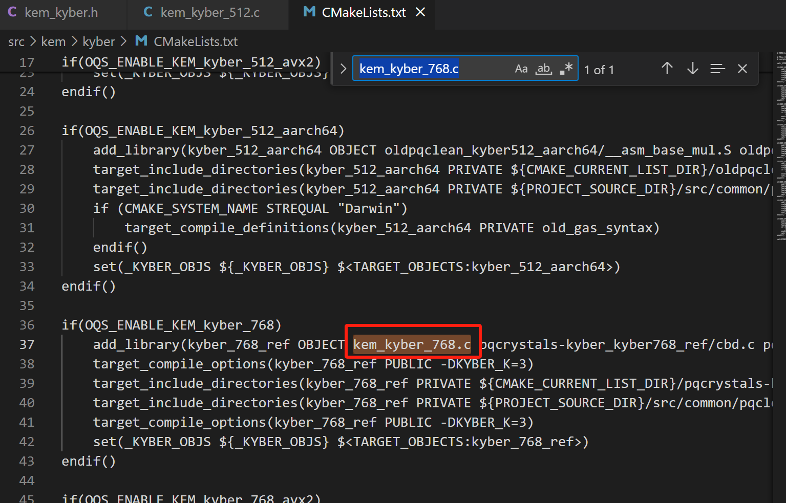

1.粘贴文件，形成不同的文件夹
fptru
    /fptru_653_batch
    /fptru_761_batch
    /fptru_1277_batch

2.编写CmakeList.txt
```
if(OQS_ENABLE_KEM_fptru_761)
    add_library(fptru_761_batch OBJECT kem_fptru_761_batch.c fptru_761_batch/poly_mul_n761q/radix_ntt_n761.c fptru_761_batch/cbd.c fptru_761_batch/coding.c fptru_761_batch/cpucycles.c fptru_761_batch/fips202.c fptru_761_batch/inverse.c fptru_761_batch/kem.c fptru_761_batch/pack.c fptru_761_batch/pke.c fptru_761_batch/poly.c fptru_761_batch/randombytes.c fptru_761_batch/reduce.c fptru_761_batch/speed.c) #这里不能够有斜杠 添加源文件以形成一个库
    target_compile_options(fptru_761_batch PUBLIC -DFPTRU_N=761) #设置编译的选项
    target_include_directories(fptru_761_batch PRIVATE ${CMAKE_CURRENT_LIST_DIR}/fptru_761_batch) #设置搜索的头文件路径
    target_include_directories(fptru_761_batch PRIVATE ${CMAKE_CURRENT_LIST_DIR}/fptru_761_batch/poly_mul_n761q)
    set(_FPTRU_OBJS ${_FPTRU_OBJS} $<TARGET_OBJECTS:fptru_761_batch>)
endif()
```

3.编写头文件 kem_fptru.h

>//TODO:这里的宏是否需要改成batch的？

为什么在这里只出现了一次呢，是一个参数对应的一组实现放在一个.c文件中嘛?
batch版本的接口是什么，一次生成多个具体可以应用在哪里呢？

4.编写kem_fptru_653/761/1277.c三个文件
主要是将原先的ctruprime653改成fptru653,然后其他的就在这个基础上进行修改

6.修改kem.c和kem.h文件
根据//HXW的指引

7.重写CMakelists.txt文件
