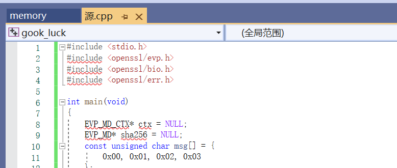

代码网址:https://github.com/open-quantum-safe/openssl

open-quantumn-safe网址:https://openquantumsafe.org/ oqs的主要工作路线为开发相关的密码学库和将这些集成到相关的协议中

openssl的官网介绍: https://www.openssl.org/
openssl的provider介绍: csrc.nist.gov/Projects/post-quantum-cryptography/publications

这里似乎是在介绍怎么添加新的加密原语？https://www.openssl.org/docs/manmaster/man7/provider-cipher.html

# 一些官方文档的阅读总结
## 2023-12-18:
openssl的官网感觉一直在介绍怎么去用相应的函数，并没有给出相关的内容
todo:看一下代码文档里的md文件
# openssl
## 代码结构
demos下给出了一些样例->看下能不能跑起来

related-codes\oqs-tls\openssl-master\crypto\evp\kem.c 似乎给出了kem的接口

想尝试写一个代码，但是发现无法打开openssl

>如果说自己要内置一个库来进行实现的话，可能需要在装openssl的时候就使用源码安装的方式，然后再进行库的一个调用

## 概述
1.命令行
2.两个库libssl(提供两个实体之间的ssl交互)和libcrypto(提供相关的密码学原语，例如加解密等)
3.大量provider

openssl的多线程安全问题和需要去关注调用的openssl函数的返回值所代表的确切的含义并进行错误的处理
openssl在第一次时会加载一个配置文件
## provider
在openssl中，provider是提供相应密码套件原语的部分。
> In order to use an algorithm you must have at least one provider loaded that contains an implementation of it.
内置(built-in)的provider可能已经在libcrypto中实现或者由函数本身实现
还有一类provider是一个单独的可加载模块文件，例如.so和.dll

provider一般只会load和unload一次

不同的provider可能会实现一个相同的算法，使用PROPERTY QUERY STRINGS来为算法的选择指定一些条件，例如provider=default

每个provider下都会有相应的算法实现，应该进行选择

### 1.default provider
默认提供程序是作为libcrypto库的一部分内置的，包含所有最常用的算法实现。
### 2.base provider
基本提供程序是作为libcrypto库的一部分内置的，包含用于编码和解码OpenSSL密钥的算法实现。一些不是fips的算法支持fips mode的使用
provider=base
### 3.fips provider
FIPS提供程序是一个可动态加载的模块，因此必须以代码或通过OpenSSL配置显式加载。包含所有通过fips标准的算法
provider=fips

### 4.Legacy provider
遗留提供程序是一个可动态加载的模块，因此必须以代码或通过OpenSSL配置显式加载（请参阅配置（5））。它包含被认为不安全的或不再常用的算法实现，如MD2或RC4。
provider=legacy

### 5.null provider
null提供程序是作为libcrypto库的一部分内置的。它根本不包含任何算法。

## library context
库的语境规定了一些配置
每一个provider都会使用一个library context作为参数
library context都会使用OSSL_LIB_CTX作为参数，默认值为NULL，代表使用default library context

## libcrypto
libcrypto适用于ssl的实现
>The functionality includes symmetric encryption, public key cryptography, key agreement, certificate handling, cryptographic hash functions, cryptographic pseudo-random number generators, message authentication codes (MACs), key derivation functions (KDFs), and various utilities.

在openssl中，算法(algorithm)代表的是一整个提出的算法（比如说sha256、AES加密等等），不同的provider下可能实现了不同的算法，比如说default和fips下对于RSA都有实现，但是一个是通过了fips测试的。

使用显示的fetch的方法来寻找匹配的算法，使用APINAME_fetch来找对应的算法，使用完成后使用APINAME_free来释放掉相应的指针。APINAME_fetch函数需要指定library context(只有在该context下的provider中的algorithm才能被使用)

使用隐式的方法来寻找匹配的算法，主要是为了和以前不支持显示寻找的版本进行兼容，使用了默认的搜索标准

在opensll中，操作(operation)代表的是每个不同的算法所执行的操作，比如说加密等等

对于相应libcrypto中获取的算法的使用，需要借助EVP(https://www.openssl.org/docs/manmaster/man7/evp.html)这个API。具体的使用流程为：（1）首先创建一个CTX，例如EVP_CIPHER_CTX（2）使用init函数来进行初始化 （3）使用update的方式来给出数据 （4）final call进行调用并得到最终的输出结果

关于**openssl**中密钥封装的产生与使用方式，可以直接再新[产生](https://www.openssl.org/docs/manmaster/man3/EVP_PKEY_Q_keygen.html)一个，也可以从别的地方load过来，后者便涉及到了[encode](https://www.openssl.org/docs/manmaster/man3/OSSL_ENCODER_CTX_new_for_pkey.html)和[Decode](https://www.openssl.org/docs/manmaster/man3/OSSL_DECODER_CTX_new_for_pkey.html)的问题

## libssl
libssl提供了一些安全网络交互协议的具体实现(比如说SSL/TLS、DTLS、QUIC等)，基于libcrypto来实现相关的协议中所使用到的密码原语。

为了使用libssl，首先必须使用头文件<openssl/ssl.h>，主要使用到的两个数据结构是SSL和SSL_CTX

数据结构SSL再不同的互联网交互协议中有不同的含义，例如SSL/TLS和QUIC中是stream(要求必须按序且没有数据丢失,stream可以是单向的，也可以是双向的),在DTLS中是datagram(允许丢失且不一定是按序到达的)

数据结构SSL_CTX对象用于为基础连接创建SSL对象。基于一个SSL_CTX对象可以创建多个SSL对象(连接)。对于SSL_CTX的修改会被反应到基于其的SSL对象上，而基于同一个SSL_CTX的SSL对象之间是不会互相影响的。

## openssl中的ssl协议简介
一些用语:
endpoint代表的是通信的双方
peer代表的是当前语境下通信一方的对方

ssl协议的历史:
1995年:SSLv2
1996年:SSLv3
1999年:TLSv1.0
2006年:TLSv1.1
2008年:TLSv1.2
2018年:TLSv1.3
openssl支持SSLv3及以上的版本，需要注意的是，对于SSLv3的支持是使用的编译时选项

一些重要的点:
TLS支持TLS版本的协商，使用的是客户端和服务端所共同支持的最大的版本号

认证:
需要使用到X.509证书，证书中包含了服务端的一些信息，比如说DNS主机名、公钥。认证的过程使用了签名同时还使用到了CA来完成整个证书链的认证。由于需要对整个证书链进行认证，对于证书链上的CA，认证方应该具备其证书，这就要求endpoint有这些证书的本地存储。
可以使用openssl version -d来查看当前openssl中是否自带了一些链上的证书文件，通常证书文件会被放在cert文件夹下。此外，SSL_CERT_PATH是openssl查找相应证书文件的系统环境变量

比较重要的几个数据结构:
1.SSL在TLS连接中，SSL结构体用于双方数据的存储与传输，endpoint可以向其中写入数据，也可以向其中读出数据。一个新的SSL结构体是从SSL_CTX中获取得到的，在SSL_CTX中做一些配置，然后从该SSL_CTX中生成多个SSL结构体(SSL结构体会继承SSL_CTX中的配置)。
2.SSL对象会和两个BIO对象相关联。BIO对象用于从下面的传输层发送或者接收数据。BIO充当的是TCP套接字的功能，具体是充当一方还是两方的套接字，这是由编程者决定的。

会话(session)中保存了客户端和服务端之间的一系列TLS参数，可以在下次连接时重新使用这些参数。

## TLS的连接阶段
[参考链接](https://www.openssl.org/docs/manmaster/man7/ossl-guide-tls-introduction.html)
setup:
1.双方创建SSL_CTX对象并且配置它
2.客户端创建SSL对象来代表新的TLS连接。应用相关的配置并使用BIP对象来创建TCP套接字。
3.服务端创建一个套接字来监听所有的客户端发起的连接。一旦建立了一个连接，服务端也会创建一个SSL对象，并将其和一个BIO对象相关联。

handshake:
双方交换信息，ClientHello和ServerHello。整个handshake的过程是以"Finished"消息来作为终结的。

data transfer phase:
客户端和服务端任意地写/读数据

shutdown:
"close_notify"用于标记连接的关闭
