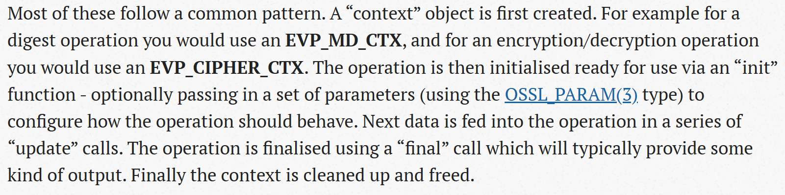

代码网址:https://github.com/open-quantum-safe/openssl

open-quantumn-safe网址:https://openquantumsafe.org/ oqs的主要工作路线为开发相关的密码学库和将这些集成到相关的协议中

openssl的官网介绍: https://www.openssl.org/
openssl的provider介绍: csrc.nist.gov/Projects/post-quantum-cryptography/publications

这里似乎是在介绍怎么添加新的加密原语？https://www.openssl.org/docs/manmaster/man7/provider-cipher.html

# 一些官方文档的阅读总结
## 2023-12-18:
openssl的官网感觉一直在介绍怎么去用相应的函数，并没有给出相关的内容
todo:看一下代码文档里的md文件
## 2024-1-7
related-codes\oqs-tls\openssl-master\demos\keyexch\x25519.c主体流程是生成对等方的公钥和私钥，然后以传递参数的形式来模拟了双方交互自己公钥的行为，最终生成一个共享的秘密并比较两个秘密之间是否相等。

在related-codes\oqs-tls\openssl-master\include\openssl\core_names.h.in中，给出了不同的值对应的宏定义，其中，关于KEM的是下面的两条
```cpp
/* OSSL_KEM_PARAM_OPERATION values */
#define OSSL_KEM_PARAM_OPERATION_RSASVE     "RSASVE" 
#define OSSL_KEM_PARAM_OPERATION_DHKEM      "DHKEM"
```
>RSASVE 是 NIST.SP.800-56Br2 中定义的密钥交换机制的一部分，它指的是基于 RSA 的密钥交换算法。具体而言，RSASVE（RSA Key Encapsulation Mechanism with Sender Validation）是 NIST 标准中描述的一种密钥封装机制，用于保护密钥交换的安全性。

related-codes\oqs-tls\openssl-master\include 相关的头文件都定义在这个文件夹下

TODO:
X25519使用的函数都是从哪里来的

## 2024-1-8
下图似乎表示，在oqs中支持的是"X25519", "ED25519", "X448" or "ED448"四种密钥协商的方法


### EVP_PKEY类型的查找

evp_pkey_st结构体定义在related-codes\oqs-tls\openssl-master\include\crypto\evp.h中
```cpp
struct evp_pkey_st {
    /* == Legacy attributes == */
    int type;
    int save_type;

# ifndef FIPS_MODULE
    /*
     * Legacy key "origin" is composed of a pointer to an EVP_PKEY_ASN1_METHOD,
     * a pointer to a low level key and possibly a pointer to an engine.
     */
    const EVP_PKEY_ASN1_METHOD *ameth;
    ENGINE *engine;
    ENGINE *pmeth_engine; /* If not NULL public key ENGINE to use */

    /* Union to store the reference to an origin legacy key */
    union legacy_pkey_st pkey;

    /* Union to store the reference to a non-origin legacy key */
    union legacy_pkey_st legacy_cache_pkey;
# endif

    /* == Common attributes == */
    CRYPTO_REF_COUNT references;
    CRYPTO_RWLOCK *lock;
#ifndef FIPS_MODULE
    STACK_OF(X509_ATTRIBUTE) *attributes; /* [ 0 ] */
    int save_parameters;
    unsigned int foreign:1; /* the low-level key is using an engine or an app-method */
    CRYPTO_EX_DATA ex_data;
#endif

    /* == Provider attributes == */

    /*
     * Provider keydata "origin" is composed of a pointer to an EVP_KEYMGMT
     * and a pointer to the provider side key data.  This is never used at
     * the same time as the legacy key data above.
     */
    EVP_KEYMGMT *keymgmt;//密钥管理的方式
    void *keydata;//存储具体的密钥值，具体的存储方式由keymgmt来决定
    /*
     * If any libcrypto code does anything that may modify the keydata
     * contents, this dirty counter must be incremented.
     */
    size_t dirty_cnt;//记录密钥被修改的次数

    /*
     * To support transparent execution of operation in backends other
     * than the "origin" key, we support transparent export/import to
     * those providers, and maintain a cache of the imported keydata,
     * so we don't need to redo the export/import every time we perform
     * the same operation in that same provider.
     */
    STACK_OF(OP_CACHE_ELEM) *operation_cache;//提供cache机制来避免重复的加载

    /*
     * We keep a copy of that "origin"'s dirty count, so we know if the
     * operation cache needs flushing.
     */
    size_t dirty_cnt_copy;

    /* Cache of key object information */
    struct {
        int bits;
        int security_bits;
        int size;
    } cache;
} /* EVP_PKEY */ ;

```
与此类似的，在types.
其具体的结构体在related-codes\oqs-tls\openssl-master\crypto\evp\evp_local.h中进行定义


### KEX相关的结构体查找
在related-codes\oqs-tls\openssl-master\crypto\evp\evp_local.h文件中，存在结构体evp_keyexch_st(EVP_KEYEXCH)
```cpp
/*2024-1-8
每个成员函数指针都指向一个具体的实现，从而提供了一种灵活的方式，允许不同的密钥交换方法通过实现这些函数来与 OpenSSL 库进行集成。
*/
struct evp_keyexch_st {
    int name_id;
    char *type_name;
    const char *description;
    OSSL_PROVIDER *prov;//表示提供者的信息
    CRYPTO_REF_COUNT refcnt;//引用计数，用于追踪该结构体被引用的次数

    //密钥交换上下文的创建和销毁
    OSSL_FUNC_keyexch_newctx_fn *newctx;
    OSSL_FUNC_keyexch_init_fn *init;
    OSSL_FUNC_keyexch_freectx_fn *freectx;
    OSSL_FUNC_keyexch_dupctx_fn *dupctx;

    OSSL_FUNC_keyexch_set_peer_fn *set_peer; //设置密钥交换的对等方信息
    OSSL_FUNC_keyexch_derive_fn *derive;//执行密钥派生操作

    //上下文参数的设置和获取
    OSSL_FUNC_keyexch_set_ctx_params_fn *set_ctx_params;
    OSSL_FUNC_keyexch_settable_ctx_params_fn *settable_ctx_params;
    OSSL_FUNC_keyexch_get_ctx_params_fn *get_ctx_params;
    OSSL_FUNC_keyexch_gettable_ctx_params_fn *gettable_ctx_params;

} /* EVP_KEYEXCH */;
```
在相关的exch代码的前部分，给出了结构体中相关元素的初始化方法
related-codes\oqs-tls\openssl-master\providers\implementations\exchange\dh_exch.c
related-codes\oqs-tls\openssl-master\providers\implementations\exchange\ecdh_exch.c


TODO:
dh_exch和ecdh_exch内的各个函数时怎么实现的，以及如何把它传递到KEX相关的结构体中的？
## 2024-1-9
在related-codes\oqs-tls\openssl-master\providers\implementations\include\prov\implementations.h中，存在对于所有的密钥交换算法的总结
``` cpp
extern const OSSL_DISPATCH ossl_dh_keyexch_functions[];
extern const OSSL_DISPATCH ossl_x25519_keyexch_functions[];
extern const OSSL_DISPATCH ossl_x448_keyexch_functions[];
extern const OSSL_DISPATCH ossl_ecdh_keyexch_functions[];
extern const OSSL_DISPATCH ossl_kdf_tls1_prf_keyexch_functions[];
extern const OSSL_DISPATCH ossl_kdf_hkdf_keyexch_functions[];
extern const OSSL_DISPATCH ossl_kdf_scrypt_keyexch_functions[];
```


在related-codes\oqs-tls\openssl-master\providers\defltprov.c中，有关于keyexch算法的选择
``` cpp
static const OSSL_ALGORITHM deflt_keyexch[] = {
#ifndef OPENSSL_NO_DH
    { PROV_NAMES_DH, "provider=default", ossl_dh_keyexch_functions },
#endif
#ifndef OPENSSL_NO_EC
    { PROV_NAMES_ECDH, "provider=default", ossl_ecdh_keyexch_functions },
# ifndef OPENSSL_NO_ECX
    { PROV_NAMES_X25519, "provider=default", ossl_x25519_keyexch_functions },
    { PROV_NAMES_X448, "provider=default", ossl_x448_keyexch_functions },
# endif
#endif
    { PROV_NAMES_TLS1_PRF, "provider=default", ossl_kdf_tls1_prf_keyexch_functions },
    { PROV_NAMES_HKDF, "provider=default", ossl_kdf_hkdf_keyexch_functions },
    { PROV_NAMES_SCRYPT, "provider=default",
      ossl_kdf_scrypt_keyexch_functions },
    { NULL, NULL, NULL }
};
```
deflt_keyexch会被在同文件下的函数deflt_query使用，而deflt_query函数作为provider向core提供的接口table的一个元素，该table将被作为provider的初始化函数的一部分

在related-codes\oqs-tls\openssl-master\providers\fips\fipsprov.c中，有关于keyexch算法的选择
``` cpp
static const OSSL_ALGORITHM fips_keyexch[] = {
#ifndef OPENSSL_NO_DH
    { PROV_NAMES_DH, FIPS_DEFAULT_PROPERTIES, ossl_dh_keyexch_functions },
#endif
#ifndef OPENSSL_NO_EC
    { PROV_NAMES_ECDH, FIPS_DEFAULT_PROPERTIES, ossl_ecdh_keyexch_functions },
# ifndef OPENSSL_NO_ECX
    { PROV_NAMES_X25519, FIPS_DEFAULT_PROPERTIES, ossl_x25519_keyexch_functions },
    { PROV_NAMES_X448, FIPS_DEFAULT_PROPERTIES, ossl_x448_keyexch_functions },
# endif
#endif
    { PROV_NAMES_TLS1_PRF, FIPS_DEFAULT_PROPERTIES,
      ossl_kdf_tls1_prf_keyexch_functions },
    { PROV_NAMES_HKDF, FIPS_DEFAULT_PROPERTIES, ossl_kdf_hkdf_keyexch_functions },
    { NULL, NULL, NULL }
};

```
上述代码中OSSL_ALGORITHM的具体结构体定义如下所示
``` cpp
def struct ossl_algorithm_st OSSL_ALGORITHM;
struct ossl_algorithm_st {
    const char *algorithm_names;     /* key */
    const char *property_definition; /* key */
    const OSSL_DISPATCH *implementation; //代表了具体的实现，即函数的实例化
    const char *algorithm_description;
};
```
> 阶段总结:总共提供了dh、ecdh、x25519、x448和kdf这几种实现，并在provider中提供了可选择性

以related-codes\oqs-tls\openssl-master\providers\defltprov.c为例来学习一下provider的实现思路:provider中给出了该provider所支持的各种密码套件的具体算法，获取core所支持的函数，并向core提供自己所支持的相关操作

### 以ossl_rsa_asym_kem_functions为例探究kem的具体集成思路
related-codes\oqs-tls\openssl-master\providers\implementations\kem\rsa_kem.c中定义了ossl_rsa_asym_kem_functions
rsa的具体实现在related-codes\oqs-tls\openssl-master\crypto\rsa中，其中对于rsa的测试文件为related-codes\oqs-tls\openssl-master\test\rsa_test.c和related-codes\oqs-tls\openssl-master\test\rsa_mp_test.c

## 2024-1-10
> 阶段总结:从X25519的测试文件出发，发现了EVP_KEYEXCH，然后根据这个结构体定位到了相关exch(例如ecdh_exch.c)的代码实现，从这些方法被调用的角度出发，找到了provider的相关实现，在provider中发现了关于kem的内容，于是开始研究kem是如何进行集成的。

### RSA算法的基本信息

(openssl中关于RSASVP的介绍网址)[https://www.openssl.org/docs/man3.0/man7/EVP_PKEY-RSA.html]

[https://www.openssl.org/docs/man3.0/man7/EVP_KEM-RSA.html] 

### rsa_kem.c代码阅读总结
rsa_kem.c位于related-codes\oqs-tls\openssl-master\providers\implementations\kem\rsa_kem.c中。
rsa_kem.c对外(provider)提供了一个接口数组ossl_rsa_asym_kem_functions，里面存放了所有在rsa_kem.c中实现的函数。
在rsa_kem.c中，主要是调用了rsa的底层实现，实现了封装(rsakem_generate)和解封装函数(rsakem_recover)。此外，还实现了对于ras_kem的上下文(ctx)进行操作(例如复制、销毁、初始化等)的各种函数

> 现在想要找rsa用于加密的具体函数，但存在的问题是该函数指针存在于RSA结构体的meth中，而在RSA_public_encrypt的调用过程中，RSA结构体是作为参数传递过来的，那么就要找调用RSA_public_encrypt的函数，即为rsasve_generate，而该函数却又作为rsa_kem.c对外的唯一接口——数组ossl_rsa_asym_kem_functions中的一个元素，因此需要定位ossl_rsa_asym_kem_functions在哪里被调用，此时又回到了provider中

### provider是如何被调用的


## 2024-1-14
包括libssl在内，所有对于libcrypto的调用都是通过EVP的


### 官方文档阅读之-算法选择
以下为显示地进行算法选择的过程
```cpp
//声明了一个 EVP_CIPHER_CTX 结构体指针 ctx 和一个 EVP_CIPHER 结构体指针 ciph，用于存储加密上下文和加密算法信息。
EVP_CIPHER_CTX *ctx;
EVP_CIPHER *ciph;
//使用 EVP_CIPHER_CTX_new 函数创建一个新的加密上下文对象，并将其地址赋给 ctx 指针。
ctx = EVP_CIPHER_CTX_new();
//使用 EVP_CIPHER_fetch 函数从 osslctx 中获取 AES-128-CBC 算法的信息，并将其赋给 ciph 指针。
ciph = EVP_CIPHER_fetch(osslctx, "aes-128-cbc", NULL);                /* <=== */
//使用 EVP_EncryptInit_ex 函数初始化加密操作。传入加密上下文 ctx、加密算法信息 ciph、密钥 key 和初始化向量 iv。
EVP_EncryptInit_ex(ctx, ciph, NULL, key, iv);
//使用 EVP_EncryptUpdate 函数对输入的明文数据进行加密，并将结果存储在 ciphertext 中。clen 是一个输出参数，表示加密后的数据长度。
EVP_EncryptUpdate(ctx, ciphertext, &clen, plaintext, plen);
//使用 EVP_EncryptFinal_ex 函数结束加密操作。任何剩余的加密数据将被处理，并将结果追加到 ciphertext 的末尾。最后，更新 clen 以包含完整的加密数据长度。
EVP_EncryptFinal_ex(ctx, ciphertext + clen, &clentmp);
clen += clentmp;
//释放资源
EVP_CIPHER_CTX_free(ctx);
EVP_CIPHER_free(ciph); 
```
## 2024-1-15

## openssl design文档阅读结束
>还是有些许的混乱的


## openssl的编码使用
参考的链接 https://www.openssl.org/docs/man3.0/man7/crypto.html


```cpp
#include <stdio.h>
#include <openssl/evp.h>
#include <openssl/bio.h>
#include <openssl/err.h>

int main(void)
{
    EVP_MD_CTX *ctx = NULL;
    EVP_MD *sha256 = NULL;
    const unsigned char msg[] = {
        0x00, 0x01, 0x02, 0x03
    };
    unsigned int len = 0;
    unsigned char *outdigest = NULL;
    int ret = 1;

    /* Create a context for the digest operation */
    ctx = EVP_MD_CTX_new();
    if (ctx == NULL)
        goto err;

    /*
     * Fetch the SHA256 algorithm implementation for doing the digest. We're
     * using the "default" library context here (first NULL parameter), and
     * we're not supplying any particular search criteria for our SHA256
     * implementation (second NULL parameter). Any SHA256 implementation will
     * do.
     * In a larger application this fetch would just be done once, and could
     * be used for multiple calls to other operations such as EVP_DigestInit_ex().
     */
    sha256 = EVP_MD_fetch(NULL, "SHA256", NULL); //TODO:这里的default library context的含义是什么？
    if (sha256 == NULL)
        goto err;

   /* Initialise the digest operation */
   if (!EVP_DigestInit_ex(ctx, sha256, NULL)) //sha256指向了具体的函数实现方法
       goto err;

    /*
     * Pass the message to be digested. This can be passed in over multiple
     * EVP_DigestUpdate calls if necessary
     */
    if (!EVP_DigestUpdate(ctx, msg, sizeof(msg)))
        goto err;

    /* Allocate the output buffer */
    outdigest = OPENSSL_malloc(EVP_MD_get_size(sha256));
    if (outdigest == NULL)
        goto err;

    /* Now calculate the digest itself */
    if (!EVP_DigestFinal_ex(ctx, outdigest, &len))
        goto err;

    /* Print out the digest result */
    BIO_dump_fp(stdout, outdigest, len);

    ret = 0;

 err:
    /* Clean up all the resources we allocated */
    OPENSSL_free(outdigest);
    EVP_MD_free(sha256);
    EVP_MD_CTX_free(ctx);
    if (ret != 0)
       ERR_print_errors_fp(stderr);
    return ret;
}
```
## 2024-1-16
在编译过程中，遇到了诸如下述的问题，即目标动态库不存在，经过分析，认定为代码中使用的函数版本和实际上链接到的openssl库的版本不匹配。

因此，使用下述命令对上述代码进行编译
```
gcc first-test.c -o first-test -lssl -lcrypto -L /usr/local/openssl/lib64
```
注意:在这里需要指明动态链接库的位置-L，使用-lssl代表需要使用的库为libssl和libcrypto(据gpt这里应该使用的是动态链接库)

## 2024-1-17
EVP_PKEY_CTX的结构体如下所示:
```cpp
struct evp_pkey_ctx_st {
    /* Actual operation */
    int operation;

    /*
     * Library context, property query, keytype and keymgmt associated with
     * this context
     */
    OSSL_LIB_CTX *libctx;
    char *propquery;
    const char *keytype;
    /* If |pkey| below is set, this field is always a reference to its keymgmt */
    EVP_KEYMGMT *keymgmt;

    union {
        struct {
            void *genctx;
        } keymgmt;

        struct {
            EVP_KEYEXCH *exchange;
            /*
             * Opaque ctx returned from a providers exchange algorithm
             * implementation OSSL_FUNC_keyexch_newctx()
             */
            void *algctx;
        } kex;

        struct {
            EVP_SIGNATURE *signature;
            /*
             * Opaque ctx returned from a providers signature algorithm
             * implementation OSSL_FUNC_signature_newctx()
             */
            void *algctx;
        } sig;

        struct {
            EVP_ASYM_CIPHER *cipher;
            /*
             * Opaque ctx returned from a providers asymmetric cipher algorithm
             * implementation OSSL_FUNC_asym_cipher_newctx()
             */
            void *algctx;
        } ciph;
        struct {
            EVP_KEM *kem;
            /*
             * Opaque ctx returned from a providers KEM algorithm
             * implementation OSSL_FUNC_kem_newctx()
             */
            void *algctx;
        } encap;
    } op;

    /*
     * Cached parameters.  Inits of operations that depend on these should
     * call evp_pkey_ctx_use_delayed_data() when the operation has been set
     * up properly.
     */
    struct {
        /* Distinguishing Identifier, ISO/IEC 15946-3, FIPS 196 */
        char *dist_id_name; /* The name used with EVP_PKEY_CTX_ctrl_str() */
        void *dist_id;      /* The distinguishing ID itself */
        size_t dist_id_len; /* The length of the distinguishing ID */

        /* Indicators of what has been set.  Keep them together! */
        unsigned int dist_id_set : 1;
    } cached_parameters;

    /* Application specific data, usually used by the callback */
    void *app_data;
    /* Keygen callback */
    EVP_PKEY_gen_cb *pkey_gencb;
    /* implementation specific keygen data */
    int *keygen_info;
    int keygen_info_count;

    /* Legacy fields below */

    /* EVP_PKEY identity */
    int legacy_keytype;
    /* Method associated with this operation */
    const EVP_PKEY_METHOD *pmeth;
    /* Engine that implements this method or NULL if builtin */
    ENGINE *engine;
    /* Key: may be NULL */
    EVP_PKEY *pkey;
    /* Peer key for key agreement, may be NULL */
    EVP_PKEY *peerkey;
    /* Algorithm specific data */
    void *data;
    /* Indicator if digest_custom needs to be called */
    unsigned int flag_call_digest_custom:1;
    /*
     * Used to support taking custody of memory in the case of a provider being
     * used with the deprecated EVP_PKEY_CTX_set_rsa_keygen_pubexp() API. This
     * member should NOT be used for any other purpose and should be removed
     * when said deprecated API is excised completely.
     */
    BIGNUM *rsa_pubexp;
} /* EVP_PKEY_CTX */ ;
```
查看相关函数的官方文档
### EVP_PKEY_CTX_new
https://beta.openssl.org/docs/manmaster/man3/EVP_PKEY_CTX_new.html
### EVP_PKEY_new
https://beta.openssl.org/docs/manmaster/man3/EVP_PKEY_new.html
EVP_PKEY用于存储各种非对称的密钥,这些密钥可用于签名、认证、密钥派生等。
```
EVP_PKEY *EVP_PKEY_new_raw_private_key_ex(OSSL_LIB_CTX *libctx,
                                          const char *keytype,
                                          const char *propq,
                                          const unsigned char *key,
                                          size_t keylen);
```
>EVP_PKEY_new_raw_private_key_ex() allocates a new EVP_PKEY. Unless an engine should be used for the key type, a provider for the key is found using the library context libctx and the property query string propq. The keytype argument indicates what kind of key this is. The value should be a string for a public key algorithm that supports raw private keys, i.e one of “X25519”, “ED25519”, “X448” or “ED448”. key points to the raw private key data for this EVP_PKEY which should be of length keylen. The length should be appropriate for the type of the key. The public key data will be automatically derived from the given private key data (if appropriate for the algorithm type).

### KEM函数搜集
觉得KEM应该是在provider中封装了底层的密码实现
先找EVP提供的函数接口是哪一个

```
EVP_KEM_free
EVP_KEM_up_ref
EVP_KEM_get0_provider
EVP_KEM_fetch
EVP_KEM_is_a
EVP_KEM_do_all_provided
EVP_KEM_names_do_all
EVP_KEM_get0_name
EVP_KEM_get0_description
EVP_KEM_gettable_ctx_params
EVP_KEM_settable_ctx_params
```

## 2024-1-18
``` cpp
struct evp_kem_st {
    int name_id;
    char *type_name;
    const char *description;
    OSSL_PROVIDER *prov;
    CRYPTO_REF_COUNT refcnt;

    OSSL_FUNC_kem_newctx_fn *newctx;
    OSSL_FUNC_kem_encapsulate_init_fn *encapsulate_init;
    OSSL_FUNC_kem_encapsulate_fn *encapsulate;
    OSSL_FUNC_kem_decapsulate_init_fn *decapsulate_init;
    OSSL_FUNC_kem_decapsulate_fn *decapsulate;
    OSSL_FUNC_kem_freectx_fn *freectx;
    OSSL_FUNC_kem_dupctx_fn *dupctx;
    OSSL_FUNC_kem_get_ctx_params_fn *get_ctx_params;
    OSSL_FUNC_kem_gettable_ctx_params_fn *gettable_ctx_params;
    OSSL_FUNC_kem_set_ctx_params_fn *set_ctx_params;
    OSSL_FUNC_kem_settable_ctx_params_fn *settable_ctx_params;
    OSSL_FUNC_kem_auth_encapsulate_init_fn *auth_encapsulate_init;
    OSSL_FUNC_kem_auth_decapsulate_init_fn *auth_decapsulate_init;
} /* EVP_KEM */;
```
> 使用EVP_KEM来调用相关的函数？

crypto\evp\kem.c: 20

``` cpp
277 results - 22 files

apps\list.c:
   56  IS_FETCHABLE(signature, EVP_SIGNATURE)
   57: IS_FETCHABLE(kem, EVP_KEM)
   58  IS_FETCHABLE(asym_cipher, EVP_ASYM_CIPHER)

  749  
  750: DEFINE_STACK_OF(EVP_KEM)
  751: static int kem_cmp(const EVP_KEM * const *a,
  752:                    const EVP_KEM * const *b)
  753  {
  754:     return strcmp(OSSL_PROVIDER_get0_name(EVP_KEM_get0_provider(*a)),
  755:                   OSSL_PROVIDER_get0_name(EVP_KEM_get0_provider(*b)));
  756  }
  757  
  758: static void collect_kem(EVP_KEM *kem, void *stack)
  759  {
  760:     STACK_OF(EVP_KEM) *kem_stack = stack;
  761  
  762      if (is_kem_fetchable(kem)
  763:             && sk_EVP_KEM_push(kem_stack, kem) > 0)
  764:         EVP_KEM_up_ref(kem);
  765  }

  769      int i, count = 0;
  770:     STACK_OF(EVP_KEM) *kem_stack = sk_EVP_KEM_new(kem_cmp);
  771  
  772:     EVP_KEM_do_all_provided(app_get0_libctx(), collect_kem, kem_stack);
  773:     sk_EVP_KEM_sort(kem_stack);
  774  
  775:     for (i = 0; i < sk_EVP_KEM_num(kem_stack); i++) {
  776:         EVP_KEM *k = sk_EVP_KEM_value(kem_stack, i);
  777          STACK_OF(OPENSSL_CSTRING) *names = NULL;
  778  
  779:         if (select_name != NULL && !EVP_KEM_is_a(k, select_name))
  780              continue;

  782          names = sk_OPENSSL_CSTRING_new(name_cmp);
  783:         if (names != NULL && EVP_KEM_names_do_all(k, collect_names, names)) {
  784              count++;

  788              BIO_printf(bio_out, " @ %s\n",
  789:                        OSSL_PROVIDER_get0_name(EVP_KEM_get0_provider(k)));
  790  
  791              if (verbose) {
  792:                 const char *desc = EVP_KEM_get0_description(k);
  793  

  796                  print_param_types("settable operation parameters",
  797:                                 EVP_KEM_settable_ctx_params(k), 4);
  798                  print_param_types("retrievable operation parameters",
  799:                                 EVP_KEM_gettable_ctx_params(k), 4);
  800              }

  803      }
  804:     sk_EVP_KEM_pop_free(kem_stack, EVP_KEM_free);
  805      if (count == 0)

apps\speed.c:
  1617  IS_FETCHABLE(signature, EVP_SIGNATURE)
  1618: IS_FETCHABLE(kem, EVP_KEM)
  1619  
  1620: DEFINE_STACK_OF(EVP_KEM)
  1621  
  1622: static int kems_cmp(const EVP_KEM * const *a,
  1623:                     const EVP_KEM * const *b)
  1624  {
  1625:     return strcmp(OSSL_PROVIDER_get0_name(EVP_KEM_get0_provider(*a)),
  1626:                   OSSL_PROVIDER_get0_name(EVP_KEM_get0_provider(*b)));
  1627  }
  1628  
  1629: static void collect_kem(EVP_KEM *kem, void *stack)
  1630  {
  1631:     STACK_OF(EVP_KEM) *kem_stack = stack;
  1632  
  1633      if (is_kem_fetchable(kem)
  1634:             && sk_EVP_KEM_push(kem_stack, kem) > 0) {
  1635:         EVP_KEM_up_ref(kem);
  1636      }

  1705      int ret = 1, misalign = 0, lengths_single = 0, aead = 0;
  1706:     STACK_OF(EVP_KEM) *kem_stack = NULL;
  1707      STACK_OF(EVP_SIGNATURE) *sig_stack = NULL;

  2010      /* find all KEMs currently available */
  2011:     kem_stack = sk_EVP_KEM_new(kems_cmp);
  2012:     EVP_KEM_do_all_provided(app_get0_libctx(), collect_kem, kem_stack);
  2013  

  2015  
  2016:     for (idx = 0; idx < (unsigned int)sk_EVP_KEM_num(kem_stack); idx++) {
  2017:         EVP_KEM *kem = sk_EVP_KEM_value(kem_stack, idx);
  2018  
  2019:         if (strcmp(EVP_KEM_get0_name(kem), "RSA") == 0) {
  2020              if (kems_algs_len + OSSL_NELEM(rsa_choices) >= MAX_KEM_NUM) {

  2028              }
  2029:         } else if (strcmp(EVP_KEM_get0_name(kem), "EC") == 0) {
  2030              if (kems_algs_len + 3 >= MAX_KEM_NUM) {

  2047              kems_doit[kems_algs_len] = 1;
  2048:             kems_algname[kems_algs_len++] = OPENSSL_strdup(EVP_KEM_get0_name(kem));
  2049          }
  2050      }
  2051:     sk_EVP_KEM_pop_free(kem_stack, EVP_KEM_free);
  2052      kem_stack = NULL;

  4368      if (kem_stack != NULL)
  4369:         sk_EVP_KEM_pop_free(kem_stack, EVP_KEM_free);
  4370      for (k = 0; k < sigs_algs_len; k++)

crypto\evp\evp_local.h:
  209  
  210: struct evp_kem_st {
  211      int name_id;

  229      OSSL_FUNC_kem_auth_decapsulate_init_fn *auth_decapsulate_init;
  230: } /* EVP_KEM */;
  231  

  302                                           const char *properties);
  303: EVP_KEM *evp_kem_fetch_from_prov(OSSL_PROVIDER *prov,
  304                                   const char *name,

crypto\evp\kem.c:
   19  
   20: static int evp_kem_init(EVP_PKEY_CTX *ctx, int operation,
   21                          const OSSL_PARAM params[], EVP_PKEY *authkey)

   23      int ret = 0;
   24:     EVP_KEM *kem = NULL;
   25      EVP_KEYMGMT *tmp_keymgmt = NULL;

   88           */
   89:         EVP_KEM_free(kem);
   90          EVP_KEYMGMT_free(tmp_keymgmt);

   93          case 1:
   94:             kem = EVP_KEM_fetch(ctx->libctx, supported_kem, ctx->propquery);
   95              if (kem != NULL)
   96:                 tmp_prov = EVP_KEM_get0_provider(kem);
   97              break;

   99              tmp_prov = EVP_KEYMGMT_get0_provider(ctx->keymgmt);
  100:             kem = evp_kem_fetch_from_prov((OSSL_PROVIDER *)tmp_prov,
  101                                            supported_kem, ctx->propquery);

  133                  if (provauthkey == NULL) {
  134:                     EVP_KEM_free(kem);
  135                      ERR_raise(ERR_LIB_EVP, EVP_R_INITIALIZATION_ERROR);

  144      if (provkey == NULL) {
  145:         EVP_KEM_free(kem);
  146          ERR_raise(ERR_LIB_EVP, EVP_R_INITIALIZATION_ERROR);

  206          return 0;
  207:     return evp_kem_init(ctx, EVP_PKEY_OP_ENCAPSULATE, params, authpriv);
  208  }

  211  {
  212:     return evp_kem_init(ctx, EVP_PKEY_OP_ENCAPSULATE, params, NULL);
  213  }

  240  {
  241:     return evp_kem_init(ctx, EVP_PKEY_OP_DECAPSULATE, params, NULL);
  242  }

  248          return 0;
  249:     return evp_kem_init(ctx, EVP_PKEY_OP_DECAPSULATE, params, authpub);
  250  }

  273  
  274: static EVP_KEM *evp_kem_new(OSSL_PROVIDER *prov)
  275  {
  276:     EVP_KEM *kem = OPENSSL_zalloc(sizeof(EVP_KEM));
  277  

  290  
  291: static void *evp_kem_from_algorithm(int name_id, const OSSL_ALGORITHM *algodef,
  292                                      OSSL_PROVIDER *prov)

  294      const OSSL_DISPATCH *fns = algodef->implementation;
  295:     EVP_KEM *kem = NULL;
  296      int ctxfncnt = 0, encfncnt = 0, decfncnt = 0;

  298  
  299:     if ((kem = evp_kem_new(prov)) == NULL) {
  300          ERR_raise(ERR_LIB_EVP, ERR_R_EVP_LIB);

  416   err:
  417:     EVP_KEM_free(kem);
  418      return NULL;

  420  
  421: void EVP_KEM_free(EVP_KEM *kem)
  422  {

  436  
  437: int EVP_KEM_up_ref(EVP_KEM *kem)
  438  {

  444  
  445: OSSL_PROVIDER *EVP_KEM_get0_provider(const EVP_KEM *kem)
  446  {

  449  
  450: EVP_KEM *EVP_KEM_fetch(OSSL_LIB_CTX *ctx, const char *algorithm,
  451                         const char *properties)

  453      return evp_generic_fetch(ctx, OSSL_OP_KEM, algorithm, properties,
  454:                              evp_kem_from_algorithm,
  455:                              (int (*)(void *))EVP_KEM_up_ref,
  456:                              (void (*)(void *))EVP_KEM_free);
  457  }
  458  
  459: EVP_KEM *evp_kem_fetch_from_prov(OSSL_PROVIDER *prov, const char *algorithm,
  460                                   const char *properties)

  462      return evp_generic_fetch_from_prov(prov, OSSL_OP_KEM, algorithm, properties,
  463:                                        evp_kem_from_algorithm,
  464:                                        (int (*)(void *))EVP_KEM_up_ref,
  465:                                        (void (*)(void *))EVP_KEM_free);
  466  }
  467  
  468: int EVP_KEM_is_a(const EVP_KEM *kem, const char *name)
  469  {

  472  
  473: int evp_kem_get_number(const EVP_KEM *kem)
  474  {

  477  
  478: const char *EVP_KEM_get0_name(const EVP_KEM *kem)
  479  {

  482  
  483: const char *EVP_KEM_get0_description(const EVP_KEM *kem)
  484  {

  487  
  488: void EVP_KEM_do_all_provided(OSSL_LIB_CTX *libctx,
  489:                              void (*fn)(EVP_KEM *kem, void *arg),
  490                               void *arg)

  492      evp_generic_do_all(libctx, OSSL_OP_KEM, (void (*)(void *, void *))fn, arg,
  493:                        evp_kem_from_algorithm,
  494:                        (int (*)(void *))EVP_KEM_up_ref,
  495:                        (void (*)(void *))EVP_KEM_free);
  496  }
  497  
  498: int EVP_KEM_names_do_all(const EVP_KEM *kem,
  499                           void (*fn)(const char *name, void *data),

  507  
  508: const OSSL_PARAM *EVP_KEM_gettable_ctx_params(const EVP_KEM *kem)
  509  {

  514  
  515:     provctx = ossl_provider_ctx(EVP_KEM_get0_provider(kem));
  516      return kem->gettable_ctx_params(NULL, provctx);

  518  
  519: const OSSL_PARAM *EVP_KEM_settable_ctx_params(const EVP_KEM *kem)
  520  {

  525  
  526:     provctx = ossl_provider_ctx(EVP_KEM_get0_provider(kem));
  527      return kem->settable_ctx_params(NULL, provctx);

crypto\evp\pmeth_lib.c:
   388              ctx->op.encap.kem->freectx(ctx->op.encap.algctx);
   389:         EVP_KEM_free(ctx->op.encap.kem);
   390          ctx->op.encap.algctx = NULL;

   561              rctx->op.encap.kem = pctx->op.encap.kem;
   562:             if (!EVP_KEM_up_ref(rctx->op.encap.kem))
   563                  goto err;

   573              if (rctx->op.encap.algctx == NULL) {
   574:                 EVP_KEM_free(rctx->op.encap.kem);
   575                  rctx->op.encap.kem = NULL;

   793          && ctx->op.encap.kem->gettable_ctx_params != NULL) {
   794:         provctx = ossl_provider_ctx(EVP_KEM_get0_provider(ctx->op.encap.kem));
   795          return ctx->op.encap.kem->gettable_ctx_params(ctx->op.encap.algctx,

   837          && ctx->op.encap.kem->settable_ctx_params != NULL) {
   838:         provctx = ossl_provider_ctx(EVP_KEM_get0_provider(ctx->op.encap.kem));
   839          return ctx->op.encap.kem->settable_ctx_params(ctx->op.encap.algctx,

  1501          if (ctx->op.encap.kem != NULL)
  1502:             return EVP_KEM_get0_provider(ctx->op.encap.kem);
  1503      } else if (EVP_PKEY_CTX_IS_ASYM_CIPHER_OP(ctx)) {

doc\build.info:
  1149  GENERATE[man/man3/EVP_KDF.3]=man3/EVP_KDF.pod
  1150: DEPEND[html/man3/EVP_KEM_free.html]=man3/EVP_KEM_free.pod
  1151: GENERATE[html/man3/EVP_KEM_free.html]=man3/EVP_KEM_free.pod
  1152: DEPEND[man/man3/EVP_KEM_free.3]=man3/EVP_KEM_free.pod
  1153: GENERATE[man/man3/EVP_KEM_free.3]=man3/EVP_KEM_free.pod
  1154  DEPEND[html/man3/EVP_KEYEXCH_free.html]=man3/EVP_KEYEXCH_free.pod

  3196  html/man3/EVP_KDF.html \
  3197: html/man3/EVP_KEM_free.html \
  3198  html/man3/EVP_KEYEXCH_free.html \

  3835  man/man3/EVP_KDF.3 \
  3836: man/man3/EVP_KEM_free.3 \
  3837  man/man3/EVP_KEYEXCH_free.3 \

  4455  GENERATE[man/man7/EVP_KDF-X963.7]=man7/EVP_KDF-X963.pod
  4456: DEPEND[html/man7/EVP_KEM-EC.html]=man7/EVP_KEM-EC.pod
  4457: GENERATE[html/man7/EVP_KEM-EC.html]=man7/EVP_KEM-EC.pod
  4458: DEPEND[man/man7/EVP_KEM-EC.7]=man7/EVP_KEM-EC.pod
  4459: GENERATE[man/man7/EVP_KEM-EC.7]=man7/EVP_KEM-EC.pod
  4460: DEPEND[html/man7/EVP_KEM-RSA.html]=man7/EVP_KEM-RSA.pod
  4461: GENERATE[html/man7/EVP_KEM-RSA.html]=man7/EVP_KEM-RSA.pod
  4462: DEPEND[man/man7/EVP_KEM-RSA.7]=man7/EVP_KEM-RSA.pod
  4463: GENERATE[man/man7/EVP_KEM-RSA.7]=man7/EVP_KEM-RSA.pod
  4464: DEPEND[html/man7/EVP_KEM-X25519.html]=man7/EVP_KEM-X25519.pod
  4465: GENERATE[html/man7/EVP_KEM-X25519.html]=man7/EVP_KEM-X25519.pod
  4466: DEPEND[man/man7/EVP_KEM-X25519.7]=man7/EVP_KEM-X25519.pod
  4467: GENERATE[man/man7/EVP_KEM-X25519.7]=man7/EVP_KEM-X25519.pod
  4468  DEPEND[html/man7/EVP_KEYEXCH-DH.html]=man7/EVP_KEYEXCH-DH.pod

  4932  html/man7/EVP_KDF-X963.html \
  4933: html/man7/EVP_KEM-EC.html \
  4934: html/man7/EVP_KEM-RSA.html \
  4935: html/man7/EVP_KEM-X25519.html \
  4936  html/man7/EVP_KEYEXCH-DH.html \

  5074  man/man7/EVP_KDF-X963.7 \
  5075: man/man7/EVP_KEM-EC.7 \
  5076: man/man7/EVP_KEM-RSA.7 \
  5077: man/man7/EVP_KEM-X25519.7 \
  5078  man/man7/EVP_KEYEXCH-DH.7 \

doc\internal\man3\evp_md_get_number.pod:
   6  evp_mac_get_number, evp_rand_get_number, evp_keymgmt_get_number,
   7: evp_signature_get_number, evp_asym_cipher_get_number, evp_kem_get_number,
   8  evp_keyexch_get_number, evp_kdf_get_number, ossl_encoder_get_number,

  17   int evp_kdf_get_number(const EVP_KDF *kdf);
  18:  int evp_kem_get_number(const EVP_KEM *kem);
  19   int evp_keyexch_get_number(const EVP_KEYEXCH *exchange);

  50  
  51: =item evp_kem_get_number()
  52  

doc\man3\EVP_KEM_free.pod:
   4  
   5: EVP_KEM_fetch, EVP_KEM_free, EVP_KEM_up_ref,
   6: EVP_KEM_get0_name, EVP_KEM_is_a, EVP_KEM_get0_provider,
   7: EVP_KEM_do_all_provided, EVP_KEM_names_do_all, EVP_KEM_get0_description,
   8: EVP_KEM_gettable_ctx_params, EVP_KEM_settable_ctx_params
   9: - Functions to manage EVP_KEM algorithm objects
  10  

  14  
  15:  EVP_KEM *EVP_KEM_fetch(OSSL_LIB_CTX *ctx, const char *algorithm,
  16                          const char *properties);
  17:  void EVP_KEM_free(EVP_KEM *kem);
  18:  int EVP_KEM_up_ref(EVP_KEM *kem);
  19:  const char *EVP_KEM_get0_name(const EVP_KEM *kem);
  20:  int EVP_KEM_is_a(const EVP_KEM *kem, const char *name);
  21:  OSSL_PROVIDER *EVP_KEM_get0_provider(const EVP_KEM *kem);
  22:  void EVP_KEM_do_all_provided(OSSL_LIB_CTX *libctx,
  23:                               void (*fn)(EVP_KEM *kem, void *arg), void *arg);
  24:  int EVP_KEM_names_do_all(const EVP_KEM *kem,
  25                            void (*fn)(const char *name, void *data), void *data);
  26:  const char *EVP_KEM_get0_description(const EVP_KEM *kem);
  27:  const OSSL_PARAM *EVP_KEM_gettable_ctx_params(const EVP_KEM *kem);
  28:  const OSSL_PARAM *EVP_KEM_settable_ctx_params(const EVP_KEM *kem);
  29  

  31  
  32: EVP_KEM_fetch() fetches the implementation for the given B<algorithm> from any
  33  provider offering it, within the criteria given by the B<properties> and in the

  38  
  39: The returned value must eventually be freed with EVP_KEM_free().
  40  
  41: EVP_KEM_free() decrements the reference count for the B<EVP_KEM> structure.
  42  Typically this structure will have been obtained from an earlier call to
  43: EVP_KEM_fetch(). If the reference count drops to 0 then the structure is freed.
  44  
  45: EVP_KEM_up_ref() increments the reference count for an B<EVP_KEM> structure.
  46  
  47: EVP_KEM_is_a() returns 1 if I<kem> is an implementation of an
  48  algorithm that's identifiable with I<name>, otherwise 0.
  49  
  50: EVP_KEM_get0_provider() returns the provider that I<kem> was fetched from.
  51  
  52: EVP_KEM_do_all_provided() traverses all EVP_KEMs implemented by all activated
  53  providers in the given library context I<libctx>, and for each of the

  56  
  57: EVP_KEM_get0_name() returns the algorithm name from the provided
  58  implementation for the given I<kem>. Note that the I<kem> may have

  62  
  63: EVP_KEM_names_do_all() traverses all names for I<kem>, and calls I<fn> with
  64  each name and I<data>.
  65  
  66: EVP_KEM_get0_description() returns a description of the I<kem>, meant for
  67  display and human consumption.  The description is at the discretion of

  69  
  70: EVP_KEM_gettable_ctx_params() and EVP_KEM_settable_ctx_params() return
  71  a constant L<OSSL_PARAM(3)> array that describes the names and types of key

  76  
  77: EVP_KEM_fetch() returns a pointer to an B<EVP_KEM> for success or B<NULL> for
  78  failure.
  79  
  80: EVP_KEM_up_ref() returns 1 for success or 0 otherwise.
  81  
  82: EVP_KEM_names_do_all() returns 1 if the callback was called for all names. A
  83  return value of 0 means that the callback was not called for any names.
  84  
  85: EVP_KEM_gettable_ctx_params() and EVP_KEM_settable_ctx_params() return
  86  a constant L<OSSL_PARAM(3)> array or NULL on error.

doc\man3\EVP_PKEY_decapsulate.pod:
  92  L<EVP_PKEY_encapsulate(3)>,
  93: L<EVP_KEM-RSA(7)>, L<EVP_KEM-X25519(7)>, L<EVP_KEM-EC(7)>
  94  

doc\man3\EVP_PKEY_encapsulate.pod:
  101  L<EVP_PKEY_decapsulate(3)>,
  102: L<EVP_KEM-RSA(7)>, L<EVP_KEM-X25519(7)>, L<EVP_KEM-EC(7)>
  103  

doc\man7\EVP_KEM-EC.pod:
  4  
  5: EVP_KEM-EC
  6: - EVP_KEM EC keytype and algorithm support
  7  

doc\man7\EVP_KEM-RSA.pod:
  4  
  5: EVP_KEM-RSA
  6: - EVP_KEM RSA keytype and algorithm support
  7  

doc\man7\EVP_KEM-X25519.pod:
  4  
  5: EVP_KEM-X25519, EVP_KEM-X448
  6: - EVP_KEM X25519 and EVP_KEM X448 keytype and algorithm support
  7  

doc\man7\OSSL_PROVIDER-default.pod:
  217  
  218: =item RSA, see L<EVP_KEM-RSA(7)>
  219  
  220: =item X25519, see L<EVP_KEM-X25519(7)>
  221  
  222: =item X448, see L<EVP_KEM-X448(7)>
  223  
  224: =item EC, see L<EVP_KEM-EC(7)>
  225  

doc\man7\OSSL_PROVIDER-FIPS.pod:
  184  
  185: =item RSA, see L<EVP_KEM-RSA(7)>
  186  

doc\man7\ossl-guide-libcrypto-introduction.pod:
  165  
  166: =item L<EVP_KEM_fetch(3)>
  167  

doc\man7\ossl-guide-migration.pod:
  247  
  248: See L<EVP_KEM-RSA(7)>.
  249  

  893  
  894: L<EVP_KEM_fetch(3)> and L<EVP_KEM_do_all_provided(3)>
  895  

doc\man7\provider.pod:
  161  
  162: In the OpenSSL libraries, the corresponding method object is B<EVP_KEM>.
  163  The number for this operation is B<OSSL_OP_KEM>.

include\crypto\evp.h:
   85          struct {
   86:             EVP_KEM *kem;
   87              /*

  949  int evp_kdf_get_number(const EVP_KDF *kdf);
  950: int evp_kem_get_number(const EVP_KEM *wrap);
  951  int evp_keyexch_get_number(const EVP_KEYEXCH *keyexch);

include\openssl\evp.h:
  1882  
  1883: void EVP_KEM_free(EVP_KEM *wrap);
  1884: int EVP_KEM_up_ref(EVP_KEM *wrap);
  1885: OSSL_PROVIDER *EVP_KEM_get0_provider(const EVP_KEM *wrap);
  1886: EVP_KEM *EVP_KEM_fetch(OSSL_LIB_CTX *ctx, const char *algorithm,
  1887                         const char *properties);
  1888: int EVP_KEM_is_a(const EVP_KEM *wrap, const char *name);
  1889: const char *EVP_KEM_get0_name(const EVP_KEM *wrap);
  1890: const char *EVP_KEM_get0_description(const EVP_KEM *wrap);
  1891: void EVP_KEM_do_all_provided(OSSL_LIB_CTX *libctx,
  1892:                              void (*fn)(EVP_KEM *wrap, void *arg), void *arg);
  1893: int EVP_KEM_names_do_all(const EVP_KEM *wrap,
  1894                           void (*fn)(const char *name, void *data), void *data);
  1895: const OSSL_PARAM *EVP_KEM_gettable_ctx_params(const EVP_KEM *kem);
  1896: const OSSL_PARAM *EVP_KEM_settable_ctx_params(const EVP_KEM *kem);
  1897  

include\openssl\types.h:
  130  
  131: typedef struct evp_kem_st EVP_KEM;
  132  

util\libcrypto.num:
  5241  EC_KEY_decoded_from_explicit_params     5369	3_0_0	EXIST::FUNCTION:DEPRECATEDIN_3_0,EC
  5242: EVP_KEM_free                            5370	3_0_0	EXIST::FUNCTION:
  5243: EVP_KEM_up_ref                          5371	3_0_0	EXIST::FUNCTION:
  5244: EVP_KEM_get0_provider                   5372	3_0_0	EXIST::FUNCTION:
  5245: EVP_KEM_fetch                           5373	3_0_0	EXIST::FUNCTION:
  5246: EVP_KEM_is_a                            5374	3_0_0	EXIST::FUNCTION:
  5247: EVP_KEM_do_all_provided                 5375	3_0_0	EXIST::FUNCTION:
  5248: EVP_KEM_names_do_all                    5376	3_0_0	EXIST::FUNCTION:
  5249  EVP_PKEY_encapsulate_init               5377	3_0_0	EXIST::FUNCTION:

  5271  EVP_ASYM_CIPHER_settable_ctx_params     5399	3_0_0	EXIST::FUNCTION:
  5272: EVP_KEM_gettable_ctx_params             5400	3_0_0	EXIST::FUNCTION:
  5273: EVP_KEM_settable_ctx_params             5401	3_0_0	EXIST::FUNCTION:
  5274  PKCS7_type_is_other                     5402	3_0_0	EXIST::FUNCTION:

  5359  EVP_ASYM_CIPHER_get0_description        5487	3_0_0	EXIST::FUNCTION:
  5360: EVP_KEM_get0_description                5488	3_0_0	EXIST::FUNCTION:
  5361  EVP_KEYEXCH_get0_description            5489	3_0_0	EXIST::FUNCTION:

  5376  EVP_ASYM_CIPHER_get0_name               5504	3_0_0	EXIST::FUNCTION:
  5377: EVP_KEM_get0_name                       5505	3_0_0	EXIST::FUNCTION:
  5378  EVP_KEYEXCH_get0_name                   5506	3_0_0	EXIST::FUNCTION:

```

EVP_PKEY_CTX 代表 a public key algorithm context
EVP_PKEY_CTX_new_from_pkey 依据待使用的公钥创建一个EVP_PKEY_CTX

EVP_PKEY_encapsulate_init为密钥封装操作初始化一个公钥算法的context(EVP_PKEY_CTX)

```cpp
int EVP_PKEY_encapsulate(EVP_PKEY_CTX *ctx,
                         unsigned char *wrappedkey, size_t *wrappedkeylen,//wrappedkey代表的是封装好的密钥
                         unsigned char *genkey, size_t *genkeylen); //genkey代表的是共享的秘密
```

## 2024-1-18
### A 查找liboqs和openssl之间的链接关系
#### A.a liboqs官方文档的阅读
1.关于生成的静态链接库liboqs的使用
https://github.com/open-quantum-safe/liboqs/wiki/Minimal-example-of-a-post-quantum-KEM
使用下面的命令进行编译
```bash
gcc -Ibuild/include -I/usr/local/openssl/include  -Lbuild/lib -L/usr/local/openssl/lib64 tests/example_kem.c -o example_kem -loqs -lcrypto -pthread
```
需要得到openssl中的lcrypto支持

2.编程的convention
https://github.com/open-quantum-safe/liboqs/wiki/Coding-conventions
公共函数是以大写字母开头的，格式为OQS_KEM_...或者OQS_SIG_...
私有函数(在整个项目中具有全局的范围)不能被生成的lib调用，使用小写字母开头
涉及存储秘密的内存，一旦不使用，应该立即清空，在栈上使用OQS_MEM_cleanse来进行清除，在堆上使用OQS_MEM_secure_free进行清除
使用OQS_STATUS来进行来表示函数是成功还是失败，位于src/common/common.h
使用doxygen来生成代码文档

3.发布notes
https://github.com/open-quantum-safe/liboqs/wiki/Release-process

> A.a完成
#### A.b liboqs-main的代码结构
C:\Users\Lenovo\Desktop\file cache\liboqs-main\tests 存储的是待测试的文件
C:\Users\Lenovo\Desktop\file cache\liboqs-main\src 存储了相关的后量子密码的实现源码，包括sig和kem

#### A.c oqs-provider官方文档的阅读
https://github.com/open-quantum-safe/oqs-provider

STATUS:KEM被集成到了openssl provider中,QSC签名和CMS和SMP被集成到了EVP中,通过编码/解码机制和X.509数据结构提供密钥持久性。
    [Standards supported when deploying oqsprovider](https://github.com/open-quantum-safe/oqs-provider/blob/main/STANDARDS.md):oqs-provider集成到了openssl中，当应用程序调用后量子密码算法时，oqs-provider提供相关的支持。oqs-provider的具体内容依赖于liboqs。
    [oqs-provider中支持的kem的具体信息](https://github.com/open-quantum-safe/oqs-provider/blob/main/oqs-template/oqs-kem-info.md)

ALGORITHMS：
    可以更改下述文件[Configuring oqsprovider](https://github.com/open-quantum-safe/oqs-provider/blob/main/CONFIGURE.md#pre-build-configuration)来更改TLS中对于不同密码算法的支持。
    对于后量子密码算法，不仅仅只有单独模式，还有和一般的密码算法的混合模式，例如以p256_开头的。
    **在增加了新的密码算法时，需要调整OID和相关的算法实现**

Quick Start:
    运行scripts/fullbuild.sh和scripts/runtests.sh
    


##### A.a.a 查看openssl支持的相关算法

可以使用下述命令来查看oqsprovider支持的kem算法类型
```bash
openssl list -signature-algorithms -provider oqsprovider and openssl list -kem-algorithms -provider oqsprovider
```
> TODO:应该如何进行集成呢？

```bash
hxw@ubuntu:~/Desktop/liboqs-main$ openssl list -provider default -kem-algorithms
  { 1.2.840.113549.1.1.1, 2.5.8.1.1, RSA, rsaEncryption } @ default
  { 1.2.840.10045.2.1, EC, id-ecPublicKey } @ default
  { 1.3.101.110, X25519 } @ default
  { 1.3.101.111, X448 } @ default
hxw@ubuntu:~/Desktop/liboqs-main$ openssl list -providers
Providers:
  default
    name: OpenSSL Default Provider
    version: 3.2.0
    status: active
hxw@ubuntu:~/Desktop/liboqs-main$ 
```
## 2024-1-20
### A.d oqs-provider的安装
解决找不到liboqs的问题
```bash
hxw@ubuntu:~/Desktop/oqs-provider-main/scripts$ ./fullbuild.sh
need to re-build static liboqs...
cloning liboqs main...
./fullbuild.sh: line 77: git: command not found
liboqs clone failure for branch main. Exiting.
hxw@ubuntu:~/Desktop/oqs-provider-main/scripts$ export liboqs_DIR=/home/hxw/Desktop/liboqs-main/build/lib
```

解决
```bash
hxw@ubuntu:~/Desktop/oqs-provider-main$ ./scripts/fullbuild.sh 
oqsprovider (_build/lib/oqsprovider.so) not built: Building...
CMake Deprecation Warning at CMakeLists.txt:4 (cmake_minimum_required):
  Compatibility with CMake < 3.5 will be removed from a future version of
  CMake.

  Update the VERSION argument <min> value or use a ...<max> suffix to tell
  CMake that the project does not need compatibility with older versions.


-- The C compiler identification is GNU 9.4.0
-- Detecting C compiler ABI info
-- Detecting C compiler ABI info - done
-- Check for working C compiler: /usr/bin/cc - skipped
-- Detecting C compile features
-- Detecting C compile features - done
-- Creating Release build
-- Build will store public keys in PKCS#8 structures
-- Build will not include external encoding library for SPKI/PKCS#8
CMake Error at /usr/local/share/cmake-3.27/Modules/FindPackageHandleStandardArgs.cmake:230 (message):
  Could NOT find OpenSSL, try to set the path to OpenSSL root folder in the
  system variable OPENSSL_ROOT_DIR: Found unsuitable version "1.1.1f", but
  required is at least "3.0" (found /usr/lib/x86_64-linux-gnu/libcrypto.so, )
Call Stack (most recent call first):
  /usr/local/share/cmake-3.27/Modules/FindPackageHandleStandardArgs.cmake:598 (_FPHSA_FAILURE_MESSAGE)
  /usr/local/share/cmake-3.27/Modules/FindOpenSSL.cmake:668 (find_package_handle_standard_args)
  CMakeLists.txt:58 (find_package)


-- Configuring incomplete, errors occurred!
provider build failed. Exiting.
hxw@ubuntu:~/Desktop/oqs-provider-main$ export OPENSSL_ROOT_DIR=/usr/local/openssl
hxw@ubuntu:~/Desktop/oqs-provider-main$ ./scripts/fullbuild.sh 
oqsprovider (_build/lib/oqsprovider.so) not built: Building...
CMake Deprecation Warning at CMakeLists.txt:4 (cmake_minimum_required):
  Compatibility with CMake < 3.5 will be removed from a future version of
  CMake.

  Update the VERSION argument <min> value or use a ...<max> suffix to tell
  CMake that the project does not need compatibility with older versions.


-- Creating Release build
-- Build will store public keys in PKCS#8 structures
-- Build will not include external encoding library for SPKI/PKCS#8
CMake Error at /usr/local/share/cmake-3.27/Modules/FindPackageHandleStandardArgs.cmake:230 (message):
  Could NOT find OpenSSL, try to set the path to OpenSSL root folder in the
  system variable OPENSSL_ROOT_DIR: Found unsuitable version "1.1.1f", but
  required is at least "3.0" (found /usr/lib/x86_64-linux-gnu/libcrypto.so, )
Call Stack (most recent call first):
  /usr/local/share/cmake-3.27/Modules/FindPackageHandleStandardArgs.cmake:598 (_FPHSA_FAILURE_MESSAGE)
  /usr/local/share/cmake-3.27/Modules/FindOpenSSL.cmake:668 (find_package_handle_standard_args)
  CMakeLists.txt:58 (find_package)


-- Configuring incomplete, errors occurred!
provider build failed. Exiting.
```
在环境变量中关于openssl的部分都是正确的


于是把/usr/lib/x86_64-linux-gnu/给删除了

```bash
hxw@ubuntu:~/Desktop/oqs-provider-main$ ./scripts/fullbuild.sh 


/usr/local/openssl/lib64

/home/hxw/Desktop/liboqs-main/build/lib
/usr/local/openssl/lib64
oqsprovider (_build/lib/oqsprovider.so) not built: Building...
openssl install type
cmake: error while loading shared libraries: libcrypto.so.1.1: cannot open shared object file: No such file or directory
before cmake
cmake: error while loading shared libraries: libcrypto.so.1.1: cannot open shared object file: No such file or directory
provider build failed. Exiting.
```

**打算在不安装openssl3.x和liboqs的情况下直接进行安装**
会将openssl和liboqs下载在当前文件夹下

Found OpenSSL: /home/hxw/Desktop/oqs-provider-main/.local/lib/libcrypto.so (found suitable version "3.3.0", minimum required is "3.0")  
-- liboqs found: Include dir at /home/hxw/Desktop/oqs-provider-main/.local/include;/home/hxw/Desktop/oqs-provider-main/.local/include/oqs

最终的安装命令行输出如下所示:
```bash
oqsprovider (_build/lib/oqsprovider.so) not built: Building...
openssl install type
CMake Deprecation Warning at CMakeLists.txt:4 (cmake_minimum_required):
  Compatibility with CMake < 3.5 will be removed from a future version of
  CMake.

  Update the VERSION argument <min> value or use a ...<max> suffix to tell
  CMake that the project does not need compatibility with older versions.


-- The C compiler identification is GNU 9.4.0
-- Detecting C compiler ABI info
-- Detecting C compiler ABI info - done
-- Check for working C compiler: /usr/bin/cc - skipped
-- Detecting C compile features
-- Detecting C compile features - done
-- Creating Release build
-- Build will store public keys in PKCS#8 structures
-- Build will not include external encoding library for SPKI/PKCS#8
-- Found OpenSSL: /home/hxw/Desktop/oqs-provider-main/.local/lib/libcrypto.so (found suitable version "3.3.0", minimum required is "3.0")  
-- liboqs found: Include dir at /home/hxw/Desktop/oqs-provider-main/.local/include;/home/hxw/Desktop/oqs-provider-main/.local/include/oqs
fatal: not a git repository (or any of the parent directories): .git
-- Building commit  in /home/hxw/Desktop/oqs-provider-main
-- Configuring done (1.4s)
-- Generating done (0.1s)
-- Build files have been written to: /home/hxw/Desktop/oqs-provider-main/_build
before cmake
[  3%] Building C object oqsprov/CMakeFiles/oqsprovider.dir/oqsprov.c.o
[  7%] Building C object oqsprov/CMakeFiles/oqsprovider.dir/oqsprov_capabilities.c.o
[ 10%] Building C object oqsprov/CMakeFiles/oqsprovider.dir/oqsprov_keys.c.o
[ 14%] Building C object oqsprov/CMakeFiles/oqsprovider.dir/oqs_kmgmt.c.o
[ 17%] Building C object oqsprov/CMakeFiles/oqsprovider.dir/oqs_sig.c.o
[ 21%] Building C object oqsprov/CMakeFiles/oqsprovider.dir/oqs_kem.c.o
[ 25%] Building C object oqsprov/CMakeFiles/oqsprovider.dir/oqs_encode_key2any.c.o
[ 28%] Building C object oqsprov/CMakeFiles/oqsprovider.dir/oqs_endecoder_common.c.o
[ 32%] Building C object oqsprov/CMakeFiles/oqsprovider.dir/oqs_decode_der2key.c.o
[ 35%] Building C object oqsprov/CMakeFiles/oqsprovider.dir/oqsprov_bio.c.o
[ 39%] Linking C shared module ../lib/oqsprovider.so
[ 39%] Built target oqsprovider
[ 42%] Building C object test/CMakeFiles/oqs_test_signatures.dir/oqs_test_signatures.c.o
[ 46%] Building C object test/CMakeFiles/oqs_test_signatures.dir/test_common.c.o
[ 50%] Linking C executable oqs_test_signatures
[ 50%] Built target oqs_test_signatures
[ 53%] Building C object test/CMakeFiles/oqs_test_kems.dir/oqs_test_kems.c.o
[ 57%] Building C object test/CMakeFiles/oqs_test_kems.dir/test_common.c.o
[ 60%] Linking C executable oqs_test_kems
[ 60%] Built target oqs_test_kems
[ 64%] Building C object test/CMakeFiles/oqs_test_groups.dir/oqs_test_groups.c.o
[ 67%] Building C object test/CMakeFiles/oqs_test_groups.dir/test_common.c.o
[ 71%] Building C object test/CMakeFiles/oqs_test_groups.dir/tlstest_helpers.c.o
[ 75%] Linking C executable oqs_test_groups
[ 75%] Built target oqs_test_groups
[ 78%] Building C object test/CMakeFiles/oqs_test_tlssig.dir/oqs_test_tlssig.c.o
[ 82%] Building C object test/CMakeFiles/oqs_test_tlssig.dir/test_common.c.o
[ 85%] Building C object test/CMakeFiles/oqs_test_tlssig.dir/tlstest_helpers.c.o
[ 89%] Linking C executable oqs_test_tlssig
[ 89%] Built target oqs_test_tlssig
[ 92%] Building C object test/CMakeFiles/oqs_test_endecode.dir/oqs_test_endecode.c.o
[ 96%] Building C object test/CMakeFiles/oqs_test_endecode.dir/test_common.c.o
[100%] Linking C executable oqs_test_endecode
[100%] Built target oqs_test_endecode

```

接着，[配置openssl3到系统环境变量](https://zhuanlan.zhihu.com/p/662481058)中
在/etc/profile中添加如下内容，并使得配置生效
```bash
export OPENSSL_PATH=/home/hxw/Desktop/oqs-provider-main/.local/bin
export PATH=$OPENSSL_PATH:$PATH
``` 
```bash
hxw@ubuntu:~$ sudo gedit /etc/profile

(gedit:2136): Tepl-WARNING **: 22:24:48.563: GVfs metadata is not supported. Fallback to TeplMetadataManager. Either GVfs is not correctly installed or GVfs metadata are not supported on this platform. In the latter case, you should configure Tepl with --disable-gvfs-metadata.
hxw@ubuntu:~$ source /etc/profile
hxw@ubuntu:~$ printenv PATH | grep openssl
hxw@ubuntu:~$ printenv PATH | grep local
/home/hxw/Desktop/oqs-provider-main/.local/bin:/usr/local/sbin:/usr/local/bin:/usr/sbin:/usr/bin:/sbin:/bin:/usr/games:/usr/local/games:/snap/bin
hxw@ubuntu:~$ openssl version
OpenSSL 3.3.0-dev  (Library: OpenSSL 3.3.0-dev )

```


最终，生成的oqsprovider.so的路径为/home/hxw/Desktop/oqs-provider-main/_build/lib

***下面需要将oqsprovider注册到openssl系统中***
使用下述命令之后，可以不用再指定-provider的路径了
``` bash
export OPENSSL_MODULES=/home/hxw/Desktop/oqs-provider-main/_build/lib
```

``` bash
hxw@ubuntu:~/Desktop/oqs-provider-main/.local/lib64/ossl-modules$ openssl list -providers
Providers:
  default
    name: OpenSSL Default Provider
    version: 3.3.0
    status: active
hxw@ubuntu:~/Desktop/oqs-provider-main/.local/lib64/ossl-modules$ cp /home/hxw/Desktop/oqs-provider-main/_build/lib/oqsprovider.so /home/hxw/Desktop/oqs-provider-main/.local/lib64/ossl-modules/oqsprovider.so
hxw@ubuntu:~/Desktop/oqs-provider-main/.local/lib64/ossl-modules$ ls -l
total 4700
-rwxr-xr-x 1 hxw hxw  171368 Jan 20 19:28 legacy.so
-rwxrwxr-x 1 hxw hxw 4640320 Jan 21 05:26 oqsprovider.so
```

在调用oqs-provider中集成的测试脚本时，能够正确地输出相关的信息
``` bash
hxw@ubuntu:~/Desktop/oqs-provider-main$ ./scripts/runtests.sh 
Test setup:
LD_LIBRARY_PATH=/home/hxw/Desktop/oqs-provider-main/.local/lib64
OPENSSL_APP=/home/hxw/Desktop/oqs-provider-main/openssl/apps/openssl
OPENSSL_CONF=/home/hxw/Desktop/oqs-provider-main/scripts/openssl-ca.cnf
OPENSSL_MODULES=/home/hxw/Desktop/oqs-provider-main/_build/lib
No OQS-OpenSSL111 interop test because of absence of docker
Version information:
OpenSSL 3.3.0-dev  (Library: OpenSSL 3.3.0-dev )
Providers:
  default
    name: OpenSSL Default Provider
    version: 3.3.0
    status: active
    build info: 3.3.0-dev
    gettable provider parameters:
      name: pointer to a UTF8 encoded string (arbitrary size)
      version: pointer to a UTF8 encoded string (arbitrary size)
      buildinfo: pointer to a UTF8 encoded string (arbitrary size)
      status: integer (arbitrary size)
  oqsprovider
    name: OpenSSL OQS Provider
    version: 0.5.3-dev
    status: active
    build info: OQS Provider v.0.5.3-dev () based on liboqs v.0.10.0-dev
    gettable provider parameters:
      name: pointer to a UTF8 encoded string (arbitrary size)
      version: pointer to a UTF8 encoded string (arbitrary size)
      buildinfo: pointer to a UTF8 encoded string (arbitrary size)
      status: integer (arbitrary size)
Cert gen/verify, CMS sign/verify, CA tests for all enabled OQS signature algorithms commencing: 
.......................
External interop tests commencing
 Cloudflare:
kex=X25519Kyber768Draft00
kex=X25519Kyber512Draft00
Test project /home/hxw/Desktop/oqs-provider-main/_build
    Start 1: oqs_signatures
1/5 Test #1: oqs_signatures ...................   Passed   11.13 sec
    Start 2: oqs_kems
2/5 Test #2: oqs_kems .........................   Passed    1.54 sec
    Start 3: oqs_groups
3/5 Test #3: oqs_groups .......................   Passed    1.81 sec
    Start 4: oqs_tlssig
4/5 Test #4: oqs_tlssig .......................   Passed    8.74 sec
    Start 5: oqs_endecode
5/5 Test #5: oqs_endecode .....................   Passed   20.08 sec

100% tests passed, 0 tests failed out of 5

Total Test time (real) =  43.35 sec

All oqsprovider tests passed.
 
```

```bash
hxw@ubuntu:~/Desktop/oqs-provider-main/.local/ssl$ sudo gedit openssl.cnf

(gedit:4308): Tepl-WARNING **: 05:52:46.126: GVfs metadata is not supported. Fallback to TeplMetadataManager. Either GVfs is not correctly installed or GVfs metadata are not supported on this platform. In the latter case, you should configure Tepl with --disable-gvfs-metadata.


hxw@ubuntu:~/Desktop/oqs-provider-main/.local/ssl$ sudo gedit /etc/ssl/openssl.cnf 

(gedit:4331): Tepl-WARNING **: 05:54:14.348: GVfs metadata is not supported. Fallback to TeplMetadataManager. Either GVfs is not correctly installed or GVfs metadata are not supported on this platform. In the latter case, you should configure Tepl with --disable-gvfs-metadata.

hxw@ubuntu:~/Desktop/oqs-provider-main/.local/ssl$ sudo gedit /home/hxw/Desktop/oqs-provider-main/openssl/apps/openssl.cnf

(gedit:4394): Tepl-WARNING **: 05:58:03.725: GVfs metadata is not supported. Fallback to TeplMetadataManager. Either GVfs is not correctly installed or GVfs metadata are not supported on this platform. In the latter case, you should configure Tepl with --disable-gvfs-metadata.

```

将下述环境变量写到/etc/profile中，便能将oqsprovider添加到openssl的provider列表中
```bash
hxw@ubuntu:~$ export LD_LIBRARY_PATH=/home/hxw/Desktop/oqs-provider-main/.local/lib64
hxw@ubuntu:~$ export OPENSSL_APP=/home/hxw/Desktop/oqs-provider-main/openssl/apps/openssl
hxw@ubuntu:~$ export OPENSSL_CONF=/home/hxw/Desktop/oqs-provider-main/scripts/openssl-ca.cnf
hxw@ubuntu:~$ export OPENSSL_MODULES=/home/hxw/Desktop/oqs-provider-main/_build/lib
```

> tips:openssl version -d可以用来查看相关的路径配置

### A.e oqs-provider的使用
[官方文档的使用教程](https://github.com/open-quantum-safe/oqs-provider/blob/main/USAGE.md#running-a-client-to-interact-with-quantum-safe-kem-algorithms)
主要包括一些命令的配置等等

#### A.e.a 显示使用命令行进行调用
使用下述命令查看oqsprovider中提供的签名算法
```bash
openssl list -signature-algorithms -provider-path /home/hxw/Desktop/oqs-provider-main/_build/lib -provider oqsprovider
openssl list -kem-algorithms -provider-path /home/hxw/Desktop/oqs-provider-main/_build/lib -provider oqsprovider
```
#### A.e.b C API

#### A.e.c 系统文件


### A.f openssl中openssl s_server和s_client的连接
[oqs-openssl1.1.1中running](https://github.com/open-quantum-safe/openssl?tab=readme-ov-file)
首先生成一个CA的根证书，然后服务端生成自己的密钥对并让CA签名。客户端选定KEX的方式和服务端交互

```bash
hxw@ubuntu:~/Desktop/oqs3-test/docs-test2$ openssl req -x509 -new -newkey dilithium3 -keyout dilithium3_CA.key -out dilithium3_CA.crt -nodes -subj "/CN=test CA" -days 365 -config /home/hxw/Desktop/oqs-provider-main/openssl/apps/openssl.cnf
-----
hxw@ubuntu:~/Desktop/oqs3-test/docs-test2$ openssl genpkey -algorithm dilithium3 -out dilithium3_srv.key
hxw@ubuntu:~/Desktop/oqs3-test/docs-test2$ openssl req -new -newkey dilithium3 -keyout dilithium3_srv.key -out dilithium3_srv.csr -nodes -subj "/CN=test server" -config /home/hxw/Desktop/oqs-provider-main/openssl/apps/openssl.cnf
-----
hxw@ubuntu:~/Desktop/oqs3-test/docs-test2$ openssl x509 -req -in dilithium3_srv.csr -out dilithium3_srv.crt -CA dilithium3_CA.crt -CAkey dilithium3_CA.key -CAcreateserial -days 365
Certificate request self-signature ok
subject=CN=test server
hxw@ubuntu:~/Desktop/oqs3-test/docs-test2$ 
```


进一步地，使用下述的命令完成客户端和服务端的交互，在客户端，输入如下所示的命令:
``` bash
hxw@ubuntu:~$ cd Desktop/
hxw@ubuntu:~/Desktop$ cd oqs3-test
hxw@ubuntu:~/Desktop/oqs3-test$ cd docs-test2
hxw@ubuntu:~/Desktop/oqs3-test/docs-test2$ openssl s_client -groups frodo640shake
Connecting to ::1
CONNECTED(00000003)
depth=0 CN=test server
verify error:num=20:unable to get local issuer certificate
verify return:1
depth=0 CN=test server
verify error:num=21:unable to verify the first certificate
verify return:1
depth=0 CN=test server
verify return:1
---
Certificate chain
 0 s:CN=test server
   i:CN=test CA
   a:PKEY: UNDEF, 192 (bit); sigalg: dilithium3
   v:NotBefore: Jan 22 06:17:32 2024 GMT; NotAfter: Jan 21 06:17:32 2025 GMT
---
Server certificate
-----BEGIN CERTIFICATE-----
MIIVZzCCCHKgAwIBAgIUBmrkhc7C3DsLs+dEsuScHRxtKswwDQYLKwYBBAECggsH
BgUwEjEQMA4GA1UEAwwHdGVzdCBDQTAeFw0yNDAxMjIwNjE3MzJaFw0yNTAxMjEw
NjE3MzJaMBYxFDASBgNVBAMMC3Rlc3Qgc2VydmVyMIIHtDANBgsrBgEEAQKCCwcG
BQOCB6EA4WVaD00OGEVVwdxBT3OY8METJeG+F3adE7zn78tl30WWefmlXBMYg6dB
6EVXg5BIDFLovontwMgKQi7NweiKMKcc6DfurJUi1q4kzt1Aji4Y5t8Kzr9iPgCt
dGIL8Xl7ux6Gxs6Pa6TM5MxYopx34K25jzdJRCASfLv5KLPYxzdGN3it7DdlD42P
HxCvGqailYRnavflzhtyperPY0vUe7SRGvgGt8EFR67gvSdyaNPrFm7hjtFwC6cQ
b5sWYyBsNJPOE55dmG41OrIokvtMnvdQZJ7sY2Z5lfRtU05sQHPIVt/wfi/KEOGb
eoiPKd+xQIC1Mv7h+5vB+UHuyeeCVLadjBLwyGDYs7R5dP+kjvrBJCnAVhC0qZLB
2wNCqhwifT56r5P5MDz0DJwpZ+u5hjjnWkfz9OpzFCB2jhYPyVypgKxEwa3Z+9f3
dK2AgI9LE5DbQoKwhC3+wKYkiqVH3KxM5WxPd7Q3juQfaAOKuJNblXdGf1ksVEkX
pTLZJP9tI6vjlaxiKLcPxCZBZprXin5h1zcDxXmscSJpuZW3osMg5tf2qflLy9fd
AeCLDtz7/LHxhKoEyFZSD601HXNMGUjIeiDBtUr9rRnJUo+E/GATQ6XzCPZwnkv/
DWVoMnuZSHjmYo7us6qvv6rSrVcUrBbo15NrUb9oFR6Au/l5tT/oEDRGRVami+HX
E/Q55SdSZuiQXFkHqfLQ7nP/i9jD9ykYpzDwEQ8rw+IQK9ovB5GnoVO0KclKpWZU
6uxLdPXqQm9nhMn9cneZyKk4Q4/NFOkSK2UHd4jIDSkm/62JMtNY26BVLmH1PaLz
XeLcn9WRQprTon9bIR9FHaOFslXwv8D5vJ/wqejDh6+1orPq8OpjY8jCiwIDyj25
Sif5DptHIsynGeYgHiLBq7d2yppTlskShIKHbp4WGsIfWmF7o6M/aDDe8j3xI3qf
QvFAz8AYr922cDPiWks1Eegdvf7pcCvPUSJG5/j2Va+TqvRdt24eltYyxDsxn+Io
8Q9j7gYfI/Tq4ItfDqNddBPBF0PSkbDubxjndSk0DWhiz+vRGaVurVb0kNEEbVmN
kvuVKxgwGeqfMtuE0UJbSiJmt/eZRrq1ghwmFyf2/W20fJxj4NMQsLu9zRKjr55z
Pujm6ZbQraif6SuvM4G3ju+b5qM+dmz+IXATnbbj9orhp9OV5nWEo6E9XSzzYO8N
jE+3ZIo+01sZUHdU6lQ7kEP4j5LaHTb6XlwSgotNZK8gIIqg56361dMFI9K6LwRL
sXDRiXFdJgtvLA7/HeSiU3FaUOd2bNkxjjQXKTU2dHG5XtJIPzua316EhmSuqlt4
BNxaYNCMsdTCNuwne5FlFqRTPhWorV6lTpLK/iGpRyscHWtlx1xPsUWYfwABj5ug
Zu5C26xjDJO7bFuWRpVaUCkX4OUbiZAvKPYJVLR/EHDLA26kfb8ufrbvs+dNmift
ZEfXixOtlGRyEngFWsnFklcSo5QN7rWKyvoVI5d7P6xRNT0QGtaE6xvBx7yzcZrb
nNTe+I6H6be7MICtPDAg6izKKVlWXfCk3vgB2gMQXoPGhJJIL57Kf/JPa0Hnn1xM
p8y3qltSDk2UezD8cgRu1jNFp3ORPrIggxyx7cUtl2mj4MXsPLeEjt9B0amzIXkw
XRQtEXWrACwyJeuqliMS6JIm//v1FDgqAspYHcHpKQkVLc76zEWt9YTVf6B+OQUr
U27yjmvyMzr/wLeUjfdLXfpvPhaCAB7ooOvkQ1G7mrNvopi8KQXvmgjqhLVWJwxW
6JWZ5QJdbC5U+dvjcbrK/ik8h8YRrt7NYVYosM1JCvWQLURh2y+vqqpQ4Y5WuZaQ
8B2aQ6Lnibq0mwiQ34jX7HSh9smfxNjWj/n2cK4q4O8VbKTfXDjeEhqF2Ho4SX+x
/9Jt6DVxc6Id6zzEQfKAft/aybQd/aSxTW74bnyecjnaQ7gwpeKV1MJU5gxHYFcs
c+8udN2M867TNhLoVoyLqKg6hF1nM1w0aFCscJA8HU7GG+eI3InkDGmDn9Z2eP7O
e7DV5xSCh9zBLM6qmKCwVNvTuHAsv7VprbreqEvxHbYUSz4YGpv07KxWJ1K5sOaN
tGeZk3eE+rJkRrtXoiRVt/bQB+OOd3L+dD5K8K5vTwCWpU4gpzad8ZGW+IzqCJYs
5wcn6Fs8QDnCxmi45yPj75caXyaw8g9YqNHDEahu2NYrBww1QNcMbW98eBo/GX68
LkW93XtxJiRHJl4P44GV7pFUlwtO3ylzjwPUmdWlnFxB3JqZCnwcdb9jdcWl9sRM
WUlN7E5TQ/Xol3VXUyXwfu41wkcPzGILXaYmkylq7MZBxfCSDzippPV2a8WzuGM6
iES/2CqwRwkGQ2cYj/3YaFz4P6xib4NLfLWxQ20u5/dCkxU9+WZXM17az+cHe4B/
BmQ2wSFgla1yCcauTVYa7Kn3M3aX77r3RcTqn7hSMOX8z4mAm/UcNFg/nxGJUi+k
2fobNSIxv2HE8pZQnfWbOopLB1TyrHcC+USUZzDRyd4yLKR6cCl0ICroEmZ6E7e+
R0fHAzEbv0FAav1GBHuB9IWaaIicF5iRcu0lDItek08c1T4sc2yjQjBAMB0GA1Ud
DgQWBBSihmP8Nrln2SRhQSpT0QGwAsOUrzAfBgNVHSMEGDAWgBTFYELTLpzQSk1z
hZS+WNPq2FcvRTANBgsrBgEEAQKCCwcGBQOCDN4A5kqoHysTVvsPNkFXUr9nLHJV
6NU5EmCnvmgZujQt9459fF+QJ6e/wSXEHL+o6l+6RRcMVWC71SLwpd2ZCCZoR5ER
eKYu/vl3x1Mmh8mJHSF/2GUeU98NHhNBDtWq4H/gIe1DC94vP3rKJ9GBv0hJ2PHO
u8tUEkVTHHhURMjb7ha6runvFBwXz2gLR3aj6ZSP6reo3kPBo1k165N5X5QRJYjV
AYJ0IOe4KT7PBHP+rYvbhnTPbfGxlEek/w2tKMl8zJX4FfcQXZwmvpVvpfUK9+Gl
sND4PGZS0ksZTI8h1GnA/bfqAw0Mj8cPUaAjVVtoSqIYr179JjOaPUeue7SwxOqZ
DS459xhNnkSFN+mOpx81iob0eyoB1mhQLIyjPDnJUUzyl8vfkq7dnTML9QURjr/b
gasjrOnPBNVDBNnlCVazYQ0IpCmHdMuEBRDwIIaYjXjBNc3hyY6OrnUjyZsTUAn4
ksM9h2RrIICI76kxmGkNfNCxLGGfxGa7shKnPMGyWGJiPT4cxpFCtbsWCrAVKBPw
4cXKYJ2e5dSWwtYDd3HdvHxmaRvTFZp2QKKo2VpO78BTWn/AJzZqkCUI1Wqt7t+C
JwwA0CPikEkEOCOS9ShMnNfO8aMJFEEfutXl/QQvZp3v3f8LJcBorvlnLHlO4Do8
Lz/Nu4ZAf8CqVkZQxAcNmu4pBwdU863vvPw/8+nYCQQ/Po7yrK/t53i+vQaOBMnB
1YOVB4bZU9q8CLa1GxqNSyQwIwbHfo3kd51ERVX6XSvB9oMxnwvTD7TRXqyJG2P0
IFK8wnDDlo14ncdeYxS3af22jEH62HxZKEAxbdwjNsqvRtT3HnMEHgcLFXnkMGFo
sy7IjuQOSWN0gA5DMEY3Et6/FIjUp54ZJ5u9nP0kVDxxG2HQVOccmo9/AC/Sgljc
Njctscv1eq/Pa87ByFZF4DiXMS9zWtC8cIrtxGk5tOjOvE+mOhm+I2G1LMQR/Cgr
sVdRsyYIs7EG8a3aafDspDWnFiRRMk2VlgsItb9f10d+dgEqs3ycxapJWGjgb2sl
iz7FmcOx+WB/dXhOE8X5MkrWm80ZDBY/1/3rmjjyLAUa0odX27muS4QNCnV9E+d3
lZD+Z4CLAq6/fc6AYZ+75QdFqZUG4qpKpHwa8B73mgY8uw4yAcvtlms3lMR2Utcf
kDXHbK0lyMKZOoeUxe7UYv41K3/nPbq4CbHOMP30sXNBFnnruq3niwjVLq55F2bn
EdPEArZOqpLHndInRC/UGWRdBs2T6H9iOZtEQPZLJbP23a+nUBUrtfvAlY/gRfiR
f7DqTGhourx4H5XcXXgsbe0Bbm5On57MkN63dxZZUcvTsgRxRnGFvWroqyMEj1bT
XYnJ0LxZkxuQoSCvtqZhSY+snp1Equ+A2/nF/AdwaVUn0M7l7CIGZ3EK7sFHOqD4
s2vfUDNyGkzPhgdCfqjpNSua7cVPIiHg109IuItpabR5VY2tWWUKLTC5lkjdfsCs
RImlGHFFErsU1cwo35yvnjvtOaNPt7lZVXsFOdCR4L4hvtjlIHnSfJ8yXwixsb6P
xVn2cSJ8iK/hDLSR32Bdj1RcNwtP+oc60tk5R6eIZ3lsTEO70Aew53c9csl+3WUN
0ZQtrgA5QeAVrTxlL8HaozUUSbhuNaJrSNfwxb95DafynvqqAnrGNsUTRyYPs4v9
zAdAlNtGegPZsTH5yYPzcvaPkN+duXA/FQ8e8hQzmHaWPrgsQns0lpf32//8jgPo
Zleo5XenbLxJPnHCawib2JkaxFbib1hnIvxCjlEnbg6hPbKLqd2jmJxjn+t9TQJG
X6lTKskZwMHKV6lfVz5eHs8hqFAW2fq2AU9LXlj/ozUnsT6Tmgb0MZZfVH3WGDkH
FpUEX9xCJMsVyGFMLQqHTii9sdLV3zLjFGdk0MFM2pamwB06v7qSxvYI1cIYiHeQ
rc7C+TUb/r6dOyYztCeTsGMhImOBXJpqICK8zlPnADnepE+AWyMxiOYYBUjD/RWy
Xhn3MEss+Q1fCfcdKBxOTyNzDf2aC0vNG84zZ4chTLBbt4fbIFlz0gv/W7D3Jl5f
0g69Gr6VxdqdPBK6nSUss8nf54crxZf56uTJ5w1EaX/irI/Jm1oi1pVdtnOXqZqi
Qe87aPpxBoOIPKZTyG2XrNOproQEraMcGSkO9uWbcd7NZMjYtdVqRXNPfwBJfW7j
dunGy4AT3Fqs5oG82KXbkNy9/mgmjW9l+OCwMz+y762JuN0Nftm/OrB8E4CVKqT1
bCqckGwXdG4oQCrjsNG/dqcbjykXyzK7Z+DJIfVPqwZbxaObdbynC50YHDYao46J
necIRhgEXWsKvU0qrcxaIRXWVmzXfndDwKRz/n9gCbSi44TdfYnY1Zw/kj75oBZE
K61IrJbuDP3DxHNGoMBqqO2VTswuHXhDpAjUcF6HXsjjbeacQxIyvplmZF8XHTGj
vEw3jfM1LR4+NfElpawQYAtmbP70mk6LV5vFQ4HclUazrpKsecfpQQpet0z3mroP
Hak1F19iMwttOc4mMZYOUJHBMOdgmnG0YhspcpdqWqgdx74J/D9Or0J55BZV3tUq
Rn/S1zduGawLmDdPg6M3FHgPPBl5lyh2XimJ3BSd9h6+RP0jEE6K9xttUaCj/ciK
xwWu2peick5Ga9vCIUZqTSUxSUbeeQJNusKrWw3AV9skVyvrOWyDOFyfgifMd0eT
OiIqpkDIYO/+hwvGH+IOLrZdO80H/S3a89w6f1FtaMftCZH2gjAnniglCf/feYkG
QZvo8HJOcMsotO1+56TxnCMyp4U7ek0jF56YFehrJCpisI08r9LiUs9zk7fco0cZ
AiBqeTePpAIJjKIZnfmbhpVEEGS8f5LSrpOsY12mUiNQdnNLrPAKpm4bITKEsiV5
37nNGih3RZNh4UJrVwxXNBXfjkCy9QZDUKh5j1bSsLAw6IMjHX+FcOiEYdCrNTQC
3IqvSLeOePz+akVQzi+oRv8o2CX8c3fYh75PSLaIZ4Ntyl1HTWQW2l7Hd+KQzk5r
8t4rqRy+7EZrsV2U9ELVL4SWgUbfKk4ie15Vn+LT7CGcdf4/PK1bAnizTVlUWFer
BSWu2oji6MyOgyCjdmkesjgSWq95bNTStEpodt9PoYH0HgFMtjT13wuSjL1UdtuT
EFUKMgiWv613wJI3m4Ogo7DgRb9Rdc5Pdr1B9xhR5ffmEoqpOe/r8g73k1q/bZpW
cHqKPdyBxRV6XgoXkfYIhGEeiSc3Vc/x0M8Ma8TlXnE5Ov6XLa6Ao4IDfWkrvVp3
eUaCQZkbBi3FkE/lUfA3b1zNli7sH5yw1dss0WBxFz7PREJtYQPVjX+TIcmBmg+Q
7pcsrfT557RRUtgnTJP/0FC4I4msspUjQBR3Xkid12F8rmQ4Lnsd9pikMDswlboq
TRunnDoxTl172Szb/o8EdgHgpFKGmXbZ/XU4Eji19JEyCiADh+ytiCydE/rm1uf2
JESTXSJLgeR3yKgr/9t+cvVplp4qGOsawRYv0zR/E82gmNbKdo1pOpFy5CZSMsj9
xCJpfudtb4IZnzzfewNXWE5gLYqnjbWnt5vmV1rKxt/tcDAQks6pN3bIgL4tywV+
pq0pvyFN6p/xx8SH9848WzpYbH8pDcOo0VoJgAmCkFtRTTHhUsFxpycJukOZon2s
sigP7xdo5SnUHfg6y4xO1/or7aelTuQxyxwdMWfC8dinRjJFx9OLnpy1xuHpPMV7
KzDITmDPIGOglh9+wkT7TiSDPleePdxQIZ8PUY5sHPI8HCSnjd/W/DnyWw5pjK2R
z69ZrTzuKON5pNv6tWBLgWhTX9AansXcqjoWmFIM6Dc06ljRl3TrkvyRtBQFC6VI
ddUR5kBvtp57GAdb6CXNAxSrp6i4K49nw+guWWaYuP6KlrZCrV44NsQaItzffGOn
jEqLOMKUNVq2Z1le+JWfSDEZDv2wTheIZeSQT5S6/22yLY3G7axFuBAIWubzuBlF
hPFkV5cfwLyVjsfY/Ji0iBMTZi3dZBViIm+2qoIEnzmVUdKzFf2kToZ9yV5HY0wC
FvhSCiQddt+EzpAO6z4cpz+KPDekkmVhanRZpoq5tOorcEvzOkKj/LeM09PDldKu
zuzDYZSff0lSjD84FzfmxCc9TytRePargrJY15GHQkNpJ9WE0ST+sx9DUkJxL4LI
3PTPpyK3fpUVo1/fS9Q72k6ZzpI2BUj3mqfVQckDcKnqbLJ3/1Ho6pmgU9XnqF1o
kQrNSMX1tSKMHGkPggpJad7+l7dqYTK9pN2meEZRByxp6n4y488ubyw4DhDAokBf
q7vD2QYgLGuLkLnfCTtCmMHH2d/kATB43wRQXgA6UKSn1gAAAAAAAAAAAAAAAAAA
AAAAAAAGDhcbHiQ=
-----END CERTIFICATE-----
subject=CN=test server
issuer=CN=test CA
---
No client certificate CA names sent
Peer signature type: dilithium3
---
SSL handshake has read 18774 bytes and written 10001 bytes
Verification error: unable to verify the first certificate
---
New, TLSv1.3, Cipher is TLS_AES_256_GCM_SHA384
Server public key is 192 bit
This TLS version forbids renegotiation.
Compression: NONE
Expansion: NONE
No ALPN negotiated
Early data was not sent
Verify return code: 21 (unable to verify the first certificate)
---
---
Post-Handshake New Session Ticket arrived:
SSL-Session:
    Protocol  : TLSv1.3
    Cipher    : TLS_AES_256_GCM_SHA384
    Session-ID: 06BD842EF7AAEE5FA3FF281836152FFB1E38C0701D203D7685F6C238EAAFD06A
    Session-ID-ctx: 
    Resumption PSK: A89FC142B4E7AB14147BEDACE3A395F2A59668416A9EE6A51A2403D63D498C674C9B147646738659E2AA7A211074CED5
    PSK identity: None
    PSK identity hint: None
    SRP username: None
    TLS session ticket lifetime hint: 7200 (seconds)
    TLS session ticket:
    0000 - 39 6a dd 7a 20 ee ad d3-81 e1 1b 13 c2 f1 a5 35   9j.z ..........5
    0010 - e2 28 11 b2 eb 83 59 d9-65 65 51 7a 02 b1 a4 d5   .(....Y.eeQz....
    0020 - 02 ed 4f 9e 83 61 e5 67-e0 89 8e d9 c3 05 7c 7b   ..O..a.g......|{
    0030 - f3 23 43 fc 23 6a 86 c6-d1 43 fa a9 af 79 81 cb   .#C.#j...C...y..
    0040 - 5f d5 6f b0 3a 54 6d a4-6c 94 31 dc e5 26 61 aa   _.o.:Tm.l.1..&a.
    0050 - 21 d9 78 a0 51 b1 b0 8c-2e 4a 6c 49 e2 36 cf 9a   !.x.Q....JlI.6..
    0060 - 30 54 f0 f5 62 2b a3 95-79 2d f1 3b 21 0b b3 82   0T..b+..y-.;!...
    0070 - e6 9e 8d e7 5e 44 36 09-a6 b0 71 5d 10 c2 6c 83   ....^D6...q]..l.
    0080 - e1 04 7e 93 b9 df a2 48-2b 9c c3 c5 53 bc 13 e4   ..~....H+...S...
    0090 - 35 50 b2 60 10 14 12 09-4a eb 1f ac 64 c2 fc cb   5P.`....J...d...
    00a0 - c4 07 e7 a0 be a1 d5 7d-77 31 a1 8a 16 a5 36 bd   .......}w1....6.
    00b0 - 49 c0 e7 c6 74 9a 59 2c-22 58 ca 54 05 8d e9 52   I...t.Y,"X.T...R
    00c0 - a8 e7 07 ab 3b dd 4b b1-60 0c ae 89 25 ad e4 26   ....;.K.`...%..&

    Start Time: 1705906464
    Timeout   : 7200 (sec)
    Verify return code: 21 (unable to verify the first certificate)
    Extended master secret: no
    Max Early Data: 0
---
read R BLOCK
---
Post-Handshake New Session Ticket arrived:
SSL-Session:
    Protocol  : TLSv1.3
    Cipher    : TLS_AES_256_GCM_SHA384
    Session-ID: CCA3FF1990AFCCB256939C9BA91E12B256800996F591CCAE20A01F7057DC1BD4
    Session-ID-ctx: 
    Resumption PSK: D1DBB903291A764DCE3C453DF8791BF48E3D9F3DEE9B5727C3B9B75C1D39B7250E590592C2B5BD7C0A8C2119ABD69A89
    PSK identity: None
    PSK identity hint: None
    SRP username: None
    TLS session ticket lifetime hint: 7200 (seconds)
    TLS session ticket:
    0000 - 39 6a dd 7a 20 ee ad d3-81 e1 1b 13 c2 f1 a5 35   9j.z ..........5
    0010 - cc ad 8b 18 64 97 ff 57-08 ab 53 18 8d c6 0c 66   ....d..W..S....f
    0020 - 3d 96 55 e9 95 c3 d2 e6-e6 c7 25 6c fd c1 e2 ac   =.U.......%l....
    0030 - 98 18 16 49 51 d1 39 19-d4 3c 34 6a dd 96 4c 00   ...IQ.9..<4j..L.
    0040 - c0 0d b2 4a 63 90 96 83-9e ec f7 5a 8f ce da fc   ...Jc......Z....
    0050 - c0 27 90 ca 76 bd f4 26-bc 3c d1 28 66 c5 ae 6f   .'..v..&.<.(f..o
    0060 - 0a 88 4c 1e b6 56 1b 89-35 d7 b4 0b 9d c1 58 9d   ..L..V..5.....X.
    0070 - 83 34 14 31 b6 63 0a 56-3a c7 de 97 af ca 73 d8   .4.1.c.V:.....s.
    0080 - 09 40 91 68 c9 a0 6a d3-84 0b 04 9f 52 75 73 1f   .@.h..j.....Rus.
    0090 - 30 80 d6 c6 d5 11 b1 ad-02 30 60 01 34 fe 41 4d   0........0`.4.AM
    00a0 - 6c 3d 1c 5d 91 fa 2d 22-d4 2e 6b 31 d9 7a 80 5a   l=.]..-"..k1.z.Z
    00b0 - 48 2d 43 c0 32 de 87 68-bb f9 1c 34 95 d6 47 6a   H-C.2..h...4..Gj
    00c0 - a2 91 ac a5 f3 c1 f7 05-dc 34 8c ad fb 3d 2d c3   .........4...=-.

    Start Time: 1705906464
    Timeout   : 7200 (sec)
    Verify return code: 21 (unable to verify the first certificate)
    Extended master secret: no
    Max Early Data: 0
---
read R BLOCK
```

在服务端，输入如下的命令来建立连接
``` bash
hxw@ubuntu:~/Desktop/oqs3-test/docs-test2$ openssl s_server -cert dilithium3_srv.crt -key dilithium3_srv.key -www -tls1_3 -groups kyber768:frodo640shake
Using default temp DH parameters
ACCEPT
```

在客户端，输入如下所示的命令后，出现错误的情况
``` bash
GET / 2123
HTTP/1.0 200 ok
Content-type: text/html

<HTML><BODY BGCOLOR="#ffffff">
<pre>

s_server -cert dilithium3_srv.crt -key dilithium3_srv.key -www -tls1_3 -groups kyber768:frodo640shake 
This TLS version forbids renegotiation.
Ciphers supported in s_server binary
TLSv1.3    :TLS_AES_256_GCM_SHA384    TLSv1.3    :TLS_CHACHA20_POLY1305_SHA256 
TLSv1.3    :TLS_AES_128_GCM_SHA256    TLSv1.2    :ECDHE-ECDSA-AES256-GCM-SHA384 
TLSv1.2    :ECDHE-RSA-AES256-GCM-SHA384 TLSv1.2    :DHE-RSA-AES256-GCM-SHA384 
TLSv1.2    :ECDHE-ECDSA-CHACHA20-POLY1305 TLSv1.2    :ECDHE-RSA-CHACHA20-POLY1305 
TLSv1.2    :DHE-RSA-CHACHA20-POLY1305 TLSv1.2    :ECDHE-ECDSA-AES128-GCM-SHA256 
TLSv1.2    :ECDHE-RSA-AES128-GCM-SHA256 TLSv1.2    :DHE-RSA-AES128-GCM-SHA256 
TLSv1.2    :ECDHE-ECDSA-AES256-SHA384 TLSv1.2    :ECDHE-RSA-AES256-SHA384   
TLSv1.2    :DHE-RSA-AES256-SHA256     TLSv1.2    :ECDHE-ECDSA-AES128-SHA256 
TLSv1.2    :ECDHE-RSA-AES128-SHA256   TLSv1.2    :DHE-RSA-AES128-SHA256     
TLSv1.0    :ECDHE-ECDSA-AES256-SHA    TLSv1.0    :ECDHE-RSA-AES256-SHA      
SSLv3      :DHE-RSA-AES256-SHA        TLSv1.0    :ECDHE-ECDSA-AES128-SHA    
TLSv1.0    :ECDHE-RSA-AES128-SHA      SSLv3      :DHE-RSA-AES128-SHA        
TLSv1.2    :RSA-PSK-AES256-GCM-SHA384 TLSv1.2    :DHE-PSK-AES256-GCM-SHA384 
TLSv1.2    :RSA-PSK-CHACHA20-POLY1305 TLSv1.2    :DHE-PSK-CHACHA20-POLY1305 
TLSv1.2    :ECDHE-PSK-CHACHA20-POLY1305 TLSv1.2    :AES256-GCM-SHA384         
TLSv1.2    :PSK-AES256-GCM-SHA384     TLSv1.2    :PSK-CHACHA20-POLY1305     
TLSv1.2    :RSA-PSK-AES128-GCM-SHA256 TLSv1.2    :DHE-PSK-AES128-GCM-SHA256 
TLSv1.2    :AES128-GCM-SHA256         TLSv1.2    :PSK-AES128-GCM-SHA256     
TLSv1.2    :AES256-SHA256             TLSv1.2    :AES128-SHA256             
TLSv1.0    :ECDHE-PSK-AES256-CBC-SHA384 TLSv1.0    :ECDHE-PSK-AES256-CBC-SHA  
SSLv3      :SRP-RSA-AES-256-CBC-SHA   SSLv3      :SRP-AES-256-CBC-SHA       
TLSv1.0    :RSA-PSK-AES256-CBC-SHA384 TLSv1.0    :DHE-PSK-AES256-CBC-SHA384 
SSLv3      :RSA-PSK-AES256-CBC-SHA    SSLv3      :DHE-PSK-AES256-CBC-SHA    
SSLv3      :AES256-SHA                TLSv1.0    :PSK-AES256-CBC-SHA384     
SSLv3      :PSK-AES256-CBC-SHA        TLSv1.0    :ECDHE-PSK-AES128-CBC-SHA256 
TLSv1.0    :ECDHE-PSK-AES128-CBC-SHA  SSLv3      :SRP-RSA-AES-128-CBC-SHA   
SSLv3      :SRP-AES-128-CBC-SHA       TLSv1.0    :RSA-PSK-AES128-CBC-SHA256 
TLSv1.0    :DHE-PSK-AES128-CBC-SHA256 SSLv3      :RSA-PSK-AES128-CBC-SHA    
SSLv3      :DHE-PSK-AES128-CBC-SHA    SSLv3      :AES128-SHA                
TLSv1.0    :PSK-AES128-CBC-SHA256     SSLv3      :PSK-AES128-CBC-SHA        
---
Ciphers common between both SSL end points:
TLS_AES_256_GCM_SHA384     TLS_CHACHA20_POLY1305_SHA256 TLS_AES_128_GCM_SHA256    
ECDHE-ECDSA-AES256-GCM-SHA384 ECDHE-RSA-AES256-GCM-SHA384 DHE-RSA-AES256-GCM-SHA384 
ECDHE-ECDSA-CHACHA20-POLY1305 ECDHE-RSA-CHACHA20-POLY1305 DHE-RSA-CHACHA20-POLY1305 
ECDHE-ECDSA-AES128-GCM-SHA256 ECDHE-RSA-AES128-GCM-SHA256 DHE-RSA-AES128-GCM-SHA256 
ECDHE-ECDSA-AES256-SHA384  ECDHE-RSA-AES256-SHA384    DHE-RSA-AES256-SHA256     
ECDHE-ECDSA-AES128-SHA256  ECDHE-RSA-AES128-SHA256    DHE-RSA-AES128-SHA256     
ECDHE-ECDSA-AES256-SHA     ECDHE-RSA-AES256-SHA       DHE-RSA-AES256-SHA        
ECDHE-ECDSA-AES128-SHA     ECDHE-RSA-AES128-SHA       DHE-RSA-AES128-SHA        
AES256-GCM-SHA384          AES128-GCM-SHA256          AES256-SHA256             
AES128-SHA256              AES256-SHA                 AES128-SHA
Signature Algorithms: ECDSA+SHA256:ECDSA+SHA384:ECDSA+SHA512:Ed25519:Ed448:ECDSA+SHA256:ECDSA+SHA384:ECDSA+SHA512:RSA-PSS+SHA256:RSA-PSS+SHA384:RSA-PSS+SHA512:RSA-PSS+SHA256:RSA-PSS+SHA384:RSA-PSS+SHA512:RSA+SHA256:RSA+SHA384:RSA+SHA512:ECDSA+SHA224:RSA+SHA224:DSA+SHA224:DSA+SHA256:DSA+SHA384:DSA+SHA512:dilithium2:p256_dilithium2:rsa3072_dilithium2:dilithium3:p384_dilithium3:dilithium5:p521_dilithium5:falcon512:p256_falcon512:rsa3072_falcon512:falcon1024:p521_falcon1024:sphincssha2128fsimple:p256_sphincssha2128fsimple:rsa3072_sphincssha2128fsimple:sphincssha2128ssimple:p256_sphincssha2128ssimple:rsa3072_sphincssha2128ssimple:sphincssha2192fsimple:p384_sphincssha2192fsimple:sphincsshake128fsimple:p256_sphincsshake128fsimple:rsa3072_sphincsshake128fsimple
Shared Signature Algorithms: ECDSA+SHA256:ECDSA+SHA384:ECDSA+SHA512:Ed25519:Ed448:ECDSA+SHA256:ECDSA+SHA384:ECDSA+SHA512:RSA-PSS+SHA256:RSA-PSS+SHA384:RSA-PSS+SHA512:RSA-PSS+SHA256:RSA-PSS+SHA384:RSA-PSS+SHA512:RSA+SHA256:RSA+SHA384:RSA+SHA512:ECDSA+SHA224:RSA+SHA224:dilithium2:p256_dilithium2:rsa3072_dilithium2:dilithium3:p384_dilithium3:dilithium5:p521_dilithium5:falcon512:p256_falcon512:rsa3072_falcon512:falcon1024:p521_falcon1024:sphincssha2128fsimple:p256_sphincssha2128fsimple:rsa3072_sphincssha2128fsimple:sphincssha2128ssimple:p256_sphincssha2128ssimple:rsa3072_sphincssha2128ssimple:sphincssha2192fsimple:p384_sphincssha2192fsimple:sphincsshake128fsimple:p256_sphincsshake128fsimple:rsa3072_sphincsshake128fsimple
Supported groups: frodo640shake
Shared groups: frodo640shake
---
New, TLSv1.3, Cipher is TLS_AES_256_GCM_SHA384
SSL-Session:
    Protocol  : TLSv1.3
    Cipher    : TLS_AES_256_GCM_SHA384
    Session-ID: 0FB0EE9A24F2D78B2BB55D14B754723FC2EA1BA9489EA4DF3449F9285D2A09F1
    Session-ID-ctx: 01000000
    Resumption PSK: D1DBB903291A764DCE3C453DF8791BF48E3D9F3DEE9B5727C3B9B75C1D39B7250E590592C2B5BD7C0A8C2119ABD69A89
    PSK identity: None
    PSK identity hint: None
    SRP username: None
    Start Time: 1705906464
    Timeout   : 7200 (sec)
    Verify return code: 0 (ok)
    Extended master secret: no
    Max Early Data: 0
---
   0 items in the session cache
   0 client connects (SSL_connect())
   0 client renegotiates (SSL_connect())
   0 client connects that finished
   1 server accepts (SSL_accept())
   0 server renegotiates (SSL_accept())
   1 server accepts that finished
   0 session cache hits
   0 session cache misses
   0 session cache timeouts
   0 callback cache hits
   0 cache full overflows (128 allowed)
---
no client certificate available
</pre></BODY></HTML>

closed

```

### A.g 使用openssl进行集成的例子
https://github.com/open-quantum-safe/oqs-demos
包括httpd、wireshark等

### A.h oqs-provider 将liboqs接入到openssl的接口代码阅读
根据一般的provider的编写规范，一般都会写一个新的provider_init函数，观察下面的截图，可以得出结论，oqs-provider也是以provider的形式接入的


> 小结:[OpenSSL主配置文件openssl.cnf解读](https://www.cnblogs.com/f-ck-need-u/p/6091027.html)
  [Correct location of openssl.cnf file](https://stackoverflow.com/questions/21477210/correct-location-of-openssl-cnf-file)
  [如何在lunix系统彻底删除Openssl](https://www.dbs724.com/452270.html)

## 2024-1-22
openssl命令行中的-groups选项，用于指定客户端和服务端所支持的密码套件的类型

依据C:\Users\Lenovo\Desktop\file cache\oqs-provider-main\test\oqs_test_kems.c，编写了C:\Users\Lenovo\Desktop\file cache\oqs-code\oqsprovider-code-kemtest.c，用于调用oqsprovider中的kyber512进行封装和解封装

## 2024-1-23
### B.a liboqs的ctru集成
根据EDIT-WHEN-ADDING-KEM来添加相关的宏定义到C:\Users\Lenovo\Desktop\file cache\liboqs-hxw\src\kem\kem.c和C:\Users\Lenovo\Desktop\file cache\liboqs-hxw\src\kem\kem.h中，注意使用"//HXW"来进行标识

观察C:\Users\Lenovo\Desktop\file cache\liboqs-hxw\src\kem下的每个算法实现的文件目录结构，对于一个算法，为每一个参数实现都添加了对应的.c文件，用于封装具体实现提供的函数，并对于所有参数的.c文件，给出了一个.h文件


对于需要添加的.h文件，这两个有什么样的区别呢？


C:\Users\Lenovo\Desktop\file cache\liboqs-hxw\src\oqs.h用于总结所有需要使用liboqs的头文件

step1:在C:\Users\Lenovo\Desktop\file cache\liboqs-hxw\.CMake\alg_support.cmake和C:\Users\Lenovo\Desktop\file cache\liboqs-hxw\src\oqsconfig.h.cmake中添加关于ENABLE的宏定义

step2:为ctruprime编写Cmakefile.txt文件
逐级向上添加Cmakefile.txt文件的内容

编译后存在如下所示的报错
``` bash
[526/555] Linking C executable tests/test_aes
FAILED: tests/test_aes 
: && /usr/bin/cc  -Wl,-z,noexecstack src/common/sha3/xkcp_low/CMakeFiles/xkcp_low_keccakp_1600_plain64.dir/KeccakP-1600/plain-64bits/KeccakP-1600-opt64.c.o src/common/sha3/xkcp_low/CMakeFiles/xkcp_low_keccakp_1600times4_serial.dir/KeccakP-1600times4/serial/KeccakP-1600-times4-on1.c.o src/common/sha3/xkcp_low/CMakeFiles/xkcp_low_keccakp_1600_avx2.dir/KeccakP-1600/avx2/KeccakP-1600-AVX2.S.o src/common/sha3/xkcp_low/CMakeFiles/xkcp_low_keccakp_1600times4_avx2.dir/KeccakP-1600times4/avx2/KeccakP-1600-times4-SIMD256.c.o src/common/CMakeFiles/common.dir/aes/aes.c.o src/common/CMakeFiles/common.dir/aes/aes_c.c.o src/common/CMakeFiles/common.dir/aes/aes128_ni.c.o src/common/CMakeFiles/common.dir/aes/aes256_ni.c.o src/common/CMakeFiles/common.dir/sha2/sha2_ossl.c.o src/common/CMakeFiles/common.dir/sha3/xkcp_sha3.c.o src/common/CMakeFiles/common.dir/sha3/xkcp_sha3x4.c.o src/common/CMakeFiles/common.dir/ossl_helpers.c.o src/common/CMakeFiles/common.dir/common.c.o src/common/CMakeFiles/common.dir/pqclean_shims/nistseedexpander.c.o src/common/CMakeFiles/common.dir/pqclean_shims/fips202.c.o src/common/CMakeFiles/common.dir/pqclean_shims/fips202x4.c.o src/common/CMakeFiles/common.dir/rand/rand.c.o src/common/CMakeFiles/common.dir/rand/rand_nist.c.o tests/CMakeFiles/test_aes.dir/test_aes.c.o -o tests/test_aes  /usr/lib/x86_64-linux-gnu/libcrypto.so  -lm  -pthread && :
/usr/bin/ld: src/common/CMakeFiles/common.dir/ossl_helpers.c.o: in function `oqs_fetch_ossl_objects':
ossl_helpers.c:(.text.oqs_fetch_ossl_objects+0x14): undefined reference to `EVP_MD_fetch'
/usr/bin/ld: ossl_helpers.c:(.text.oqs_fetch_ossl_objects+0x2b): undefined reference to `EVP_MD_fetch'
/usr/bin/ld: ossl_helpers.c:(.text.oqs_fetch_ossl_objects+0x42): undefined reference to `EVP_MD_fetch'
/usr/bin/ld: ossl_helpers.c:(.text.oqs_fetch_ossl_objects+0x59): undefined reference to `EVP_MD_fetch'
/usr/bin/ld: ossl_helpers.c:(.text.oqs_fetch_ossl_objects+0x70): undefined reference to `EVP_MD_fetch'
/usr/bin/ld: src/common/CMakeFiles/common.dir/ossl_helpers.c.o:ossl_helpers.c:(.text.oqs_fetch_ossl_objects+0x87): more undefined references to `EVP_MD_fetch' follow
/usr/bin/ld: src/common/CMakeFiles/common.dir/ossl_helpers.c.o: in function `oqs_fetch_ossl_objects':
ossl_helpers.c:(.text.oqs_fetch_ossl_objects+0xcc): undefined reference to `EVP_CIPHER_fetch'
/usr/bin/ld: ossl_helpers.c:(.text.oqs_fetch_ossl_objects+0xe3): undefined reference to `EVP_CIPHER_fetch'
/usr/bin/ld: ossl_helpers.c:(.text.oqs_fetch_ossl_objects+0xfa): undefined reference to `EVP_CIPHER_fetch'
/usr/bin/ld: src/common/CMakeFiles/common.dir/ossl_helpers.c.o: in function `oqs_free_ossl_objects':
ossl_helpers.c:(.text.oqs_free_ossl_objects+0x10): undefined reference to `EVP_MD_free'
/usr/bin/ld: ossl_helpers.c:(.text.oqs_free_ossl_objects+0x1c): undefined reference to `EVP_MD_free'
/usr/bin/ld: ossl_helpers.c:(.text.oqs_free_ossl_objects+0x28): undefined reference to `EVP_MD_free'
/usr/bin/ld: ossl_helpers.c:(.text.oqs_free_ossl_objects+0x34): undefined reference to `EVP_MD_free'
/usr/bin/ld: ossl_helpers.c:(.text.oqs_free_ossl_objects+0x40): undefined reference to `EVP_MD_free'
/usr/bin/ld: src/common/CMakeFiles/common.dir/ossl_helpers.c.o:ossl_helpers.c:(.text.oqs_free_ossl_objects+0x4c): more undefined references to `EVP_MD_free' follow
/usr/bin/ld: src/common/CMakeFiles/common.dir/ossl_helpers.c.o: in function `oqs_free_ossl_objects':
ossl_helpers.c:(.text.oqs_free_ossl_objects+0x70): undefined reference to `EVP_CIPHER_free'
/usr/bin/ld: ossl_helpers.c:(.text.oqs_free_ossl_objects+0x7c): undefined reference to `EVP_CIPHER_free'
/usr/bin/ld: ossl_helpers.c:(.text.oqs_free_ossl_objects+0x8c): undefined reference to `EVP_CIPHER_free'
collect2: error: ld returned 1 exit status
[528/555] Linking C static library lib/liboqs.a
ninja: build stopped: subcommand failed.
```

存在问题的原因可能是因为没有指定正确的openssl的位置

于是，在最顶层的Cmakelist.txt中的修改对于Openssl的查找选项，并直接设置相关的值为 openssl 3对应的目录位置，但是仍然存在问题，可能liboqs真的是需要openssl 1.1.1f的


## 2024-1-27
于是尝试在没有卸载openssl 1.1.1f的地方重新编译安装liboqs-hxw，编译成功


下面尝试调用ctru，发现似没用真正定义和ctru prime相关的enable宏

## 2024-1-28
### liboqs的ctruprime集成
在.CMake\alg_support.cmake中添加来打开ctru prime相关的enable宏
```bash
option(OQS_ENABLE_KEM_CTRUPRIME "Enable ctruprime algorithm family" ON)
cmake_dependent_option(OQS_ENABLE_KEM_ctruprime_653 "" ON "OQS_ENABLE_KEM_CTRUPRIME" OFF)
```

打开后进行编译，发现无法找到对应的源文件

查找原因发现是因为路径前面加了/

修改后进行编译，发现无法找到对应的头文件，根据gpt的提示，在build/include下无对应的kem_ctruprime.h头文件


查找原因发现在最外层的CMakeLists.txt中，对于头文件的包含中给出了错误的路径

在下面的编译过程中，发现了
1.不写分号
2.extern拼写错误

接着，发现了如下所示的问题:
```bash
/home/hxw/Desktop/liboqs-hxw/src/kem/ctruprime/kem_ctruprime_653.c: In function ‘OQS_KEM_ctruprime_653_keypair’:
/home/hxw/Desktop/liboqs-hxw/src/kem/ctruprime/kem_ctruprime_653.c:48:43: error: expected expression before ‘unsigned’
   48 |     return (OQS_STATUS) crypto_kem_keygen(unsigned char * (public_key),unsigned char *(secret_key)); //TODO:这里的强制类型转化可能会存在问题
      |                                           ^~~~~~~~
/home/hxw/Desktop/liboqs-hxw/src/kem/ctruprime/kem_ctruprime_653.c:48:25: error: too few arguments to function ‘crypto_kem_keygen’
   48 |     return (OQS_STATUS) crypto_kem_keygen(unsigned char * (public_key),unsigned char *(secret_key)); //TODO:这里的强制类型转化可能会存在问题
      |                         ^~~~~~~~~~~~~~~~~
/home/hxw/Desktop/liboqs-hxw/src/kem/ctruprime/kem_ctruprime_653.c:43:12: note: declared here
   43 | extern int crypto_kem_keygen(unsigned char *pk, unsigned char *sk);
      |            ^~~~~~~~~~~~~~~~~
/home/hxw/Desktop/liboqs-hxw/src/kem/ctruprime/kem_ctruprime_653.c: In function ‘OQS_KEM_ctruprime_653_encaps’:
/home/hxw/Desktop/liboqs-hxw/src/kem/ctruprime/kem_ctruprime_653.c:52:43: error: expected expression before ‘unsigned’
   52 |     return (OQS_STATUS) crypto_kem_encaps(unsigned char * (ciphertext),unsigned char *(shared_secret),unsigned char *(public_key));
      |                                           ^~~~~~~~
/home/hxw/Desktop/liboqs-hxw/src/kem/ctruprime/kem_ctruprime_653.c:52:25: error: too few arguments to function ‘crypto_kem_encaps’
   52 |     return (OQS_STATUS) crypto_kem_encaps(unsigned char * (ciphertext),unsigned char *(shared_secret),unsigned char *(public_key));
      |                         ^~~~~~~~~~~~~~~~~
/home/hxw/Desktop/liboqs-hxw/src/kem/ctruprime/kem_ctruprime_653.c:44:12: note: declared here
   44 | extern int crypto_kem_encaps(unsigned char *ct, unsigned char *k,const unsigned char *pk);
      |            ^~~~~~~~~~~~~~~~~
/home/hxw/Desktop/liboqs-hxw/src/kem/ctruprime/kem_ctruprime_653.c: In function ‘OQS_KEM_ctruprime_653_decaps’:
/home/hxw/Desktop/liboqs-hxw/src/kem/ctruprime/kem_ctruprime_653.c:56:43: error: expected expression before ‘unsigned’
   56 |     return (OQS_STATUS) crypto_kem_decaps(unsigned char * (shared_secret) , unsigned char *(ciphertext) ,unsigned char * (secret_key));
      |                                           ^~~~~~~~
/home/hxw/Desktop/liboqs-hxw/src/kem/ctruprime/kem_ctruprime_653.c:56:25: error: too few arguments to function ‘crypto_kem_decaps’
   56 |     return (OQS_STATUS) crypto_kem_decaps(unsigned char * (shared_secret) , unsigned char *(ciphertext) ,unsigned char * (secret_key));
      |                         ^~~~~~~~~~~~~~~~~
/home/hxw/Desktop/liboqs-hxw/src/kem/ctruprime/kem_ctruprime_653.c:45:12: note: declared here
   45 | extern int crypto_kem_decaps(unsigned char *k,const unsigned char *ct,const unsigned char *sk);
      |            ^~~~~~~~~~~~~~~~~
[253/689] Building C object src/kem/ct...me_653_ref.dir/ctruprime653/coding.c.o
ninja: build stopped: subcommand failed.

```
这里的问题是强制类型转化，去掉强制类型转化后，通过了编译，但是测试的结果是不相等的
``` bash
hxw@ubuntu:~/Desktop/liboqs-hxw/build/tests$ ./test_kem ctruprime653
Testing KEM algorithms using liboqs version 0.10.0-dev
Configuration info
==================
Target platform:  x86_64-Linux-5.15.0-92-generic
Compiler:         gcc (9.4.0)
Compile options:  [-Wa,--noexecstack;-O3;-fomit-frame-pointer;-fdata-sections;-ffunction-sections;-Wl,--gc-sections;-Wbad-function-cast]
OQS version:      0.10.0-dev
Git commit:       unknown
OpenSSL enabled:  Yes (OpenSSL 1.1.1f  31 Mar 2020)
AES:              NI
SHA-2:            OpenSSL
SHA-3:            C
OQS build flags:  OQS_DIST_BUILD OQS_OPT_TARGET=generic CMAKE_BUILD_TYPE=Release 
CPU exts active:  ADX AES AVX AVX2 BMI1 BMI2 PCLMULQDQ POPCNT SSE SSE2 SSE3
[In kem.c] Try to new ctruprime653
[In OQS_KEM_ctruprime_653_new] start new ctruprime 653
1
2
3
[In OQS_KEM_ctruprime_653_new] new ctruprime 653 success,start return!
================================================================================
Sample computation for KEM Ctruprime653
================================================================================
ERROR: shared secrets are not equal
shared_secret_e      (  33 bytes):  BE8C1F2F128CB23051E210323E8B8DFA833E87FD715DF590358708B870DACDE814
shared_secret_d      (  33 bytes):  BE8C1F2F128CB23051E210323E8B8DFA833E87FD715DF590358708B870DACDE87B

```
加上强制类型转化，测试的结果也是不相同的


### oqs-provider的集成
code point的问题，oqs-provider中能够支持的[kem算法类型](https://github.com/open-quantum-safe/oqs-provider/blob/main/oqs-template/oqs-kem-info.md)

观察generate_oid_nid_table.py的生成结果，可以发现,code points应该已经存在于oqs-template/generate.yml中


抓住code point的问题，查找ntru中关于code point的描述，似乎codepoint是用于密钥协商的


在[对于liboqs的配置中](https://github.com/open-quantum-safe/oqs-provider/blob/main/CONFIGURE.md#pre-build-configuration),观察下图，可以看到，在oqs-provider中，为了支持liboqs中的相关算法，必须要对generate.yml重新进行配置


首先大致了解一下什么是[yml文件](https://zhuanlan.zhihu.com/p/433176170)

## 2024-1-29

可以讲liboqs针对具体的openssl进行安装
cmake -GNinja .. -DOPENSSL_ROOT_DIR=~/Desktop/oqs-provider-main/.local 

> 测试发现没有在provider中注册ctruprime,猜测是因为没有运行generate.py文件

在运行generte.py文件前，需要给出全局变量LIBOQS_SRC_DIR，便于其寻找所需要的.yml文件
```bash
hxw@ubuntu:~/Desktop/oqs-provider-hxw$ printenv LIBOQS_SRC_DIR
/home/hxw/Desktop/liboqs-hxw
```
运行generate.py文件后，输出的结果如下所示:
``` bash
hxw@ubuntu:~/Desktop/oqs-provider-hxw$ python3 ./oqs-template/generate.py 
Traceback (most recent call last):
  File "./oqs-template/generate.py", line 235, in <module>
    config = complete_config(config)
  File "./oqs-template/generate.py", line 102, in complete_config
    bits_level = nist_to_bits(get_kem_nistlevel(kem))
  File "./oqs-template/generate.py", line 44, in get_kem_nistlevel
    algyml = yaml.safe_load(file_get_contents(algymlfilename, encoding='utf-8'))
  File "./oqs-template/generate.py", line 154, in file_get_contents
    with open(filename, mode='r', encoding=encoding) as fh:
FileNotFoundError: [Errno 2] No such file or directory: '/home/hxw/Desktop/liboqs-hxw/docs/algorithms/kem/ctru-prime.yml'

```
于是按照提示思考两个问题
1.如何构造ctruprime.yml文件
2.从哪里得到的需要ctruprime.yml文件的信息->在generate.yml文件中给出，因此generate.yml文件中关于ctru的名称应该和ctru.yml的名称一样

构造完ctruprime.yml文件后，发现存在一些小问题，比如说结构的错误

继续发现generate.yml缺少key 'nid_hybrid'，于是加上去
``` bash
Traceback (most recent call last):
  File "./oqs-template/generate.py", line 246, in <module>
    config = complete_config(config)
  File "./oqs-template/generate.py", line 126, in complete_config
    phyb['nid']=kem['nid_hybrid']
KeyError: 'nid_hybrid'
```
最终能够正确运行generate.py，但是存在的问题是，打开生成的oqs-kem-info.md和oqs-sig-info.md，并没有和ctru相关的选项

下面尝试编译一下oqs-provider
```bash
hxw@ubuntu:~/Desktop/oqs-provider-hxw$ ./scripts/fullbuild.sh 


/home/hxw/Desktop/oqs-provider-main/.local

/home/hxw/Desktop/liboqs-hxw/build

oqsprovider (_build/lib/oqsprovider.so) not built: Building...
openssl install type
CMake Deprecation Warning at CMakeLists.txt:4 (cmake_minimum_required):
  Compatibility with CMake < 3.5 will be removed from a future version of
  CMake.

  Update the VERSION argument <min> value or use a ...<max> suffix to tell
  CMake that the project does not need compatibility with older versions.


-- The C compiler identification is GNU 9.4.0
-- Detecting C compiler ABI info
-- Detecting C compiler ABI info - done
-- Check for working C compiler: /usr/bin/cc - skipped
-- Detecting C compile features
-- Detecting C compile features - done
-- Creating Release build
-- Build will store public keys in PKCS#8 structures
-- Build will not include external encoding library for SPKI/PKCS#8
-- Found OpenSSL: /home/hxw/Desktop/oqs-provider-main/.local/lib/libcrypto.so (found suitable version "3.3.0", minimum required is "3.0")  
-- liboqs found: Include dir at /home/hxw/Desktop/oqs-provider-main/.local/include;/home/hxw/Desktop/oqs-provider-main/.local/include/oqs
fatal: not a git repository (or any of the parent directories): .git
-- Building commit  in /home/hxw/Desktop/oqs-provider-hxw
-- Configuring done (1.7s)
-- Generating done (0.1s)
-- Build files have been written to: /home/hxw/Desktop/oqs-provider-hxw/_build
before cmake
[  3%] Building C object oqsprov/CMakeFiles/oqsprovider.dir/oqsprov.c.o
[  7%] Building C object oqsprov/CMakeFiles/oqsprovider.dir/oqsprov_capabilities.c.o
[ 10%] Building C object oqsprov/CMakeFiles/oqsprovider.dir/oqsprov_keys.c.o
[ 14%] Building C object oqsprov/CMakeFiles/oqsprovider.dir/oqs_kmgmt.c.o
/home/hxw/Desktop/oqs-provider-hxw/oqsprov/oqs_kmgmt.c: In function ‘ctruprime653_new_key’:
/home/hxw/Desktop/oqs-provider-hxw/oqsprov/oqs_kmgmt.c:827:67: error: expected expression before ‘,’ token
  827 | n oqsx_key_new(PROV_OQS_LIBCTX_OF(provctx), tokoqsalg,           \
      |                                                      ^

/home/hxw/Desktop/oqs-provider-hxw/oqsprov/oqs_kmgmt.c:1035:1: note: in expansion of macro ‘MAKE_KEM_KEYMGMT_FUNCTIONS’
 1035 | MAKE_KEM_KEYMGMT_FUNCTIONS(ctruprime653, , 128)
      | ^~~~~~~~~~~~~~~~~~~~~~~~~~
/home/hxw/Desktop/oqs-provider-hxw/oqsprov/oqs_kmgmt.c: In function ‘ctruprime653_gen_init’:
/home/hxw/Desktop/oqs-provider-hxw/oqsprov/oqs_kmgmt.c:834:59: error: expected expression before ‘,’ token
  834 | turn oqsx_gen_init(provctx, selection, tokoqsalg, "" #tokalg "",    \
      |                                                 ^

/home/hxw/Desktop/oqs-provider-hxw/oqsprov/oqs_kmgmt.c:1035:1: note: in expansion of macro ‘MAKE_KEM_KEYMGMT_FUNCTIONS’
 1035 | MAKE_KEM_KEYMGMT_FUNCTIONS(ctruprime653, , 128)
      | ^~~~~~~~~~~~~~~~~~~~~~~~~~
/home/hxw/Desktop/oqs-provider-hxw/oqsprov/oqs_kmgmt.c: In function ‘ecp_p256_ctruprime653_new_key’:
/home/hxw/Desktop/oqs-provider-hxw/oqsprov/oqs_kmgmt.c:867:67: error: expected expression before ‘,’ token
  867 |  oqsx_key_new(PROV_OQS_LIBCTX_OF(provctx), tokoqsalg,            \
      |                                                     ^

/home/hxw/Desktop/oqs-provider-hxw/oqsprov/oqs_kmgmt.c:1037:1: note: in expansion of macro ‘MAKE_KEM_ECP_KEYMGMT_FUNCTIONS’
 1037 | MAKE_KEM_ECP_KEYMGMT_FUNCTIONS(p256_ctruprime653, , 128)
      | ^~~~~~~~~~~~~~~~~~~~~~~~~~~~~~
/home/hxw/Desktop/oqs-provider-hxw/oqsprov/oqs_kmgmt.c: In function ‘ecp_p256_ctruprime653_gen_init’:
/home/hxw/Desktop/oqs-provider-hxw/oqsprov/oqs_kmgmt.c:874:59: error: expected expression before ‘,’ token
  874 | turn oqsx_gen_init(provctx, selection, tokoqsalg, "" #tokalg "",     \
      |                                                 ^

/home/hxw/Desktop/oqs-provider-hxw/oqsprov/oqs_kmgmt.c:1037:1: note: in expansion of macro ‘MAKE_KEM_ECP_KEYMGMT_FUNCTIONS’
 1037 | MAKE_KEM_ECP_KEYMGMT_FUNCTIONS(p256_ctruprime653, , 128)
      | ^~~~~~~~~~~~~~~~~~~~~~~~~~~~~~
make[2]: *** [oqsprov/CMakeFiles/oqsprovider.dir/build.make:118: oqsprov/CMakeFiles/oqsprovider.dir/oqs_kmgmt.c.o] Error 1
make[1]: *** [CMakeFiles/Makefile2:142: oqsprov/CMakeFiles/oqsprovider.dir/all] Error 2
make: *** [Makefile:166: all] Error 2
provider build failed. Exiting.

```

和原先的文件进行比对，发现并没有什么差异，而根据报错的提示 In function ‘ctruprime653_new_key’，猜测可能ctruprime653的函数写的有问题
思考如何进行宏展开的，于是查找对应的宏定义的位置

在对于ctru的展开中，tokoqsalg都为空，因此这应该便是为什么报错一直在对"tokoqsalg ，"后面的逗号报错的原因

下面的问题是，tokoqsalg是什么含义
1.这肯定和yml文件有关系
这个参数应该对应着宏的名称

好像找不到这个宏


## 2024-1-31
观察到，安装了oqs的openssl，下面会出现目录

分析，认为是在头文件里没有包含ctru


打算在wsl的虚拟机上进行实验


成功跑通，这也验证liboqs会在openssl的include目录下，添加相关的头文件
> 成功！

# openssl
## 代码结构
demos下给出了一些样例->看下能不能跑起来


related-codes\oqs-tls\openssl-master\crypto\evp\kem.c 似乎给出了kem的接口

想尝试写一个代码，但是发现无法打开openssl

>如果说自己要内置一个库来进行实现的话，可能需要在装openssl的时候就使用源码安装的方式，然后再进行库的一个调用

## 概述
1.命令行
2.两个库libssl(提供两个实体之间的ssl交互)和libcrypto(提供相关的密码学原语，例如加解密等)
3.大量provider

openssl的多线程安全问题和需要去关注调用的openssl函数的返回值所代表的确切的含义并进行错误的处理
openssl在第一次时会加载一个配置文件
## provider
在openssl中，provider是提供相应密码套件原语的部分。
provider允许用户动态地加载和选择密码学实现

> In order to use an algorithm you must have at least one provider loaded that contains an implementation of it.
内置(built-in)的provider可能已经在libcrypto中实现或者由函数本身实现
还有一类provider是一个单独的可加载模块文件，例如.so和.dll

provider一般只会load和unload一次
>是对应了prov函数中的init函数吗？

不同的provider可能会实现一个相同的算法，使用PROPERTY QUERY STRINGS来为算法的选择指定一些条件，例如provider=default

每个provider下都会有相应的算法实现，应该进行选择

### 1.default provider
默认提供程序是作为libcrypto库的一部分内置的，包含所有最常用的算法实现。
### 2.base provider
基本提供程序是作为libcrypto库的一部分内置的，包含用于编码和解码OpenSSL密钥的算法实现。一些不是fips的算法支持fips mode的使用
provider=base
### 3.fips provider
FIPS提供程序是一个可动态加载的模块，因此必须以代码或通过OpenSSL配置显式加载。包含所有通过fips标准的算法
provider=fips

### 4.Legacy provider
遗留提供程序是一个可动态加载的模块，因此必须以代码或通过OpenSSL配置显式加载（请参阅配置（5））。它包含被认为不安全的或不再常用的算法实现，如MD2或RC4。
provider=legacy

### 5.null provider
null提供程序是作为libcrypto库的一部分内置的。它根本不包含任何算法。
具体来说，在代码中的related-codes\oqs-tls\openssl-master\providers文件夹下
有baseprov.c、defltprov.c、legacyprov.c、nullprov.c和fips\fipsprov.c这5种文件

## library context
库的语境规定了一些配置
每一个provider都会使用一个library context作为参数
library context都会使用OSSL_LIB_CTX作为参数，默认值为NULL，代表使用default library context

## libcrypto
libcrypto适用于ssl的实现
>The functionality includes symmetric encryption, public key cryptography, key agreement, certificate handling, cryptographic hash functions, cryptographic pseudo-random number generators, message authentication codes (MACs), key derivation functions (KDFs), and various utilities.

在openssl中，算法(algorithm)代表的是一整个提出的算法（比如说sha256、AES加密等等），不同的provider下可能实现了不同的算法，比如说default和fips下对于RSA都有实现，但是一个是通过了fips测试的。

使用显示的fetch的方法来寻找匹配的算法，使用APINAME_fetch来找对应的算法，使用完成后使用APINAME_free来释放掉相应的指针。APINAME_fetch函数需要指定library context(只有在该context下的provider中的algorithm才能被使用)

使用隐式的方法来寻找匹配的算法，主要是为了和以前不支持显示寻找的版本进行兼容，使用了默认的搜索标准

在opensll中，操作(operation)代表的是每个不同的算法所执行的操作，比如说加密等等

对于相应libcrypto中获取的算法的使用，需要借助EVP(https://www.openssl.org/docs/manmaster/man7/evp.html)这个API。具体的使用流程为：（1）首先创建一个CTX，例如EVP_CIPHER_CTX（2）使用init函数来进行初始化 （3）使用update的方式来给出数据 （4）final call进行调用并得到最终的输出结果

关于**openssl**中密钥封装的产生与使用方式，可以直接再新[产生](https://www.openssl.org/docs/manmaster/man3/EVP_PKEY_Q_keygen.html)一个，也可以从别的地方load过来，后者便涉及到了[encode](https://www.openssl.org/docs/manmaster/man3/OSSL_ENCODER_CTX_new_for_pkey.html)和[Decode](https://www.openssl.org/docs/manmaster/man3/OSSL_DECODER_CTX_new_for_pkey.html)的问题


## libssl
libssl提供了一些安全网络交互协议的具体实现(比如说SSL/TLS、DTLS、QUIC等)，基于libcrypto来实现相关的协议中所使用到的密码原语。

为了使用libssl，首先必须使用头文件<openssl/ssl.h>，主要使用到的两个数据结构是SSL和SSL_CTX

数据结构SSL再不同的互联网交互协议中有不同的含义，例如SSL/TLS和QUIC中是stream(要求必须按序且没有数据丢失,stream可以是单向的，也可以是双向的),在DTLS中是datagram(允许丢失且不一定是按序到达的)

数据结构SSL_CTX对象用于为基础连接创建SSL对象。基于一个SSL_CTX对象可以创建多个SSL对象(连接)。对于SSL_CTX的修改会被反应到基于其的SSL对象上，而基于同一个SSL_CTX的SSL对象之间是不会互相影响的。

## openssl中的ssl协议简介
一些用语:
endpoint代表的是通信的双方
peer代表的是当前语境下通信一方的对方

ssl协议的历史:
1995年:SSLv2
1996年:SSLv3
1999年:TLSv1.0
2006年:TLSv1.1
2008年:TLSv1.2
2018年:TLSv1.3
openssl支持SSLv3及以上的版本，需要注意的是，对于SSLv3的支持是使用的编译时选项

一些重要的点:
TLS支持TLS版本的协商，使用的是客户端和服务端所共同支持的最大的版本号

认证:
需要使用到X.509证书，证书中包含了服务端的一些信息，比如说DNS主机名、公钥。认证的过程使用了签名同时还使用到了CA来完成整个证书链的认证。由于需要对整个证书链进行认证，对于证书链上的CA，认证方应该具备其证书，这就要求endpoint有这些证书的本地存储。
可以使用openssl version -d来查看当前openssl中是否自带了一些链上的证书文件，通常证书文件会被放在cert文件夹下。此外，SSL_CERT_PATH是openssl查找相应证书文件的系统环境变量

比较重要的几个数据结构:
1.SSL在TLS连接中，SSL结构体用于双方数据的存储与传输，endpoint可以向其中写入数据，也可以向其中读出数据。一个新的SSL结构体是从SSL_CTX中获取得到的，在SSL_CTX中做一些配置，然后从该SSL_CTX中生成多个SSL结构体(SSL结构体会继承SSL_CTX中的配置)。
2.SSL对象会和两个BIO对象相关联。BIO对象用于从下面的传输层发送或者接收数据。BIO充当的是TCP套接字的功能，具体是充当一方还是两方的套接字，这是由编程者决定的。

会话(session)中保存了客户端和服务端之间的一系列TLS参数，可以在下次连接时重新使用这些参数。

## TLS的连接阶段
[参考链接](https://www.openssl.org/docs/manmaster/man7/ossl-guide-tls-introduction.html)
setup:
1.双方创建SSL_CTX对象并且配置它
2.客户端创建SSL对象来代表新的TLS连接。应用相关的配置并使用BIO对象来创建TCP套接字。
3.服务端创建一个套接字来监听所有的客户端发起的连接。一旦建立了一个连接，服务端也会创建一个SSL对象，并将其和一个BIO对象相关联。

handshake:
双方交换信息，ClientHello和ServerHello。整个handshake的过程是以"Finished"消息来作为终结的。

data transfer phase:
客户端和服务端任意地写/读数据

shutdown:
"close_notify"用于标记连接的关闭
hh