## 2024-2-23
TODO:寻找ssl协议中关于指定协商算法的位置

related-codes\oqs-tls\openssl-master\ssl中存放了tls相关协议的流程

related-codes\oqs-tls\openssl-master\demos\http3展示了一个示例

从handshake入手
bio_ssl.c中给出了诸如ssl_read等的实现函数

在ssl_local.h中，给出了CLIENTHELLO_MSG的相关结构体

``` cpp
typedef struct {
    unsigned int isv2;
    unsigned int legacy_version;
    unsigned char random[SSL3_RANDOM_SIZE];
    size_t session_id_len;
    unsigned char session_id[SSL_MAX_SSL_SESSION_ID_LENGTH];
    size_t dtls_cookie_len;
    unsigned char dtls_cookie[DTLS1_COOKIE_LENGTH];
    PACKET ciphersuites;
    size_t compressions_len;
    unsigned char compressions[MAX_COMPRESSIONS_SIZE];
    PACKET extensions;
    size_t pre_proc_exts_len;
    RAW_EXTENSION *pre_proc_exts;
} CLIENTHELLO_MSG;
```


函数 [SSL_CTX_set_ciphersuites](https://www.openssl.org/docs/manmaster/man3/SSL_CTX_set_ciphersuites.html)和 [SSL_CTX_set_cipher_list](https://www.openssl.org/docs/manmaster/man3/SSL_CTX_set_cipher_list.html)仅仅只是指定了记录层使用到的加密算法的密码套件的类型，而不是kem的

注释掉connect.cnf的第一个配置后，出现如下所示的报错
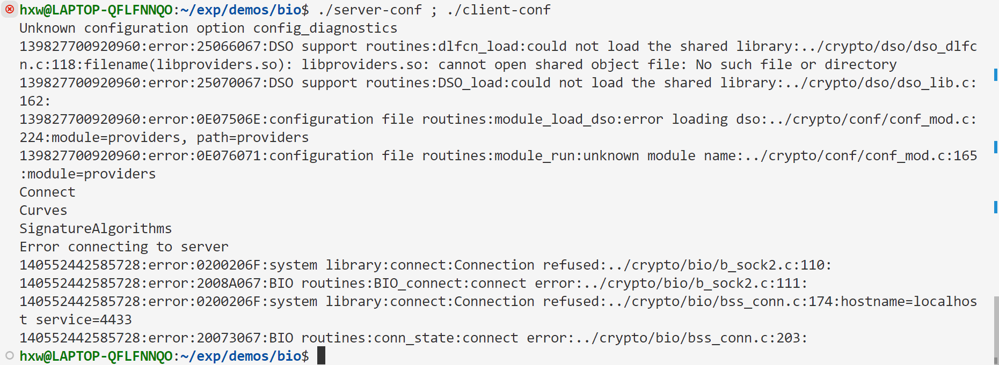
然后把accept.cnf中的第一个配置也给注释掉


``` bash
hxw@LAPTOP-QFLFNNQO:~/exp/demos/bio$ ./client-conf
Error connecting to server
140042944201344:error:14094410:SSL routines:ssl3_read_bytes:sslv3 alert handshake failure:../ssl/record/rec_layer_s3.c:1543:SSL alert number 40

hxw@LAPTOP-QFLFNNQO:~/exp/demos/bio$ ./server-conf
[Stage 1]
[Stage 2]In for
[Stage 3]In for i=-1
140062391857792:error:14201076:SSL routines:tls_choose_sigalg:no suitable signature algorithm:../ssl/t1_lib.c:2750:
```

尝试修改对应的编译选项，仍然会出现上面的报错

翻阅上述报错在ssl中对应的源码，服务端的看不太懂，客户端的指示存在握手的错误
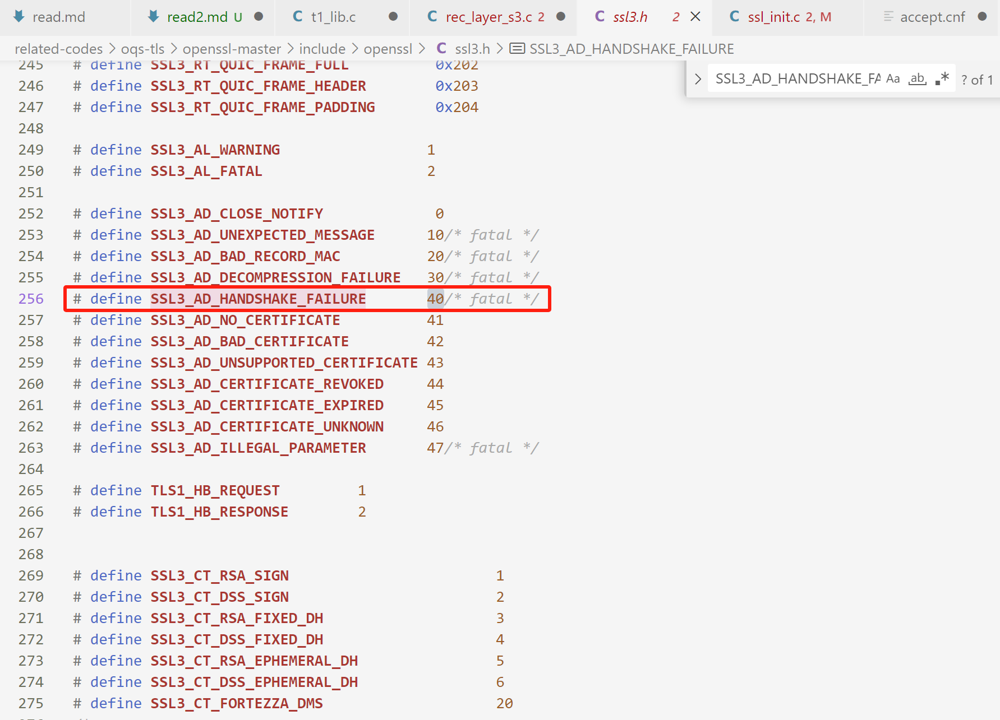

根据服务端的报错，不支持对应的签名算法，那么看一下非conf版本的代码

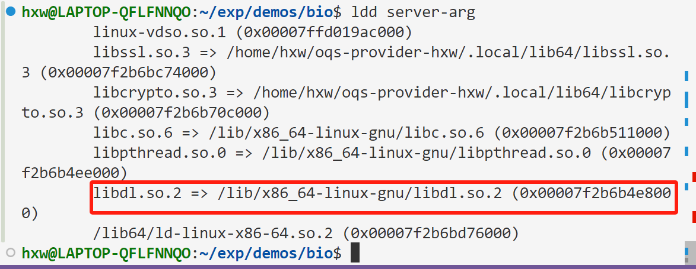

在注释掉对于签名算法的要求之后，发现能够使用，但是通过tcpdump无法抓包成功

开始在vm虚拟机上安装wireshark，企图正确抓包并进行分析

在1.更改了系统环境变量2.安装wireshark的情况下，能够抓到正确的包
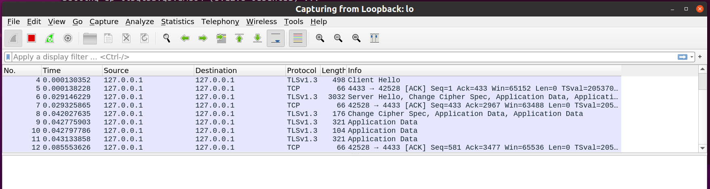

[对TLS包进行分析的博客](https://blog.csdn.net/simonchi/article/details/107563574)

# 2024-2-25
1.通过配置文件来修改默认的密钥协商方式

[SSL_CONF_cmd](https://www.openssl.org/docs/man3.0/man3/SSL_CONF_cmd.html)重要信息提取：
(1)命令行参数:
-serverpref
Use server and not client preference order when determining which **cipher suite**, **signature algorithm** or **elliptic curve** to use for an incoming connection. 
-sigalgs
用于设置服务端或者客户端支持哪些签名算法
在未设置的情况下，默认为Openssl库支持的所有算法
设置的语法规则:
The algs argument should be a colon separated list of signature algorithms in order of decreasing preference of the form algorithm+hash or signature_scheme. algorithm is one of RSA, DSA or ECDSA and hash is a supported algorithm OID short name such as SHA1, SHA224, SHA256, SHA384 of SHA512. Note: algorithm and hash names are case sensitive. signature_scheme is one of the signature schemes defined in TLSv1.3, specified using the IETF name, e.g., ecdsa_secp256r1_sha256, ed25519, or rsa_pss_pss_sha256.

-groups:
用于决定签名和kex使用的group
Currently supported groups for TLSv1.3 are P-256, P-384, P-521, X25519, X448, ffdhe2048, ffdhe3072, ffdhe4096, ffdhe6144, ffdhe8192.

-ciphersuites:
用于设置TLS1.3的密码套件
[密码套件的格式IANA](https://www.iana.org/assignments/tls-parameters/tls-parameters.xhtml#tls-parameters-4):以冒号分隔(没什么用，仅仅只是列出了一些描述对应的参考文档)

[具体的格式 CIPHER LIST FORMAT](https://www.openssl.org/docs/man3.0/man1/openssl-ciphers.html):
可以使用SHA来代表整个SHA族的算法；可以使用逻辑表达式的形式，+代表逻辑与，!代表非等(例如 openssl ciphers -s -v 'ALL:@SECLEVEL=2' 用于列出所有安全等级为2的密码套件)，来对默认支持的算法列表进行操作

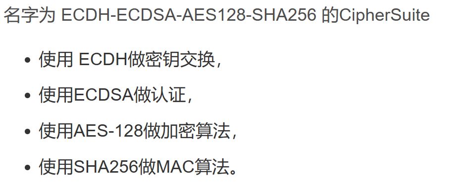


[openssl-ciphers命令](https://www.openssl.org/docs/manmaster/man1/openssl-ciphers.html)
``` bash
hxw@LAPTOP-QFLFNNQO:~/exp$ openssl ciphers -s
TLS_AES_256_GCM_SHA384:TLS_CHACHA20_POLY1305_SHA256:TLS_AES_128_GCM_SHA256:ECDHE-ECDSA-AES256-GCM-SHA384:ECDHE-RSA-AES256-GCM-SHA384:DHE-RSA-AES256-GCM-SHA384:ECDHE-ECDSA-CHACHA20-POLY1305:ECDHE-RSA-CHACHA20-POLY1305:DHE-RSA-CHACHA20-POLY1305:ECDHE-ECDSA-AES128-GCM-SHA256:ECDHE-RSA-AES128-GCM-SHA256:DHE-RSA-AES128-GCM-SHA256:ECDHE-ECDSA-AES256-SHA384:ECDHE-RSA-AES256-SHA384:DHE-RSA-AES256-SHA256:ECDHE-ECDSA-AES128-SHA256:ECDHE-RSA-AES128-SHA256:DHE-RSA-AES128-SHA256:ECDHE-ECDSA-AES256-SHA:ECDHE-RSA-AES256-SHA:DHE-RSA-AES256-SHA:ECDHE-ECDSA-AES128-SHA:ECDHE-RSA-AES128-SHA:DHE-RSA-AES128-SHA:AES256-GCM-SHA384:AES128-GCM-SHA256:AES256-SHA256:AES128-SHA256:AES256-SHA:AES128-SHA

openssl ciphers -ciphersuites TLS_AES_256_GCM_SHA384

```

> 总结:在密码套件中确实指定了kex的方式，但是似乎默认的kex中并没有kem的部分，基本上都是RSA、ECDH之类的这种，具体可以参照openssl-ciphers这个网址

还没找到具体的格式进行对应，还没有显示oqsprovider的作用


> Openssl OID name:prime256v1

(2) 配置文件参数
-Ciphersuites:
TLS1.3支持的参数

-SignatureAlgorithm:
客户端和服务端代表支持的签名算法
The value argument should be a colon separated list of signature algorithms in order of decreasing preference of the form ****algorithm+hash or signature_scheme**. **algorithm is one of RSA, DSA or ECDSA** and **hash is a supported algorithm OID short name such as SHA1, SHA224, SHA256, SHA384 of SHA512**. Note: algorithm and hash names are case sensitive. signature_scheme is one of the signature schemes defined in TLSv1.3, specified using the IETF name, e.g., ecdsa_secp256r1_sha256, ed25519, or rsa_pss_pss_sha256.

>为什么在实验的过程中显示不支持该签名算法呢？

-Groups/Curves
用于设置签名和kex的椭圆曲线组

-VerifyMode
用于设置对于客户端的认证方式

-ClientCAFile ClientCAPath
服务端指定的对于客户端的证书的要求

(3)编程示例
设置支持的签名算法
``` cpp
SSL_CONF_cmd(ctx, "SignatureAlgorithms", "ECDSA+SHA256:RSA+SHA256:DSA+SHA256");
```

> 总结:可以通过配置文件、命令行以及编程的方式来设置最初的handshake过程中需要交换的信息，但是还没有找到一个通用的方式来进行设置

(4) 编程实战
修改支持的签名算法后，观察到wireshark中仅仅支持自己指定的签名算法
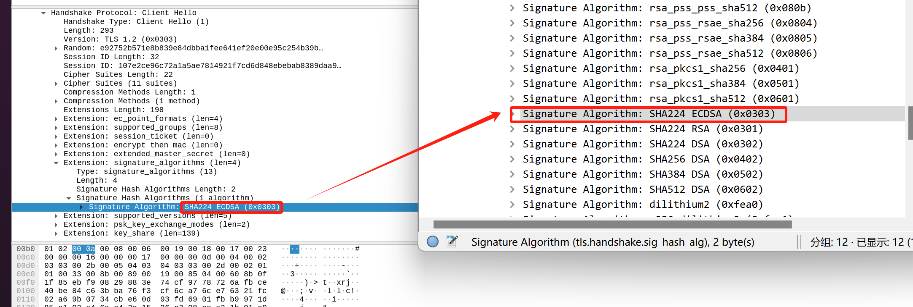
但是可能是出于服务端的证书的原因，导致服务端报错无法支持现有的签名算法
同时，并没有相关的证书的信息

观察了csdn上对于某一次交互过程的解析，发现博客上的交互过程和自己截取到的不太一样，不存在证书的交换等过程


2.观察截取的报文
发现里面添加了新的后量子的密码
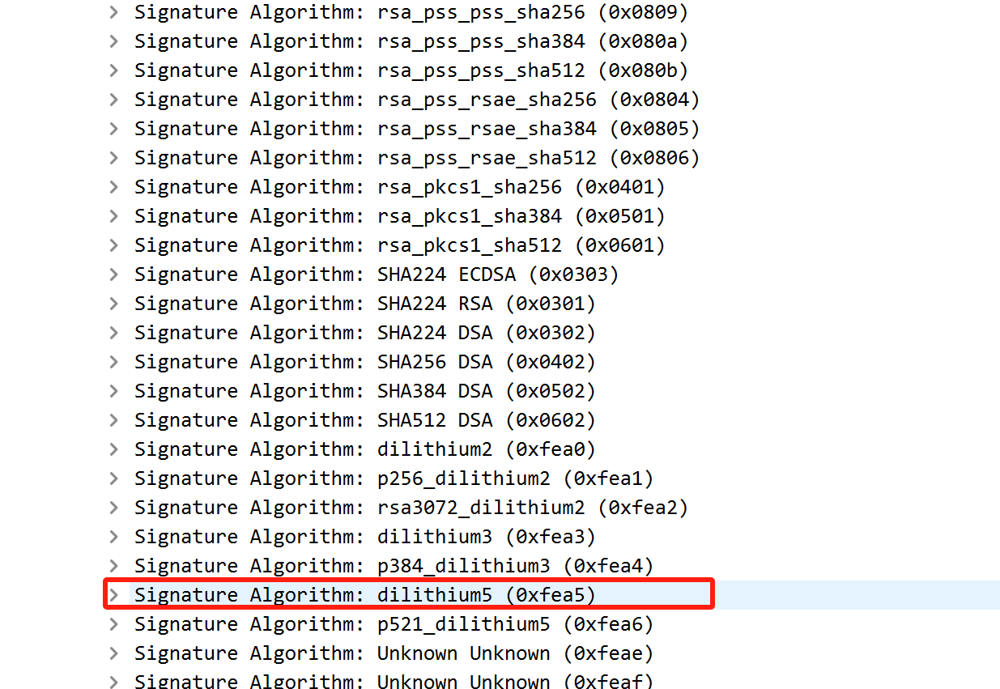

TODO:去看一下openssl-oqs里面是如何定义对于后量子密码的支持的

[OpenSSL Strategic Architecture](https://www.openssl.org/docs/OpenSSLStrategicArchitecture.html)

[OpenSSL1.1.0中关于后量子密码的支持](https://github.com/open-quantum-safe/openssl/blob/OQS-OpenSSL_1_1_1-stable/README.md)

按照论文里的内容，应该是已经实现了对于后量子密码的支持了的
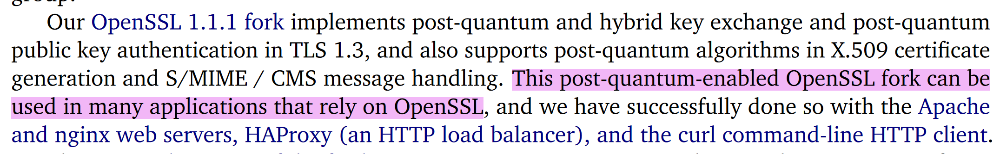

基于[oqs provider中的示例](https://github.com/open-quantum-safe/oqs-provider/blob/main/USAGE.md#running-a-client-to-interact-with-quantum-safe-kem-algorithms)，尝试使用后量子密码进行交互，但是抓包抓不到，而且似乎密码套件并没有引入诸如kyber等后量子密码的信息

后量子的签名倒是可以找到相关的信息
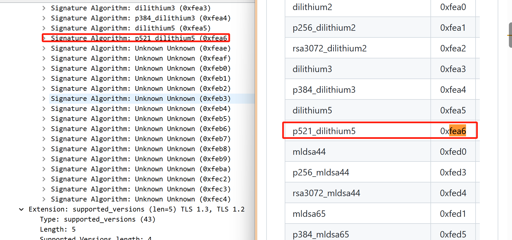

对于group选项给出一些奇怪的东西，是能够正确识别的，但是在抓包的过程中就是无法正确地进行识别
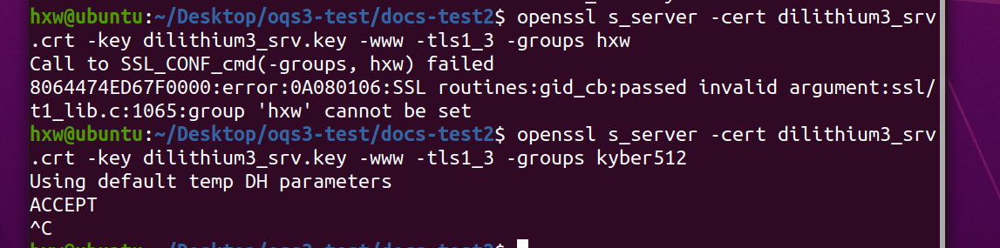

> TODO:

1.liboqs中的通用密码套件接口是什么？

2.openssl的server命令行中是否真正使用了kyber，论文里基本上都是使用的密码套件的形式来进行，但是这里却仅仅指定了kex

3.代码的server是否对于配置文件中的内容有新的支持？

# 2024-2-26
1.TLS的handshake过程最后是否会发送finished呢？
2.报错40似乎是因为[TLS的报错机制](https://www.rfc-editor.org/rfc/rfc8446#section-6)
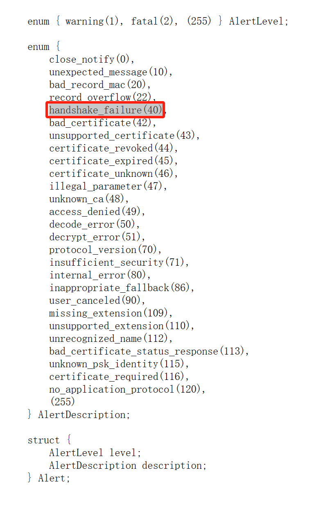

3.TLS协议的再学习
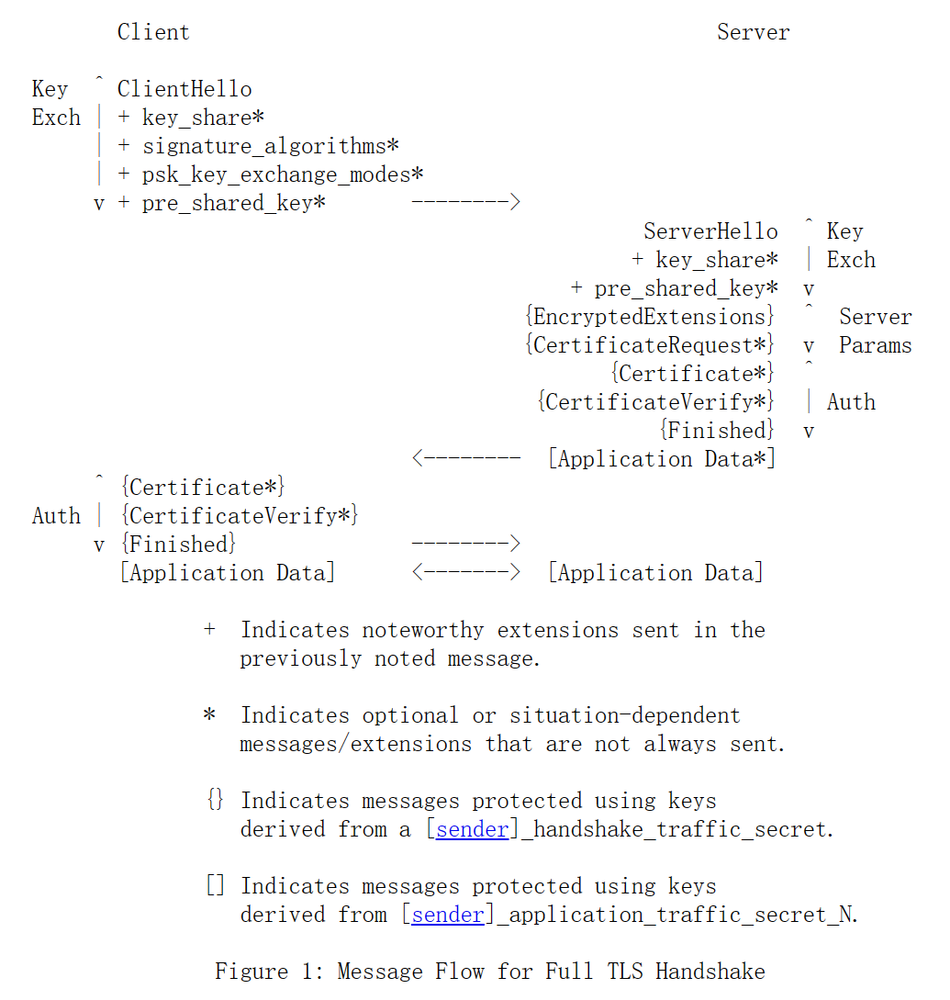
在kex阶段之后，后续的阶段都是被加密了的

client hello和Server hello决定了最终的共享密钥，双方的临时密钥应该放在key_share拓展中
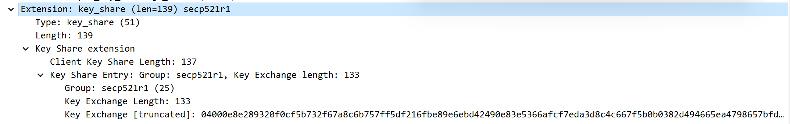

serverhello后面的application data应该都是被加密过了的
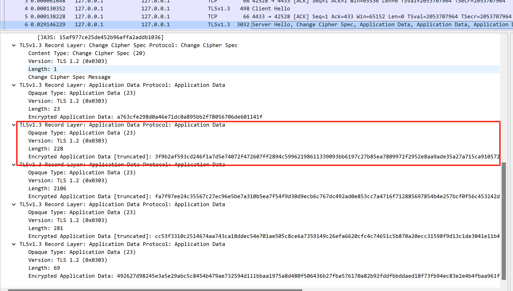

# 2024-2-27
1.阅读论文 Benchmarking Post-Quantum Cryptography in TLS

TLS进行密钥交换时，会在supported groups中指明自己支持的组，然后在keyshare中给出待交换的值

kem替代TLS一般的密钥交换时，会clienthello替换keyshare为自己的kem公钥，serverhello替换keyshare为使用kem公钥分装后的临时密钥

混合模式下，openssl（修改了ssl目录）会调用libcrypto下的ECDH算法，以及liboqs下的后量子KEM算法
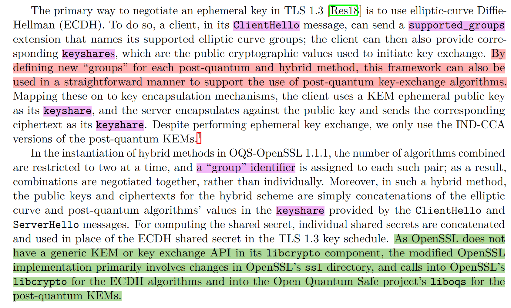

> TODO:oqs-openssl中到底有没有修改ssl目录来支持进行kem密钥交换呢？

2.阅读论文 Prototyping post-quantum and hybrid key exchange and authentication in TLS and SSH

**每个密码套件包含的信息**
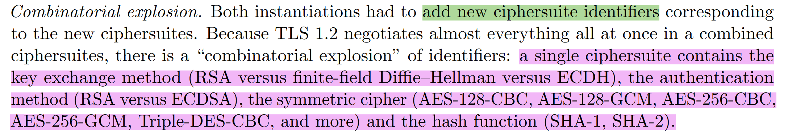

liboqs的**通用密码套件**存在的局限:无法适用于真实的场景中
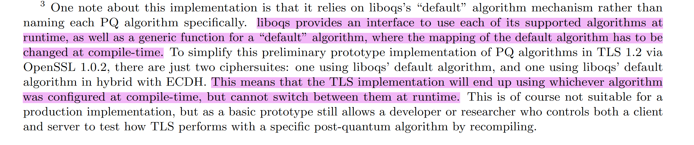
同时，在论文Post-Quantum Key Exchange for the Internet and the Open Quantum Safe Project中，也提到了liboqs的通用密码套件，其指出，通过在编译时确定liboqs支持的套件中的算法内容，可以只修改liboqs而无需修改ssl目录
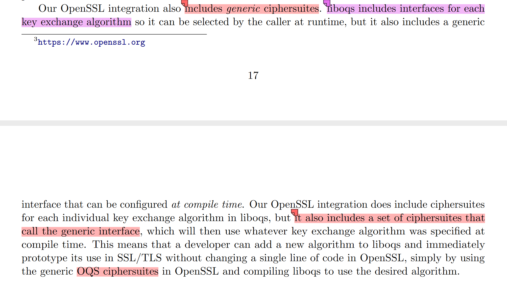


**在TLS1.3中集成后量子密码:**
两种协商的方式:1.分别协商单独的算法2.作为一个组合来进行协商（第二种方式往往会引起多余的往返延迟）
> Clienthello的shared_key中允许多个公钥的存在，但是Serverhello中仅仅只允许一个

openssl1.1.1通过**supported groups来定义支持的kex方法**，仅后量子的算法是通过新的标识符来进行协商的，而混合模式的算法则是通过没有结构的标识符来进行协商的
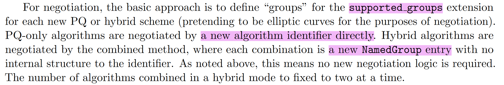
但是，在后面却说到TLS1.3中使用的是点菜式的方法来进行混合(从而避免了组合爆炸的问题)
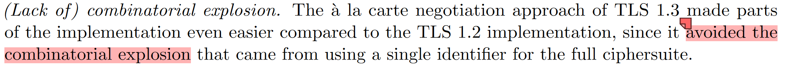

但是，似乎在新的openssl 1.1.1中，为每一个后量子密码都集成了一个新的标识符
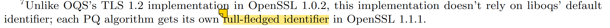


**oqs-openssl的后量子kem调用结构:**
原先的DH调用逻辑是在TLS层调用generate key和generate messae API到crypto层。但是由于KEM方案需要标识客户端和服务端，因此oqs不能仅在crypto层提供kem算法，而需要修改TLS层，来将对于后量子密码方案的调用转移到OQS中
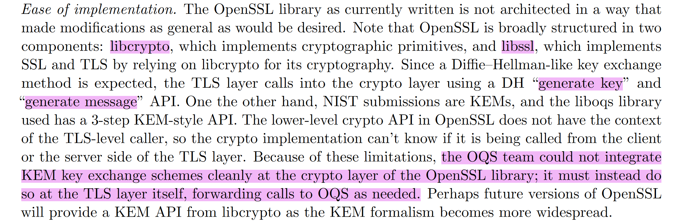

**openssl的应用tip:** 使用装配了oqs-openssl的nginx服务器和s_client完成了新的测试
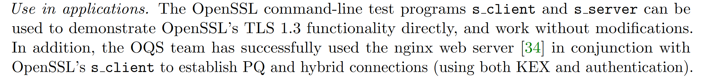

**新的后量子密码套件的集成思路**:首先加入到liboqs中，根据下面的这段话，再加入到liboqs之后，应该便可以直接使用了。
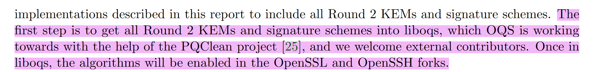

3.论文阅读 [Post-quantum confidentiality for TLS](https://www.imperialviolet.org/2018/04/11/pqconftls.html)

根据下述文字，在TLS1.2中，客户端和服务端先协商需要使用的密码套件，然后服务端选择其中的一个并发送对应的公钥，而客户端将再使用一个消息来完成密钥的交换；然而在TLS1.3中，客户端会先发送完所有支持的后量子公钥，然后服务端再选择其中的一个进行返回
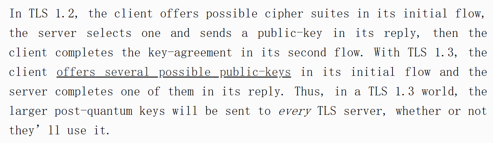
在TLS1.3中，客户端可以先声明自己支持某个算法，然后服务端再发送额外的消息来让客户端发送对应的公钥
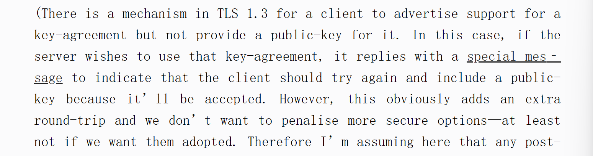

> TODO:验证一下是否符合和真实的TLS1.2和TLS1.3协议的交互流程相一致

kem情况下的密钥交换流程
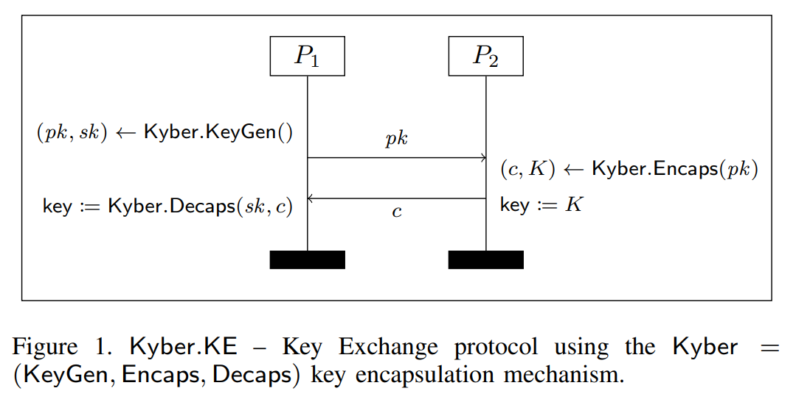

4.论文阅读 Frodo: Take off the Ring! Practical, Quantum-Secure Key Exchange from LWE


# 2024-2-28

TODO:

1.oqs-openssl中到底有没有修改ssl目录来支持进行kem密钥交换呢？

2.tls 1.3是使用组合的方式来完成kex的嘛

3.验证一下是否符合和真实的TLS1.2和TLS1.3协议的交互流程相一致


**TASK1:调研kem的使用方式**
1.使用命令行中的-groups选项
2.使用C API
[ssl_set1_groups_list](https://www.openssl.org/docs/manmaster/man3/SSL_set1_groups_list.html)用于设置服务端或者客户端支持的组
3.使用openssl.cnf文件来进行配置

再次尝试使用官方文档中生成证书并调用openssl s_server的例子

``` bash
hxw@LAPTOP-QFLFNNQO:~/exp$ openssl s_client -groups frodo640shake
Connecting to ::1
CONNECTED(00000003)
depth=0 CN=test server
verify error:num=20:unable to get local issuer certificate
verify return:1
depth=0 CN=test server
verify error:num=21:unable to verify the first certificate
verify return:1
depth=0 CN=test server
verify return:1
---
Certificate chain
 0 s:CN=test server
   i:CN=test CA
   a:PKEY: UNDEF, 192 (bit); sigalg: dilithium3
   v:NotBefore: Feb 28 02:42:37 2024 GMT; NotAfter: Feb 27 02:42:37 2025 GMT
---
Server certificate
-----BEGIN CERTIFICATE-----
MIIVZzCCCHKgAwIBAgIUY0RronV9pPRgsmAkpEJ5017O5NwwDQYLKwYBBAECggsH
BgUwEjEQMA4GA1UEAwwHdGVzdCBDQTAeFw0yNDAyMjgwMjQyMzdaFw0yNTAyMjcw
MjQyMzdaMBYxFDASBgNVBAMMC3Rlc3Qgc2VydmVyMIIHtDANBgsrBgEEAQKCCwcG
BQOCB6EAx4iAhJwJroENfOflFR6N1zrgp5q83RCq80YNDOXCL/WZXMBsFX91Gjzy
EKvR/GDo8HWvW62/c8Tft1u9kfhu1DBUQZmvbqdOGIrHqGhR1I7kTl2YJlHeuUYh
L7JJpiG+Jt/ScgYvXJ3Quje8PECPAkwfVrLsfNES5YrIxFIvVlzzCsl34B8NLoNw
2C4CJAA1Ko1qtl3AtJp0h9qk277/pUdbwFBypfWQp3E6+VVssbUnNLi6SsUYcL56
zdWgM8Eu1PH6Ory83wPGaml4BMdSKbzfQVDyYt79ZY6WI6RcBpRhXqKOyjDAydjw
kju3ahmeAvRpaI+zVLC871enLGsrIl74oXAMMJOFm65Xrdgf0aXvE53o3547IM9O
3W4H38VNRuN4BNHMSvmNp5GdkNhZ3iQSPzwiEd84fP2/XWqBR9hSGFnxQypDUDcs
/RyyRo6iqC9ObsMYq5uZmFI55cu7kZtJxMlWNsnigmgXN8L2v+7TVz2qdHWUPHm4
G8MevjAMR0deX8uejNZfk59phPhdkVB3kzij+LUVwatxeFEVxD3RtA698wxIY3Wr
2hwokuEldup0xsR0TTGgTagBebbftJpISLOA/YlgJiSRPRxiDfYMh6h7kq7AqUZp
bM5geqEhiIxX3ABxLCUrqFIeiLS7mgNWHv9IpBV25mAIuNOSb40qEpAwIuLstuzW
UnFhzWkr5zTr+3m7vmgLz5xYY5m7GiCOdrgKrAHCaKTv7EMgOWoA/5oPQsIXDQhR
uXqAQMf/6UsdXsGqIz8zNppXWn4T0M5f7JB2eaAe2aerpfDB7QGg6AAP9HORILsW
B5s0Hnjy0uoXJ+FEeeEFZFA6xAdYwzRTnC1IiEp+qXqo+SNgHS9fJdz24jmSsivS
Fih3OMoC00aNITUpVbsoLRBgPSoZgNwOnjUWSEJ/HKzW7/0rP7j5rO/2IavgeHX+
3DWFQnKO2vhw6u9gzj+yP/m/qxVD66VOcQw0TLbxnuT+qibGXuWTaUPKhMATrjdh
2OQ/fVpy7qL39hCUhmvMvp2PzfZg5lgpJ7CV2pCNonBx3BwU3wW4yfhz0LQym7eQ
MrKbi0KYzuQWdKiCVOsm1rmN7UAqVCiIWosUshehfyxmdARDnNONU3ealHmo8aWl
ZtWWLpq7Y3CRfICaHSgipStVEbq6znpScrIz8xEMdodhVwYA5Fnlyf2n3pDwJS9Y
i5v6MeTyRRg04t9abbtJPZBEcBjkgxIQWwqlIkJtdsag8sGn8rWRJaM53+bE2Wjs
LmJt8mRJpClKQ29Hg1V2TBkfYMJeQ8Bzt4Ks3htQnHReP0YhcXHoNL858EgLrEuR
7uLI+if4SZwoNFTn/F7ZRjTFQMIAfanqcTXvMzrQVbjdPStkfqhYtaWSFGBM1xCX
rdRk8UlncTTTeTsecclbLBonbk9DRPoY+0T86dodBHNJG00e7ifeuUY3n4DSyDmF
sGPhvUMwHoBEtnPrj0LHmshuh5fIOC6sl6qi2EnlBdWH7XWnor3rnGoX1/gC7NhF
+FdkIp+cu605khA4WihyR6us9MJkRpwAt4X5dFmo3NS0znFOL/95DgZ+t9U1my7i
/8CVhTuMkYwzrwAX4p5nfPXUDdeYgUPDILtkdDyGiXI3vrcBF5oSNA3KSTyDI9a1
hYAAl+ackXkAgjT6yhtYuryVLkR1e/lwJRYXr5H7jLAInyumC15sj0DSyNxypv1D
LaOwSsMKVZP3i2dn3d5tNON9jldzuS9/AtAVpQQD+iz9FQ+bXYUkakcNECp5EhBj
zRBcqaZYejska2uG2Sqr03QzRhh4hWRus5L+gTEuJmu2mmbKCQQ+1v741LI1dKpX
wEhOo8rWDwWL50Z8mCd/h/EchOxmJgXyL2UKsdHIAprFf6UgJLJiCSyL/+KnfQPl
ZRv0CW4DM3esnZCpipxvafcBjHMJ6Ln9fyLwt36fzVQsXQ4sRXaILaf9nHdb5f7u
FYm8YU/CSVFf8solc0wtUxIanvqiyDMOzvVXf0ilZqziUWszKP1ZmbedyN0AfcVQ
Tdeb60GcAJb/Ztn6KbXgrcWazgY9juWOBSsDFytdfhtZNYS+86tGd9A/99XbUws5
IHZS9Wth//BE2v8FmJPB3KC7gzGBPt7Pr7MXkuG6Vja9fIXO4mCZl3VgsL1Odiq6
HShBD1cRHY3zwB/YrYbgqOzCviGd7y6hXQDcQzCoSKBvUOBSIFbjvXdCJmDtFOv1
CnPOn8K5/UpjqdWqfAv6Q/GHSm4VZUGnr7fbEMq+0qUdxVp9Uc5pio3aj53Bb7G2
wkm1xiFV80TKkhNeSwrsXJiUS9UzaLR2YExRSr2ehVAv0L7sCIr9q4O5SmyehLeF
wxRwmzjG663lb6MyGe5V4klNrGPkpehZy+PSmUomBBbAIcHKDUCqzsFLAhBst/dp
rWmUCUeyCheehDUoxfOuqKrBAkDCaxQ5WsESrB8lcrjRFR4Y3yy1i0QGsAR7hmcd
DQj+ESdEpApslmDl7sIF51VXELz0lz6hx0vZSUFkGTodWdMSqFrZon84QDgVlbjR
69keLH57N0PEk7KvVDmmrAQr6ZE0K5gaHR+Y1PEU6xFSc94sVlOjQjBAMB0GA1Ud
DgQWBBSkLgGoID/BSqX/8iSHO49r/XhguDAfBgNVHSMEGDAWgBSy9/QOWcTtL+h9
7sUwLGLtwnUgMDANBgsrBgEEAQKCCwcGBQOCDN4AS8buX93HeXtnBfdXHbwry5ot
LVlWNlb7N5VwOql1MxvHUyet25xzgyflgDMEU+feaPPJ4bSn45vB8gF+dgmnKfRs
RO3zZxZ2vsP0p8ThUnOIfIP4GdS0J/CiLTwgZsBjC53ilQ9sPzZRdEQzbP3xVpYe
PZynTCHxk+2IZ8zo5wFwi4XyBcvHsq7FaUDMtcvEOdJe888UpiHrOHncb0N6VELO
bjsWk5DRjnh4FaZcdHO5zt4Aw+WZN/u/kRvDE/+ZqB5hE+qBCpv+0CMID85Btkfk
/Q3NuJEukVazBYefiuKJRvwMgxrp8pxrrr32O2WuEo7vqThQVK6XBWWasHi52OE8
ITWwzlvM/U/ugHZ4Bz/PdnjBNd7f0KvqxckOJhNC0x3qoE1uGJT0PsnktGYyOSJW
zvn6dtrPHfIEorVt2szopqkPFrp0mJ93V1oAGhnf4B0SnILyJcD+qhJwgBosIwAL
pW+zZA93/jmtzPiRDTKLsvTr5DM+Lks2ZPjdJIDrpfnWqxX7a8u296KSxLyMljOw
GQ6b6VZne+Szpkxz8pNH9DM1j7uffJplMDI4a/to6Kx7GuH/jJTPPcsF5OMWaIex
ErlRjN8qeE832exHexxdnb5fQ4KmFmArTJtlS/VAvOCnvNkW5HVkDJ+D0MM89Sr+
VjfecIsN21/XZi/gF69yqKgvypRCh9nTHIPZFhwR61t+Eg9mvTV8SYJnJtn0jfy0
1bsEThb5EkDKwoISrawPLWBpRMQalUK37qSJe+onPqg6EymGISWxIAa/pPNMnRI8
Sucn08oCnvMY+FFXI/wktFyAFuVbcrkBiDOAqGDgirAls+TWJt4EEvRnhW5uNg6E
QRmETLCgezTYJJrrK8XQ1OgKzPWFPoRZ6aLpa0z00oGrVC8xRSQR/Qaipn7YcRml
2VhVmRaJ5yqgOJme+wr/P/ZC1PrdTelANcni7SpgqBfanZR6JjpmzrZMJRStHSze
hGCvv9FmeY0lvvH/GiOOeD1QoaOkMmgNU77WszjekzikV7fQCi/aAxs8bkXCe6/v
RKk8cdYn6pFnU6mDxeEZwclq9Szd2Lx+lTjRcoqTeFjwiPkR75oisuUV6sP0WfQF
lmgBjNaHE70DYT8LwtbGUz5rvqw6x0nTgGNKRjY63Cc+pzE8AP4zPBuIZqU+kvxk
dp6E0QlASaXy5+nZi7ZOPkyVo7JSqu1dwzIvEe6zy14G7P+onchZQjXMvix9TnMM
Nz/3p5PXlqcMbjwK1sbSDJLR5gm9+Pf8VyqfVIDXG7DYxGLgN72AXxZsNYJfiRPv
TQ5OikPkOoMrPly2Vcm+Plm5+KfSYu92G1nPKbCGqxFszMz/EQMMthMQ0pSBm0dK
O0D+9WDXsBt7w8FCMiGXy+LPlRH7tmWGNlUoweKbEGJiMuwnEkjKC0jNVZdrGwRo
TF1qifZ2Phi77ei2xiGoo0cQsxCxkTTQchB9HQy3A2vZqf1PNR1Ay7pjEemPL7n/
Azris27cbol7CrlORlRmrvZYjqOnEFmpwt/NUMTiP4f4Dh8EZVsMut7t2bwZCdg7
IB0GXszk6snlBMA32ZO5cElHKDh3I56DgKarYJpVTw7mIsS81JnwvDhxfyP5C+ai
8Son2B9XJBI4WK7zQ+SDIu4dnUu/SZTily0guQIRRQPezkIcaX1eNVtoNscnqJSr
/VHO3+inL99fxQAL2ZXxp4l9QvOyITW7xWBXWubzx13pkjdcbJufgzrzVBPqEUqP
bu3yu2oNPLLJ2/V3WCSldmm5ykgpFVnMtGw+gwLkRBK8ngT8amhGqDZn3Amlm2Xj
xFIbifrlPPapkIfiGT7RJ/UMtW/Vb7nxIZiPCPNMzaYwEirNJVg5q4P66Oy8/F3z
goK8FtIbrcHGLNr8uJDYdiEBUpJADfLl9xvK9RoioWNBugcgcEDkGL/vXJl+z/r5
bOKNnG+LtIZLydLOxnRoT9U0FSU3XLcpQz8wn2yAHqyRSmOzk+fc0/KOil3FQjw9
1eHevuoKhl2tFAsYG4OmJx8+LU77R5sW1gSxiPTtUtbNWIkRdljy1sPqt46mPhlE
UM3LZZupCDf8bcK5eeT8h/qTCmz8vvxqCkom5I+Ro7sAH5OXMAQjbmq0Inh6cbLj
aHi/kZhYz7tClAjJcs5WvzCAJO6rnLx9SxlzbhJiexJVYxPd4dlYKIPK7YZtTldv
u1uZYC/kYnksYET4kKuW+rk85SR7VQvzizvow4l/1E8/fcv8qvcJHRjXEuemppol
EABlYFe2neo+j/5gFwaqRxD1zTZAWRQnJ4PC3EeIidxigLnoGdF+oOzfNNc0y3Yt
Af7T4KtEmdYNNl4EI5YiP9I1T2W/EqepMmHMB6UoRPBxX373yDlj8wRKXxS+5Ijt
vQh4C9vyHsBALAq2JK4nDALc9+jszHF6TW9zkzw1mAnQ0ewP03hCPuDSXcJ2fYf9
BXHCOiPBo7q8HKdKB0ap42l4/0rNtiBCAJmNODh4CAcPvI032rIqHid/Z/mdjDLS
YCWg4oSLH9mAtPXxX9l5NEI3Kyp2dvBUDNTkpIBRIyAko4MWalBsGR/wUdMsVTYF
Iudeg9JCEqk9Poxr/qeYK6gPTuRYaeYD4MIjvHj8ofyo3x4cMJ504RS5HFp3cKbu
z55B4Sw3TlUbXnFN1ayHV38c7iHLZPWu5BnKsRrwY1iDhi4tywc9jkK8d9a3UXPi
7GsamMUO8hookjF+fqb8P+0GTKkjaB6PZm52k7MGop7QyxYeMg9hUur4JRO1ZjUF
QPL6eUjspi7ZpHiv9SjI5AYKuZH1XAm7ggU8nxMKfQp4xz49aH9t+X6Zrdj5Xgih
78kvCowNCh0zqb6gcsST7on59XiRYlmiA1+iehlRcA4KPzI8q1aEH4cbbsvswFj3
zDbbPzefP/y8DVIkG3cdzLGGPp2G2TwvmDx+f3dzUzzmP6/hMFh55c2Kihk5xzdU
kADe2CJR6NL3leAf+S6ulikc2I7FXlEyRXS7d2dXex+9TxhhrdtPn5yqGUIFZO3E
S9dSPwWcApFPKHyi6+1MTr8T4GEJxVm5nTmDuimh1B2O8zSyrF2Ul5l5wnFr60/J
vj73LLsqaRWeO7QugwpyPa80ctVlrO9Lbp9CNGXFX51LzwD30ZNXrM+5iph1lToW
I/xP0er2Gq1KOhNX1CpkK/OgihZK9huM6adMy7VoUx0hqQe5uHTLDhB8dtbaP43a
geq2fBAQ8NaCc8amHTU51N2qYbBkMr55Uk6yQBrEcVyYClIITvLtuM/fWmggKVVH
vMDosbDgBHei6rmpwGIgz+v5SbCckyb0PdzzaNbU/ip6AfPw1ACqgaN0lOrQTPp0
YZkmUCtTekBUkO0rcikiu4ZqDfwe2Jb15g+EK9OP4Zo7aanYS5XCOCLZvg7S2ZRo
RRlNXcsImEDOHA9NHqGhf1M/FKIsEqzTarvyFAoBJzbNi/kjm5IW5nineH8nxxxx
/pEcbHobsPlpDoiG1P5Jn/EkbyM4nT80kaVet4TX2PbiYhgY07FXSXqeKR5V3Q3L
dOgMW5YvCnDzrtnXykaEGBSzFDaYnoV73PpddDdVCYK1863kRaMvzFTx1anjt71B
5+ebAEkaGSmeunSDpy2yPfIcsjJCf8nlBzil2hcZDaFUhpN3A0Wvc/d5Qqn9a/7r
cRZtkyjDjSLTlEuGNtfCN063QpkuH6m7fIYQ6kHVZU0vfCSPX+HNYBT4UmSsrDxX
9VZjp+Luwxk4EAZA1FK7SGdg+R/R/nR415EeWDaNQfOekzOMPYf5A5P2m0v4tKdo
zUCLiwFKWudoMQSkmG+xbmQPeOQSwKiwX7l6398xhDdJnXhCUrlG3QgIcr5YnVsQ
wEFRi25U1wKLVjRGGsiCiSviPRZY6xdygKA+TbuUCQxDDY3vJUKST1226jfUP/6n
1aUT1FGdRVpWa34Q0t2395xWN3+N+2Wlt3pqsZIwhcEO1jjwvcHqgIkJIXpDhCea
Cvf8Wm8r5mk1FAxaJA8B2ZnskjT7ymGTzhWfxnLCOIVpxKiJagWtOgV4hPU0U/7S
Y4ludC9+GU5YbL1o6EBnYYh+dJypg+soi268FgabPev2hm1PSWVt6Lenfxc889lZ
XabMr3tMdaMtqKXCDzze6fquu5WBhpd0iXaflhCSNQ4kIPInQsF3lMAPr/fF5l8T
rmDVQUUFpDcAiyD5Y/1IrbnDVx/AWqNkewWtj2jx3f8uYF3k3q01pWGLfE1/nUXX
Xm6V4pCBW9aizifC11Tesl1tjL/P5rn7Ek8lfBEs49kYFXsD6EOJ27GJjH6NF66y
CjE6PEFPWnGJztAFBxgaKj6JjavyAEBGYnOfvdTW6SNCdKLg4/UABClHYW2os7oA
AAAAAAACDRchKDE=
-----END CERTIFICATE-----
subject=CN=test server
issuer=CN=test CA
---
No client certificate CA names sent
**Peer signature type: dilithium3**
---
SSL handshake has read 18774 bytes and written 10001 bytes
**Verification error: unable to verify the first certificate**
---
New, TLSv1.3, Cipher is **TLS_AES_256_GCM_SHA384**
Server public key is 192 bit
This TLS version forbids renegotiation.
Compression: NONE
Expansion: NONE
No ALPN negotiated
Early data was not sent
Verify return code: 21 (unable to verify the first certificate)
---
---
Post-Handshake New Session Ticket arrived:
SSL-Session:
    Protocol  : TLSv1.3
    Cipher    : TLS_AES_256_GCM_SHA384
    Session-ID: A923167F90203A4488998EFC3BA95C40F1E465ED41FD189A6EEF5F24D9D4700D
    Session-ID-ctx: 
    Resumption PSK: 4967084FC519A21F95E5D8EEF8454D48C7668C78FD8A48CD1293C48228133510E6969E693DC4D67FFB7E167E8CE0F87B
    PSK identity: None
    PSK identity hint: None
    SRP username: None
    TLS session ticket lifetime hint: 7200 (seconds)
    TLS session ticket:
    0000 - b4 c3 00 08 4c 40 e6 e7-d5 82 c3 92 a1 f4 65 8a   ....L@........e.
    0010 - e1 67 6d dd 91 82 fa 4d-a1 39 b6 54 c6 8d 93 66   .gm....M.9.T...f
    0020 - 64 01 98 0d 54 57 78 67-43 7e 63 f2 4a 96 56 0b   d...TWxgC~c.J.V.
    0030 - 60 79 53 2a ef 7a ab 2d-f8 ae e3 33 bb 38 ed aa   `yS*.z.-...3.8..
    0040 - cb 09 4f d3 a5 5f c4 c6-22 8d 40 40 82 2d 91 ac   ..O.._..".@@.-..
    0050 - 26 99 59 78 bc ec 17 80-ca c7 c5 02 bb 8a 3b 21   &.Yx..........;!
    0060 - 8b 35 d8 1d af a4 97 f3-44 bf cf f1 16 66 84 59   .5......D....f.Y
    0070 - c8 8c 26 7b 99 34 20 90-f5 82 62 42 08 c4 a8 cc   ..&{.4 ...bB....
    0080 - aa bd ef a5 d0 74 6a 92-18 d6 5d d8 04 39 52 ef   .....tj...]..9R.
    0090 - b2 74 a1 09 7e 73 41 22-39 ea 12 db a1 4b 43 51   .t..~sA"9....KCQ
    00a0 - 5c da bb 82 2a bf 37 db-e4 85 ab 01 70 01 6c 98   \...*.7.....p.l.
    00b0 - c1 1f 67 ab bf fc b3 53-d7 30 43 4d a1 2d 82 f1   ..g....S.0CM.-..
    00c0 - 46 cf 25 59 8d 9a f2 e5-14 fd 2d 28 10 6a 83 ca   F.%Y......-(.j..

    Start Time: 1709088201
    Timeout   : 7200 (sec)
    Verify return code: 21 (unable to verify the first certificate)
    Extended master secret: no
    Max Early Data: 0
---
read R BLOCK
---
Post-Handshake New Session Ticket arrived:
SSL-Session:
    Protocol  : TLSv1.3
    Cipher    : TLS_AES_256_GCM_SHA384
    Session-ID: 366F83D7AD98813ADE274F2FD8E113B9E27A3F2662577D93862FC84F33E93E48
    Session-ID-ctx: 
    Resumption PSK: C5B3D5AAE06A4948A3C0B3BA4EB7804A59CE9A884A50322270FFBC38C57385E1BA34A27E3AD3B02DE92D0482B51783D5
    PSK identity: None
    PSK identity hint: None
    SRP username: None
    TLS session ticket lifetime hint: 7200 (seconds)
    TLS session ticket:
    0000 - b4 c3 00 08 4c 40 e6 e7-d5 82 c3 92 a1 f4 65 8a   ....L@........e.
    0010 - f1 98 8c 04 3e 06 a2 1b-e7 1b 2c a3 69 db c7 9d   ....>.....,.i...
    0020 - bc ee ab 19 ed 9e 93 30-fc 72 3a fa 0d c0 3a 7b   .......0.r:...:{
    0030 - a1 2c e0 f8 88 d7 6f d4-2c 09 95 02 a7 99 dc 67   .,....o.,......g
    0040 - 1d 22 08 30 a8 e3 70 94-b0 40 78 22 83 44 1e 49   .".0..p..@x".D.I
    0050 - df 5c 67 30 7b c6 d7 5d-10 39 d4 27 bb 0a 1d 17   .\g0{..].9.'....
    0060 - 28 1c 8f f2 61 27 19 fc-f4 3c ca 8c 7f 81 4b c0   (...a'...<....K.
    0070 - 76 92 b1 c1 39 0b 88 ac-c4 ca 06 83 ee 4a 51 a2   v...9........JQ.
    0080 - f9 39 68 7c 9d 2e f0 c4-c3 60 98 73 cc 7d da ef   .9h|.....`.s.}..
    0090 - 80 82 dc 75 4a 6a 94 d1-37 f9 72 3b 21 f2 00 50   ...uJj..7.r;!..P
    00a0 - a6 de ca a8 76 5a 72 67-16 aa 1a 12 ac a0 9a 5a   ....vZrg.......Z
    00b0 - 0d 14 31 2d f1 5f a6 38-a1 bb ed fd dd ec 9d 5f   ..1-._.8......._
    00c0 - 9d 41 c1 93 4b 22 21 ac-d4 18 c2 d0 36 9a af 53   .A..K"!.....6..S

    Start Time: 1709088201
    Timeout   : 7200 (sec)
    Verify return code: 21 (unable to verify the first certificate)
    Extended master secret: no
    Max Early Data: 0
---
read R BLOCK
GET /
HTTP/1.0 200 ok
Content-type: text/html

<HTML><BODY BGCOLOR="#ffffff">
<pre>

s_server -cert dilithium3_srv.crt -key dilithium3_srv.key -www -tls1_3 -groups kyber768:frodo640shake 
This TLS version forbids renegotiation.

服务端支持的密码套件
Ciphers supported in s_server binary
TLSv1.3    :TLS_AES_256_GCM_SHA384    TLSv1.3    :TLS_CHACHA20_POLY1305_SHA256 
TLSv1.3    :TLS_AES_128_GCM_SHA256    TLSv1.2    :ECDHE-ECDSA-AES256-GCM-SHA384 
TLSv1.2    :ECDHE-RSA-AES256-GCM-SHA384 TLSv1.2    :DHE-RSA-AES256-GCM-SHA384 
TLSv1.2    :ECDHE-ECDSA-CHACHA20-POLY1305 TLSv1.2    :ECDHE-RSA-CHACHA20-POLY1305 
TLSv1.2    :DHE-RSA-CHACHA20-POLY1305 TLSv1.2    :ECDHE-ECDSA-AES128-GCM-SHA256 
TLSv1.2    :ECDHE-RSA-AES128-GCM-SHA256 TLSv1.2    :DHE-RSA-AES128-GCM-SHA256 
TLSv1.2    :ECDHE-ECDSA-AES256-SHA384 TLSv1.2    :ECDHE-RSA-AES256-SHA384   
TLSv1.2    :DHE-RSA-AES256-SHA256     TLSv1.2    :ECDHE-ECDSA-AES128-SHA256 
TLSv1.2    :ECDHE-RSA-AES128-SHA256   TLSv1.2    :DHE-RSA-AES128-SHA256     
TLSv1.0    :ECDHE-ECDSA-AES256-SHA    TLSv1.0    :ECDHE-RSA-AES256-SHA      
SSLv3      :DHE-RSA-AES256-SHA        TLSv1.0    :ECDHE-ECDSA-AES128-SHA    
TLSv1.0    :ECDHE-RSA-AES128-SHA      SSLv3      :DHE-RSA-AES128-SHA        
TLSv1.2    :RSA-PSK-AES256-GCM-SHA384 TLSv1.2    :DHE-PSK-AES256-GCM-SHA384 
TLSv1.2    :RSA-PSK-CHACHA20-POLY1305 TLSv1.2    :DHE-PSK-CHACHA20-POLY1305 
TLSv1.2    :ECDHE-PSK-CHACHA20-POLY1305 TLSv1.2    :AES256-GCM-SHA384         
TLSv1.2    :PSK-AES256-GCM-SHA384     TLSv1.2    :PSK-CHACHA20-POLY1305     
TLSv1.2    :RSA-PSK-AES128-GCM-SHA256 TLSv1.2    :DHE-PSK-AES128-GCM-SHA256 
TLSv1.2    :AES128-GCM-SHA256         TLSv1.2    :PSK-AES128-GCM-SHA256     
TLSv1.2    :AES256-SHA256             TLSv1.2    :AES128-SHA256             
TLSv1.0    :ECDHE-PSK-AES256-CBC-SHA384 TLSv1.0    :ECDHE-PSK-AES256-CBC-SHA  
SSLv3      :SRP-RSA-AES-256-CBC-SHA   SSLv3      :SRP-AES-256-CBC-SHA       
TLSv1.0    :RSA-PSK-AES256-CBC-SHA384 TLSv1.0    :DHE-PSK-AES256-CBC-SHA384 
SSLv3      :RSA-PSK-AES256-CBC-SHA    SSLv3      :DHE-PSK-AES256-CBC-SHA    
SSLv3      :AES256-SHA                TLSv1.0    :PSK-AES256-CBC-SHA384     
SSLv3      :PSK-AES256-CBC-SHA        TLSv1.0    :ECDHE-PSK-AES128-CBC-SHA256 
TLSv1.0    :ECDHE-PSK-AES128-CBC-SHA  SSLv3      :SRP-RSA-AES-128-CBC-SHA   
SSLv3      :SRP-AES-128-CBC-SHA       TLSv1.0    :RSA-PSK-AES128-CBC-SHA256 
TLSv1.0    :DHE-PSK-AES128-CBC-SHA256 SSLv3      :RSA-PSK-AES128-CBC-SHA    
SSLv3      :DHE-PSK-AES128-CBC-SHA    SSLv3      :AES128-SHA                
TLSv1.0    :PSK-AES128-CBC-SHA256     SSLv3      :PSK-AES128-CBC-SHA        
---
双方共同支持的密码套件
Ciphers common between both SSL end points:
TLS_AES_256_GCM_SHA384     TLS_CHACHA20_POLY1305_SHA256 TLS_AES_128_GCM_SHA256    
ECDHE-ECDSA-AES256-GCM-SHA384 ECDHE-RSA-AES256-GCM-SHA384 DHE-RSA-AES256-GCM-SHA384 
ECDHE-ECDSA-CHACHA20-POLY1305 ECDHE-RSA-CHACHA20-POLY1305 DHE-RSA-CHACHA20-POLY1305 
ECDHE-ECDSA-AES128-GCM-SHA256 ECDHE-RSA-AES128-GCM-SHA256 DHE-RSA-AES128-GCM-SHA256 
ECDHE-ECDSA-AES256-SHA384  ECDHE-RSA-AES256-SHA384    DHE-RSA-AES256-SHA256     
ECDHE-ECDSA-AES128-SHA256  ECDHE-RSA-AES128-SHA256    DHE-RSA-AES128-SHA256     
ECDHE-ECDSA-AES256-SHA     ECDHE-RSA-AES256-SHA       DHE-RSA-AES256-SHA        
ECDHE-ECDSA-AES128-SHA     ECDHE-RSA-AES128-SHA       DHE-RSA-AES128-SHA        
AES256-GCM-SHA384          AES128-GCM-SHA256          AES256-SHA256             
AES128-SHA256              AES256-SHA                 AES128-SHA
支持的签名算法:
Signature Algorithms: ECDSA+SHA256:ECDSA+SHA384:ECDSA+SHA512:Ed25519:Ed448:ECDSA+SHA256:ECDSA+SHA384:ECDSA+SHA512:RSA-PSS+SHA256:RSA-PSS+SHA384:RSA-PSS+SHA512:RSA-PSS+SHA256:RSA-PSS+SHA384:RSA-PSS+SHA512:RSA+SHA256:RSA+SHA384:RSA+SHA512:ECDSA+SHA224:RSA+SHA224:DSA+SHA224:DSA+SHA256:DSA+SHA384:DSA+SHA512:dilithium2:p256_dilithium2:rsa3072_dilithium2:dilithium3:p384_dilithium3:dilithium5:p521_dilithium5:falcon512:p256_falcon512:rsa3072_falcon512:falcon1024:p521_falcon1024:sphincssha2128fsimple:p256_sphincssha2128fsimple:rsa3072_sphincssha2128fsimple:sphincssha2128ssimple:p256_sphincssha2128ssimple:rsa3072_sphincssha2128ssimple:sphincssha2192fsimple:p384_sphincssha2192fsimple:sphincsshake128fsimple:p256_sphincsshake128fsimple:rsa3072_sphincsshake128fsimple
双方共同支持的签名算法:
Shared Signature Algorithms: ECDSA+SHA256:ECDSA+SHA384:ECDSA+SHA512:Ed25519:Ed448:ECDSA+SHA256:ECDSA+SHA384:ECDSA+SHA512:RSA-PSS+SHA256:RSA-PSS+SHA384:RSA-PSS+SHA512:RSA-PSS+SHA256:RSA-PSS+SHA384:RSA-PSS+SHA512:RSA+SHA256:RSA+SHA384:RSA+SHA512:ECDSA+SHA224:RSA+SHA224:dilithium2:p256_dilithium2:rsa3072_dilithium2:dilithium3:p384_dilithium3:dilithium5:p521_dilithium5:falcon512:p256_falcon512:rsa3072_falcon512:falcon1024:p521_falcon1024:sphincssha2128fsimple:p256_sphincssha2128fsimple:rsa3072_sphincssha2128fsimple:sphincssha2128ssimple:p256_sphincssha2128ssimple:rsa3072_sphincssha2128ssimple:sphincssha2192fsimple:p384_sphincssha2192fsimple:sphincsshake128fsimple:p256_sphincsshake128fsimple:rsa3072_sphincsshake128fsimple
**支持的kex方法:
Supported groups: frodo640shake
双方共同支持的kex方法：
Shared groups: frodo640shake** 
注意:当将客户端支持的算法换成kyber768之后，这里会变成对应的kyber768
---
New, TLSv1.3, Cipher is TLS_AES_256_GCM_SHA384
SSL-Session:
    Protocol  : TLSv1.3
    Cipher    : TLS_AES_256_GCM_SHA384
    Session-ID: A608866A89EEDE7710B91AD476CC61D2E986ABAEAFA5CEB361C946A19FBFC23C
    Session-ID-ctx: 01000000
    Resumption PSK: C5B3D5AAE06A4948A3C0B3BA4EB7804A59CE9A884A50322270FFBC38C57385E1BA34A27E3AD3B02DE92D0482B51783D5
    PSK identity: None
    PSK identity hint: None
    SRP username: None
    Start Time: 1709088201
    Timeout   : 7200 (sec)
    Verify return code: 0 (ok)
    Extended master secret: no
    Max Early Data: 0
---
   0 items in the session cache
   0 client connects (SSL_connect())
   0 client renegotiates (SSL_connect())
   0 client connects that finished
   1 server accepts (SSL_accept())
   0 server renegotiates (SSL_accept())
   1 server accepts that finished
   0 session cache hits
   0 session cache misses
   0 session cache timeouts
   0 callback cache hits
   0 cache full overflows (128 allowed)
---
no client certificate available
</pre></BODY></HTML>

closed
```

尝试在命令行使用ctruprime653

客户端的情况如下:
``` bash
hxw@LAPTOP-QFLFNNQO:~/exp$ openssl s_client -groups ctruprime653
Connecting to ::1
CONNECTED(00000003)
[In kem.c] Try to new ctruprime653
[In OQS_KEM_ctruprime_653_new] start new ctruprime 653
1
2
3
[In OQS_KEM_ctruprime_653_new] new ctruprime 653 success,start return!
80B4AE63E37F0000:error:0A000119:SSL routines:tls_get_more_records:decryption failed or bad record mac:ssl/record/methods/tls_common.c:858:
80B4AE63E37F0000:error:0A000139:SSL routines::record layer failure:ssl/record/rec_layer_s3.c:643:
---
no peer certificate available
---
No client certificate CA names sent
---
SSL handshake has read 1039 bytes and written 1306 bytes
Verification: OK
---
New, TLSv1.3, Cipher is TLS_AES_256_GCM_SHA384
This TLS version forbids renegotiation.
Compression: NONE
Expansion: NONE
No ALPN negotiated
Early data was not sent
Verify return code: 0 (ok)
---
hxw@LAPTOP-QFLFNNQO:~/exp$ openssl s_client -groups ctrupri
Call to SSL_CONF_cmd(-groups, ctrupri) failed
802420A4DA7F0000:error:0A080106:SSL routines:gid_cb:passed invalid argument:ssl/t1_lib.c:1065:group 'ctrupri' cannot be set
```
服务端的情况如下:
```bash
hxw@LAPTOP-QFLFNNQO:~/exp$ openssl s_client -groups ctruprime653
Connecting to ::1
CONNECTED(00000003)
[In kem.c] Try to new ctruprime653
[In OQS_KEM_ctruprime_653_new] start new ctruprime 653
1
2
3
[In OQS_KEM_ctruprime_653_new] new ctruprime 653 success,start return!
80B4AE63E37F0000:error:0A000119:SSL routines:tls_get_more_records:decryption failed or bad record mac:ssl/record/methods/tls_common.c:858:
80B4AE63E37F0000:error:0A000139:SSL routines::record layer failure:ssl/record/rec_layer_s3.c:643:
---
no peer certificate available
---
No client certificate CA names sent
---
SSL handshake has read 1039 bytes and written 1306 bytes
Verification: OK
---
New, TLSv1.3, Cipher is TLS_AES_256_GCM_SHA384
This TLS version forbids renegotiation.
Compression: NONE
Expansion: NONE
No ALPN negotiated
Early data was not sent
Verify return code: 0 (ok)
---
hxw@LAPTOP-QFLFNNQO:~/exp$ openssl s_client -groups ctrupri
Call to SSL_CONF_cmd(-groups, ctrupri) failed
802420A4DA7F0000:error:0A080106:SSL routines:gid_cb:passed invalid argument:ssl/t1_lib.c:1065:group 'ctrupri' cannot be set
```
> 能够识别出ctruprime653，但是却报错mac认证错误。猜测可能是因为ctruprime653的协商出的密钥有问题导致的，因为在调用openssl的kem测试过程中，总是说ctruprime653的测试结果是失败的。所以现在的思路是，确认进行了ctruprime653的协商即可。那么需要寻找能够记录整个协商过程的方式。

尝试使用**sslkeylog**来记录整个过程中使用到的密钥，通过添加SSLKEYLOGFILE环境变量的方式，但是最终并没有输出相应的结果。

[sslkeylog的介绍网址](https://sslkeylog.readthedocs.io/en/latest/index.html)指出，sslkeylog要配合浏览器进行使用，因此可能无法真正得到密钥协商的结果


尝试使用tcpdump来进行抓包，使用下述命令能够记录得到正确抓取的结果
``` bash
sudo tcpdump -i lo -s 0 -w tls13_handshake2.pcap 'tcp port 4433'
```
将抓取形成的pcap文件拷贝到本地主机中，然后使用wireshark查看
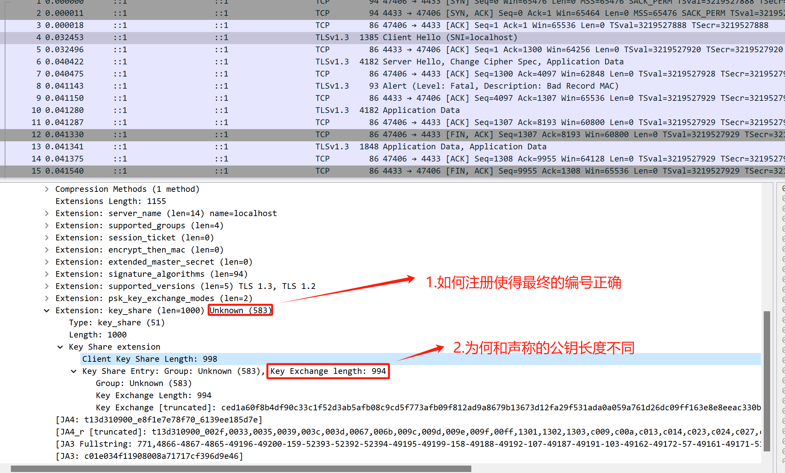

对比正常交互过程中的结果
对于frodo640shake,在client hello的key share的拓展中，公钥的长度和声称的是一致的
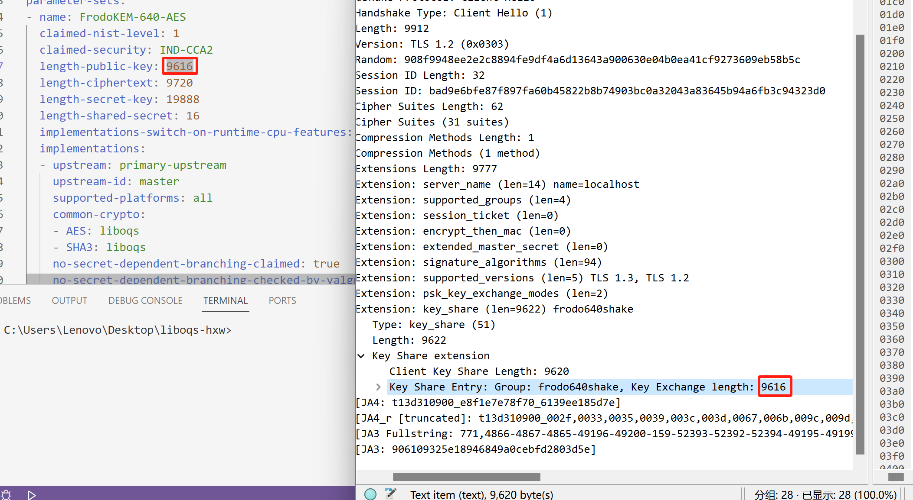
对于ctruprime653,在client hello的key_share的拓展中，也是一致的
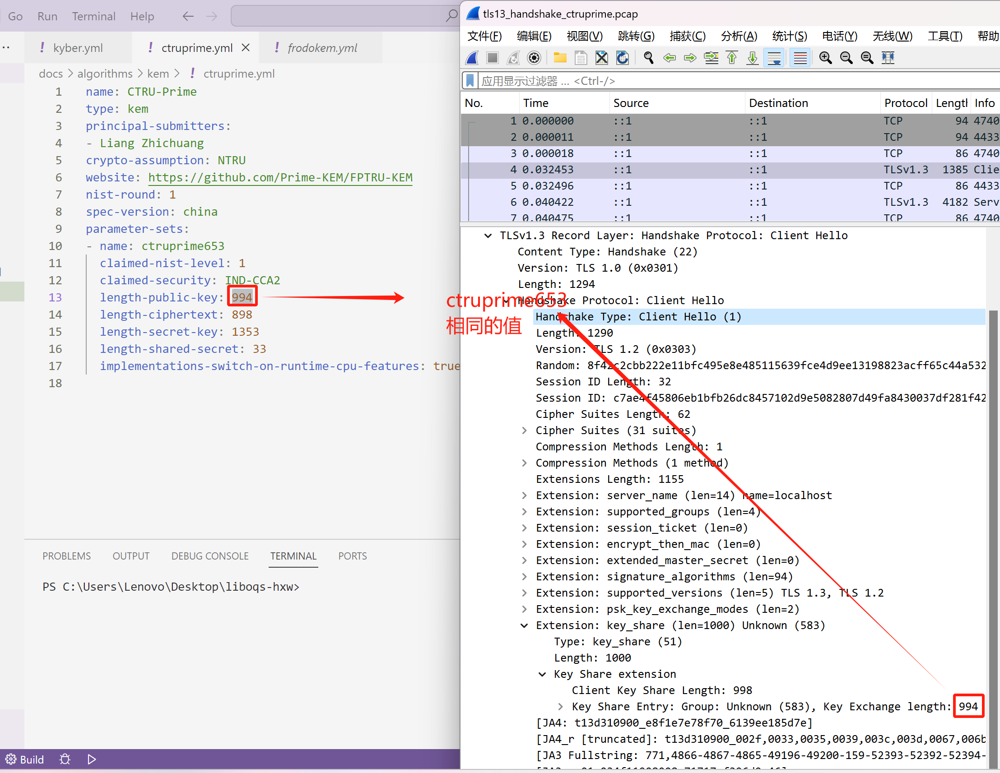

对于ctruprime653,在server hello的key_share的拓展中，也是一致的
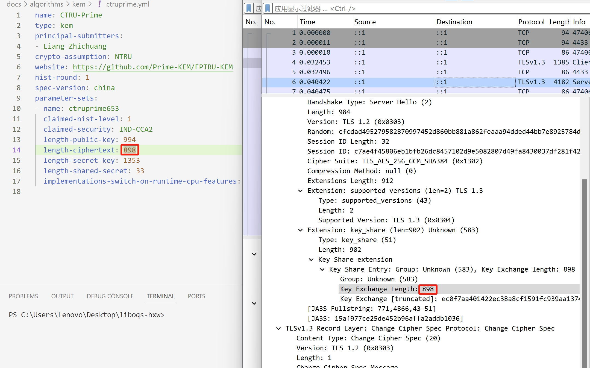

目前猜测完成了正确的kex，存在的问题可能是最终得到的kem结果是不一样的

因此，下面再调用liboqs中的内容重新进行测试
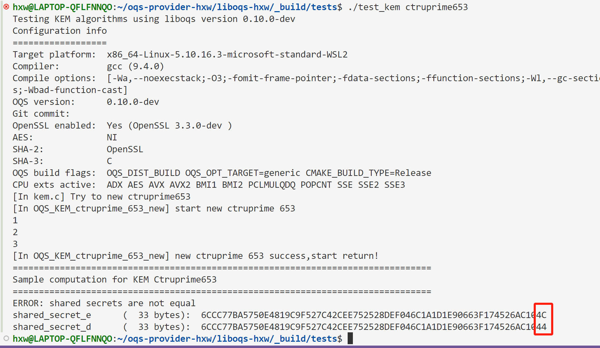

在多次的测试结果中，发现最终共享密钥总是不相等，猜测是因为长度的问题

现在的想法是，重新编译一边liboqs，然后进行安装

#### 修改liboqs

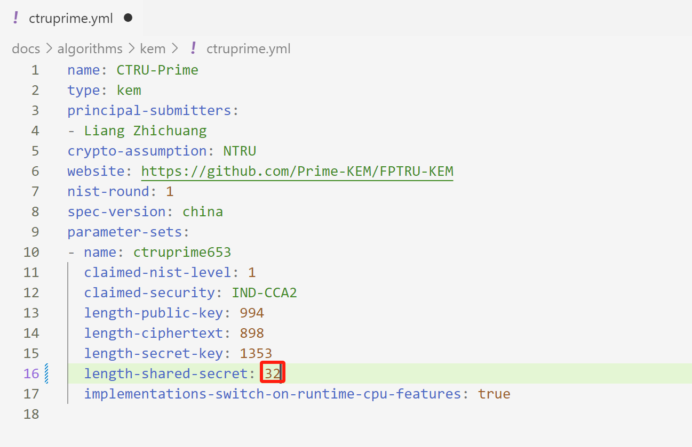

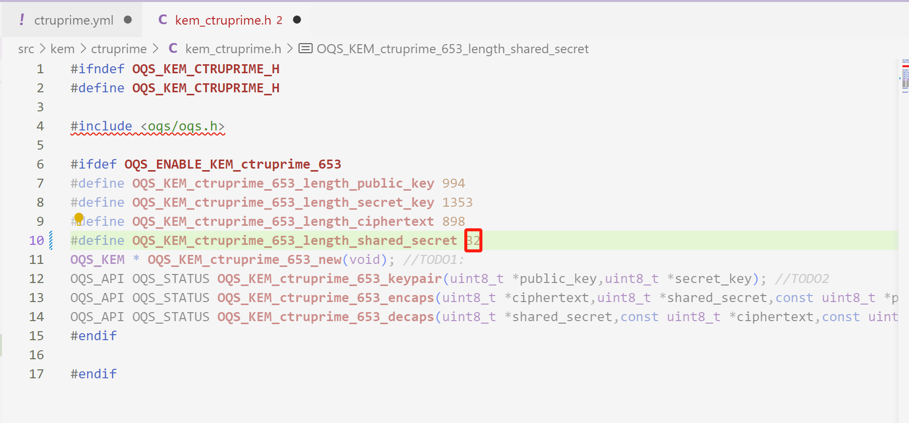

在wsl虚拟机上重新安装liboqs,出现如下所示的报错
``` bash
[1186/1216] Linking C executable tests/test_aes
FAILED: tests/test_aes 
: && /usr/bin/cc   -Wl,-z,noexecstack src/common/sha3/xkcp_low/CMakeFiles/xkcp_low_keccakp_1600_plain64.dir/KeccakP-1600/plain-64bits/KeccakP-1600-opt64.c.o src/common/sha3/xkcp_low/CMakeFiles/xkcp_low_keccakp_1600times4_serial.dir/KeccakP-1600times4/serial/KeccakP-1600-times4-on1.c.o src/common/sha3/xkcp_low/CMakeFiles/xkcp_low_keccakp_1600_avx2.dir/KeccakP-1600/avx2/KeccakP-1600-AVX2.S.o src/common/sha3/xkcp_low/CMakeFiles/xkcp_low_keccakp_1600times4_avx2.dir/KeccakP-1600times4/avx2/KeccakP-1600-times4-SIMD256.c.o src/common/CMakeFiles/common.dir/aes/aes.c.o src/common/CMakeFiles/common.dir/aes/aes_c.c.o src/common/CMakeFiles/common.dir/aes/aes128_ni.c.o src/common/CMakeFiles/common.dir/aes/aes256_ni.c.o src/common/CMakeFiles/common.dir/sha2/sha2_ossl.c.o src/common/CMakeFiles/common.dir/sha3/xkcp_sha3.c.o src/common/CMakeFiles/common.dir/sha3/xkcp_sha3x4.c.o src/common/CMakeFiles/common.dir/ossl_helpers.c.o src/common/CMakeFiles/common.dir/common.c.o src/common/CMakeFiles/common.dir/pqclean_shims/nistseedexpander.c.o src/common/CMakeFiles/common.dir/pqclean_shims/fips202.c.o src/common/CMakeFiles/common.dir/pqclean_shims/fips202x4.c.o src/common/CMakeFiles/common.dir/rand/rand.c.o src/common/CMakeFiles/common.dir/rand/rand_nist.c.o tests/CMakeFiles/test_aes.dir/test_aes.c.o  -o tests/test_aes  /usr/lib/x86_64-linux-gnu/libcrypto.so  -lm  -pthread && :
/usr/bin/ld: src/common/CMakeFiles/common.dir/ossl_helpers.c.o: in function `oqs_fetch_ossl_objects':
ossl_helpers.c:(.text.oqs_fetch_ossl_objects+0x14): undefined reference to `EVP_MD_fetch'
/usr/bin/ld: ossl_helpers.c:(.text.oqs_fetch_ossl_objects+0x2b): undefined reference to `EVP_MD_fetch'
/usr/bin/ld: ossl_helpers.c:(.text.oqs_fetch_ossl_objects+0x42): undefined reference to `EVP_MD_fetch'
/usr/bin/ld: ossl_helpers.c:(.text.oqs_fetch_ossl_objects+0x59): undefined reference to `EVP_MD_fetch'
/usr/bin/ld: ossl_helpers.c:(.text.oqs_fetch_ossl_objects+0x70): undefined reference to `EVP_MD_fetch'
/usr/bin/ld: src/common/CMakeFiles/common.dir/ossl_helpers.c.o:ossl_helpers.c:(.text.oqs_fetch_ossl_objects+0x87): more undefined references to `EVP_MD_fetch' follow
/usr/bin/ld: src/common/CMakeFiles/common.dir/ossl_helpers.c.o: in function `oqs_fetch_ossl_objects':
ossl_helpers.c:(.text.oqs_fetch_ossl_objects+0xcc): undefined reference to `EVP_CIPHER_fetch'
/usr/bin/ld: ossl_helpers.c:(.text.oqs_fetch_ossl_objects+0xe3): undefined reference to `EVP_CIPHER_fetch'
/usr/bin/ld: ossl_helpers.c:(.text.oqs_fetch_ossl_objects+0xfa): undefined reference to `EVP_CIPHER_fetch'
/usr/bin/ld: src/common/CMakeFiles/common.dir/ossl_helpers.c.o: in function `oqs_free_ossl_objects':
ossl_helpers.c:(.text.oqs_free_ossl_objects+0x10): undefined reference to `EVP_MD_free'
/usr/bin/ld: ossl_helpers.c:(.text.oqs_free_ossl_objects+0x1c): undefined reference to `EVP_MD_free'
/usr/bin/ld: ossl_helpers.c:(.text.oqs_free_ossl_objects+0x28): undefined reference to `EVP_MD_free'
/usr/bin/ld: ossl_helpers.c:(.text.oqs_free_ossl_objects+0x34): undefined reference to `EVP_MD_free'
/usr/bin/ld: ossl_helpers.c:(.text.oqs_free_ossl_objects+0x40): undefined reference to `EVP_MD_free'
/usr/bin/ld: src/common/CMakeFiles/common.dir/ossl_helpers.c.o:ossl_helpers.c:(.text.oqs_free_ossl_objects+0x4c): more undefined references to `EVP_MD_free' follow
/usr/bin/ld: src/common/CMakeFiles/common.dir/ossl_helpers.c.o: in function `oqs_free_ossl_objects':
ossl_helpers.c:(.text.oqs_free_ossl_objects+0x70): undefined reference to `EVP_CIPHER_free'
/usr/bin/ld: ossl_helpers.c:(.text.oqs_free_ossl_objects+0x7c): undefined reference to `EVP_CIPHER_free'
/usr/bin/ld: ossl_helpers.c:(.text.oqs_free_ossl_objects+0x8c): undefined reference to `EVP_CIPHER_free'
collect2: error: ld returned 1 exit status
[1191/1216] Linking C executable tests/test_hash
FAILED: tests/test_hash 
: && /usr/bin/cc   -Wl,-z,noexecstack src/common/sha3/xkcp_low/CMakeFiles/xkcp_low_keccakp_1600_plain64.dir/KeccakP-1600/plain-64bits/KeccakP-1600-opt64.c.o src/common/sha3/xkcp_low/CMakeFiles/xkcp_low_keccakp_1600times4_serial.dir/KeccakP-1600times4/serial/KeccakP-1600-times4-on1.c.o src/common/sha3/xkcp_low/CMakeFiles/xkcp_low_keccakp_1600_avx2.dir/KeccakP-1600/avx2/KeccakP-1600-AVX2.S.o src/common/sha3/xkcp_low/CMakeFiles/xkcp_low_keccakp_1600times4_avx2.dir/KeccakP-1600times4/avx2/KeccakP-1600-times4-SIMD256.c.o src/common/CMakeFiles/common.dir/aes/aes.c.o src/common/CMakeFiles/common.dir/aes/aes_c.c.o src/common/CMakeFiles/common.dir/aes/aes128_ni.c.o src/common/CMakeFiles/common.dir/aes/aes256_ni.c.o src/common/CMakeFiles/common.dir/sha2/sha2_ossl.c.o src/common/CMakeFiles/common.dir/sha3/xkcp_sha3.c.o src/common/CMakeFiles/common.dir/sha3/xkcp_sha3x4.c.o src/common/CMakeFiles/common.dir/ossl_helpers.c.o src/common/CMakeFiles/common.dir/common.c.o src/common/CMakeFiles/common.dir/pqclean_shims/nistseedexpander.c.o src/common/CMakeFiles/common.dir/pqclean_shims/fips202.c.o src/common/CMakeFiles/common.dir/pqclean_shims/fips202x4.c.o src/common/CMakeFiles/common.dir/rand/rand.c.o src/common/CMakeFiles/common.dir/rand/rand_nist.c.o tests/CMakeFiles/test_hash.dir/test_hash.c.o  -o tests/test_hash  /usr/lib/x86_64-linux-gnu/libcrypto.so  -lm  -pthread && :
/usr/bin/ld: src/common/CMakeFiles/common.dir/ossl_helpers.c.o: in function `oqs_fetch_ossl_objects':
ossl_helpers.c:(.text.oqs_fetch_ossl_objects+0x14): undefined reference to `EVP_MD_fetch'
/usr/bin/ld: ossl_helpers.c:(.text.oqs_fetch_ossl_objects+0x2b): undefined reference to `EVP_MD_fetch'
/usr/bin/ld: ossl_helpers.c:(.text.oqs_fetch_ossl_objects+0x42): undefined reference to `EVP_MD_fetch'
/usr/bin/ld: ossl_helpers.c:(.text.oqs_fetch_ossl_objects+0x59): undefined reference to `EVP_MD_fetch'
/usr/bin/ld: ossl_helpers.c:(.text.oqs_fetch_ossl_objects+0x70): undefined reference to `EVP_MD_fetch'
/usr/bin/ld: src/common/CMakeFiles/common.dir/ossl_helpers.c.o:ossl_helpers.c:(.text.oqs_fetch_ossl_objects+0x87): more undefined references to `EVP_MD_fetch' follow
/usr/bin/ld: src/common/CMakeFiles/common.dir/ossl_helpers.c.o: in function `oqs_fetch_ossl_objects':
ossl_helpers.c:(.text.oqs_fetch_ossl_objects+0xcc): undefined reference to `EVP_CIPHER_fetch'
/usr/bin/ld: ossl_helpers.c:(.text.oqs_fetch_ossl_objects+0xe3): undefined reference to `EVP_CIPHER_fetch'
/usr/bin/ld: ossl_helpers.c:(.text.oqs_fetch_ossl_objects+0xfa): undefined reference to `EVP_CIPHER_fetch'
/usr/bin/ld: src/common/CMakeFiles/common.dir/ossl_helpers.c.o: in function `oqs_free_ossl_objects':
ossl_helpers.c:(.text.oqs_free_ossl_objects+0x10): undefined reference to `EVP_MD_free'
/usr/bin/ld: ossl_helpers.c:(.text.oqs_free_ossl_objects+0x1c): undefined reference to `EVP_MD_free'
/usr/bin/ld: ossl_helpers.c:(.text.oqs_free_ossl_objects+0x28): undefined reference to `EVP_MD_free'
/usr/bin/ld: ossl_helpers.c:(.text.oqs_free_ossl_objects+0x34): undefined reference to `EVP_MD_free'
/usr/bin/ld: ossl_helpers.c:(.text.oqs_free_ossl_objects+0x40): undefined reference to `EVP_MD_free'
/usr/bin/ld: src/common/CMakeFiles/common.dir/ossl_helpers.c.o:ossl_helpers.c:(.text.oqs_free_ossl_objects+0x4c): more undefined references to `EVP_MD_free' follow
/usr/bin/ld: src/common/CMakeFiles/common.dir/ossl_helpers.c.o: in function `oqs_free_ossl_objects':
ossl_helpers.c:(.text.oqs_free_ossl_objects+0x70): undefined reference to `EVP_CIPHER_free'
/usr/bin/ld: ossl_helpers.c:(.text.oqs_free_ossl_objects+0x7c): undefined reference to `EVP_CIPHER_free'
/usr/bin/ld: ossl_helpers.c:(.text.oqs_free_ossl_objects+0x8c): undefined reference to `EVP_CIPHER_free'
collect2: error: ld returned 1 exit status
[1202/1216] Building C object src/sig/falcon/CMakeFiles/falcon_512_avx2.dir/pqclean_falcon-512_avx2/keygen.c.o
ninja: build stopped: subcommand failed.
```

似乎在直接使用oqs-provider-hxw进行安装的过程中，也会出现类似的错误

## 2024-3-1
感觉上述错误应该是由于没有找到对应的openssl引起的。
根据以前的报错，应该是openssl的版本问题的错误。
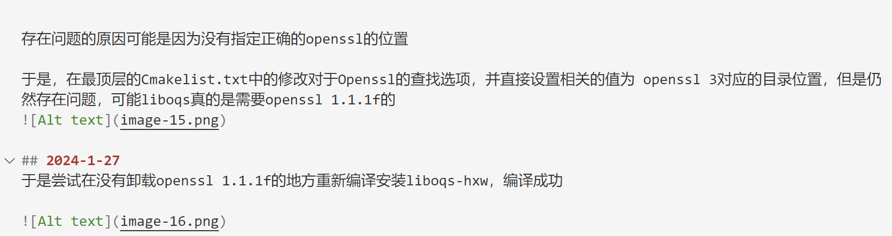

通过指定openssl_root_dir来使得liboqs针对具体的openssl版本进行安装
``` bash
cmake -GNinja .. -DOPENSSL_ROOT_DIR=/home/hxw/oqs-provider-hxw/.local/
```

调整并编译成功后，得到了正确的ctruprime653的结果
```bash
hxw@LAPTOP-QFLFNNQO:~/exp/liboqs-test/liboqs-hxw/build/tests$ ./test_kem ctruprime653
Testing KEM algorithms using liboqs version 0.10.0-dev
Configuration info
==================
Target platform:  x86_64-Linux-5.10.16.3-microsoft-standard-WSL2
Compiler:         gcc (9.4.0)
Compile options:  [-Wa,--noexecstack;-O3;-fomit-frame-pointer;-fdata-sections;-ffunction-sections;-Wl,--gc-sections;-Wbad-function-cast]
OQS version:      0.10.0-dev
Git commit:       
OpenSSL enabled:  Yes (OpenSSL 3.3.0-dev )
AES:              NI
SHA-2:            OpenSSL
SHA-3:            C
OQS build flags:  OQS_DIST_BUILD OQS_OPT_TARGET=generic CMAKE_BUILD_TYPE=Release 
CPU exts active:  ADX AES AVX AVX2 BMI1 BMI2 PCLMULQDQ POPCNT SSE SSE2 SSE3
[In kem.c] Try to new ctruprime653
[In OQS_KEM_ctruprime_653_new] start new ctruprime 653
================================================================================
Sample computation for KEM Ctruprime653
================================================================================
shared secrets are equal
```

**重新安装一遍oqs_provider**
首先修改命令，使得对于openssl版本的检测失效，来重新安装新的openssl
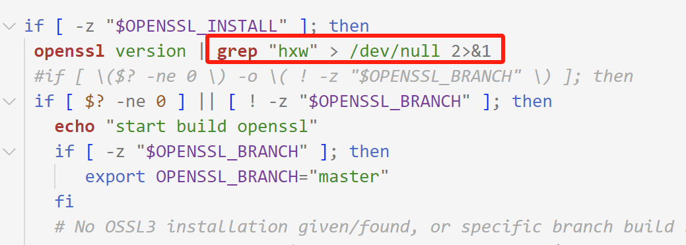

在安装过程中，出现如下所示的报错
```bash
[1216/1216] Linking C executable tests/kat_kem
[0/1] Install the project...
-- Install configuration: ""
-- Installing: /home/hxw/exp/oqs-provider-test/oqs-provider-hxw/scripts/.local/lib/cmake/liboqs/liboqsConfig.cmake
-- Installing: /home/hxw/exp/oqs-provider-test/oqs-provider-hxw/scripts/.local/lib/cmake/liboqs/liboqsConfigVersion.cmake
-- Installing: /home/hxw/exp/oqs-provider-test/oqs-provider-hxw/scripts/.local/lib/pkgconfig/liboqs.pc
-- Installing: /home/hxw/exp/oqs-provider-test/oqs-provider-hxw/scripts/.local/lib/liboqs.a
-- Installing: /home/hxw/exp/oqs-provider-test/oqs-provider-hxw/scripts/.local/lib/cmake/liboqs/liboqsTargets.cmake
-- Installing: /home/hxw/exp/oqs-provider-test/oqs-provider-hxw/scripts/.local/lib/cmake/liboqs/liboqsTargets-noconfig.cmake
-- Installing: /home/hxw/exp/oqs-provider-test/oqs-provider-hxw/scripts/.local/include/oqs/oqs.h
-- Installing: /home/hxw/exp/oqs-provider-test/oqs-provider-hxw/scripts/.local/include/oqs/common.h
-- Installing: /home/hxw/exp/oqs-provider-test/oqs-provider-hxw/scripts/.local/include/oqs/rand.h
-- Installing: /home/hxw/exp/oqs-provider-test/oqs-provider-hxw/scripts/.local/include/oqs/aes.h
-- Installing: /home/hxw/exp/oqs-provider-test/oqs-provider-hxw/scripts/.local/include/oqs/sha2.h
-- Installing: /home/hxw/exp/oqs-provider-test/oqs-provider-hxw/scripts/.local/include/oqs/sha3.h
-- Installing: /home/hxw/exp/oqs-provider-test/oqs-provider-hxw/scripts/.local/include/oqs/sha3x4.h
-- Installing: /home/hxw/exp/oqs-provider-test/oqs-provider-hxw/scripts/.local/include/oqs/kem.h
-- Installing: /home/hxw/exp/oqs-provider-test/oqs-provider-hxw/scripts/.local/include/oqs/sig.h
-- Installing: /home/hxw/exp/oqs-provider-test/oqs-provider-hxw/scripts/.local/include/oqs/kem_bike.h
-- Installing: /home/hxw/exp/oqs-provider-test/oqs-provider-hxw/scripts/.local/include/oqs/kem_frodokem.h
-- Installing: /home/hxw/exp/oqs-provider-test/oqs-provider-hxw/scripts/.local/include/oqs/kem_ntruprime.h
-- Installing: /home/hxw/exp/oqs-provider-test/oqs-provider-hxw/scripts/.local/include/oqs/kem_classic_mceliece.h
-- Installing: /home/hxw/exp/oqs-provider-test/oqs-provider-hxw/scripts/.local/include/oqs/kem_hqc.h
-- Installing: /home/hxw/exp/oqs-provider-test/oqs-provider-hxw/scripts/.local/include/oqs/kem_kyber.h
-- Installing: /home/hxw/exp/oqs-provider-test/oqs-provider-hxw/scripts/.local/include/oqs/kem_ctruprime.h
-- Installing: /home/hxw/exp/oqs-provider-test/oqs-provider-hxw/scripts/.local/include/oqs/sig_dilithium.h
-- Installing: /home/hxw/exp/oqs-provider-test/oqs-provider-hxw/scripts/.local/include/oqs/sig_falcon.h
-- Installing: /home/hxw/exp/oqs-provider-test/oqs-provider-hxw/scripts/.local/include/oqs/sig_sphincs.h
-- Installing: /home/hxw/exp/oqs-provider-test/oqs-provider-hxw/scripts/.local/include/oqs/oqsconfig.h
oqsprovider (_build/lib/oqsprovider.so) not built: Building...
openssl install type
CMake Error: The source directory "/home/hxw/exp/oqs-provider-test/oqs-provider-hxw/scripts" does not appear to contain CMakeLists.txt.
Specify --help for usage, or press the help button on the CMake GUI.
before cmake
Error: /home/hxw/exp/oqs-provider-test/oqs-provider-hxw/scripts/_build is not a directory
provider build failed. Exiting.
```

发现错误的原因在于安装的位置错误，不应该在scripts文件夹下，而应该在最外面的文件夹下。在修改了这个问题之后，正确编译成功。

**下面尝试修改环境变量，来将openssl指向新编译成功的版本**
首先记录一下修改之前的环境变量值
``` sh
export OPENSSL_PATH=/home/hxw/oqs-provider-hxw/.local/bin
export PATH=$OPENSSL_PATH:$PATH
export LD_LIBRARY_PATH=/home/hxw/oqs-provider-hxw/.local/lib64
export OPENSSL_APP=/home/hxw/oqs-provider-hxw/openssl/apps/openssl
export OPENSSL_CONF=/home/hxw/oqs-provider-hxw/scripts/openssl-ca.cnf
export OPENSSL_MODULES=/home/hxw/oqs-provider-hxw/_build/lib
export C_INCLUDE_PATH=$C_INCLUDE_PATH:/home/hxw/oqs-provider-hxw/.local/include
```

修改后的系统环境变量如下所示
``` sh
export OPENSSL_PATH=~/exp/oqs-provider-test/oqs-provider-hxw/.local/bin
export PATH=$OPENSSL_PATH:$PATH
export LD_LIBRARY_PATH=/home/hxw/oqs-provider-hxw/.local/lib64
export OPENSSL_APP=~/exp/oqs-provider-test/oqs-provider-hxw/openssl/apps/openssl
export OPENSSL_CONF=~/exp/oqs-provider-test/oqs-provider-hxw/scripts/openssl-ca.cnf
export OPENSSL_MODULES=/home/hxw/oqs-provider-hxw/_build/lib
export C_INCLUDE_PATH=$C_INCLUDE_PATH:/home/hxw/oqs-provider-hxw/.local/include
```

但是修改了之后，还是没有转变对应的版本
``` bash
hxw@LAPTOP-QFLFNNQO:~/exp$ openssl version -d
OPENSSLDIR: "/home/hxw/oqs-provider-hxw/.local/ssl"
```
注:此时使用openssl的s_server和s_client进行验证，并没有损坏原先安装好的openssl

在老虚拟机上，记录下的对于系统环境变量设置的思考

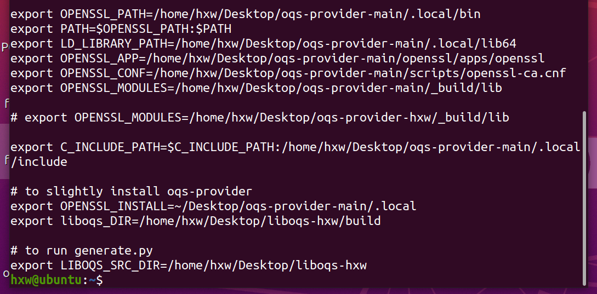
猜测是因为PATH中没有删除掉原先的环境变量，但是通过查看PATH的值，发现并不存在这个问题
``` bash
hxw@LAPTOP-QFLFNNQO:~/exp/certs$ printenv PATH | grep /home/hxw/oqs-provider-hxw/.local/bin
hxw@LAPTOP-QFLFNNQO:~/exp/certs$ printenv PATH | grep ~/exp/oqs-provider-test/oqs-provider-hxw/.local/bin
/home/hxw/.vscode-server/bin/903b1e9d8990623e3d7da1df3d33db3e42d80eda/bin/remote-cli:/home/hxw/exp/oqs-provider-test/oqs-provider-hxw/.local/bin:/usr/local/sbin:/usr/local/bin:/usr/sbin:/usr/bin:/sbin:/bin:/usr/games:/usr/local/games:/usr/lib/wsl/lib:/mnt/e/VMware/bin/:/mnt/c/Windows/system32:/mnt/c/Windows:/mnt/c/Windows/System32/Wbem:/mnt/c/Windows/System32/WindowsPowerShell/v1.0/:/mnt/c/Windows/System32/OpenSSH/:/mnt/e/Git/bin/:/mnt/c/Users/Lenovo/AppData/Local/Microsoft/WindowsApps:/mnt/e/VsCode/Microsoft VS Code/bin:/snap/bin
```
通过直接在openssl命令前面加上路径来使用对应的openssl
```bash
hxw@LAPTOP-QFLFNNQO:~/exp/certs$ /home/hxw/exp/oqs-provider-test/oqs-provider-hxw/.local/bin/openssl s_client -groups ctruprime653
Connecting to ::1
CONNECTED(00000003)
[In kem.c] Try to new ctruprime653
[In OQS_KEM_ctruprime_653_new] start new ctruprime 653
1
2
3
[In OQS_KEM_ctruprime_653_new] new ctruprime 653 success,start return!
8064F5D0A17F0000:error:0A000119:SSL routines:tls_get_more_records:decryption failed or bad record mac:ssl/record/methods/tls_common.c:858:
8064F5D0A17F0000:error:0A000139:SSL routines::record layer failure:ssl/record/rec_layer_s3.c:643:
---
no peer certificate available
---
No client certificate CA names sent
---
SSL handshake has read 1037 bytes and written 1306 bytes
Verification: OK
---
New, TLSv1.3, Cipher is TLS_AES_256_GCM_SHA384
This TLS version forbids renegotiation.
Compression: NONE
Expansion: NONE
No ALPN negotiated
Early data was not sent
Verify return code: 0 (ok)
---
```
但是仍然报错，根据输出的ctruprime信息，观察到在调用liboqs库的过程中，仍然使用的是老版本的liboqs，猜测是和liboqs指定的路径有关


晚上回来进行检查，发现可能当时自己看错了？直接调用新版openssl中bin的命令并不能解决版本调用的问题
``` bash
hxw@LAPTOP-QFLFNNQO:~/exp/oqs-provider-test/oqs-provider-hxw/.local/bin$ ./openssl version -d
OPENSSLDIR: "/home/hxw/oqs-provider-hxw/.local/ssl"
```

在尝试修改环境变量OPENSSLDIR的情况下也是如此
``` bash
hxw@LAPTOP-QFLFNNQO:~/exp/oqs-provider-test/oqs-provider-hxw/.local/bin$ openssl version -d
OPENSSLDIR: "/home/hxw/oqs-provider-hxw/.local/ssl"
hxw@LAPTOP-QFLFNNQO:~/exp/oqs-provider-test/oqs-provider-hxw/.local/bin$ printenv OPENSSLDIR
/home/hxw/exp/oqs-provider-test/oqs-provider-hxw/.local/ssl
```
TODO:找到能够修改已知openssl使用版本的方法，并测试修改后的ctruprime是否有用

# 2024-3-3
通过which openssl命令，得到似乎会调用新的openssl
``` bash
which openssl
/home/hxw/exp/oqs-provider-test/oqs-provider-hxw/.local/bin/openssl
```
此时修改系统环境变量如下所示
```bash
export OPENSSL_PATH=/home/hxw/exp/oqs-provider-test/oqs-provider-hxw/.local/bin
export PATH=$OPENSSL_PATH:$PATH
export LD_LIBRARY_PATH=/home/hxw/exp/oqs-provider-test/oqs-provider-hxw/.local/lib64
export OPENSSL_APP=/home/hxw/exp/oqs-provider-test/oqs-provider-hxw/openssl/apps/openssl
export OPENSSL_CONF=/home/hxw/exp/oqs-provider-test/oqs-provider-hxw/scripts/openssl-ca.cnf
export OPENSSL_MODULES=/home/hxw/exp/oqs-provider-test/oqs-provider-hxw/_build/lib
export C_INCLUDE_PATH=$C_INCLUDE_PATH:/home/hxw/exp/oqs-provider-test/oqs-provider-hxw/.local/include

export OPENSSLDIR=/home/hxw/exp/oqs-provider-test/oqs-provider-hxw/.local/ssl
```

再次重新运行命令如下所示
```bash
hxw@LAPTOP-QFLFNNQO:~/exp$ openssl version -d
OPENSSLDIR: "/home/hxw/exp/oqs-provider-test/oqs-provider-hxw/.local/ssl"
```

此时，却发现并没有将ctruprime653安装到oqsprovider中
``` bash
hxw@LAPTOP-QFLFNNQO:~/exp/certs$ openssl list -kem-algorithms -provider oqsprovider | grep ctruprime653
```

在liboqs-hxw中，存在ctruprime.h头文件
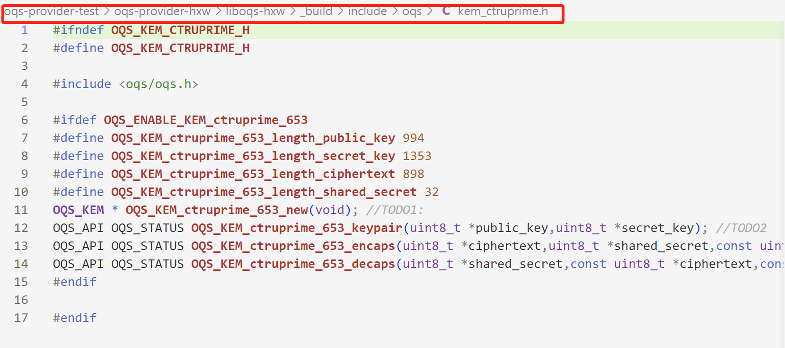

在openssl的include文件夹下，存在kem_ctruprime.h文件
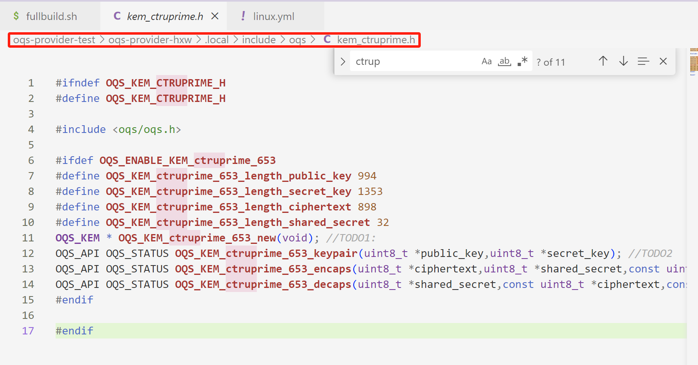

**首先确定liboqs中已经集成了ctruprime653**
``` bash
/_build/tests$ ./test_kem ctruprime653
Testing KEM algorithms using liboqs version 0.10.0-dev
Configuration info
==================
Target platform:  x86_64-Linux-5.10.16.3-microsoft-standard-WSL2
Compiler:         gcc (9.4.0)
Compile options:  [-Wa,--noexecstack;-O3;-fomit-frame-pointer;-fdata-sections;-ffunction-sections;-Wl,--gc-sections;-Wbad-function-cast]
OQS version:      0.10.0-dev
Git commit:       
OpenSSL enabled:  Yes (OpenSSL 3.3.0-dev )
AES:              NI
SHA-2:            OpenSSL
SHA-3:            C
OQS build flags:  OQS_DIST_BUILD OQS_OPT_TARGET=generic CMAKE_BUILD_TYPE=Release 
CPU exts active:  ADX AES AVX AVX2 BMI1 BMI2 PCLMULQDQ POPCNT SSE SSE2 SSE3
[In kem.c] Try to new ctruprime653
[In OQS_KEM_ctruprime_653_new] start new ctruprime 653
================================================================================
Sample computation for KEM Ctruprime653
================================================================================
shared secrets are equal
```

**检查oqsprovider**的接入
首先检查fullbuild.sh中是否调用了generate.py文件
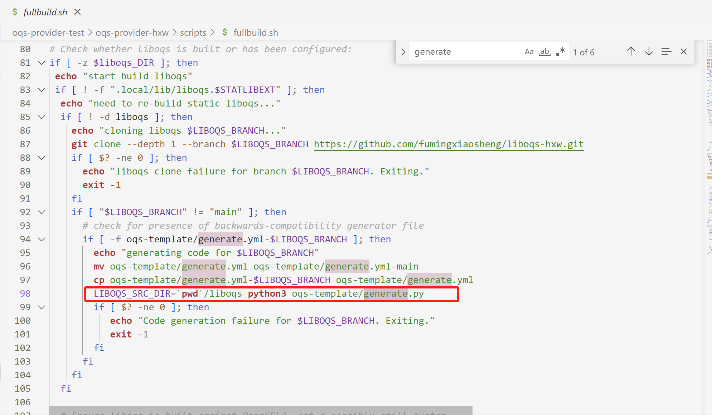
检查oqsprovider中关于nid定义部分


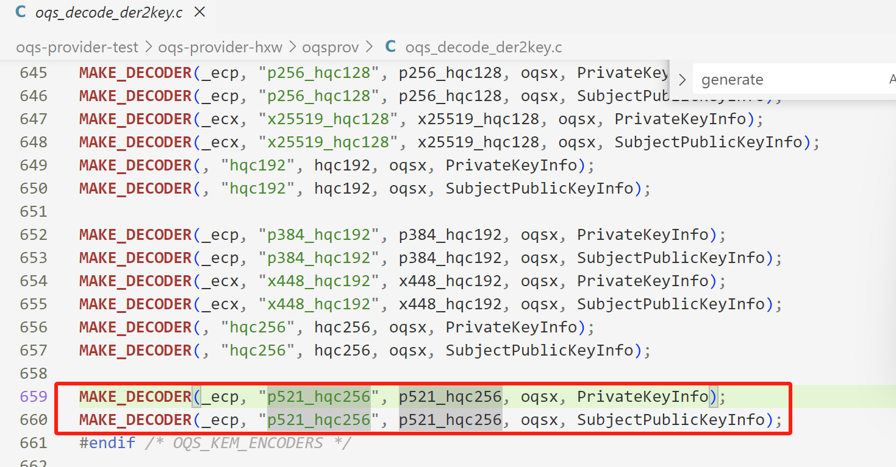

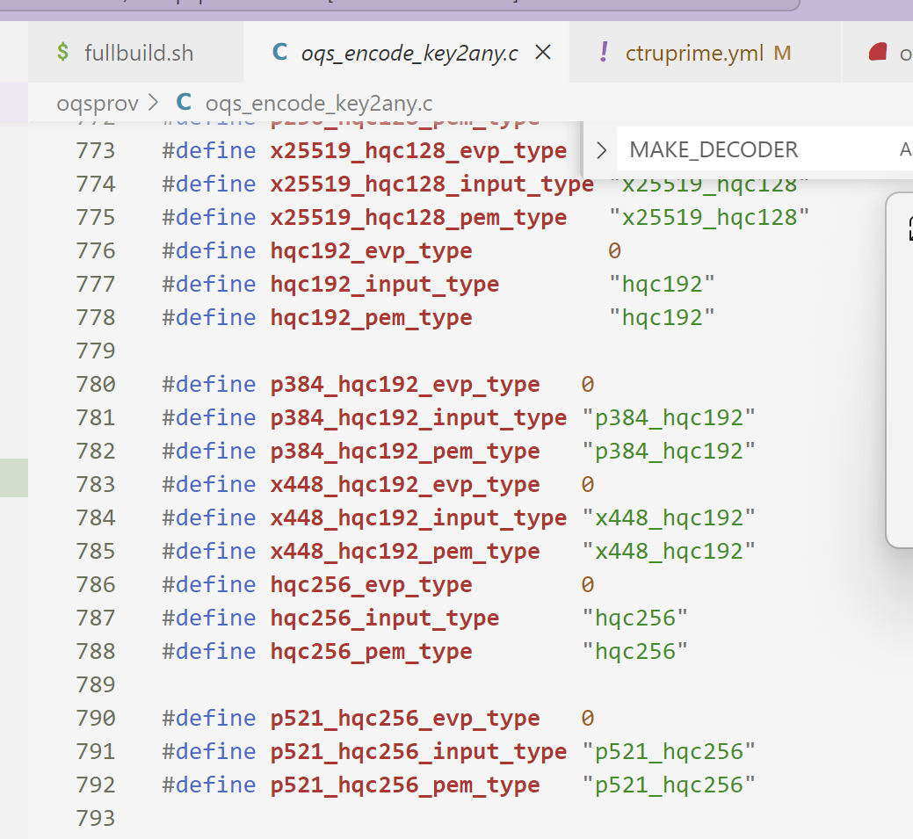

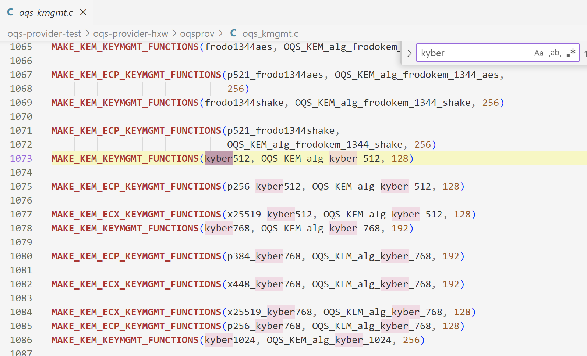

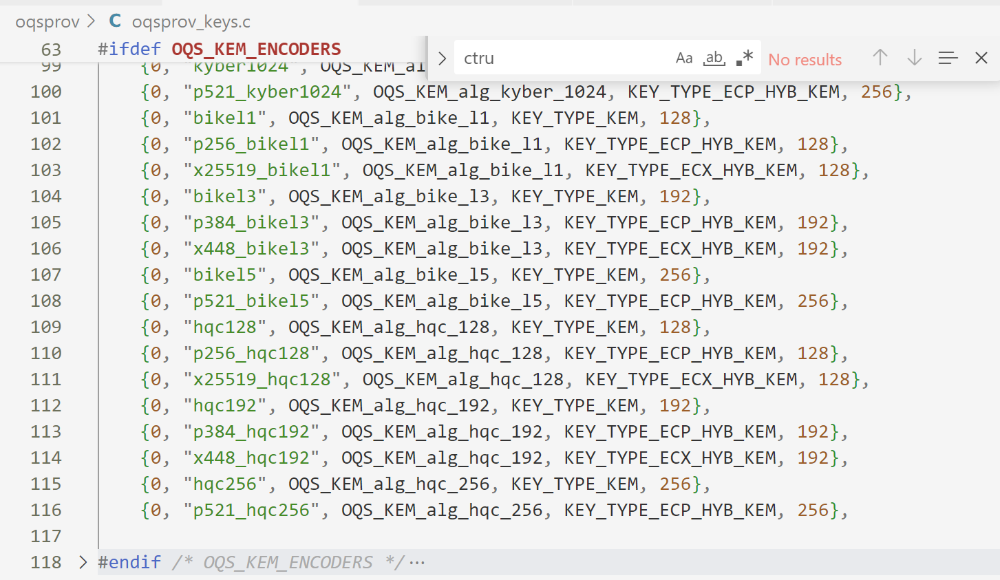

查看在vm虚拟机上的版本，发现可能是通过运行什么文件导致了oqsprov文件的修改
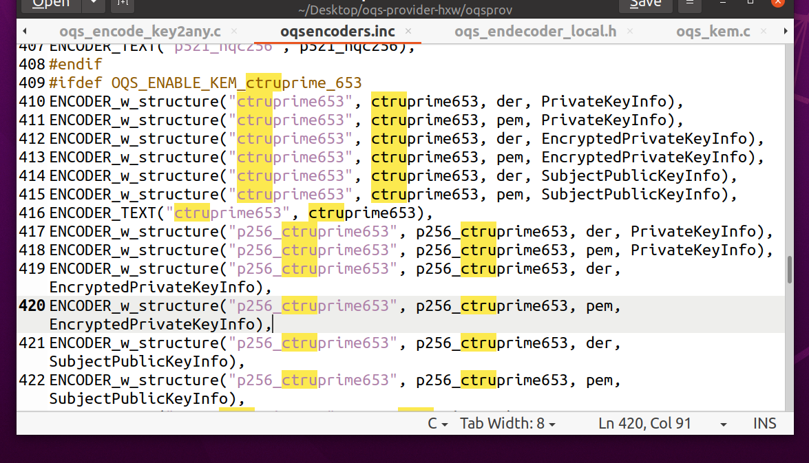

重新运行python3 
```bash
hxw@LAPTOP-QFLFNNQO:~/exp/oqs-provider-test/oqs-provider-hxw$ python3 ./oqs-template/generate.py
load_config
file_get_contents
get_tmp_kem_oid
get_tmp_kem_oid
get_tmp_kem_oid
get_tmp_kem_oid
get_tmp_kem_oid
get_tmp_kem_oid
get_tmp_kem_oid
get_tmp_kem_oid
get_tmp_kem_oid
get_tmp_kem_oid
get_tmp_kem_oid
complete_config
get_kem_nistlevel {'family': 'FrodoKEM', 'name_group': 'frodo640aes', 'nid': '0x0200', 'nid_hybrid': '0x2F00', 'oqs_alg': 'OQS_KEM_alg_frodokem_640_aes', 'extra_nids': {'current': [{'hybrid_group': 'x25519', 'nid': '0x2F80', 'bit_security': 128, 'hybrid_oid': '1.3.9999.99.1'}]}, 'hybrids': [{'hybrid_group': 'x25519', 'nid': '0x2F80', 'bit_security': 128, 'hybrid_oid': '1.3.9999.99.1'}]}
file_get_contents
nist_to_bits
get_tmp_kem_oid
get_tmp_kem_oid
get_kem_nistlevel {'family': 'FrodoKEM', 'name_group': 'frodo640shake', 'nid': '0x0201', 'nid_hybrid': '0x2F01', 'oqs_alg': 'OQS_KEM_alg_frodokem_640_shake', 'extra_nids': {'current': [{'hybrid_group': 'x25519', 'nid': '0x2F81', 'bit_security': 128, 'hybrid_oid': '1.3.9999.99.2'}]}, 'hybrids': [{'hybrid_group': 'x25519', 'nid': '0x2F81', 'bit_security': 128, 'hybrid_oid': '1.3.9999.99.2'}]}
file_get_contents
nist_to_bits
get_tmp_kem_oid
get_tmp_kem_oid
get_kem_nistlevel {'family': 'FrodoKEM', 'name_group': 'frodo976aes', 'nid': '0x0202', 'nid_hybrid': '0x2F02', 'oqs_alg': 'OQS_KEM_alg_frodokem_976_aes', 'extra_nids': {'current': [{'hybrid_group': 'x448', 'nid': '0x2F82', 'bit_security': 192, 'hybrid_oid': '1.3.9999.99.3'}]}, 'hybrids': [{'hybrid_group': 'x448', 'nid': '0x2F82', 'bit_security': 192, 'hybrid_oid': '1.3.9999.99.3'}]}
file_get_contents
nist_to_bits
get_tmp_kem_oid
get_tmp_kem_oid
get_kem_nistlevel {'family': 'FrodoKEM', 'name_group': 'frodo976shake', 'nid': '0x0203', 'nid_hybrid': '0x2F03', 'oqs_alg': 'OQS_KEM_alg_frodokem_976_shake', 'extra_nids': {'current': [{'hybrid_group': 'x448', 'nid': '0x2F83', 'bit_security': 192, 'hybrid_oid': '1.3.9999.99.4'}]}, 'hybrids': [{'hybrid_group': 'x448', 'nid': '0x2F83', 'bit_security': 192, 'hybrid_oid': '1.3.9999.99.4'}]}
file_get_contents
nist_to_bits
get_tmp_kem_oid
get_tmp_kem_oid
get_kem_nistlevel {'family': 'FrodoKEM', 'name_group': 'frodo1344aes', 'nid': '0x0204', 'nid_hybrid': '0x2F04', 'oqs_alg': 'OQS_KEM_alg_frodokem_1344_aes', 'hybrids': []}
file_get_contents
nist_to_bits
get_tmp_kem_oid
get_tmp_kem_oid
get_kem_nistlevel {'family': 'FrodoKEM', 'name_group': 'frodo1344shake', 'nid': '0x0205', 'nid_hybrid': '0x2F05', 'oqs_alg': 'OQS_KEM_alg_frodokem_1344_shake', 'hybrids': []}
file_get_contents
nist_to_bits
get_tmp_kem_oid
get_tmp_kem_oid
get_kem_nistlevel {'family': 'CRYSTALS-Kyber', 'name_group': 'kyber512', 'nid': '0x023A', 'oid': '1.3.6.1.4.1.22554.5.6.1', 'nid_hybrid': '0x2F3A', 'hybrid_oid': '1.3.6.1.4.1.22554.5.7.1', 'oqs_alg': 'OQS_KEM_alg_kyber_512', 'extra_nids': {'current': [{'hybrid_group': 'x25519', 'hybrid_oid': '1.3.6.1.4.1.22554.5.8.1', 'nid': '0x2F39', 'bit_security': 128}], 'old': [{'implementation_version': 'NIST Round 2 submission', 'nist-round': 2, 'nid': '0x020F'}, {'implementation_version': 'NIST Round 2 submission', 'nist-round': 2, 'hybrid_group': 'secp256_r1', 'nid': '0x2F0F'}, {'implementation_version': 'NIST Round 2 submission', 'nist-round': 2, 'hybrid_group': 'x25519', 'nid': '0x2F26'}]}, 'hybrids': [{'hybrid_group': 'x25519', 'hybrid_oid': '1.3.6.1.4.1.22554.5.8.1', 'nid': '0x2F39', 'bit_security': 128}]}
file_get_contents
nist_to_bits
get_kem_nistlevel {'family': 'CRYSTALS-Kyber', 'name_group': 'kyber768', 'nid': '0x023C', 'oid': '1.3.6.1.4.1.22554.5.6.2', 'nid_hybrid': '0x2F3C', 'extra_nids': {'current': [{'hybrid_group': 'x448', 'nid': '0x2F90', 'bit_security': 192, 'hybrid_oid': '1.3.9999.99.5'}, {'hybrid_group': 'x25519', 'nid': '0x6399', 'bit_security': 128, 'hybrid_oid': '1.3.9999.99.6'}, {'hybrid_group': 'p256', 'nid': '0x639A', 'bit_security': 128, 'hybrid_oid': '1.3.9999.99.7'}], 'old': [{'implementation_version': 'NIST Round 2 submission', 'nist-round': 2, 'nid': '0x0210'}, {'implementation_version': 'NIST Round 2 submission', 'nist-round': 2, 'hybrid_group': 'secp384_r1', 'nid': '0x2F10'}]}, 'oqs_alg': 'OQS_KEM_alg_kyber_768', 'hybrids': [{'hybrid_group': 'x448', 'nid': '0x2F90', 'bit_security': 192, 'hybrid_oid': '1.3.9999.99.5'}, {'hybrid_group': 'x25519', 'nid': '0x6399', 'bit_security': 128, 'hybrid_oid': '1.3.9999.99.6'}, {'hybrid_group': 'p256', 'nid': '0x639A', 'bit_security': 128, 'hybrid_oid': '1.3.9999.99.7'}]}
file_get_contents
nist_to_bits
get_tmp_kem_oid
get_kem_nistlevel {'family': 'CRYSTALS-Kyber', 'name_group': 'kyber1024', 'nid': '0x023D', 'oid': '1.3.6.1.4.1.22554.5.6.3', 'nid_hybrid': '0x2F3D', 'extra_nids': {'old': [{'implementation_version': 'NIST Round 2 submission', 'nist-round': 2, 'nid': '0x0211'}, {'implementation_version': 'NIST Round 2 submission', 'nist-round': 2, 'hybrid_group': 'secp521_r1', 'nid': '0x2F11'}]}, 'oqs_alg': 'OQS_KEM_alg_kyber_1024', 'hybrids': []}
file_get_contents
nist_to_bits
get_tmp_kem_oid
get_kem_nistlevel {'family': 'BIKE', 'name_group': 'bikel1', 'implementation_version': '5.1', 'nid': '0x0241', 'nid_hybrid': '0x2F41', 'oqs_alg': 'OQS_KEM_alg_bike_l1', 'extra_nids': {'current': [{'hybrid_group': 'x25519', 'nid': '0x2FAE', 'bit_security': 128, 'hybrid_oid': '1.3.9999.99.8'}], 'old': [{'implementation_version': 'NIST Round 3 submission', 'nist-round': 3, 'nid': '0x0238'}, {'implementation_version': 'NIST Round 3 submission', 'nist-round': 3, 'hybrid_group': 'x25519', 'nid': '0x2F37'}, {'implementation_version': 'NIST Round 3 submission', 'nist-round': 3, 'hybrid_group': 'secp256_r1', 'nid': '0x2F38'}]}, 'hybrids': [{'hybrid_group': 'x25519', 'nid': '0x2FAE', 'bit_security': 128, 'hybrid_oid': '1.3.9999.99.8'}]}
file_get_contents
nist_to_bits
get_tmp_kem_oid
get_tmp_kem_oid
get_kem_nistlevel {'family': 'BIKE', 'name_group': 'bikel3', 'implementation_version': '5.1', 'nid': '0x0242', 'nid_hybrid': '0x2F42', 'oqs_alg': 'OQS_KEM_alg_bike_l3', 'extra_nids': {'current': [{'hybrid_group': 'x448', 'nid': '0x2FAF', 'bit_security': 192, 'hybrid_oid': '1.3.9999.99.9'}], 'old': [{'implementation_version': 'NIST Round 3 submission', 'nist-round': 3, 'nid': '0x023B'}, {'implementation_version': 'NIST Round 3 submission', 'nist-round': 3, 'hybrid_group': 'secp384_r1', 'nid': '0x2F3B'}]}, 'hybrids': [{'hybrid_group': 'x448', 'nid': '0x2FAF', 'bit_security': 192, 'hybrid_oid': '1.3.9999.99.9'}]}
file_get_contents
nist_to_bits
get_tmp_kem_oid
get_tmp_kem_oid
get_kem_nistlevel {'family': 'BIKE', 'name_group': 'bikel5', 'implementation_version': '5.1', 'nid': '0x0243', 'nid_hybrid': '0x2F43', 'oqs_alg': 'OQS_KEM_alg_bike_l5', 'hybrids': []}
file_get_contents
nist_to_bits
get_tmp_kem_oid
get_tmp_kem_oid
get_kem_nistlevel {'family': 'HQC', 'name_group': 'hqc128', 'nid': '0x0244', 'nid_hybrid': '0x2F44', 'oqs_alg': 'OQS_KEM_alg_hqc_128', 'extra_nids': {'current': [{'hybrid_group': 'x25519', 'nid': '0x2FB0', 'bit_security': 128, 'hybrid_oid': '1.3.9999.99.10'}], 'old': [{'implementation_version': 'NIST Round 3 submission', 'nist-round': 3, 'nid': '0x022C'}, {'implementation_version': 'NIST Round 3 submission', 'nist-round': 3, 'hybrid_group': 'secp256_r1', 'nid': '0x2F2C'}, {'implementation_version': 'NIST Round 3 submission', 'nist-round': 3, 'hybrid_group': 'x25519', 'nid': '0x2FAC'}]}, 'hybrids': [{'hybrid_group': 'x25519', 'nid': '0x2FB0', 'bit_security': 128, 'hybrid_oid': '1.3.9999.99.10'}]}
file_get_contents
nist_to_bits
get_tmp_kem_oid
get_tmp_kem_oid
get_kem_nistlevel {'family': 'HQC', 'name_group': 'hqc192', 'nid': '0x0245', 'nid_hybrid': '0x2F45', 'oqs_alg': 'OQS_KEM_alg_hqc_192', 'extra_nids': {'current': [{'hybrid_group': 'x448', 'nid': '0x2FB1', 'bit_security': 192, 'hybrid_oid': '1.3.9999.99.11'}], 'old': [{'implementation_version': 'NIST Round 3 submission', 'nist-round': 3, 'nid': '0x022D'}, {'implementation_version': 'NIST Round 3 submission', 'nist-round': 3, 'hybrid_group': 'secp384_r1', 'nid': '0x2F2D'}, {'implementation_version': 'NIST Round 3 submission', 'nist-round': 3, 'hybrid_group': 'x448', 'nid': '0x2FAD'}]}, 'hybrids': [{'hybrid_group': 'x448', 'nid': '0x2FB1', 'bit_security': 192, 'hybrid_oid': '1.3.9999.99.11'}]}
file_get_contents
nist_to_bits
get_tmp_kem_oid
get_tmp_kem_oid
get_kem_nistlevel {'family': 'HQC', 'name_group': 'hqc256', 'nid': '0x0246', 'nid_hybrid': '0x2F46', 'oqs_alg': 'OQS_KEM_alg_hqc_256', 'extra_nids': {'old': [{'implementation_version': 'NIST Round 3 submission', 'nist-round': 3, 'nid': '0x022E'}, {'implementation_version': 'NIST Round 3 submission', 'nist-round': 3, 'hybrid_group': 'secp521_r1', 'nid': '0x2F2E'}]}, 'hybrids': []}
file_get_contents
nist_to_bits
get_tmp_kem_oid
get_tmp_kem_oid
get_kem_nistlevel {'family': 'ctruprime', 'name_group': 'ctruprime653', 'nid': '0x0247', 'nid_hybrid': '0x2F47', 'oqs_alg': 'OQS_KEM_alg_ctruprime_653', 'hybrids': []}
file_get_contents
nist_to_bits
get_tmp_kem_oid
get_tmp_kem_oid
get_sig_nistlevel
file_get_contents
nist_to_bits
get_sig_nistlevel
file_get_contents
nist_to_bits
get_sig_nistlevel
file_get_contents
nist_to_bits
get_sig_nistlevel
file_get_contents
nist_to_bits
get_sig_nistlevel
file_get_contents
nist_to_bits
get_sig_nistlevel
file_get_contents
nist_to_bits
get_sig_nistlevel
file_get_contents
nist_to_bits
get_sig_nistlevel
file_get_contents
nist_to_bits
get_sig_nistlevel
file_get_contents
nist_to_bits
populate
file_get_contents
file_put_contents
populate
file_get_contents
file_put_contents
populate
file_get_contents
file_put_contents
populate
file_get_contents
file_put_contents
populate
file_get_contents
file_put_contents
populate
file_get_contents
file_put_contents
populate
file_get_contents
file_put_contents
populate
file_get_contents
file_put_contents
populate
file_get_contents
file_put_contents
populate
file_get_contents
file_put_contents
load_config
file_get_contents
get_tmp_kem_oid
get_tmp_kem_oid
get_tmp_kem_oid
get_tmp_kem_oid
get_tmp_kem_oid
get_tmp_kem_oid
get_tmp_kem_oid
get_tmp_kem_oid
get_tmp_kem_oid
get_tmp_kem_oid
get_tmp_kem_oid
complete_config
get_kem_nistlevel {'family': 'FrodoKEM', 'name_group': 'frodo640aes', 'nid': '0x0200', 'nid_hybrid': '0x2F00', 'oqs_alg': 'OQS_KEM_alg_frodokem_640_aes', 'extra_nids': {'current': [{'hybrid_group': 'x25519', 'nid': '0x2F80', 'bit_security': 128, 'hybrid_oid': '1.3.9999.99.40'}]}, 'hybrids': [{'hybrid_group': 'x25519', 'nid': '0x2F80', 'bit_security': 128, 'hybrid_oid': '1.3.9999.99.40'}]}
file_get_contents
nist_to_bits
get_tmp_kem_oid
get_tmp_kem_oid
get_kem_nistlevel {'family': 'FrodoKEM', 'name_group': 'frodo640shake', 'nid': '0x0201', 'nid_hybrid': '0x2F01', 'oqs_alg': 'OQS_KEM_alg_frodokem_640_shake', 'extra_nids': {'current': [{'hybrid_group': 'x25519', 'nid': '0x2F81', 'bit_security': 128, 'hybrid_oid': '1.3.9999.99.41'}]}, 'hybrids': [{'hybrid_group': 'x25519', 'nid': '0x2F81', 'bit_security': 128, 'hybrid_oid': '1.3.9999.99.41'}]}
file_get_contents
nist_to_bits
get_tmp_kem_oid
get_tmp_kem_oid
get_kem_nistlevel {'family': 'FrodoKEM', 'name_group': 'frodo976aes', 'nid': '0x0202', 'nid_hybrid': '0x2F02', 'oqs_alg': 'OQS_KEM_alg_frodokem_976_aes', 'extra_nids': {'current': [{'hybrid_group': 'x448', 'nid': '0x2F82', 'bit_security': 192, 'hybrid_oid': '1.3.9999.99.42'}]}, 'hybrids': [{'hybrid_group': 'x448', 'nid': '0x2F82', 'bit_security': 192, 'hybrid_oid': '1.3.9999.99.42'}]}
file_get_contents
nist_to_bits
get_tmp_kem_oid
get_tmp_kem_oid
get_kem_nistlevel {'family': 'FrodoKEM', 'name_group': 'frodo976shake', 'nid': '0x0203', 'nid_hybrid': '0x2F03', 'oqs_alg': 'OQS_KEM_alg_frodokem_976_shake', 'extra_nids': {'current': [{'hybrid_group': 'x448', 'nid': '0x2F83', 'bit_security': 192, 'hybrid_oid': '1.3.9999.99.43'}]}, 'hybrids': [{'hybrid_group': 'x448', 'nid': '0x2F83', 'bit_security': 192, 'hybrid_oid': '1.3.9999.99.43'}]}
file_get_contents
nist_to_bits
get_tmp_kem_oid
get_tmp_kem_oid
get_kem_nistlevel {'family': 'FrodoKEM', 'name_group': 'frodo1344aes', 'nid': '0x0204', 'nid_hybrid': '0x2F04', 'oqs_alg': 'OQS_KEM_alg_frodokem_1344_aes', 'hybrids': []}
file_get_contents
nist_to_bits
get_tmp_kem_oid
get_tmp_kem_oid
get_kem_nistlevel {'family': 'FrodoKEM', 'name_group': 'frodo1344shake', 'nid': '0x0205', 'nid_hybrid': '0x2F05', 'oqs_alg': 'OQS_KEM_alg_frodokem_1344_shake', 'hybrids': []}
file_get_contents
nist_to_bits
get_tmp_kem_oid
get_tmp_kem_oid
get_kem_nistlevel {'family': 'CRYSTALS-Kyber', 'name_group': 'kyber512', 'nid': '0x023A', 'oid': '1.3.6.1.4.1.22554.5.6.1', 'nid_hybrid': '0x2F3A', 'hybrid_oid': '1.3.6.1.4.1.22554.5.7.1', 'oqs_alg': 'OQS_KEM_alg_kyber_512', 'extra_nids': {'current': [{'hybrid_group': 'x25519', 'hybrid_oid': '1.3.6.1.4.1.22554.5.8.1', 'nid': '0x2F39', 'bit_security': 128}], 'old': [{'implementation_version': 'NIST Round 2 submission', 'nist-round': 2, 'nid': '0x020F'}, {'implementation_version': 'NIST Round 2 submission', 'nist-round': 2, 'hybrid_group': 'secp256_r1', 'nid': '0x2F0F'}, {'implementation_version': 'NIST Round 2 submission', 'nist-round': 2, 'hybrid_group': 'x25519', 'nid': '0x2F26'}]}, 'hybrids': [{'hybrid_group': 'x25519', 'hybrid_oid': '1.3.6.1.4.1.22554.5.8.1', 'nid': '0x2F39', 'bit_security': 128}]}
file_get_contents
nist_to_bits
get_kem_nistlevel {'family': 'CRYSTALS-Kyber', 'name_group': 'kyber768', 'nid': '0x023C', 'oid': '1.3.6.1.4.1.22554.5.6.2', 'nid_hybrid': '0x2F3C', 'extra_nids': {'current': [{'hybrid_group': 'x448', 'nid': '0x2F90', 'bit_security': 192, 'hybrid_oid': '1.3.9999.99.44'}, {'hybrid_group': 'x25519', 'nid': '0x6399', 'bit_security': 128, 'hybrid_oid': '1.3.9999.99.45'}, {'hybrid_group': 'p256', 'nid': '0x639A', 'bit_security': 128, 'hybrid_oid': '1.3.9999.99.46'}], 'old': [{'implementation_version': 'NIST Round 2 submission', 'nist-round': 2, 'nid': '0x0210'}, {'implementation_version': 'NIST Round 2 submission', 'nist-round': 2, 'hybrid_group': 'secp384_r1', 'nid': '0x2F10'}]}, 'oqs_alg': 'OQS_KEM_alg_kyber_768', 'hybrids': [{'hybrid_group': 'x448', 'nid': '0x2F90', 'bit_security': 192, 'hybrid_oid': '1.3.9999.99.44'}, {'hybrid_group': 'x25519', 'nid': '0x6399', 'bit_security': 128, 'hybrid_oid': '1.3.9999.99.45'}, {'hybrid_group': 'p256', 'nid': '0x639A', 'bit_security': 128, 'hybrid_oid': '1.3.9999.99.46'}]}
file_get_contents
nist_to_bits
get_tmp_kem_oid
get_kem_nistlevel {'family': 'CRYSTALS-Kyber', 'name_group': 'kyber1024', 'nid': '0x023D', 'oid': '1.3.6.1.4.1.22554.5.6.3', 'nid_hybrid': '0x2F3D', 'extra_nids': {'old': [{'implementation_version': 'NIST Round 2 submission', 'nist-round': 2, 'nid': '0x0211'}, {'implementation_version': 'NIST Round 2 submission', 'nist-round': 2, 'hybrid_group': 'secp521_r1', 'nid': '0x2F11'}]}, 'oqs_alg': 'OQS_KEM_alg_kyber_1024', 'hybrids': []}
file_get_contents
nist_to_bits
get_tmp_kem_oid
get_kem_nistlevel {'family': 'BIKE', 'name_group': 'bikel1', 'implementation_version': '5.1', 'nid': '0x0241', 'nid_hybrid': '0x2F41', 'oqs_alg': 'OQS_KEM_alg_bike_l1', 'extra_nids': {'current': [{'hybrid_group': 'x25519', 'nid': '0x2FAE', 'bit_security': 128, 'hybrid_oid': '1.3.9999.99.47'}], 'old': [{'implementation_version': 'NIST Round 3 submission', 'nist-round': 3, 'nid': '0x0238'}, {'implementation_version': 'NIST Round 3 submission', 'nist-round': 3, 'hybrid_group': 'x25519', 'nid': '0x2F37'}, {'implementation_version': 'NIST Round 3 submission', 'nist-round': 3, 'hybrid_group': 'secp256_r1', 'nid': '0x2F38'}]}, 'hybrids': [{'hybrid_group': 'x25519', 'nid': '0x2FAE', 'bit_security': 128, 'hybrid_oid': '1.3.9999.99.47'}]}
file_get_contents
nist_to_bits
get_tmp_kem_oid
get_tmp_kem_oid
get_kem_nistlevel {'family': 'BIKE', 'name_group': 'bikel3', 'implementation_version': '5.1', 'nid': '0x0242', 'nid_hybrid': '0x2F42', 'oqs_alg': 'OQS_KEM_alg_bike_l3', 'extra_nids': {'current': [{'hybrid_group': 'x448', 'nid': '0x2FAF', 'bit_security': 192, 'hybrid_oid': '1.3.9999.99.48'}], 'old': [{'implementation_version': 'NIST Round 3 submission', 'nist-round': 3, 'nid': '0x023B'}, {'implementation_version': 'NIST Round 3 submission', 'nist-round': 3, 'hybrid_group': 'secp384_r1', 'nid': '0x2F3B'}]}, 'hybrids': [{'hybrid_group': 'x448', 'nid': '0x2FAF', 'bit_security': 192, 'hybrid_oid': '1.3.9999.99.48'}]}
file_get_contents
nist_to_bits
get_tmp_kem_oid
get_tmp_kem_oid
get_kem_nistlevel {'family': 'BIKE', 'name_group': 'bikel5', 'implementation_version': '5.1', 'nid': '0x0243', 'nid_hybrid': '0x2F43', 'oqs_alg': 'OQS_KEM_alg_bike_l5', 'hybrids': []}
file_get_contents
nist_to_bits
get_tmp_kem_oid
get_tmp_kem_oid
get_kem_nistlevel {'family': 'HQC', 'name_group': 'hqc128', 'nid': '0x0244', 'nid_hybrid': '0x2F44', 'oqs_alg': 'OQS_KEM_alg_hqc_128', 'extra_nids': {'current': [{'hybrid_group': 'x25519', 'nid': '0x2FB0', 'bit_security': 128, 'hybrid_oid': '1.3.9999.99.49'}], 'old': [{'implementation_version': 'NIST Round 3 submission', 'nist-round': 3, 'nid': '0x022C'}, {'implementation_version': 'NIST Round 3 submission', 'nist-round': 3, 'hybrid_group': 'secp256_r1', 'nid': '0x2F2C'}, {'implementation_version': 'NIST Round 3 submission', 'nist-round': 3, 'hybrid_group': 'x25519', 'nid': '0x2FAC'}]}, 'hybrids': [{'hybrid_group': 'x25519', 'nid': '0x2FB0', 'bit_security': 128, 'hybrid_oid': '1.3.9999.99.49'}]}
file_get_contents
nist_to_bits
get_tmp_kem_oid
get_tmp_kem_oid
get_kem_nistlevel {'family': 'HQC', 'name_group': 'hqc192', 'nid': '0x0245', 'nid_hybrid': '0x2F45', 'oqs_alg': 'OQS_KEM_alg_hqc_192', 'extra_nids': {'current': [{'hybrid_group': 'x448', 'nid': '0x2FB1', 'bit_security': 192, 'hybrid_oid': '1.3.9999.99.50'}], 'old': [{'implementation_version': 'NIST Round 3 submission', 'nist-round': 3, 'nid': '0x022D'}, {'implementation_version': 'NIST Round 3 submission', 'nist-round': 3, 'hybrid_group': 'secp384_r1', 'nid': '0x2F2D'}, {'implementation_version': 'NIST Round 3 submission', 'nist-round': 3, 'hybrid_group': 'x448', 'nid': '0x2FAD'}]}, 'hybrids': [{'hybrid_group': 'x448', 'nid': '0x2FB1', 'bit_security': 192, 'hybrid_oid': '1.3.9999.99.50'}]}
file_get_contents
nist_to_bits
get_tmp_kem_oid
get_tmp_kem_oid
get_kem_nistlevel {'family': 'HQC', 'name_group': 'hqc256', 'nid': '0x0246', 'nid_hybrid': '0x2F46', 'oqs_alg': 'OQS_KEM_alg_hqc_256', 'extra_nids': {'old': [{'implementation_version': 'NIST Round 3 submission', 'nist-round': 3, 'nid': '0x022E'}, {'implementation_version': 'NIST Round 3 submission', 'nist-round': 3, 'hybrid_group': 'secp521_r1', 'nid': '0x2F2E'}]}, 'hybrids': []}
file_get_contents
nist_to_bits
get_tmp_kem_oid
get_tmp_kem_oid
get_kem_nistlevel {'family': 'ctruprime', 'name_group': 'ctruprime653', 'nid': '0x0247', 'nid_hybrid': '0x2F47', 'oqs_alg': 'OQS_KEM_alg_ctruprime_653', 'hybrids': []}
file_get_contents
nist_to_bits
get_tmp_kem_oid
get_tmp_kem_oid
get_sig_nistlevel
file_get_contents
nist_to_bits
get_sig_nistlevel
file_get_contents
nist_to_bits
get_sig_nistlevel
file_get_contents
nist_to_bits
get_sig_nistlevel
file_get_contents
nist_to_bits
get_sig_nistlevel
file_get_contents
nist_to_bits
get_sig_nistlevel
file_get_contents
nist_to_bits
get_sig_nistlevel
file_get_contents
nist_to_bits
get_sig_nistlevel
file_get_contents
nist_to_bits
get_sig_nistlevel
file_get_contents
nist_to_bits
get_sig_nistlevel
file_get_contents
nist_to_bits
get_sig_nistlevel
file_get_contents
nist_to_bits
get_sig_nistlevel
file_get_contents
nist_to_bits
get_sig_nistlevel
file_get_contents
nist_to_bits
get_sig_nistlevel
file_get_contents
nist_to_bits
get_sig_nistlevel
file_get_contents
nist_to_bits
get_sig_nistlevel
file_get_contents
nist_to_bits
get_sig_nistlevel
file_get_contents
nist_to_bits
populate
file_get_contents
file_put_contents
populate
file_get_contents
file_put_contents
All files generated
Written oqs-kem-info.md
Written oqs-sig-info.md
```

此时上述并未出现ctruprime653的文件中都出现了对应的文件
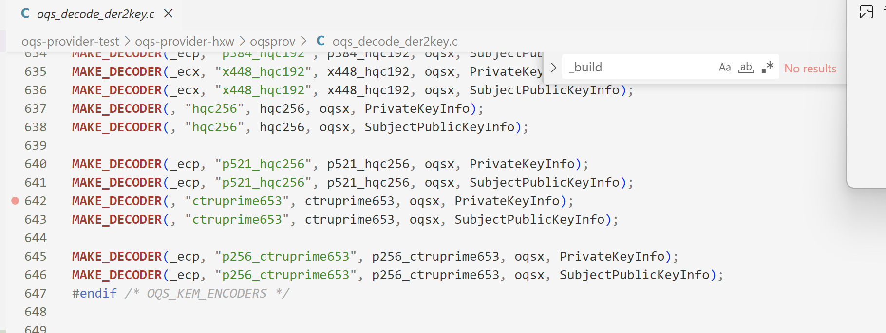

此时重新进行fullbuild.sh
```bash
hxw@LAPTOP-QFLFNNQO:~/exp/oqs-provider-test/oqs-provider-hxw$ ./scripts/fullbuild.sh 
```
使用list kem能够观察到ctruprime653
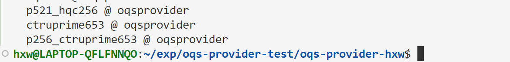

此时再次运行服务端和客户端，运行的结果分别如下所示
```bash
hxw@LAPTOP-QFLFNNQO:~/exp/certs$ openssl s_server -cert dilithium3_srv.crt -key dilithium3_srv.key -www -tls1_3 -groups kyber768:ctruprime653
Using default temp DH parameters
ACCEPT
[In kem.c] Try to new ctruprime653
[In OQS_KEM_ctruprime_653_new] start new ctruprime 653
^C
```

```bash
hxw@LAPTOP-QFLFNNQO:~/exp$ openssl s_client -groups ctruprime653
Connecting to ::1
CONNECTED(00000003)
[In kem.c] Try to new ctruprime653
[In OQS_KEM_ctruprime_653_new] start new ctruprime 653
depth=0 CN=test server
verify error:num=20:unable to get local issuer certificate
verify return:1
depth=0 CN=test server
verify error:num=21:unable to verify the first certificate
verify return:1
depth=0 CN=test server
verify return:1
---
Certificate chain
 0 s:CN=test server
   i:CN=test CA
   a:PKEY: UNDEF, 192 (bit); sigalg: dilithium3
   v:NotBefore: Feb 28 02:42:37 2024 GMT; NotAfter: Feb 27 02:42:37 2025 GMT
---
Server certificate
-----BEGIN CERTIFICATE-----
MIIVZzCCCHKgAwIBAgIUY0RronV9pPRgsmAkpEJ5017O5NwwDQYLKwYBBAECggsH
BgUwEjEQMA4GA1UEAwwHdGVzdCBDQTAeFw0yNDAyMjgwMjQyMzdaFw0yNTAyMjcw
MjQyMzdaMBYxFDASBgNVBAMMC3Rlc3Qgc2VydmVyMIIHtDANBgsrBgEEAQKCCwcG
BQOCB6EAx4iAhJwJroENfOflFR6N1zrgp5q83RCq80YNDOXCL/WZXMBsFX91Gjzy
EKvR/GDo8HWvW62/c8Tft1u9kfhu1DBUQZmvbqdOGIrHqGhR1I7kTl2YJlHeuUYh
L7JJpiG+Jt/ScgYvXJ3Quje8PECPAkwfVrLsfNES5YrIxFIvVlzzCsl34B8NLoNw
2C4CJAA1Ko1qtl3AtJp0h9qk277/pUdbwFBypfWQp3E6+VVssbUnNLi6SsUYcL56
zdWgM8Eu1PH6Ory83wPGaml4BMdSKbzfQVDyYt79ZY6WI6RcBpRhXqKOyjDAydjw
kju3ahmeAvRpaI+zVLC871enLGsrIl74oXAMMJOFm65Xrdgf0aXvE53o3547IM9O
3W4H38VNRuN4BNHMSvmNp5GdkNhZ3iQSPzwiEd84fP2/XWqBR9hSGFnxQypDUDcs
/RyyRo6iqC9ObsMYq5uZmFI55cu7kZtJxMlWNsnigmgXN8L2v+7TVz2qdHWUPHm4
G8MevjAMR0deX8uejNZfk59phPhdkVB3kzij+LUVwatxeFEVxD3RtA698wxIY3Wr
2hwokuEldup0xsR0TTGgTagBebbftJpISLOA/YlgJiSRPRxiDfYMh6h7kq7AqUZp
bM5geqEhiIxX3ABxLCUrqFIeiLS7mgNWHv9IpBV25mAIuNOSb40qEpAwIuLstuzW
UnFhzWkr5zTr+3m7vmgLz5xYY5m7GiCOdrgKrAHCaKTv7EMgOWoA/5oPQsIXDQhR
uXqAQMf/6UsdXsGqIz8zNppXWn4T0M5f7JB2eaAe2aerpfDB7QGg6AAP9HORILsW
B5s0Hnjy0uoXJ+FEeeEFZFA6xAdYwzRTnC1IiEp+qXqo+SNgHS9fJdz24jmSsivS
Fih3OMoC00aNITUpVbsoLRBgPSoZgNwOnjUWSEJ/HKzW7/0rP7j5rO/2IavgeHX+
3DWFQnKO2vhw6u9gzj+yP/m/qxVD66VOcQw0TLbxnuT+qibGXuWTaUPKhMATrjdh
2OQ/fVpy7qL39hCUhmvMvp2PzfZg5lgpJ7CV2pCNonBx3BwU3wW4yfhz0LQym7eQ
MrKbi0KYzuQWdKiCVOsm1rmN7UAqVCiIWosUshehfyxmdARDnNONU3ealHmo8aWl
ZtWWLpq7Y3CRfICaHSgipStVEbq6znpScrIz8xEMdodhVwYA5Fnlyf2n3pDwJS9Y
i5v6MeTyRRg04t9abbtJPZBEcBjkgxIQWwqlIkJtdsag8sGn8rWRJaM53+bE2Wjs
LmJt8mRJpClKQ29Hg1V2TBkfYMJeQ8Bzt4Ks3htQnHReP0YhcXHoNL858EgLrEuR
7uLI+if4SZwoNFTn/F7ZRjTFQMIAfanqcTXvMzrQVbjdPStkfqhYtaWSFGBM1xCX
rdRk8UlncTTTeTsecclbLBonbk9DRPoY+0T86dodBHNJG00e7ifeuUY3n4DSyDmF
sGPhvUMwHoBEtnPrj0LHmshuh5fIOC6sl6qi2EnlBdWH7XWnor3rnGoX1/gC7NhF
+FdkIp+cu605khA4WihyR6us9MJkRpwAt4X5dFmo3NS0znFOL/95DgZ+t9U1my7i
/8CVhTuMkYwzrwAX4p5nfPXUDdeYgUPDILtkdDyGiXI3vrcBF5oSNA3KSTyDI9a1
hYAAl+ackXkAgjT6yhtYuryVLkR1e/lwJRYXr5H7jLAInyumC15sj0DSyNxypv1D
LaOwSsMKVZP3i2dn3d5tNON9jldzuS9/AtAVpQQD+iz9FQ+bXYUkakcNECp5EhBj
zRBcqaZYejska2uG2Sqr03QzRhh4hWRus5L+gTEuJmu2mmbKCQQ+1v741LI1dKpX
wEhOo8rWDwWL50Z8mCd/h/EchOxmJgXyL2UKsdHIAprFf6UgJLJiCSyL/+KnfQPl
ZRv0CW4DM3esnZCpipxvafcBjHMJ6Ln9fyLwt36fzVQsXQ4sRXaILaf9nHdb5f7u
FYm8YU/CSVFf8solc0wtUxIanvqiyDMOzvVXf0ilZqziUWszKP1ZmbedyN0AfcVQ
Tdeb60GcAJb/Ztn6KbXgrcWazgY9juWOBSsDFytdfhtZNYS+86tGd9A/99XbUws5
IHZS9Wth//BE2v8FmJPB3KC7gzGBPt7Pr7MXkuG6Vja9fIXO4mCZl3VgsL1Odiq6
HShBD1cRHY3zwB/YrYbgqOzCviGd7y6hXQDcQzCoSKBvUOBSIFbjvXdCJmDtFOv1
CnPOn8K5/UpjqdWqfAv6Q/GHSm4VZUGnr7fbEMq+0qUdxVp9Uc5pio3aj53Bb7G2
wkm1xiFV80TKkhNeSwrsXJiUS9UzaLR2YExRSr2ehVAv0L7sCIr9q4O5SmyehLeF
wxRwmzjG663lb6MyGe5V4klNrGPkpehZy+PSmUomBBbAIcHKDUCqzsFLAhBst/dp
rWmUCUeyCheehDUoxfOuqKrBAkDCaxQ5WsESrB8lcrjRFR4Y3yy1i0QGsAR7hmcd
DQj+ESdEpApslmDl7sIF51VXELz0lz6hx0vZSUFkGTodWdMSqFrZon84QDgVlbjR
69keLH57N0PEk7KvVDmmrAQr6ZE0K5gaHR+Y1PEU6xFSc94sVlOjQjBAMB0GA1Ud
DgQWBBSkLgGoID/BSqX/8iSHO49r/XhguDAfBgNVHSMEGDAWgBSy9/QOWcTtL+h9
7sUwLGLtwnUgMDANBgsrBgEEAQKCCwcGBQOCDN4AS8buX93HeXtnBfdXHbwry5ot
LVlWNlb7N5VwOql1MxvHUyet25xzgyflgDMEU+feaPPJ4bSn45vB8gF+dgmnKfRs
RO3zZxZ2vsP0p8ThUnOIfIP4GdS0J/CiLTwgZsBjC53ilQ9sPzZRdEQzbP3xVpYe
PZynTCHxk+2IZ8zo5wFwi4XyBcvHsq7FaUDMtcvEOdJe888UpiHrOHncb0N6VELO
bjsWk5DRjnh4FaZcdHO5zt4Aw+WZN/u/kRvDE/+ZqB5hE+qBCpv+0CMID85Btkfk
/Q3NuJEukVazBYefiuKJRvwMgxrp8pxrrr32O2WuEo7vqThQVK6XBWWasHi52OE8
ITWwzlvM/U/ugHZ4Bz/PdnjBNd7f0KvqxckOJhNC0x3qoE1uGJT0PsnktGYyOSJW
zvn6dtrPHfIEorVt2szopqkPFrp0mJ93V1oAGhnf4B0SnILyJcD+qhJwgBosIwAL
pW+zZA93/jmtzPiRDTKLsvTr5DM+Lks2ZPjdJIDrpfnWqxX7a8u296KSxLyMljOw
GQ6b6VZne+Szpkxz8pNH9DM1j7uffJplMDI4a/to6Kx7GuH/jJTPPcsF5OMWaIex
ErlRjN8qeE832exHexxdnb5fQ4KmFmArTJtlS/VAvOCnvNkW5HVkDJ+D0MM89Sr+
VjfecIsN21/XZi/gF69yqKgvypRCh9nTHIPZFhwR61t+Eg9mvTV8SYJnJtn0jfy0
1bsEThb5EkDKwoISrawPLWBpRMQalUK37qSJe+onPqg6EymGISWxIAa/pPNMnRI8
Sucn08oCnvMY+FFXI/wktFyAFuVbcrkBiDOAqGDgirAls+TWJt4EEvRnhW5uNg6E
QRmETLCgezTYJJrrK8XQ1OgKzPWFPoRZ6aLpa0z00oGrVC8xRSQR/Qaipn7YcRml
2VhVmRaJ5yqgOJme+wr/P/ZC1PrdTelANcni7SpgqBfanZR6JjpmzrZMJRStHSze
hGCvv9FmeY0lvvH/GiOOeD1QoaOkMmgNU77WszjekzikV7fQCi/aAxs8bkXCe6/v
RKk8cdYn6pFnU6mDxeEZwclq9Szd2Lx+lTjRcoqTeFjwiPkR75oisuUV6sP0WfQF
lmgBjNaHE70DYT8LwtbGUz5rvqw6x0nTgGNKRjY63Cc+pzE8AP4zPBuIZqU+kvxk
dp6E0QlASaXy5+nZi7ZOPkyVo7JSqu1dwzIvEe6zy14G7P+onchZQjXMvix9TnMM
Nz/3p5PXlqcMbjwK1sbSDJLR5gm9+Pf8VyqfVIDXG7DYxGLgN72AXxZsNYJfiRPv
TQ5OikPkOoMrPly2Vcm+Plm5+KfSYu92G1nPKbCGqxFszMz/EQMMthMQ0pSBm0dK
O0D+9WDXsBt7w8FCMiGXy+LPlRH7tmWGNlUoweKbEGJiMuwnEkjKC0jNVZdrGwRo
TF1qifZ2Phi77ei2xiGoo0cQsxCxkTTQchB9HQy3A2vZqf1PNR1Ay7pjEemPL7n/
Azris27cbol7CrlORlRmrvZYjqOnEFmpwt/NUMTiP4f4Dh8EZVsMut7t2bwZCdg7
IB0GXszk6snlBMA32ZO5cElHKDh3I56DgKarYJpVTw7mIsS81JnwvDhxfyP5C+ai
8Son2B9XJBI4WK7zQ+SDIu4dnUu/SZTily0guQIRRQPezkIcaX1eNVtoNscnqJSr
/VHO3+inL99fxQAL2ZXxp4l9QvOyITW7xWBXWubzx13pkjdcbJufgzrzVBPqEUqP
bu3yu2oNPLLJ2/V3WCSldmm5ykgpFVnMtGw+gwLkRBK8ngT8amhGqDZn3Amlm2Xj
xFIbifrlPPapkIfiGT7RJ/UMtW/Vb7nxIZiPCPNMzaYwEirNJVg5q4P66Oy8/F3z
goK8FtIbrcHGLNr8uJDYdiEBUpJADfLl9xvK9RoioWNBugcgcEDkGL/vXJl+z/r5
bOKNnG+LtIZLydLOxnRoT9U0FSU3XLcpQz8wn2yAHqyRSmOzk+fc0/KOil3FQjw9
1eHevuoKhl2tFAsYG4OmJx8+LU77R5sW1gSxiPTtUtbNWIkRdljy1sPqt46mPhlE
UM3LZZupCDf8bcK5eeT8h/qTCmz8vvxqCkom5I+Ro7sAH5OXMAQjbmq0Inh6cbLj
aHi/kZhYz7tClAjJcs5WvzCAJO6rnLx9SxlzbhJiexJVYxPd4dlYKIPK7YZtTldv
u1uZYC/kYnksYET4kKuW+rk85SR7VQvzizvow4l/1E8/fcv8qvcJHRjXEuemppol
EABlYFe2neo+j/5gFwaqRxD1zTZAWRQnJ4PC3EeIidxigLnoGdF+oOzfNNc0y3Yt
Af7T4KtEmdYNNl4EI5YiP9I1T2W/EqepMmHMB6UoRPBxX373yDlj8wRKXxS+5Ijt
vQh4C9vyHsBALAq2JK4nDALc9+jszHF6TW9zkzw1mAnQ0ewP03hCPuDSXcJ2fYf9
BXHCOiPBo7q8HKdKB0ap42l4/0rNtiBCAJmNODh4CAcPvI032rIqHid/Z/mdjDLS
YCWg4oSLH9mAtPXxX9l5NEI3Kyp2dvBUDNTkpIBRIyAko4MWalBsGR/wUdMsVTYF
Iudeg9JCEqk9Poxr/qeYK6gPTuRYaeYD4MIjvHj8ofyo3x4cMJ504RS5HFp3cKbu
z55B4Sw3TlUbXnFN1ayHV38c7iHLZPWu5BnKsRrwY1iDhi4tywc9jkK8d9a3UXPi
7GsamMUO8hookjF+fqb8P+0GTKkjaB6PZm52k7MGop7QyxYeMg9hUur4JRO1ZjUF
QPL6eUjspi7ZpHiv9SjI5AYKuZH1XAm7ggU8nxMKfQp4xz49aH9t+X6Zrdj5Xgih
78kvCowNCh0zqb6gcsST7on59XiRYlmiA1+iehlRcA4KPzI8q1aEH4cbbsvswFj3
zDbbPzefP/y8DVIkG3cdzLGGPp2G2TwvmDx+f3dzUzzmP6/hMFh55c2Kihk5xzdU
kADe2CJR6NL3leAf+S6ulikc2I7FXlEyRXS7d2dXex+9TxhhrdtPn5yqGUIFZO3E
S9dSPwWcApFPKHyi6+1MTr8T4GEJxVm5nTmDuimh1B2O8zSyrF2Ul5l5wnFr60/J
vj73LLsqaRWeO7QugwpyPa80ctVlrO9Lbp9CNGXFX51LzwD30ZNXrM+5iph1lToW
I/xP0er2Gq1KOhNX1CpkK/OgihZK9huM6adMy7VoUx0hqQe5uHTLDhB8dtbaP43a
geq2fBAQ8NaCc8amHTU51N2qYbBkMr55Uk6yQBrEcVyYClIITvLtuM/fWmggKVVH
vMDosbDgBHei6rmpwGIgz+v5SbCckyb0PdzzaNbU/ip6AfPw1ACqgaN0lOrQTPp0
YZkmUCtTekBUkO0rcikiu4ZqDfwe2Jb15g+EK9OP4Zo7aanYS5XCOCLZvg7S2ZRo
RRlNXcsImEDOHA9NHqGhf1M/FKIsEqzTarvyFAoBJzbNi/kjm5IW5nineH8nxxxx
/pEcbHobsPlpDoiG1P5Jn/EkbyM4nT80kaVet4TX2PbiYhgY07FXSXqeKR5V3Q3L
dOgMW5YvCnDzrtnXykaEGBSzFDaYnoV73PpddDdVCYK1863kRaMvzFTx1anjt71B
5+ebAEkaGSmeunSDpy2yPfIcsjJCf8nlBzil2hcZDaFUhpN3A0Wvc/d5Qqn9a/7r
cRZtkyjDjSLTlEuGNtfCN063QpkuH6m7fIYQ6kHVZU0vfCSPX+HNYBT4UmSsrDxX
9VZjp+Luwxk4EAZA1FK7SGdg+R/R/nR415EeWDaNQfOekzOMPYf5A5P2m0v4tKdo
zUCLiwFKWudoMQSkmG+xbmQPeOQSwKiwX7l6398xhDdJnXhCUrlG3QgIcr5YnVsQ
wEFRi25U1wKLVjRGGsiCiSviPRZY6xdygKA+TbuUCQxDDY3vJUKST1226jfUP/6n
1aUT1FGdRVpWa34Q0t2395xWN3+N+2Wlt3pqsZIwhcEO1jjwvcHqgIkJIXpDhCea
Cvf8Wm8r5mk1FAxaJA8B2ZnskjT7ymGTzhWfxnLCOIVpxKiJagWtOgV4hPU0U/7S
Y4ludC9+GU5YbL1o6EBnYYh+dJypg+soi268FgabPev2hm1PSWVt6Lenfxc889lZ
XabMr3tMdaMtqKXCDzze6fquu5WBhpd0iXaflhCSNQ4kIPInQsF3lMAPr/fF5l8T
rmDVQUUFpDcAiyD5Y/1IrbnDVx/AWqNkewWtj2jx3f8uYF3k3q01pWGLfE1/nUXX
Xm6V4pCBW9aizifC11Tesl1tjL/P5rn7Ek8lfBEs49kYFXsD6EOJ27GJjH6NF66y
CjE6PEFPWnGJztAFBxgaKj6JjavyAEBGYnOfvdTW6SNCdKLg4/UABClHYW2os7oA
AAAAAAACDRchKDE=
-----END CERTIFICATE-----
subject=CN=test server
issuer=CN=test CA
---
No client certificate CA names sent
Peer signature type: dilithium3
---
SSL handshake has read 9952 bytes and written 1379 bytes
Verification error: unable to verify the first certificate
---
New, TLSv1.3, Cipher is TLS_AES_256_GCM_SHA384
Server public key is 192 bit
This TLS version forbids renegotiation.
Compression: NONE
Expansion: NONE
No ALPN negotiated
Early data was not sent
Verify return code: 21 (unable to verify the first certificate)
---
---
Post-Handshake New Session Ticket arrived:
SSL-Session:
    Protocol  : TLSv1.3
    Cipher    : TLS_AES_256_GCM_SHA384
    Session-ID: 4ABFA73A35BECB17323803102028E7232C81A1A1A657714FA7E338451F1DD128
    Session-ID-ctx: 
    Resumption PSK: 259473D55CAC23C346C1527516D22C8949E4BE9EA0746DA602583C018302F52BD551B404F7AE0FB8018F0812C615E398
    PSK identity: None
    PSK identity hint: None
    SRP username: None
    TLS session ticket lifetime hint: 7200 (seconds)
    TLS session ticket:
    0000 - 8c e1 6f 2c 5c 55 08 51-fa fd aa 77 69 b2 24 5a   ..o,\U.Q...wi.$Z
    0010 - 29 1e 6b 50 b3 f5 17 14-09 d1 8c 20 a4 93 f8 b4   ).kP....... ....
    0020 - c9 9c c5 fb 74 d5 e3 dc-35 4a 00 71 0e 53 ea 53   ....t...5J.q.S.S
    0030 - c2 c8 f6 d1 15 e7 94 12-56 48 85 39 bf b9 f9 b5   ........VH.9....
    0040 - 8d 7b 3b 0b 25 e9 37 3a-26 7b 62 d8 8b 75 bd f1   .{;.%.7:&{b..u..
    0050 - e7 1c b4 6a ff 17 47 d6-b9 a6 50 23 f4 ef ae 7a   ...j..G...P#...z
    0060 - 7c 07 d6 f1 66 b9 0d 0f-62 9a 50 ea d0 d2 72 ca   |...f...b.P...r.
    0070 - 11 8d d8 ce 69 34 73 69-94 13 68 33 a7 0a 98 97   ....i4si..h3....
    0080 - 74 a3 f8 a2 71 3f 92 1b-3f a3 e6 53 49 37 61 ba   t...q?..?..SI7a.
    0090 - 56 3e 71 6e 3a 66 6e 01-57 2b 96 a0 b9 5f 20 e0   V>qn:fn.W+..._ .
    00a0 - bf 67 1b 90 ab fb 24 b2-37 bb 36 a1 ba fa 9e 11   .g....$.7.6.....
    00b0 - 00 b4 4a b9 34 6f aa 9f-39 a9 07 06 a1 65 b6 c9   ..J.4o..9....e..
    00c0 - 85 b1 eb b4 b2 47 1c 70-1d f9 8f 78 bb 0c 4e e6   .....G.p...x..N.

    Start Time: 1709439485
    Timeout   : 7200 (sec)
    Verify return code: 21 (unable to verify the first certificate)
    Extended master secret: no
    Max Early Data: 0
---
read R BLOCK
---
Post-Handshake New Session Ticket arrived:
SSL-Session:
    Protocol  : TLSv1.3
    Cipher    : TLS_AES_256_GCM_SHA384
    Session-ID: CC987B6116959994975F355DFC981E1383A160DFA940718C775A16BD8D47BFD3
    Session-ID-ctx: 
    Resumption PSK: AD2C1F24197F431EB032B5141145B652F611FD673EEFAB9E04B39859C6B27D811205F8D73B8FF6F002EFCABEDBF7A10D
    PSK identity: None
    PSK identity hint: None
    SRP username: None
    TLS session ticket lifetime hint: 7200 (seconds)
    TLS session ticket:
    0000 - 8c e1 6f 2c 5c 55 08 51-fa fd aa 77 69 b2 24 5a   ..o,\U.Q...wi.$Z
    0010 - a4 7d df e7 0c 18 87 96-62 f4 9b a6 e8 11 02 41   .}......b......A
    0020 - f3 6e b5 28 fb aa b3 7c-ad 36 4a d1 df a5 d9 ed   .n.(...|.6J.....
    0030 - 9b 32 2e 06 c2 54 59 bb-fd b0 e5 53 ce 8a 31 c4   .2...TY....S..1.
    0040 - 18 62 74 71 a7 b5 a6 bf-89 48 43 0e 38 1b 22 28   .btq.....HC.8."(
    0050 - b0 06 c1 4e da ac e1 2b-bd 55 c6 5c da b9 0e 22   ...N...+.U.\..."
    0060 - 88 d0 e5 6b 6c 9b 61 e0-5f 67 97 7a 94 fc 66 9f   ...kl.a._g.z..f.
    0070 - dd f4 89 4c 1c d8 1e 85-4c 73 b4 60 66 a3 97 70   ...L....Ls.`f..p
    0080 - e4 03 40 19 29 81 7a 4f-3f fe c9 c6 c0 d0 aa b0   ..@.).zO?.......
    0090 - f4 1d a2 4b 9c 27 2e bb-c3 00 37 6f d9 e9 a6 1c   ...K.'....7o....
    00a0 - fb 7d a9 76 67 5c 77 e8-0f 4b 01 ce e9 77 59 49   .}.vg\w..K...wYI
    00b0 - a0 8c 63 78 60 85 6f 0d-66 e3 7a 3d 41 7d d4 5d   ..cx`.o.f.z=A}.]
    00c0 - b1 a5 b3 60 85 52 11 ad-b4 c4 6b d2 d7 26 0d e4   ...`.R....k..&..

    Start Time: 1709439485
    Timeout   : 7200 (sec)
    Verify return code: 21 (unable to verify the first certificate)
    Extended master secret: no
    Max Early Data: 0
---
read R BLOCK
GET /
HTTP/1.0 200 ok
Content-type: text/html

<HTML><BODY BGCOLOR="#ffffff">
<pre>

s_server -cert dilithium3_srv.crt -key dilithium3_srv.key -www -tls1_3 -groups kyber768:ctruprime653 
This TLS version forbids renegotiation.
Ciphers supported in s_server binary
TLSv1.3    :TLS_AES_256_GCM_SHA384    TLSv1.3    :TLS_CHACHA20_POLY1305_SHA256 
TLSv1.3    :TLS_AES_128_GCM_SHA256    TLSv1.2    :ECDHE-ECDSA-AES256-GCM-SHA384 
TLSv1.2    :ECDHE-RSA-AES256-GCM-SHA384 TLSv1.2    :DHE-RSA-AES256-GCM-SHA384 
TLSv1.2    :ECDHE-ECDSA-CHACHA20-POLY1305 TLSv1.2    :ECDHE-RSA-CHACHA20-POLY1305 
TLSv1.2    :DHE-RSA-CHACHA20-POLY1305 TLSv1.2    :ECDHE-ECDSA-AES128-GCM-SHA256 
TLSv1.2    :ECDHE-RSA-AES128-GCM-SHA256 TLSv1.2    :DHE-RSA-AES128-GCM-SHA256 
TLSv1.2    :ECDHE-ECDSA-AES256-SHA384 TLSv1.2    :ECDHE-RSA-AES256-SHA384   
TLSv1.2    :DHE-RSA-AES256-SHA256     TLSv1.2    :ECDHE-ECDSA-AES128-SHA256 
TLSv1.2    :ECDHE-RSA-AES128-SHA256   TLSv1.2    :DHE-RSA-AES128-SHA256     
TLSv1.0    :ECDHE-ECDSA-AES256-SHA    TLSv1.0    :ECDHE-RSA-AES256-SHA      
SSLv3      :DHE-RSA-AES256-SHA        TLSv1.0    :ECDHE-ECDSA-AES128-SHA    
TLSv1.0    :ECDHE-RSA-AES128-SHA      SSLv3      :DHE-RSA-AES128-SHA        
TLSv1.2    :RSA-PSK-AES256-GCM-SHA384 TLSv1.2    :DHE-PSK-AES256-GCM-SHA384 
TLSv1.2    :RSA-PSK-CHACHA20-POLY1305 TLSv1.2    :DHE-PSK-CHACHA20-POLY1305 
TLSv1.2    :ECDHE-PSK-CHACHA20-POLY1305 TLSv1.2    :AES256-GCM-SHA384         
TLSv1.2    :PSK-AES256-GCM-SHA384     TLSv1.2    :PSK-CHACHA20-POLY1305     
TLSv1.2    :RSA-PSK-AES128-GCM-SHA256 TLSv1.2    :DHE-PSK-AES128-GCM-SHA256 
TLSv1.2    :AES128-GCM-SHA256         TLSv1.2    :PSK-AES128-GCM-SHA256     
TLSv1.2    :AES256-SHA256             TLSv1.2    :AES128-SHA256             
TLSv1.0    :ECDHE-PSK-AES256-CBC-SHA384 TLSv1.0    :ECDHE-PSK-AES256-CBC-SHA  
SSLv3      :SRP-RSA-AES-256-CBC-SHA   SSLv3      :SRP-AES-256-CBC-SHA       
TLSv1.0    :RSA-PSK-AES256-CBC-SHA384 TLSv1.0    :DHE-PSK-AES256-CBC-SHA384 
SSLv3      :RSA-PSK-AES256-CBC-SHA    SSLv3      :DHE-PSK-AES256-CBC-SHA    
SSLv3      :AES256-SHA                TLSv1.0    :PSK-AES256-CBC-SHA384     
SSLv3      :PSK-AES256-CBC-SHA        TLSv1.0    :ECDHE-PSK-AES128-CBC-SHA256 
TLSv1.0    :ECDHE-PSK-AES128-CBC-SHA  SSLv3      :SRP-RSA-AES-128-CBC-SHA   
SSLv3      :SRP-AES-128-CBC-SHA       TLSv1.0    :RSA-PSK-AES128-CBC-SHA256 
TLSv1.0    :DHE-PSK-AES128-CBC-SHA256 SSLv3      :RSA-PSK-AES128-CBC-SHA    
SSLv3      :DHE-PSK-AES128-CBC-SHA    SSLv3      :AES128-SHA                
TLSv1.0    :PSK-AES128-CBC-SHA256     SSLv3      :PSK-AES128-CBC-SHA        
---
Ciphers common between both SSL end points:
TLS_AES_256_GCM_SHA384     TLS_CHACHA20_POLY1305_SHA256 TLS_AES_128_GCM_SHA256    
ECDHE-ECDSA-AES256-GCM-SHA384 ECDHE-RSA-AES256-GCM-SHA384 DHE-RSA-AES256-GCM-SHA384 
ECDHE-ECDSA-CHACHA20-POLY1305 ECDHE-RSA-CHACHA20-POLY1305 DHE-RSA-CHACHA20-POLY1305 
ECDHE-ECDSA-AES128-GCM-SHA256 ECDHE-RSA-AES128-GCM-SHA256 DHE-RSA-AES128-GCM-SHA256 
ECDHE-ECDSA-AES256-SHA384  ECDHE-RSA-AES256-SHA384    DHE-RSA-AES256-SHA256     
ECDHE-ECDSA-AES128-SHA256  ECDHE-RSA-AES128-SHA256    DHE-RSA-AES128-SHA256     
ECDHE-ECDSA-AES256-SHA     ECDHE-RSA-AES256-SHA       DHE-RSA-AES256-SHA        
ECDHE-ECDSA-AES128-SHA     ECDHE-RSA-AES128-SHA       DHE-RSA-AES128-SHA        
AES256-GCM-SHA384          AES128-GCM-SHA256          AES256-SHA256             
AES128-SHA256              AES256-SHA                 AES128-SHA
Signature Algorithms: ECDSA+SHA256:ECDSA+SHA384:ECDSA+SHA512:Ed25519:Ed448:ECDSA+SHA256:ECDSA+SHA384:ECDSA+SHA512:RSA-PSS+SHA256:RSA-PSS+SHA384:RSA-PSS+SHA512:RSA-PSS+SHA256:RSA-PSS+SHA384:RSA-PSS+SHA512:RSA+SHA256:RSA+SHA384:RSA+SHA512:ECDSA+SHA224:RSA+SHA224:DSA+SHA224:DSA+SHA256:DSA+SHA384:DSA+SHA512:dilithium2:p256_dilithium2:rsa3072_dilithium2:dilithium3:p384_dilithium3:dilithium5:p521_dilithium5:falcon512:p256_falcon512:rsa3072_falcon512:falcon1024:p521_falcon1024:sphincssha2128fsimple:p256_sphincssha2128fsimple:rsa3072_sphincssha2128fsimple:sphincssha2128ssimple:p256_sphincssha2128ssimple:rsa3072_sphincssha2128ssimple:sphincssha2192fsimple:p384_sphincssha2192fsimple:sphincsshake128fsimple:p256_sphincsshake128fsimple:rsa3072_sphincsshake128fsimple
Shared Signature Algorithms: ECDSA+SHA256:ECDSA+SHA384:ECDSA+SHA512:Ed25519:Ed448:ECDSA+SHA256:ECDSA+SHA384:ECDSA+SHA512:RSA-PSS+SHA256:RSA-PSS+SHA384:RSA-PSS+SHA512:RSA-PSS+SHA256:RSA-PSS+SHA384:RSA-PSS+SHA512:RSA+SHA256:RSA+SHA384:RSA+SHA512:ECDSA+SHA224:RSA+SHA224:dilithium2:p256_dilithium2:rsa3072_dilithium2:dilithium3:p384_dilithium3:dilithium5:p521_dilithium5:falcon512:p256_falcon512:rsa3072_falcon512:falcon1024:p521_falcon1024:sphincssha2128fsimple:p256_sphincssha2128fsimple:rsa3072_sphincssha2128fsimple:sphincssha2128ssimple:p256_sphincssha2128ssimple:rsa3072_sphincssha2128ssimple:sphincssha2192fsimple:p384_sphincssha2192fsimple:sphincsshake128fsimple:p256_sphincsshake128fsimple:rsa3072_sphincsshake128fsimple
Supported groups: ctruprime653
Shared groups: ctruprime653
---
New, TLSv1.3, Cipher is TLS_AES_256_GCM_SHA384
SSL-Session:
    Protocol  : TLSv1.3
    Cipher    : TLS_AES_256_GCM_SHA384
    Session-ID: 7FB4C7D84855939AEBA12A7A198B45AB14BC11B952BE74A408B94A9810C23E14
    Session-ID-ctx: 01000000
    Resumption PSK: AD2C1F24197F431EB032B5141145B652F611FD673EEFAB9E04B39859C6B27D811205F8D73B8FF6F002EFCABEDBF7A10D
    PSK identity: None
    PSK identity hint: None
    SRP username: None
    Start Time: 1709439485
    Timeout   : 7200 (sec)
    Verify return code: 0 (ok)
    Extended master secret: no
    Max Early Data: 0
---
   0 items in the session cache
   0 client connects (SSL_connect())
   0 client renegotiates (SSL_connect())
   0 client connects that finished
   1 server accepts (SSL_accept())
   0 server renegotiates (SSL_accept())
   1 server accepts that finished
   0 session cache hits
   0 session cache misses
   0 session cache timeouts
   0 callback cache hits
   0 cache full overflows (128 allowed)
---
no client certificate available
</pre></BODY></HTML>

closed
```

观察抓的包，能够验证已经成功使用ctruprime653完成了kem
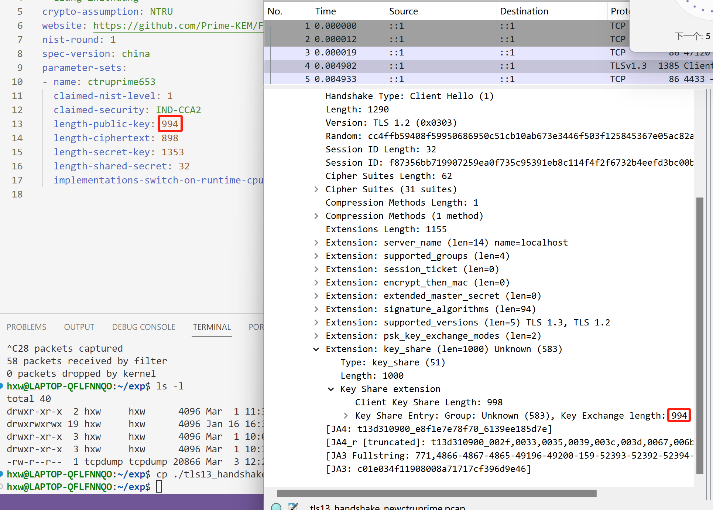


**现在需要修改.fullbuild文件，使得能够正确运行generate文件**

首先存档当前的系统环境变量文件

``` sh
export OPENSSL_PATH=/home/hxw/exp/oqs-provider-test2/oqs-provider-hxw/.local/bin
export PATH=$OPENSSL_PATH:$PATH
export LD_LIBRARY_PATH=/home/hxw/exp/oqs-provider-test2/oqs-provider-hxw/.local/lib64
export OPENSSL_APP=/home/hxw/exp/oqs-provider-test2/oqs-provider-hxw/openssl/apps/openssl
export OPENSSL_CONF=/home/hxw/exp/oqs-provider-test2/oqs-provider-hxw/scripts/openssl-ca.cnf
export OPENSSL_MODULES=/home/hxw/exp/oqs-provider-test2/oqs-provider-hxw/_build/lib
export C_INCLUDE_PATH=$C_INCLUDE_PATH:/home/hxw/exp/oqs-provider-test2/oqs-provider-hxw/.local/include

export OPENSSLDIR=/home/hxw/exp/oqs-provider-test2/oqs-provider-hxw/.local/ssl
```

> 总结:
> 
> 1.注意环境变量的配置来使得版本的正确
> 
> ```bash 
>export OPENSSL_PATH=/home/hxw/exp/oqs-provider-test2/oqs-provider-hxw/.local/bin
>export PATH=$OPENSSL_PATH:$PATH
>export LD_LIBRARY_PATH=/home/hxw/exp/oqs-provider-test2/oqs-provider-hxw/.local/lib64
>export OPENSSL_APP=/home/hxw/exp/oqs-provider-test2/oqs-provider-hxw/openssl/apps/openssl
>export OPENSSL_CONF=/home/hxw/exp/oqs-provider-test2/oqs-provider-hxw/scripts/openssl-ca.cnf
>export OPENSSL_MODULES=/home/hxw/exp/oqs-provider-test2/oqs-provider-hxw/_build/lib
>export C_INCLUDE_PATH=$C_INCLUDE_PATH:/home/hxw/exp/oqs-provider-test2/oqs-provider-hxw/.local/include
>export OPENSSLDIR=/home/hxw/exp/oqs-provider-test2/oqs-provider-hxw/.local/ssl
> ```
> 2.注意在完成liboqs集成后，一般需要调用generate.py文件来完成oqs-provider的调用(已经写入了fullbuild.sh文件中)

## 2024-3-20 网络环境的搭建
根据如下所示的显示，可能存在命名空间系统环境变量的差异
```bash
hxw@LAPTOP-QFLFNNQO:~/exp/oqs-provider-test2/oqs-provider-hxw/.local/bin$ sudo ip netns exec ns1 openssl version
OpenSSL 1.1.1f  31 Mar 2020
hxw@LAPTOP-QFLFNNQO:~/exp/oqs-provider-test2/oqs-provider-hxw/.local/bin$ sudo ip netns exec ns1 ./openssl version
OpenSSL 3.3.0-dev  (Library: OpenSSL 3.3.0-dev )
```
> 解决办法:sudo ip netns exec ns1 bash使用这个命令，在每一个子空间中开启一个新的bash

一些需要考虑到的问题
1.是否需要搭建服务器来进行测试
2.prime的优势体现在哪里
3.需要测试的指标有哪些呢？怎么进行计算呢

环境的模拟:
丢包率、报文重复率、延迟

测量指标
1.握手的完成时间


每一项因素的影响
> 如果仅仅只是着眼在一个算法，会不会不太好


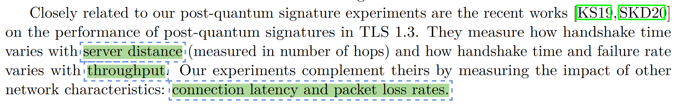

> 搭建的环境是否太简单，从实际的测量的结果出发，得到一些现实的丢包率等信息


client端，使用s_timer进行测速
server端，运行nginx服务器

下面尝试安装nginx，然后使用s_server进行测试

``` bash
./configure --prefix=./hxw_nginx \
                --with-debug \
                --with-http_ssl_module \
                --with-openssl=/home/hxw/exp/oqs-provider-test2/oqs-provider-hxw/.local/ \
                --without-http_gzip_module \
                --with-cc-opt="-I /home/hxw/exp/oqs-provider-test2/oqs-provider-hxw/.local/include/oqs" \
                --with-ld-opt="-L /home/hxw/exp/oqs-provider-test2/oqs-provider-hxw/.local/lib";
sed -i 's/libcrypto.a/libcrypto.a -loqs/g' objs/Makefile;
```

sudo apt-get install libpcre3-dev

在运行configure的过程中，出现**zlib library is not used**的情况

```bash
Configuration summary
  + using system PCRE library
  + using OpenSSL library: /home/hxw/exp/oqs-provider-test2/oqs-provider-hxw/.local/
  + zlib library is not used

  nginx path prefix: "./hxw_nginx"
  nginx binary file: "./hxw_nginx/sbin/nginx"
  nginx modules path: "./hxw_nginx/modules"
  nginx configuration prefix: "./hxw_nginx/conf"
  nginx configuration file: "./hxw_nginx/conf/nginx.conf"
  nginx pid file: "./hxw_nginx/logs/nginx.pid"
  nginx error log file: "./hxw_nginx/logs/error.log"
  nginx http access log file: "./hxw_nginx/logs/access.log"
  nginx http client request body temporary files: "client_body_temp"
  nginx http proxy temporary files: "proxy_temp"
  nginx http fastcgi temporary files: "fastcgi_temp"
  nginx http uwsgi temporary files: "uwsgi_temp"
  nginx http scgi temporary files: "scgi_temp"
  ```

  产生报错的原因在于
  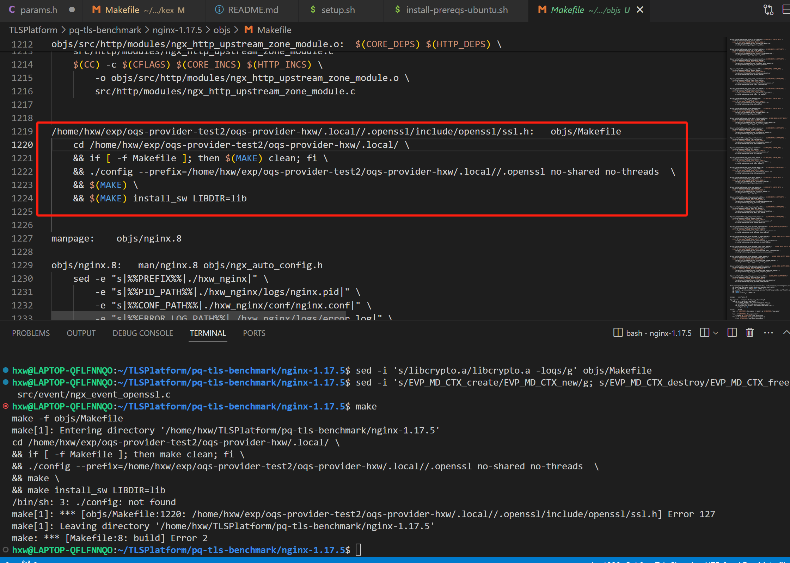

  替换一下--with-openssl的路径
  /home/hxw/exp/oqs-provider-test2/oqs-provider-hxw/.local/ssl


``` bash
./configure --prefix=./hxw_nginx  --with-openssl=/home/hxw/exp/oqs-provider-test2/oqs-provider-hxw/.local/ssl/ --with-cc-opt="-I /home/hxw/exp/oqs-provider-test2/oqs-provider-hxw/.local/include/oqs" --with-ld-opt="-L /home/hxw/exp/oqs-provider-test2/oqs-provider-hxw/.local/lib"  --with-debug --without-http_gzip_module


sed -i 's/libcrypto.a/libcrypto.a -loqs/g' objs/Makefile;
sed -i 's/EVP_MD_CTX_create/EVP_MD_CTX_new/g; s/EVP_MD_CTX_destroy/EVP_MD_CTX_free/g' src/event/ngx_event_openssl.c;
make && make install;
```


运行 ./setup.sh报错
```bash
hxw@LAPTOP-QFLFNNQO:~/TLSPlatform/pq-tls-benchmark/emulation-exp/code/kex$ sudo ./setup.sh 
+++ pwd
++ dirname /home/hxw/TLSPlatform/pq-tls-benchmark/emulation-exp/code/kex
+ ROOT=/home/hxw/TLSPlatform/pq-tls-benchmark/emulation-exp/code
+ OPENSSL=/home/hxw/exp/oqs-provider-test2/oqs-provider-hxw/.local/bin/openssl
+ OPENSSL_CNF=/home/hxw/exp/oqs-provider-test2/oqs-provider-hxw/scripts/openssl-ca.cnf
+ NGINX_APP=/home/hxw/TLSPlatform/pq-tls-benchmark/nginx-1.17.5/hxw_nginx/sbin
+ NGINX_CONF_DIR=/home/hxw/TLSPlatform/pq-tls-benchmark/nginx-1.17.5/hxw_nginx/conf
+ make s_timer.o
make: 's_timer.o' is up to date.
+ /home/hxw/TLSPlatform/pq-tls-benchmark/emulation-exp/code/setup_ns.sh
+ SERVER_VETH_LL_ADDR=00:00:00:00:00:02
+ SERVER_NS=srv_ns
+ SERVER_VETH=srv_ve
+ CLIENT_NS=cli_ns
+ CLIENT_VETH_LL_ADDR=00:00:00:00:00:01
+ CLIENT_VETH=cli_ve
+ ip netns add srv_ns
+ ip netns add cli_ns
+ ip link add name srv_ve address 00:00:00:00:00:02 netns srv_ns type veth peer name cli_ve address 00:00:00:00:00:01 netns cli_ns
+ ip netns exec srv_ns ip link set dev srv_ve up
+ ip netns exec srv_ns ip link set dev lo up
+ ip netns exec srv_ns ip addr add 10.0.0.1/24 dev srv_ve
+ ip netns exec cli_ns ip addr add 10.0.0.2/24 dev cli_ve
+ ip netns exec cli_ns ip link set dev lo up
+ ip netns exec cli_ns ip link set dev cli_ve up
+ ip netns exec cli_ns ip link set dev lo up
+ ip netns exec srv_ns ip neigh add 10.0.0.2 lladdr 00:00:00:00:00:01 dev srv_ve
+ ip netns exec cli_ns ip neigh add 10.0.0.1 lladdr 00:00:00:00:00:02 dev cli_ve
+ ip netns exec cli_ns ethtool -K cli_ve gso off gro off tso off
+ ip netns exec srv_ns ethtool -K srv_ve gso off gro off tso off
+ ip netns exec cli_ns tc qdisc add dev cli_ve root netem
Error: Specified qdisc not found.
+ ip netns exec srv_ns tc qdisc add dev srv_ve root netem
Error: Specified qdisc not found.
```


尝试使用张枫师兄中的环境代码，发现也存在无法设置的问题
```bash
hxw@LAPTOP-QFLFNNQO:~/TLSPlatform/Platform$ sudo ip netns exec ns-router tc qdisc add dev veth1-router root netem loss 0% delay "2.5ms"
Error: Specified qdisc not found.
```

[似乎在wsl中不支持qdisc](https://learn.microsoft.com/en-us/answers/questions/48142/wsl2-qdisc-netem-support)

# 2024-3-22
## 解决wsl中对于qdosc的支持问题
```bash
hxw@LAPTOP-QFLFNNQO:~$ sudo git clone https://github.com/microsoft/WSL2-Linux-Kernel.git
Cloning into 'WSL2-Linux-Kernel'...
remote: Enumerating objects: 10494809, done.
remote: Total 10494809 (delta 0), reused 0 (delta 0), pack-reused 10494809
Receiving objects: 100% (10494809/10494809), 2.17 GiB | 10.79 MiB/s, done.
Resolving deltas: 100% (8874131/8874131), done.
Updating files: 100% (73699/73699), done.
hxw@LAPTOP-QFLFNNQO:~$ cd WSL2-Linux-Kernel/
hxw@LAPTOP-QFLFNNQO:~/WSL2-Linux-Kernel$ cp Microsoft/config-wsl .config
cp: cannot create regular file '.config': Permission denied
hxw@LAPTOP-QFLFNNQO:~/WSL2-Linux-Kernel$ sudo cp Microsoft/config-wsl .config
hxw@LAPTOP-QFLFNNQO:~/WSL2-Linux-Kernel$ make -j $(expr $(nproc) - 1)
mkdir: cannot create directory ‘.tmp_6786’: Permission denied
mkdir: cannot create directory ‘.tmp_6788’: Permission denied
mkdir: cannot create directory ‘.tmp_6790’: Permission denied
mkdir: cannot create directory ‘.tmp_6792’: Permission denied
mkdir: cannot create directory ‘.tmp_6794’: Permission denied
mkdir: cannot create directory ‘.tmp_6796’: Permission denied
mkdir: cannot create directory ‘.tmp_6798’: Permission denied
mkdir: cannot create directory ‘.tmp_6800’: Permission denied
mkdir: cannot create directory ‘.tmp_6802’: Permission denied
mkdir: cannot create directory ‘.tmp_6804’: Permission denied
mkdir: cannot create directory ‘.tmp_6806’: Permission denied
mkdir: cannot create directory ‘.tmp_6808’: Permission denied
mkdir: cannot create directory ‘.tmp_6810’: Permission denied
mkdir: cannot create directory ‘.tmp_6812’: Permission denied
mkdir: cannot create directory ‘.tmp_6814’: Permission denied
mkdir: cannot create directory ‘.tmp_6816’: Permission denied
mkdir: cannot create directory ‘.tmp_6818’: Permission denied
mkdir: cannot create directory ‘.tmp_6821’: Permission denied
mkdir: cannot create directory ‘.tmp_6823’: Permission denied
mkdir: cannot create directory ‘.tmp_6825’: Permission denied
mkdir: cannot create directory ‘.tmp_6827’: Permission denied
mkdir: cannot create directory ‘.tmp_6829’: Permission denied
mkdir: cannot create directory ‘.tmp_6831’: Permission denied
mkdir: cannot create directory ‘.tmp_6833’: Permission denied
mkdir: cannot create directory ‘.tmp_6835’: Permission denied
  SYNC    include/config/auto.conf.cmd
mkdir: cannot create directory ‘.tmp_6861’: Permission denied
mkdir: cannot create directory ‘.tmp_6863’: Permission denied
mkdir: cannot create directory ‘.tmp_6865’: Permission denied
mkdir: cannot create directory ‘.tmp_6867’: Permission denied
mkdir: cannot create directory ‘.tmp_6869’: Permission denied
mkdir: cannot create directory ‘.tmp_6871’: Permission denied
mkdir: cannot create directory ‘.tmp_6873’: Permission denied
mkdir: cannot create directory ‘.tmp_6875’: Permission denied
  HOSTCC  scripts/basic/fixdep
scripts/basic/fixdep.c:373:1: fatal error: opening dependency file scripts/basic/.fixdep.d: Permission denied
  373 | }
      | ^
compilation terminated.
make[2]: *** [scripts/Makefile.host:95: scripts/basic/fixdep] Error 1
make[1]: *** [Makefile:563: scripts_basic] Error 2
make: *** [Makefile:747: include/config/auto.conf.cmd] Error 2
```

> sudo apt update && sudo apt install build-essential flex bison libssl-dev libelf-dev bc python3 pahole 安装相关的依赖（pahole换成dwarves）


sudo apt install build-essential flex bison libssl-dev libelf-dev git dwarves
git clone https://github.com/microsoft/WSL2-Linux-Kernel.git
cd WSL2-Linux-Kernel
cp Microsoft/config-wsl .config
make -j $(expr $(nproc) - 1)


使用下述命令，查看%userprofile%的具体值
```bash
C:\Users\Lenovo>echo %userprofile%
C:\Users\Lenovo
```
将~/WSL2-Linux-Kernel/arch/x86/boot下的bzImage粘贴到C:\Users\Lenovo中，并创建文件.wslconfig，文件内容为
```
[wsl2]
kernel=C:\\Users\\Lenovo\\bzImage
```

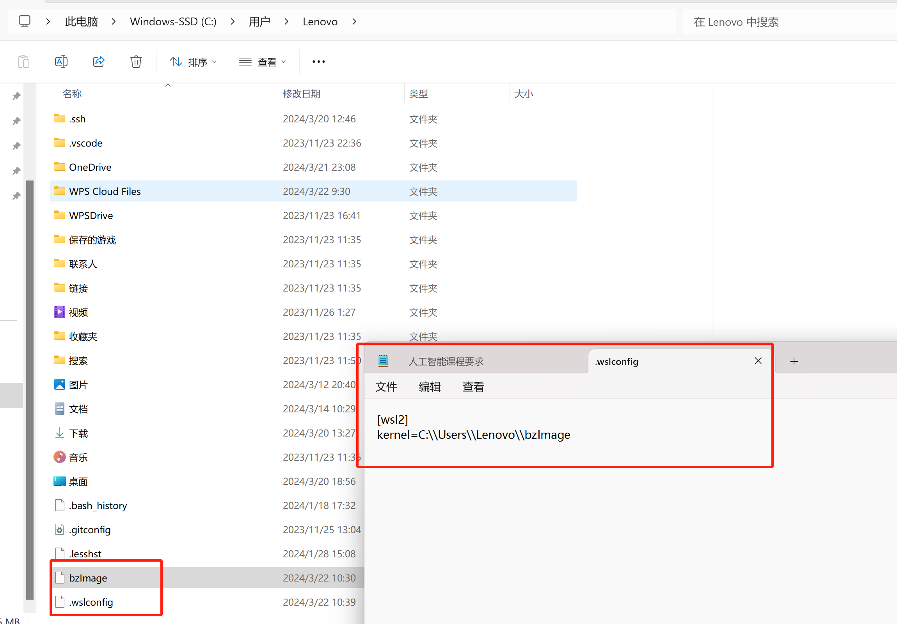

重启后，发现还是存在问题
```bash
hxw@LAPTOP-QFLFNNQO:/lib/modules$ modprobe ifb
modprobe: FATAL: Module ifb not found in directory /lib/modules/5.15.150.1-microsoft-standard-WSL2+
```
和之前的报错相比，似乎内核的确已经发生了改变
```bash
User
modprobe: FATAL: Module ifb not found in directory /lib/modules/5.10.16.3-microsoft-standard-WSL2
```

将.wslconfig文件删除，重新启动虚拟机，得到
```bash
hxw@LAPTOP-QFLFNNQO:~$ uname -r
5.10.16.3-microsoft-standard-WSL2
hxw@LAPTOP-QFLFNNQO:~$ 
```

添加.wslconfig文件，重新启动，得到
```bash
hxw@LAPTOP-QFLFNNQO:~$ uname -r
5.15.150.1-microsoft-standard-WSL2+
```

[Building the WSL2 Linux Kernel Yourself](https://blog.sampath.dev/building-the-wsl2-linux-kernel-yourself)

[How to use the Microsoft Linux kernel v6 on Windows Subsystem for Linux version 2 (WSL2)](https://learn.microsoft.com/en-us/community/content/wsl-user-msft-kernel-v6)

[WSL 2 does not have /lib/modules/](https://unix.stackexchange.com/questions/594470/wsl-2-does-not-have-lib-modules)


## batch存在的意义是什么
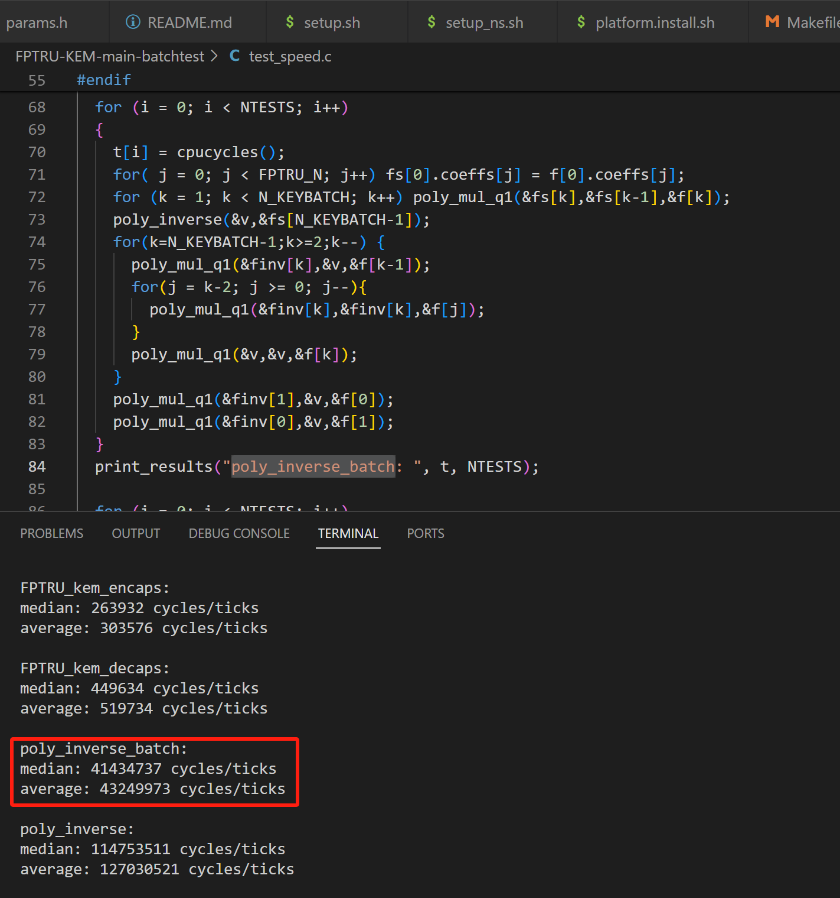


## 虚拟机的安装
### step1:
sudo apt install net-tools
sudo apt-get install build-essential

### step2:
换源
'''bash
# See http://help.ubuntu.com/community/UpgradeNotes for how to upgrade to
# newer versions of the distribution.
###deb http://archive.ubuntu.com/ubuntu/ focal main restricted
# deb-src http://archive.ubuntu.com/ubuntu/ focal main restricted

## Major bug fix updates produced after the final release of the
## distribution.
###deb http://archive.ubuntu.com/ubuntu/ focal-updates main restricted
# deb-src http://archive.ubuntu.com/ubuntu/ focal-updates main restricted

## N.B. software from this repository is ENTIRELY UNSUPPORTED by the Ubuntu
## team. Also, please note that software in universe WILL NOT receive any
## review or updates from the Ubuntu security team.
###deb http://archive.ubuntu.com/ubuntu/ focal universe
# deb-src http://archive.ubuntu.com/ubuntu/ focal universe
###deb http://archive.ubuntu.com/ubuntu/ focal-updates universe
# deb-src http://archive.ubuntu.com/ubuntu/ focal-updates universe

## N.B. software from this repository is ENTIRELY UNSUPPORTED by the Ubuntu
## team, and may not be under a free licence. Please satisfy yourself as to
## your rights to use the software. Also, please note that software in
## multiverse WILL NOT receive any review or updates from the Ubuntu
## security team.
###deb http://archive.ubuntu.com/ubuntu/ focal multiverse
# deb-src http://archive.ubuntu.com/ubuntu/ focal multiverse
###deb http://archive.ubuntu.com/ubuntu/ focal-updates multiverse
# deb-src http://archive.ubuntu.com/ubuntu/ focal-updates multiverse

## N.B. software from this repository may not have been tested as
## extensively as that contained in the main release, although it includes
## newer versions of some applications which may provide useful features.
## Also, please note that software in backports WILL NOT receive any review
## or updates from the Ubuntu security team.
###deb http://archive.ubuntu.com/ubuntu/ focal-backports main restricted universe multiverse
# deb-src http://archive.ubuntu.com/ubuntu/ focal-backports main restricted universe multiverse

## Uncomment the following two lines to add software from Canonical's
## 'partner' repository.
## This software is not part of Ubuntu, but is offered by Canonical and the
## respective vendors as a service to Ubuntu users.
# deb http://archive.canonical.com/ubuntu focal partner
# deb-src http://archive.canonical.com/ubuntu focal partner

###deb http://security.ubuntu.com/ubuntu/ focal-security main restricted
# deb-src http://security.ubuntu.com/ubuntu/ focal-security main restricted
###deb http://security.ubuntu.com/ubuntu/ focal-security universe
# deb-src http://security.ubuntu.com/ubuntu/ focal-security universe
###deb http://security.ubuntu.com/ubuntu/ focal-security multiverse
# deb-src http://security.ubuntu.com/ubuntu/ focal-security multiverse

# 默认注释了源码镜像以提高 apt update 速度，如有需要可自行取消注释
deb http://mirrors.tuna.tsinghua.edu.cn/ubuntu/ focal main restricted universe multiverse
# deb-src https://mirrors.tuna.tsinghua.edu.cn/ubuntu/ focal main restricted universe multiverse
deb http://mirrors.tuna.tsinghua.edu.cn/ubuntu/ focal-updates main restricted universe multiverse
# deb-src https://mirrors.tuna.tsinghua.edu.cn/ubuntu/ focal-updates main restricted universe multiverse
deb http://mirrors.tuna.tsinghua.edu.cn/ubuntu/ focal-backports main restricted universe multiverse
# deb-src https://mirrors.tuna.tsinghua.edu.cn/ubuntu/ focal-backports main restricted universe multiverse
deb http://mirrors.tuna.tsinghua.edu.cn/ubuntu/ focal-security main restricted universe multiverse
# deb-src https://mirrors.tuna.tsinghua.edu.cn/ubuntu/ focal-security main restricted universe multiverse
```

更新源
```bash
sudo apt-get update
sudo apt-get upgrade
```

安装相关的依赖
```bash
sudo apt install astyle cmake gcc ninja-build libssl-dev python3-pytest python3-pytest-xdist unzip xsltproc doxygen graphviz python3-yaml valgrind git python3-pip
```

pip install jinja2 tabulate

**现在开始安装nginx服务器**
```bash
./configure --prefix=./hxw_nginx  --with-openssl=/home/hxw/Desktop/TLS-hxw/oqs-provider-hxw/.local/ssl/ --with-cc-opt="-I /home/hxw/Desktop/TLS-hxw/oqs-provider-hxw/.local/include/oqs" --with-ld-opt="-L /home/hxw/Desktop/TLS-hxw/oqs-provider-hxw/.local/lib"  --with-debug --without-http_gzip_module --with-http_ssl_module

sed -i 's/libcrypto.a/libcrypto.a -loqs/g' objs/Makefile;

sed -i 's/EVP_MD_CTX_create/EVP_MD_CTX_new/g; s/EVP_MD_CTX_destroy/EVP_MD_CTX_free/g' src/event/ngx_event_openssl.c;

make
make install
```


运行setup.sh，发现nginx寻找的默认conf和位log位置发生错误，修改ssetup.sh的最后一行，添加-p参数，增加nginx的工作目录
```bash
ip netns exec srv_ns ${NGINX_APP} -p ${NGINX_CONF_DIR}/../
```

继续运行，发现仍然存在报错

```bash
+ ip netns exec srv_ns /home/hxw/Desktop/TLS-hxw/benchmark-platform/nginx-1.17.5/hxw_nginx/sbin/nginx -p /home/hxw/Desktop/TLS-hxw/benchmark-platform/nginx-1.17.5/hxw_nginx/conf/../
nginx: [emerg] the "ssl" parameter requires ngx_http_ssl_module in /home/hxw/Desktop/TLS-hxw/benchmark-platform/nginx-1.17.5/hxw_nginx/conf/../conf/nginx.conf:97
```

>下面是解决办法
首先修改nginx的文件([解决思路的参考文件](https://www.cnblogs.com/Oejfr/p/14902721.html))
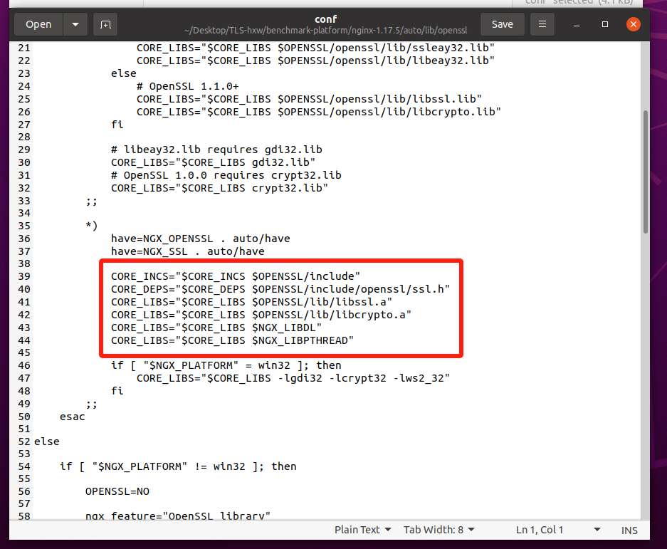

> 启发:nginx关于现有库的判断,位于auto文件夹下。在./configure的过程中,调用auto的代码，从而形成对应的Makefile文件

./configure --prefix=/home/hxw/Desktop/TLS-hxw/benchmark-platform/nginx-1.17.5/hxw_nginx  --with-debug --with-http_ssl_module --with-openssl=/home/hxw/Desktop/TLS-hxw/oqs-provider-hxw/.local --with-cc-opt="-I /home/hxw/Desktop/TLS-hxw/oqs-provider-hxw/.local/include/oqs" --with-ld-opt="-L /home/hxw/Desktop/TLS-hxw/oqs-provider-hxw/.local/lib"  --without-http_gzip_module


继续运行，存在关于engine的报错
```bash
src/event/ngx_event_openssl.c:5159:5: error: ‘ENGINE_set_default’ is deprecated: Since OpenSSL 3.0 [-Werror=deprecated-declarations]
 5159 |     if (ENGINE_set_default(engine, ENGINE_METHOD_ALL) == 0) {
      |     ^~
In file included from src/event/ngx_event_openssl.h:22,
                 from src/core/ngx_core.h:83,
                 from src/event/ngx_event_openssl.c:9:
/home/hxw/Desktop/TLS-hxw/oqs-provider-hxw/.local/include/openssl/engine.h:708:27: note: declared here
  708 | OSSL_DEPRECATEDIN_3_0 int ENGINE_set_default(ENGINE *e, unsigned int flags);
      |                           ^~~~~~~~~~~~~~~~~~
src/event/ngx_event_openssl.c:5164:9: error: ‘ENGINE_free’ is deprecated: Since OpenSSL 3.0 [-Werror=deprecated-declarations]
 5164 |         ENGINE_free(engine);
      |         ^~~~~~~~~~~
In file included from src/event/ngx_event_openssl.h:22,
                 from src/core/ngx_core.h:83,
                 from src/event/ngx_event_openssl.c:9:
/home/hxw/Desktop/TLS-hxw/oqs-provider-hxw/.local/include/openssl/engine.h:493:27: note: declared here
  493 | OSSL_DEPRECATEDIN_3_0 int ENGINE_free(ENGINE *e);
      |                           ^~~~~~~~~~~
src/event/ngx_event_openssl.c:5169:5: error: ‘ENGINE_free’ is deprecated: Since OpenSSL 3.0 [-Werror=deprecated-declarations]
 5169 |     ENGINE_free(engine);
      |     ^~~~~~~~~~~
In file included from src/event/ngx_event_openssl.h:22,
                 from src/core/ngx_core.h:83,
                 from src/event/ngx_event_openssl.c:9:
/home/hxw/Desktop/TLS-hxw/oqs-provider-hxw/.local/include/openssl/engine.h:493:27: note: declared here
  493 | OSSL_DEPRECATEDIN_3_0 int ENGINE_free(ENGINE *e);
```

加上CFLAGS来使得编译成功以略过该错误
```bash
CFLAGS="-Wno-error=deprecated-declarations" ./configure --prefix=/home/hxw/Desktop/TLS-hxw/benchmark-platform/nginx-1.17.5/hxw_nginx --with-debug --with-http_ssl_module --with-openssl=/home/hxw/Desktop/TLS-hxw/oqs-provider-hxw/.local --with-cc-opt="-I /home/hxw/Desktop/TLS-hxw/oqs-provider-hxw/.local/include/oqs" --with-ld-opt="-L /home/hxw/Desktop/TLS-hxw/oqs-provider-hxw/.local/lib" --without-http_gzip_module
```


然后运行setup.sh成功
接着运行experiment.py，出现了一些问题

```bash
hxw@ubuntu:~/Desktop/TLS-hxw/benchmark-platform/emulation-exp/code/kex$ sudo python3 experiment.py
 > ip netns exec cli_ns tc qdisc change dev cli_ve root netem limit 1000 delay 2.684ms rate 1000mbit
 > ip netns exec srv_ns tc qdisc change dev srv_ve root netem limit 1000 delay 2.684ms rate 1000mbit
 > ip netns exec cli_ns ping 10.0.0.1 -c 30
 > ip netns exec cli_ns tc qdisc change dev cli_ve root netem limit 1000 delay 2.684ms rate 1000mbit
 > ip netns exec srv_ns tc qdisc change dev srv_ve root netem limit 1000 delay 2.684ms rate 1000mbit
b'./s_timer.o: error while loading shared libraries: libssl.so.3: cannot open shared object file: No such file or directory\n'
b'./s_timer.o: error while loading shared libraries: libssl.so.3: cannot open shared object file: No such file or directory\n'
b'./s_timer.o: error while loading shared libraries: libssl.so.3: cannot open shared object file: No such file or directory\n'
b'./s_timer.o: error while loading shared libraries: libssl.so.3: cannot open shared object file: No such file or directory\n'
b'./s_timer.o: error while loading shared libraries: libssl.so.3: cannot open shared object file: No such file or directory\n'
b'./s_timer.o: error while loading shared libraries: libssl.so.3: cannot open shared object file: No such file or directory\n'
b'./s_timer.o: error while loading shared libraries: libssl.so.3: cannot open shared object file: No such file or directory\n'
b'./s_timer.o: error while loading shared libraries: libssl.so.3: cannot open shared object file: No such file or directory\n'
b'./s_timer.o: error while loading shared libraries: libssl.so.3: cannot open shared object file: No such file or directory\n'
b'./s_timer.o: error while loading shared libraries: libssl.so.3: cannot open shared object file: No such file or directory\n'
b'./s_timer.o: error while loading shared libraries: libssl.so.3: cannot open shared object file: No such file or directory\n'
b'./s_timer.o: error while loading shared libraries: libssl.so.3: cannot open shared object file: No such file or directory\n'
b'./s_timer.o: error while loading shared libraries: libssl.so.3: cannot open shared object file: No such file or directory\n'
multiprocessing.pool.RemoteTraceback: 
"""
Traceback (most recent call last):
  File "/usr/lib/python3.8/multiprocessing/pool.py", line 125, in worker
    result = (True, func(*args, **kwds))
  File "/usr/lib/python3.8/multiprocessing/pool.py", line 51, in starmapstar
    return list(itertools.starmap(args[0], args[1]))
  File "experiment.py", line 53, in time_handshake
    result = run_subprocess(command)
  File "experiment.py", line 21, in run_subprocess
    assert result.returncode == expected_returncode
AssertionError
"""

The above exception was the direct cause of the following exception:

Traceback (most recent call last):
  File "experiment.py", line 91, in <module>
    result = run_timers(kex_alg, timer_pool)
  File "experiment.py", line 57, in run_timers
    results_nested = timer_pool.starmap(time_handshake, [(kex_alg, MEASUREMENTS_PER_TIMER)] * TIMERS)
  File "/usr/lib/python3.8/multiprocessing/pool.py", line 372, in starmap
    return self._map_async(func, iterable, starmapstar, chunksize).get()
  File "/usr/lib/python3.8/multiprocessing/pool.py", line 771, in get
    raise self._value
AssertionError
```

下面先查看一下网络的结果
客户端10.0.0.2
服务端10.0.0.1
```bash
hxw@ubuntu:~/Desktop/TLS-hxw/benchmark-platform/emulation-exp/code/kex$ sudo ip netns exec cli_ns ping 10.0.0.1
PING 10.0.0.1 (10.0.0.1) 56(84) bytes of data.
64 bytes from 10.0.0.1: icmp_seq=1 ttl=64 time=5.85 ms
64 bytes from 10.0.0.1: icmp_seq=2 ttl=64 time=5.66 ms
^C
--- 10.0.0.1 ping statistics ---
2 packets transmitted, 2 received, 0% packet loss, time 1002ms
rtt min/avg/max/mdev = 5.656/5.753/5.850/0.097 ms
hxw@ubuntu:~/Desktop/TLS-hxw/benchmark-platform/emulation-exp/code/kex$ sudo ip netns exec cli_ns ifconfig
cli_ve: flags=4163<UP,BROADCAST,RUNNING,MULTICAST>  mtu 1500
        inet 10.0.0.2  netmask 255.255.255.0  broadcast 0.0.0.0
        inet6 fe80::200:ff:fe00:1  prefixlen 64  scopeid 0x20<link>
        ether 00:00:00:00:00:01  txqueuelen 1000  (Ethernet)
        RX packets 44  bytes 4072 (4.0 KB)
        RX errors 0  dropped 0  overruns 0  frame 0
        TX packets 43  bytes 4002 (4.0 KB)
        TX errors 0  dropped 0 overruns 0  carrier 0  collisions 0

lo: flags=73<UP,LOOPBACK,RUNNING>  mtu 65536
        inet 127.0.0.1  netmask 255.0.0.0
        inet6 ::1  prefixlen 128  scopeid 0x10<host>
        loop  txqueuelen 1000  (Local Loopback)
        RX packets 0  bytes 0 (0.0 B)
        RX errors 0  dropped 0  overruns 0  frame 0
        TX packets 0  bytes 0 (0.0 B)
        TX errors 0  dropped 0 overruns 0  carrier 0  collisions 0

```

# 2024-3-23/2024-3-24
## 搭建好测试环境(experiment.py代码的成功运行)

仍然存在无法寻找到库的问题
```bash
b'./s_timer.o: error while loading shared libraries: libssl.so.3: cannot open shared object file: No such file or directory\n'
```

下面单独运行s_timer程序，能够成功运行，但是由于缺乏nginx服务器，因此总是报错

于是进一步尝试在ns中运行，验证发现，是由于系统环境变量的问题导致无法找到动态链接库


```bash
root@ubuntu:/home/hxw/Desktop/TLS-hxw/benchmark-platform/emulation-exp/code/kex# printenv LD_LIBRARY_PATH
root@ubuntu:/home/hxw/Desktop/TLS-hxw/benchmark-platform/emulation-exp/code/kex# source /etc/profile
root@ubuntu:/home/hxw/Desktop/TLS-hxw/benchmark-platform/emulation-exp/code/kex# printenv LD_LIBRARY_PATH
/home/hxw/Desktop/TLS-hxw/oqs-provider-hxw/.local/lib64
root@ubuntu:/home/hxw/Desktop/TLS-hxw/benchmark-platform/emulation-exp/code/kex# ./s_timer prime256v1  100
hxw2
hxw4
hxw6
hxw8
hxw10
hxw set verify successfully
16.964455,11.615972,10.173507,5.711372,4.458571,4.623199,4.071431,3.901915,4.619473,5.089827,4.455314,3.669486,4.114288,3.665743,4.232525,3.777349,4.492146,5.097235,4.320964,7.674708,5.518913,4.107031,4.585853,4.019995,4.486076,4.561549,4.742279,4.052172,3.960240,4.563042,3.718556,4.260010,4.217083,4.902488,4.269329,4.743770,4.209305,3.759973,4.437464,4.364208,3.964576,4.220476,5.161196,4.700610,4.410105,4.129299,3.677799,3.113653,4.018252,4.665156,4.769332,4.359742,4.324971,3.890337,4.225572,4.492203,4.334081,4.520263,4.357518,5.119997,4.147201,3.749079,4.174109,4.210048,4.538015,3.870424,4.145983,4.322038,4.020862,4.643584,3.905181,3.889914,4.279939,4.499164,3.969831,4.155113,3.526474,4.238674,4.446052,4.284474,4.269660,4.139799,3.894906,4.133550,3.598712,4.209333,3.622714,4.864462,3.865526,4.273275,5.175800,4.185426,4.235865,4.140313,4.579465,4.787473,4.706640,4.562890,4.229961,4.397829
```

经过实验发现，可以使用下述命令来完成
```bash
hxw@ubuntu:~/Desktop/TLS-hxw/benchmark-platform/emulation-exp/code/kex$ sudo ip netns exec cli_ns bash -c "export LD_LIBRARY_PATH=/home/hxw/Desktop/TLS-hxw/oqs-provider-hxw/.local/lib64 ; ./s_timer prime256v1  100"
[sudo] password for hxw: 
hxw2
hxw4
hxw6
hxw8
hxw10
hxw set verify successfully
10.429356,8.305806,9.346091,8.773166,6.689679,8.838787,8.210003,7.634086,5.506995,4.543336,5.217416,8.169378,6.420159,5.649527,5.276964,5.207556,8.261495,6.820820,5.245164,3.810615,4.057196,6.436939,4.247833,4.554230,3.854200,3.495709,4.088955,4.267588,4.984942,4.497852,4.582193,4.890603,3.677964,4.529757,4.353454,5.237123,4.629254,4.089084,4.280036,3.855195,4.661856,4.730130,7.233123,6.592527,4.750197,4.418298,4.252988,5.355094,4.602718,4.517200,4.239568,4.440609,4.055054,3.797894,4.376852,3.617284,4.427737,4.881788,4.411835,5.075765,4.725168,4.558560,4.595090,4.280279,4.616857,4.658819,5.276425,4.381776,4.361608,4.451188,4.149146,4.976509,4.380106,4.543265,4.049558,6.336054,4.447290,4.365162,3.303404,4.421554,4.927753,4.376067,5.065393,4.352546,4.398853,4.833836,4.350335,6.281635,6.755814,6.191418,7.094626,5.671492,5.816716,6.914305,6.363570,6.938478,5.722543,6.265128,6.205933,6.225770
```

因此，修改experiment.py函数如下所示
```python
def time_handshake(kex_alg, measurements):
    command = [
    'sudo','ip', 'netns', 'exec', 'cli_ns', 'bash', '-c',
    'export LD_LIBRARY_PATH=/home/hxw/Desktop/TLS-hxw/oqs-provider-hxw/.local/lib64 ; ' +
    './s_timer.o ' + kex_alg + ' ' + str(measurements)
]
    result = run_subprocess(command)
    print(result)
    return [float(i) for i in result.strip().split(',')]
```
但是出现报错，是因为输出的内容包含一些hxw等调试信息或者不输出，通过删除这些调试输出从而解决这些问题

> 是用.o还是可执行文件呢 -> 使用可执行文件


### s_timer代码解读
s_timer应该是输出的是建立握手的时间

TODO:如何修改代码以指定ctruprime呢?
**注意:**当服务端不指定kex算法，而客户端指定时，此时也会出现40错误。
1.在s_timer代码中，使之调用ctruprime653


2.nginx服务端，如何指定ctruprime653
[nginx服务端配置](https://www.runoob.com/w3cnote/nginx-setup-intro.html)

首先根据gpt的提示，在nginx.conf文件中添加"ssl_key_exchange_algorithm ctruprime653;"，，但是报错nginx无法识别ssl_key_exchange_algorithm
```bash
    server {
        listen       10.0.0.1:4433 ssl;
        server_name  localhost;

        ssl_certificate      server.crt;
        ssl_certificate_key  server.key;

        ssl_session_cache    shared:SSL:1m;
        ssl_session_timeout  5m;

        ssl_protocols TLSv1.3;
        ssl_key_exchange_algorithm ctruprime653;
        client_header_timeout 67234s;

        location / {
            root   html;
            index  index.html index.htm;
        }
    }
```

于是尝试修改openssl.conf来修改

在修改experiment.py中的kex算法为ctruprime653后，出现如下所示的报错
```bash
hxw@ubuntu:~/Desktop/TLS-hxw/benchmark-platform/emulation-exp/code/kex$ sudo python3 experiment.py 
 > ip netns exec cli_ns tc qdisc change dev cli_ve root netem limit 1000 delay 2.684ms rate 1000mbit
 > ip netns exec srv_ns tc qdisc change dev srv_ve root netem limit 1000 delay 2.684ms rate 1000mbit
 > ip netns exec cli_ns ping 10.0.0.1 -c 30
 > ip netns exec cli_ns tc qdisc change dev cli_ve root netem limit 1000 delay 2.684ms rate 1000mbit
 > ip netns exec srv_ns tc qdisc change dev srv_ve root netem limit 1000 delay 2.684ms rate 1000mbit
before run timers
b'Unrecoverable OpenSSL error.\n'

b'Unrecoverable OpenSSL error.\n'

b'Unrecoverable OpenSSL error.\n'

b'Unrecoverable OpenSSL error.\n'

b'Unrecoverable OpenSSL error.\n'

b'Unrecoverable OpenSSL error.\n'

b'Unrecoverable OpenSSL error.\n'

b'Unrecoverable OpenSSL error.\n'

b'Unrecoverable OpenSSL error.\n'

b'Unrecoverable OpenSSL error.\n'

b'Unrecoverable OpenSSL error.\n'

b'Unrecoverable OpenSSL error.\n'

b'Unrecoverable OpenSSL error.\n'

multiprocessing.pool.RemoteTraceback: 
"""
Traceback (most recent call last):
  File "/usr/lib/python3.8/multiprocessing/pool.py", line 125, in worker
    result = (True, func(*args, **kwds))
  File "/usr/lib/python3.8/multiprocessing/pool.py", line 51, in starmapstar
    return list(itertools.starmap(args[0], args[1]))
  File "experiment.py", line 58, in time_handshake
    return [float(i) for i in result.strip().split(',')]
  File "experiment.py", line 58, in <listcomp>
    return [float(i) for i in result.strip().split(',')]
ValueError: could not convert string to float: ''
"""

The above exception was the direct cause of the following exception:

Traceback (most recent call last):
  File "experiment.py", line 97, in <module>
    result = run_timers(kex_alg, timer_pool)
  File "experiment.py", line 62, in run_timers
    results_nested = timer_pool.starmap(time_handshake, [(kex_alg, MEASUREMENTS_PER_TIMER)] * TIMERS)
  File "/usr/lib/python3.8/multiprocessing/pool.py", line 372, in starmap
    return self._map_async(func, iterable, starmapstar, chunksize).get()
  File "/usr/lib/python3.8/multiprocessing/pool.py", line 771, in get
    raise self._value
ValueError: could not convert string to float: ''
```

```bash
root@ubuntu:/home/hxw/Desktop/TLS-hxw/certs# openssl s_client -groups ctruprime653 -connect 10.1.2.2:4433
Connecting to 10.1.2.2
CONNECTED(00000003)
[In kem.c] Try to new ctruprime653
[In OQS_KEM_ctruprime_653_new] start new ctruprime 653
8064E308137F0000:error:0A000410:SSL routines:ssl3_read_bytes:ssl/tls alert handshake failure:ssl/record/rec_layer_s3.c:907:SSL alert number 40
---
no peer certificate available
---
No client certificate CA names sent
---
SSL handshake has read 7 bytes and written 1281 bytes
Verification: OK
---
New, (NONE), Cipher is (NONE)
This TLS version forbids renegotiation.
Compression: NONE
Expansion: NONE
No ALPN negotiated
Early data was not sent
Verify return code: 0 (ok)
---
```

在s_timer.c中，添加输出，定位错误是由于SSL_CTX_set1_groups_list(ssl_ctx, kex_alg)引起的
使用代码set_group_test进行测试
```bash
#include <stdio.h>
#include <openssl/ssl.h>
#include <openssl/err.h>

int main(void) {
    SSL_CTX* ssl_ctx = SSL_CTX_new(SSLv23_client_method()); // 创建 SSL_CTX 对象
    if (!ssl_ctx) {
        printf("Failed to create SSL_CTX\n");
        return 1;
    }

    printf("hi\n");
    int ret = SSL_CTX_set1_groups_list(ssl_ctx, "ctruprime653");
    if (ret != 1) {
        printf("set kex_alg wrong\n");
    } else {
        printf("set ctruprime653 kex_alg success\n");
    }

    SSL_CTX_free(ssl_ctx); // 释放 SSL_CTX 对象
    return 0;
}


```

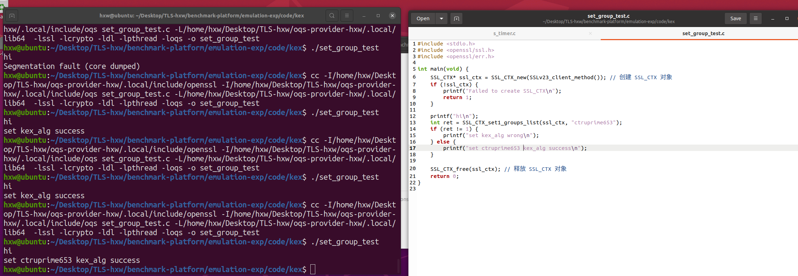

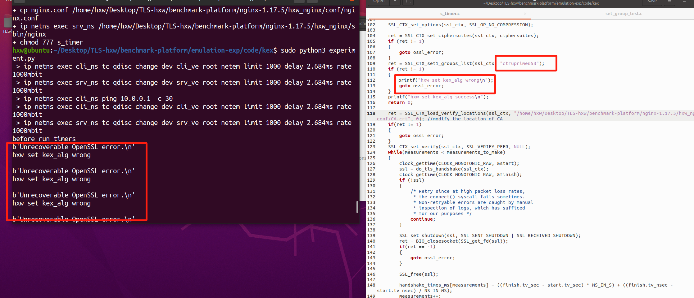

在命名空间中运行set_group_test,当没有/etc/profile的时候，失败。
于是调整，experiment.py文件中的运行s_timer的命令为 "source /etc/profile ; ./s_timer ctruprime653 100"
能够正确运行，此时报错
```bash
root@ubuntu:/home/hxw/Desktop/TLS-hxw/benchmark-platform/emulation-exp/code/kex# ./s_timer ctruprime653 1
[In kem.c] Try to new ctruprime653
[In OQS_KEM_ctruprime_653_new] start new ctruprime 653
8034D7B0B87F0000:error:0A000410:SSL routines:ssl3_read_bytes:ssl/tls alert handshake failure:ssl/record/rec_layer_s3.c:907:SSL alert number 40
[In kem.c] Try to new ctruprime653

```

根据以前的报错，猜测40错误出现的原因在于签名算法的使用错误
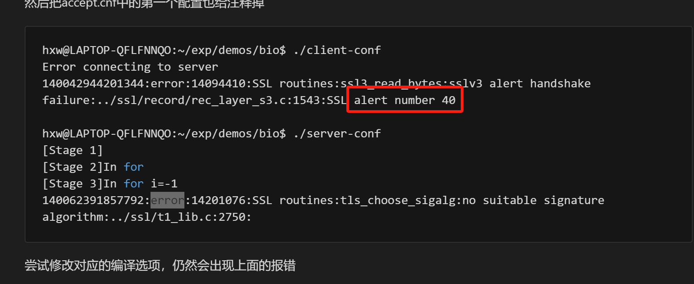

重新生成dilithium3密钥,在命令行界面是成功的
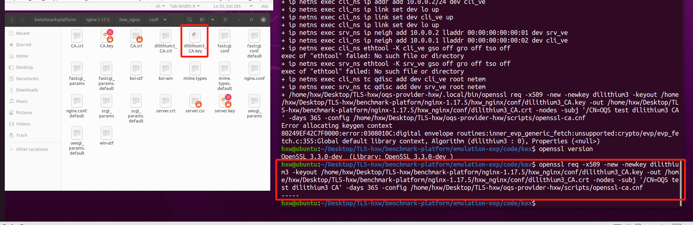

> 这是因为新的bash中，环境变量没有更新导致的，因此在setup.sh文件中，添加如下的内容

```bash
export OPENSSL_PATH=/home/hxw/Desktop/TLS-hxw/oqs-provider-hxw/.local/bin
export PATH=$OPENSSL_PATH:$PATH
export LD_LIBRARY_PATH=/home/hxw/Desktop/TLS-hxw/oqs-provider-hxw/.local/lib64
export OPENSSL_APP=/home/hxw/Desktop/TLS-hxw/oqs-provider-hxw/openssl/apps/openssl
export OPENSSL_CONF=/home/hxw/Desktop/TLS-hxw/oqs-provider-hxw/scripts/openssl-ca.cnf
export OPENSSL_MODULES=/home/hxw/Desktop/TLS-hxw/oqs-provider-hxw/_build/lib
export C_INCLUDE_PATH=$C_INCLUDE_PATH:/home/hxw/Desktop/TLS-hxw/oqs-provider-hxw/.local/include

export OPENSSLDIR=/home/hxw/Desktop/TLS-hxw/oqs-provider-hxw/.local/ssl
```

在nginx配置文件中，指定了服务端的证书路径，因此在setup的过程中，需要和nginx.conf中的保持一致

```bash
${OPENSSL} req -x509 -new -newkey dilithium3 -keyout ${NGINX_CONF_DIR}/CA.key -out ${NGINX_CONF_DIR}/CA.crt -nodes -subj "/CN=OQS test dilithium3 CA" -days 365 -config ${OPENSSL_CNF}

echo "1"


# generate server CSR
# ${OPENSSL} req -new -newkey ec:prime256v1.pem -keyout ${NGINX_CONF_DIR}/server.key -out ${NGINX_CONF_DIR}/server.csr -nodes -subj "/CN=oqstest CA ecdsap256" -config ${OPENSSL_CNF}
${OPENSSL} genpkey -algorithm dilithium3 -out ${NGINX_CONF_DIR}/server.key
${OPENSSL} req -new -newkey dilithium3 -keyout ${NGINX_CONF_DIR}/server.key -out ${NGINX_CONF_DIR}/server.csr -nodes -subj "/CN=OQS test server" -config ${OPENSSL_CNF}


echo "2"
# generate server cert
${OPENSSL} x509 -req -in ${NGINX_CONF_DIR}/server.csr -out ${NGINX_CONF_DIR}/server.crt -CA ${NGINX_CONF_DIR}/CA.crt -CAkey ${NGINX_CONF_DIR}/CA.key -CAcreateserial -days 365
```

此时，仍然没有解决40报错的问题，猜测是nginx端和客户端差不多由于环境变量的原因产生错误，于是加入了如下的命令
```bash
sudo ip netns exec srv_ns bash -c "source /etc/profile;${NGINX_APP} 
```
但是仍然没有解决

```
hxw@ubuntu:~/Desktop/TLS-hxw/benchmark-platform/emulation-exp/code/kex$ sudo ip netns exec cli_ns bash
root@ubuntu:/home/hxw/Desktop/TLS-hxw/benchmark-platform/emulation-exp/code/kex# source /etc/profile
root@ubuntu:/home/hxw/Desktop/TLS-hxw/benchmark-platform/emulation-exp/code/kex# openssl version
OpenSSL 3.3.0-dev  (Library: OpenSSL 3.3.0-dev )
root@ubuntu:/home/hxw/Desktop/TLS-hxw/benchmark-platform/emulation-exp/code/kex# ./s_timer ctruprime653 10
[In kem.c] Try to new ctruprime653
[In OQS_KEM_ctruprime_653_new] start new ctruprime 653
8084ADCC287F0000:error:0A000410:SSL routines:ssl3_read_bytes:ssl/tls alert handshake failure:ssl/record/rec_layer_s3.c:907:SSL alert number 40
[In kem.c] Try to new ctruprime653
[In OQS_KEM_ctruprime_653_new] start new ctruprime 653
8084ADCC287F0000:error:0A000410:SSL routines:ssl3_read_bytes:ssl/tls alert handshake failure:ssl/record/rec_layer_s3.c:907:SSL alert number 40
[In kem.c] Try to new ctruprime653
[In OQS_KEM_ctruprime_653_new] start new ctruprime 653
```

> 现在只能在本机配好，然后客户端连接抓包看一下发生了什么

修改s_timer连接的客户端地址为本地回环
然后运行，产生如下所示的报错
```bash
hxw@ubuntu:~/Desktop/TLS-hxw/benchmark-platform/emulation-exp/code/kex$ sudo /home/hxw/Desktop/TLS-hxw/benchmark-platform/nginx-1.17.5/hxw_nginx/sbin/nginx
nginx: [emerg] SSL_CTX_use_certificate("/home/hxw/Desktop/TLS-hxw/benchmark-platform/nginx-1.17.5/hxw_nginx/conf/server.crt") failed (SSL: error:03000072:digital envelope routines::decode error error:0A00018F:SSL routines::ee key too small)
```
还是证书有问题!!!

```bash
${OPENSSL} req -x509 -new -newkey dilithium3 -keyout ${NGINX_CONF_DIR}/CA.key -out ${NGINX_CONF_DIR}/CA.crt -nodes -subj "/CN=OQS test dilithium3 CA" -days 365 -config ${OPENSSL_CNF}

echo "1"


# generate server CSR
# ${OPENSSL} req -new -newkey ec:prime256v1.pem -keyout ${NGINX_CONF_DIR}/server.key -out ${NGINX_CONF_DIR}/server.csr -nodes -subj "/CN=oqstest CA ecdsap256" -config ${OPENSSL_CNF}
${OPENSSL} genpkey -algorithm dilithium3 -out ${NGINX_CONF_DIR}/server.key
${OPENSSL} req -new -newkey dilithium3 -keyout ${NGINX_CONF_DIR}/server.key -out ${NGINX_CONF_DIR}/server.csr -nodes -subj "/CN=OQS test server" -config ${OPENSSL_CNF}


echo "2"
# generate server cert
${OPENSSL} x509 -req -in ${NGINX_CONF_DIR}/server.csr -out ${NGINX_CONF_DIR}/server.crt -CA ${NGINX_CONF_DIR}/CA.crt -CAkey ${NGINX_CONF_DIR}/CA.key -CAcreateserial -days 365

echo "3"
```

加了新的还是没解决/(ㄒoㄒ)/~~

(2024-3-24)
当继续使用原来的证书,发现服务器端能够正确启动

```bash
hxw@ubuntu:~/Desktop/TLS-hxw/benchmark-platform/emulation-exp/code/kex$ sudo /home/hxw/Desktop/TLS-hxw/benchmark-platform/nginx-1.17.5/hxw_nginx/sbin/nginx
nginx: [emerg] bind() to 10.0.0.1:4433 failed (99: Cannot assign requested address)
```

可能存在的原因
1.证书的问题->可能性不大，因为使用原先的证书是能够在主机中成功运行nginx服务器的

根据gpt的提示再运行一遍
```bash
${OPENSSL} req -x509 -new -newkey dilithium3 -keyout ${NGINX_CONF_DIR}/CA.key -out ${NGINX_CONF_DIR}/CA.crt -nodes -subj "/CN=OQS test dilithium3 CA" -days 365 -config ${OPENSSL_CNF}

${OPENSSL} req -new -newkey dilithium3 -keyout ${NGINX_CONF_DIR}/server.key -out ${NGINX_CONF_DIR}/server.csr -nodes -subj "/CN=OQS test server" -config ${OPENSSL_CNF}

${OPENSSL} x509 -req -in ${NGINX_CONF_DIR}/server.csr -out ${NGINX_CONF_DIR}/server.crt -CA ${NGINX_CONF_DIR}/CA.crt -CAkey ${NGINX_CONF_DIR}/CA.key -CAcreateserial -days 365
```
但是仍然存在如下所示的报错
```bash
hxw@ubuntu:~/Desktop/TLS-hxw/benchmark-platform/emulation-exp/code/kex$ sudo /home/hxw/Desktop/TLS-hxw/benchmark-platform/nginx-1.17.5/hxw_nginx/sbin/nginx
nginx: [emerg] SSL_CTX_use_certificate("/home/hxw/Desktop/TLS-hxw/benchmark-platform/nginx-1.17.5/hxw_nginx/conf/server.crt") failed (SSL: error:03000072:digital envelope routines::decode error error:0A00018F:SSL routines::ee key too small)
```
2.服务端kex算法未指定的问题

似乎，找不到对应的算法

解决思路:
1.抓包看一下
2.
## batch的集成

# 2024-3-25
能够从成功运行set_group_test(里面集成的是kyber768)

下面运行含kuber768的experiment.py
没有东西输出，需要看一下

在本地又开始报错找不到libssl库
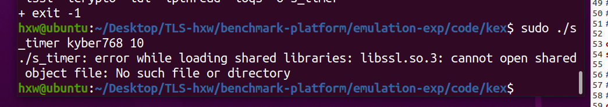

想看具体的输出是什么
在命名空间中找不到

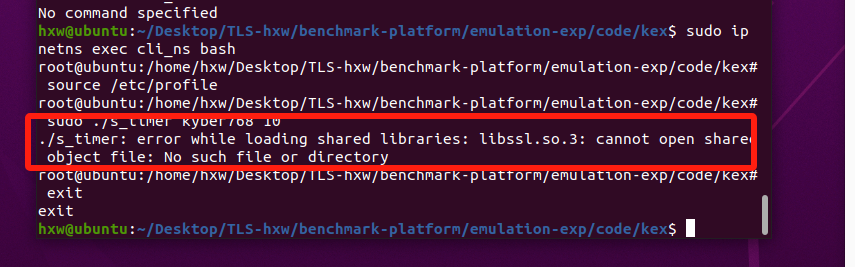

在experiment中修改使输出运行命令的结果失效

> 总结:遇到的几个问题:1.libssl找不到 2.连上了存在40错误(是算法没有集成还是证书的错误,是set_group_test的问题还是证书的40问题，证书的问题会导致服务器无法启动) 3.输出不显示 4.

运行setup
本地开启服务器，没问题

>openssl req -x509 -new -newkey dilithium3 -keyout /home/hxw/Desktop/TLS-hxw/benchmark-platform/nginx-1.17.5/hxw_nginx/conf/dilithium3_CA.key -out /home/hxw/Desktop/TLS-hxw/benchmark-platform/nginx-1.17.5/hxw_nginx/conf/dilithium3_CA.crt -nodes -subj '/CN=OQS test dilithium3 CA' -days 365 -config /home/hxw/Desktop/TLS-hxw/oqs-provider-hxw/scripts/openssl-ca.cnf
cc -g -Wall -Wextra -Werror -Wpedantic -I/home/hxw/Desktop/TLS-hxw/oqs-provider-hxw/.local/include/openssl -I/home/hxw/Desktop/TLS-hxw/oqs-provider-hxw/.local/include/oqs s_timer.c -L/home/hxw/Desktop/TLS-hxw/oqs-provider-hxw/.local/lib64  -lssl -lcrypto -ldl -lpthread -loqs -o s_timer_local
cc -g -Wall -Wextra -Werror -Wpedantic -I/home/hxw/Desktop/TLS-hxw/oqs-provider-hxw/.local/include/openssl -I/home/hxw/Desktop/TLS-hxw/oqs-provider-hxw/.local/include/oqs set_group_test.c -L/home/hxw/Desktop/TLS-hxw/oqs-provider-hxw/.local/lib64  -lssl -lcrypto -ldl -lpthread -loqs -o set_group_test

我cnm，现在又可以了
```bash
hxw@ubuntu:~/Desktop/TLS-hxw/benchmark-platform/emulation-exp/code/kex$ sudo ./setup.sh 
+++ pwd
++ dirname /home/hxw/Desktop/TLS-hxw/benchmark-platform/emulation-exp/code/kex
+ ROOT=/home/hxw/Desktop/TLS-hxw/benchmark-platform/emulation-exp/code
+ OPENSSL=/home/hxw/Desktop/TLS-hxw/oqs-provider-hxw/.local/bin/openssl
+ OPENSSL_CNF=/home/hxw/Desktop/TLS-hxw/oqs-provider-hxw/scripts/openssl-ca.cnf
+ NGINX_APP=/home/hxw/Desktop/TLS-hxw/benchmark-platform/nginx-1.17.5/hxw_nginx/sbin/nginx
+ NGINX_CONF_DIR=/home/hxw/Desktop/TLS-hxw/benchmark-platform/nginx-1.17.5/hxw_nginx/conf
+ export OPENSSL_PATH=/home/hxw/Desktop/TLS-hxw/oqs-provider-hxw/.local/bin
+ OPENSSL_PATH=/home/hxw/Desktop/TLS-hxw/oqs-provider-hxw/.local/bin
+ export PATH=/home/hxw/Desktop/TLS-hxw/oqs-provider-hxw/.local/bin:/usr/local/sbin:/usr/local/bin:/usr/sbin:/usr/bin:/sbin:/bin:/snap/bin
+ PATH=/home/hxw/Desktop/TLS-hxw/oqs-provider-hxw/.local/bin:/usr/local/sbin:/usr/local/bin:/usr/sbin:/usr/bin:/sbin:/bin:/snap/bin
+ export LD_LIBRARY_PATH=/home/hxw/Desktop/TLS-hxw/oqs-provider-hxw/.local/lib64
+ LD_LIBRARY_PATH=/home/hxw/Desktop/TLS-hxw/oqs-provider-hxw/.local/lib64
+ export OPENSSL_APP=/home/hxw/Desktop/TLS-hxw/oqs-provider-hxw/openssl/apps/openssl
+ OPENSSL_APP=/home/hxw/Desktop/TLS-hxw/oqs-provider-hxw/openssl/apps/openssl
+ export OPENSSL_CONF=/home/hxw/Desktop/TLS-hxw/oqs-provider-hxw/scripts/openssl-ca.cnf
+ OPENSSL_CONF=/home/hxw/Desktop/TLS-hxw/oqs-provider-hxw/scripts/openssl-ca.cnf
+ export OPENSSL_MODULES=/home/hxw/Desktop/TLS-hxw/oqs-provider-hxw/_build/lib
+ OPENSSL_MODULES=/home/hxw/Desktop/TLS-hxw/oqs-provider-hxw/_build/lib
+ export C_INCLUDE_PATH=:/home/hxw/Desktop/TLS-hxw/oqs-provider-hxw/.local/include
+ C_INCLUDE_PATH=:/home/hxw/Desktop/TLS-hxw/oqs-provider-hxw/.local/include
+ export OPENSSLDIR=/home/hxw/Desktop/TLS-hxw/oqs-provider-hxw/.local/ssl
+ OPENSSLDIR=/home/hxw/Desktop/TLS-hxw/oqs-provider-hxw/.local/ssl
+ make s_timer
cc -g -Wall -Wextra -Werror -Wpedantic -I/home/hxw/Desktop/TLS-hxw/oqs-provider-hxw/.local/include/openssl -I/home/hxw/Desktop/TLS-hxw/oqs-provider-hxw/.local/include/oqs s_timer.c -L/home/hxw/Desktop/TLS-hxw/oqs-provider-hxw/.local/lib64  -lssl -lcrypto -ldl -lpthread -loqs -o s_timer
+ /home/hxw/Desktop/TLS-hxw/benchmark-platform/emulation-exp/code/setup_ns.sh
+ SERVER_VETH_LL_ADDR=00:00:00:00:00:02
+ SERVER_NS=srv_ns
+ SERVER_VETH=srv_ve
+ CLIENT_NS=cli_ns
+ CLIENT_VETH_LL_ADDR=00:00:00:00:00:01
+ CLIENT_VETH=cli_ve
+ ip netns add srv_ns
+ ip netns add cli_ns
+ ip link add name srv_ve address 00:00:00:00:00:02 netns srv_ns type veth peer name cli_ve address 00:00:00:00:00:01 netns cli_ns
+ ip netns exec srv_ns ip link set dev srv_ve up
+ ip netns exec srv_ns ip link set dev lo up
+ ip netns exec srv_ns ip addr add 10.0.0.1/24 dev srv_ve
+ ip netns exec cli_ns ip addr add 10.0.0.2/24 dev cli_ve
+ ip netns exec cli_ns ip link set dev lo up
+ ip netns exec cli_ns ip link set dev cli_ve up
+ ip netns exec cli_ns ip link set dev lo up
+ ip netns exec srv_ns ip neigh add 10.0.0.2 lladdr 00:00:00:00:00:01 dev srv_ve
+ ip netns exec cli_ns ip neigh add 10.0.0.1 lladdr 00:00:00:00:00:02 dev cli_ve
+ ip netns exec cli_ns ethtool -K cli_ve gso off gro off tso off
exec of "ethtool" failed: No such file or directory
+ ip netns exec srv_ns ethtool -K srv_ve gso off gro off tso off
exec of "ethtool" failed: No such file or directory
+ ip netns exec cli_ns tc qdisc add dev cli_ve root netem
+ ip netns exec srv_ns tc qdisc add dev srv_ve root netem
+ /home/hxw/Desktop/TLS-hxw/oqs-provider-hxw/.local/bin/openssl ecparam -out prime256v1.pem -name prime256v1
+ /home/hxw/Desktop/TLS-hxw/oqs-provider-hxw/.local/bin/openssl req -x509 -new -newkey ec:prime256v1.pem -keyout /home/hxw/Desktop/TLS-hxw/benchmark-platform/nginx-1.17.5/hxw_nginx/conf/CA.key -out /home/hxw/Desktop/TLS-hxw/benchmark-platform/nginx-1.17.5/hxw_nginx/conf/CA.crt -nodes -subj '/CN=OQS test ecdsap256 CA' -days 365 -config /home/hxw/Desktop/TLS-hxw/oqs-provider-hxw/scripts/openssl-ca.cnf
-----
+ /home/hxw/Desktop/TLS-hxw/oqs-provider-hxw/.local/bin/openssl req -new -newkey ec:prime256v1.pem -keyout /home/hxw/Desktop/TLS-hxw/benchmark-platform/nginx-1.17.5/hxw_nginx/conf/server.key -out /home/hxw/Desktop/TLS-hxw/benchmark-platform/nginx-1.17.5/hxw_nginx/conf/server.csr -nodes -subj '/CN=oqstest CA ecdsap256' -config /home/hxw/Desktop/TLS-hxw/oqs-provider-hxw/scripts/openssl-ca.cnf
-----
+ /home/hxw/Desktop/TLS-hxw/oqs-provider-hxw/.local/bin/openssl x509 -req -in /home/hxw/Desktop/TLS-hxw/benchmark-platform/nginx-1.17.5/hxw_nginx/conf/server.csr -out /home/hxw/Desktop/TLS-hxw/benchmark-platform/nginx-1.17.5/hxw_nginx/conf/server.crt -CA /home/hxw/Desktop/TLS-hxw/benchmark-platform/nginx-1.17.5/hxw_nginx/conf/CA.crt -CAkey /home/hxw/Desktop/TLS-hxw/benchmark-platform/nginx-1.17.5/hxw_nginx/conf/CA.key -CAcreateserial -days 365
Certificate request self-signature ok
subject=CN=oqstest CA ecdsap256
+ cp nginx.conf /home/hxw/Desktop/TLS-hxw/benchmark-platform/nginx-1.17.5/hxw_nginx/conf/nginx.conf
+ sudo ip netns exec srv_ns bash -c 'source /etc/profile;/home/hxw/Desktop/TLS-hxw/benchmark-platform/nginx-1.17.5/hxw_nginx/sbin/nginx '
+ chmod 777 s_timer
hxw@ubuntu:~/Desktop/TLS-hxw/benchmark-platform/emulation-exp/code/kex$ sudo ip netns exec cli_ns bash
root@ubuntu:/home/hxw/Desktop/TLS-hxw/benchmark-platform/emulation-exp/code/kex# source /etc/profile
root@ubuntu:/home/hxw/Desktop/TLS-hxw/benchmark-platform/emulation-exp/code/kex# ./s_timer prime256v1  100
hxw set kex_alg success
24.742655,8.909104,4.993471,3.881720,6.285394,4.289006,6.621664,5.853383,5.662293,4.258815,4.805315,4.243928,4.787628,4.083550,3.244132,4.126683,4.669062,3.920091,2.487638,4.128054,4.614163,4.024467,2.537173,3.968418,4.419302,4.457523,3.982722,3.924149,4.242034,3.827129,4.673007,4.833593,3.860085,5.370954,2.174344,5.048302,4.007553,4.551423,4.044153,4.743337,4.479258,3.814667,4.565107,3.741841,4.288349,4.498047,4.155943,4.533891,4.095294,3.646667,4.513444,4.206049,4.125937,5.122688,4.766504,4.344489,4.320140,6.371913,4.925507,4.396034,4.749990,4.126271,4.634278,5.330654,4.629749,4.352904,3.757065,8.278117,6.837824,4.714168,3.565295,3.886913,4.488913,4.005135,4.510854,4.556717,4.782536,4.278440,4.296862,4.143982,3.967841,3.935106,4.252933,4.002932,4.274603,4.270021,4.680200,3.869335,4.373905,4.127022,4.675907,3.925412,4root@ubuntu:/home/hxw/Desktop/root@ubuntu:/home/hxroot@ubuntu:/home/hxw/Desktop/root@ubuntu:/home/hxroot@ubuntroot@ubuntu:/home/hxw/Desktop/TLS-hxw/benchmark-platform/emulation-exp/code/kex# 

```

下面运行kyber768
```bash
root@ubuntu:/home/hxw/Desktop/root@ubuntu:/home/hxroot@ubuntroot@ubuntu:/home/hxw/Desktop/TLS-hxw/benchmark-platform/emulation-exp/code/kex# ./s_timer kyber768  100
hxw set kex_alg success
8054914A367F0000:error:0A000410:SSL routines:ssl3_read_bytes:ssl/tls alert handshake failure:ssl/record/rec_layer_s3.c:907:SSL alert number 40
8054914A367F0000:error:0A000410:SSL routines:ssl3_read_bytes:ssl/tls alert handshake failure:ssl/record/rec_layer_s3.c:907:SSL alert number 40
8054914A367F0000:error:0A000410:SSL routines:ssl3_read_bytes:ssl/tls alert handshake failure:ssl/record/rec_layer_s3.c:907:SSL alert number 40
8054914A367F0000:error:0A000410:SSL routines:ssl3_read_bytes:ssl/tls alert handshake failure:ssl/record/rec_layer_s3.c:907:SSL alert number 40

```

```bash
root@ubuntu:/home/hxw/Desktop/TLS-hxw/benchmark-platform/emulation-exp/code/kex# ./s_timer ctruprime653  100
hxw set kex_alg success
[In kem.c] Try to new ctruprime653
[In OQS_KEM_ctruprime_653_new] start new ctruprime 653
803435CB687F0000:error:0A000410:SSL routines:ssl3_read_bytes:ssl/tls alert handshake failure:ssl/record/rec_layer_s3.c:907:SSL alert number 40
```

**血的教训**:引起找不到问题似乎是因为sudo引起的
```bash
hxw@ubuntu:~/Desktop/TLS-hxw/benchmark-platform/emulation-exp/code/kex$ ./s_timer kyber768 10
hxw set kex_alg success
8064A39CC77F0000:error:8000006F:system library:BIO_connect:Connection refused:crypto/bio/bio_sock2.c:178:calling connect()
8064A39CC77F0000:error:10000067:BIO routines:BIO_connect:connect error:crypto/bio/bio_sock2.c:180:
8064A39CC77F0000:error:8000006F:system library:conn_state:Connection refused:crypto/bio/bss_conn.c:211:calling connect(10.0.0.1, 4433)
8064A39CC77F0000:error:10000067:BIO routines:conn_state:connect error:crypto/bio/bss_conn.c:264:
8064A39CC77F0000:error:8000006F:system library:BIO_connect:Connection refused:crypto/bio/bio_sock2.c:178:calling connect()
8064A39CC77F0000:error:10000067:BIO routines:BIO_connect:connect error:crypto/bio/bio_sock2.c:180:
8064A39CC77F0000:error:8000006F:system library:conn_state:Connection refused:crypto/bio/bss_conn.c:211:calling connect(10.0.0.1, 4433)
8064A39CC77F0000:error:10000067:BIO routines:conn_state:connect error:crypto/bio/bss_conn.c:264:
^C
hxw@ubuntu:~/Desktop/TLS-hxw/benchmark-platform/emulation-exp/code/kex$ sudo ./s_timer kyber768 10
./s_timer: error while loading shared libraries: libssl.so.3: cannot open shared object file: No such file or directory
```

现在需要定位问题出在s_timer的哪一个函数上面

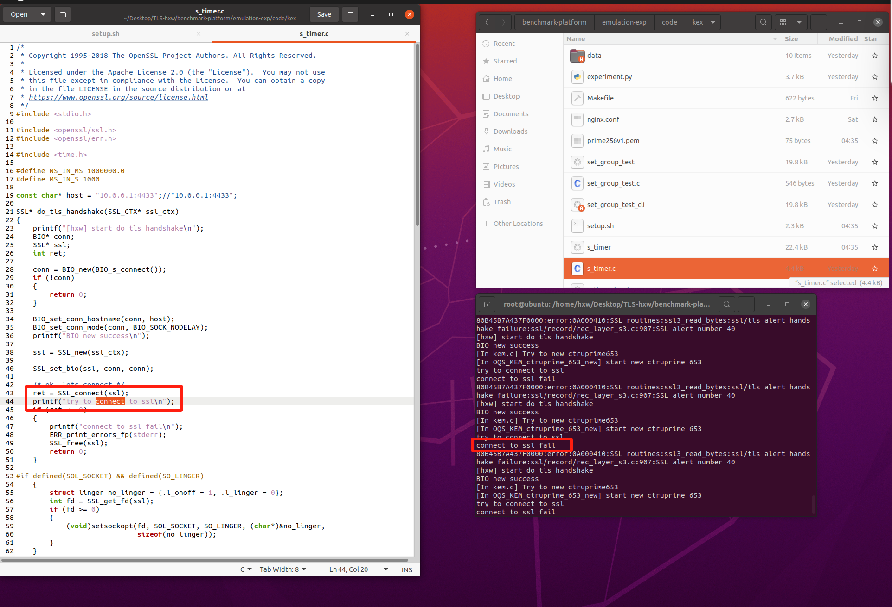

通过实验发现，错误发生在SSL_connect(ssl)上

在不改变任何配置的情况下，在客户端指定prime256v1时，能够成功建立连接，这意味着，不是网络和服务端证书的问题，而是服务端不支持客户端提供的密钥交换算法

下面进一步确认nginx所使用的openssl的版本,可以看到,nginx是已经成功编译的

```bash
hxw@ubuntu:~/Desktop/TLS-hxw/benchmark-platform/emulation-exp/code/kex$ /home/hxw/Desktop/TLS-hxw/benchmark-platform/nginx-1.17.5/hxw_nginx/sbin/nginx -V
nginx version: nginx/1.17.5
built with OpenSSL 3.3.0-dev 
TLS SNI support enabled
configure arguments: --prefix=/home/hxw/Desktop/TLS-hxw/benchmark-platform/nginx-1.17.5/hxw_nginx --with-debug --with-http_ssl_module --with-openssl=/home/hxw/Desktop/TLS-hxw/oqs-provider-hxw/.local --with-cc-opt='-I /home/hxw/Desktop/TLS-hxw/oqs-provider-hxw/.local/include/oqs' --with-ld-opt='-L /home/hxw/Desktop/TLS-hxw/oqs-provider-hxw/.local/lib' --without-http_gzip_module
```

当尝试使用openssl 自带的s_server和s_client进行操作时，发现当只有客户端指定kem算法，而服务端不进行指定时，也会存在40错误

openssl.cnf备份
```
#
# OpenSSL example configuration file.
# See doc/man5/config.pod for more info.
#
# This is mostly being used for generation of certificate requests,
# but may be used for auto loading of providers

# Note that you can include other files from the main configuration
# file using the .include directive.
#.include filename

# This definition stops the following lines choking if HOME isn't
# defined.
HOME                    = .

# Use this in order to automatically load providers.
openssl_conf = openssl_init

# Comment out the next line to ignore configuration errors
config_diagnostics = 1

# Extra OBJECT IDENTIFIER info:
# oid_file       = $ENV::HOME/.oid
oid_section = new_oids

# To use this configuration file with the "-extfile" option of the
# "openssl x509" utility, name here the section containing the
# X.509v3 extensions to use:
# extensions            =
# (Alternatively, use a configuration file that has only
# X.509v3 extensions in its main [= default] section.)

[ new_oids ]
# We can add new OIDs in here for use by 'ca', 'req' and 'ts'.
# Add a simple OID like this:
# testoid1=1.2.3.4
# Or use config file substitution like this:
# testoid2=${testoid1}.5.6

# Policies used by the TSA examples.
tsa_policy1 = 1.2.3.4.1
tsa_policy2 = 1.2.3.4.5.6
tsa_policy3 = 1.2.3.4.5.7

# For FIPS
# Optionally include a file that is generated by the OpenSSL fipsinstall
# application. This file contains configuration data required by the OpenSSL
# fips provider. It contains a named section e.g. [fips_sect] which is
# referenced from the [provider_sect] below.
# Refer to the OpenSSL security policy for more information.
# .include fipsmodule.cnf

[openssl_init]
providers = provider_sect
ssl_conf = ssl_sect

# List of providers to load
[provider_sect]
default = default_sect
oqsprovider = oqsprovider_sect
#oqsprovider2 = oqsprovider2_sect

# The fips section name should match the section name inside the
# included fipsmodule.cnf.
# fips = fips_sect

# If no providers are activated explicitly, the default one is activated implicitly.
# See man 7 OSSL_PROVIDER-default for more details.
#
# If you add a section explicitly activating any other provider(s), you most
# probably need to explicitly activate the default provider, otherwise it
# becomes unavailable in openssl.  As a consequence applications depending on
# OpenSSL may not work correctly which could lead to significant system
# problems including inability to remotely access the system.
[default_sect]
activate = 1

[oqsprovider_sect]
activate = 1
# This second provider instance can be activated (for testing) for example
# by creating a softlink with suitable name "oqsprovider2" to the originally
# created oqsprovider.{so|dylib|dll}
# 3-25 remove oqsprovider2_sect
#[oqsprovider2_sect]
#activate = 1

# activate = 1

[ssl_sect]
system_default = system_default_sect

[system_default_sect]
Groups = kyber768:kyber1024

####################################################################
[ ca ]
default_ca      = CA_default            # The default ca section

####################################################################
[ CA_default ]

dir             = ./demoCA              # Where everything is kept
certs           = $dir/certs            # Where the issued certs are kept
crl_dir         = $dir/crl              # Where the issued crl are kept
database        = $dir/index.txt        # database index file.
#unique_subject = no                    # Set to 'no' to allow creation of
                                        # several certs with same subject.
new_certs_dir   = $dir/newcerts         # default place for new certs.

certificate     = $dir/cacert.pem       # The CA certificate
serial          = $dir/serial           # The current serial number
rand_serial     = no
crlnumber       = $dir/crlnumber        # the current crl number
                                        # must be commented out to leave a V1 CRL
crl             = $dir/crl.pem          # The current CRL
private_key     = $dir/private/cakey.pem # The private key

x509_extensions = usr_cert              # The extensions to add to the cert

# Comment out the following two lines for the "traditional"
# (and highly broken) format.
name_opt        = ca_default            # Subject Name options
cert_opt        = ca_default            # Certificate field options

# Extension copying option: use with caution.
# copy_extensions = copy

# Extensions to add to a CRL. Note: Netscape communicator chokes on V2 CRLs
# so this is commented out by default to leave a V1 CRL.
# crlnumber must also be commented out to leave a V1 CRL.
# crl_extensions        = crl_ext

default_days    = 365                   # how long to certify for
default_crl_days= 30                    # how long before next CRL
default_md      = sha256                # use public key default MD
preserve        = no                    # keep passed DN ordering
email_in_dn     = no
# A few difference way of specifying how similar the request should look
# For type CA, the listed attributes must be the same, and the optional
# and supplied fields are just that :-)
policy          = policy_match

# For the CA policy
[ policy_match ]
countryName             = match
stateOrProvinceName     = match
organizationName        = match
organizationalUnitName  = optional
commonName              = supplied
emailAddress            = optional

# For the 'anything' policy
# At this point in time, you must list all acceptable 'object'
# types.
[ policy_anything ]
countryName             = optional
stateOrProvinceName     = optional
localityName            = optional
organizationName        = optional
organizationalUnitName  = optional
commonName              = supplied
emailAddress            = optional

####################################################################
[ req ]
default_bits            = 2048
default_keyfile         = privkey.pem
distinguished_name      = req_distinguished_name
attributes              = req_attributes
x509_extensions = v3_ca # The extensions to add to the self signed cert

# Passwords for private keys if not present they will be prompted for
# input_password = secret
# output_password = secret

# This sets a mask for permitted string types. There are several options.
# default: PrintableString, T61String, BMPString.
# pkix   : PrintableString, BMPString (PKIX recommendation before 2004)
# utf8only: only UTF8Strings (PKIX recommendation after 2004).
# nombstr : PrintableString, T61String (no BMPStrings or UTF8Strings).
# MASK:XXXX a literal mask value.
# WARNING: ancient versions of Netscape crash on BMPStrings or UTF8Strings.
string_mask = utf8only

# req_extensions = v3_req # The extensions to add to a certificate request

[ req_distinguished_name ]
countryName                     = Country Name (2 letter code)
countryName_default             = AU
countryName_min                 = 2
countryName_max                 = 2

stateOrProvinceName             = State or Province Name (full name)
stateOrProvinceName_default     = Some-State

localityName                    = Locality Name (eg, city)

0.organizationName              = Organization Name (eg, company)
0.organizationName_default      = Internet Widgits Pty Ltd

# we can do this but it is not needed normally :-)
#1.organizationName             = Second Organization Name (eg, company)
#1.organizationName_default     = World Wide Web Pty Ltd

organizationalUnitName          = Organizational Unit Name (eg, section)
#organizationalUnitName_default =

commonName                      = Common Name (e.g. server FQDN or YOUR name)
commonName_max                  = 64

emailAddress                    = Email Address
emailAddress_max                = 64

# SET-ex3                       = SET extension number 3

[ req_attributes ]
challengePassword               = A challenge password
challengePassword_min           = 4
challengePassword_max           = 20

unstructuredName                = An optional company name

[ usr_cert ]

# These extensions are added when 'ca' signs a request.

# This goes against PKIX guidelines but some CAs do it and some software
# requires this to avoid interpreting an end user certificate as a CA.

basicConstraints=CA:FALSE

# This is typical in keyUsage for a client certificate.
# keyUsage = nonRepudiation, digitalSignature, keyEncipherment

# PKIX recommendations harmless if included in all certificates.
subjectKeyIdentifier=hash
authorityKeyIdentifier=keyid,issuer

# This stuff is for subjectAltName and issuerAltname.
# Import the email address.
# subjectAltName=email:copy
# An alternative to produce certificates that aren't
# deprecated according to PKIX.
# subjectAltName=email:move

# Copy subject details
# issuerAltName=issuer:copy

# This is required for TSA certificates.
# extendedKeyUsage = critical,timeStamping

[ v3_req ]

# Extensions to add to a certificate request

basicConstraints = CA:FALSE
keyUsage = nonRepudiation, digitalSignature, keyEncipherment

[ v3_ca ]


# Extensions for a typical CA


# PKIX recommendation.

subjectKeyIdentifier=hash

authorityKeyIdentifier=keyid:always,issuer

basicConstraints = critical,CA:true

# Key usage: this is typical for a CA certificate. However since it will
# prevent it being used as an test self-signed certificate it is best
# left out by default.
# keyUsage = cRLSign, keyCertSign

# Include email address in subject alt name: another PKIX recommendation
# subjectAltName=email:copy
# Copy issuer details
# issuerAltName=issuer:copy

# DER hex encoding of an extension: beware experts only!
# obj=DER:02:03
# Where 'obj' is a standard or added object
# You can even override a supported extension:
# basicConstraints= critical, DER:30:03:01:01:FF

[ crl_ext ]

# CRL extensions.
# Only issuerAltName and authorityKeyIdentifier make any sense in a CRL.

# issuerAltName=issuer:copy
authorityKeyIdentifier=keyid:always

[ proxy_cert_ext ]
# These extensions should be added when creating a proxy certificate

# This goes against PKIX guidelines but some CAs do it and some software
# requires this to avoid interpreting an end user certificate as a CA.

basicConstraints=CA:FALSE

# This is typical in keyUsage for a client certificate.
# keyUsage = nonRepudiation, digitalSignature, keyEncipherment

# PKIX recommendations harmless if included in all certificates.
subjectKeyIdentifier=hash
authorityKeyIdentifier=keyid,issuer

# This stuff is for subjectAltName and issuerAltname.
# Import the email address.
# subjectAltName=email:copy
# An alternative to produce certificates that aren't
# deprecated according to PKIX.
# subjectAltName=email:move

# Copy subject details
# issuerAltName=issuer:copy

# This really needs to be in place for it to be a proxy certificate.
proxyCertInfo=critical,language:id-ppl-anyLanguage,pathlen:3,policy:foo

####################################################################
[ tsa ]

default_tsa = tsa_config1       # the default TSA section

[ tsa_config1 ]

# These are used by the TSA reply generation only.
dir             = ./demoCA              # TSA root directory
serial          = $dir/tsaserial        # The current serial number (mandatory)
crypto_device   = builtin               # OpenSSL engine to use for signing
signer_cert     = $dir/tsacert.pem      # The TSA signing certificate
                                        # (optional)
certs           = $dir/cacert.pem       # Certificate chain to include in reply
                                        # (optional)
signer_key      = $dir/private/tsakey.pem # The TSA private key (optional)
signer_digest  = sha256                 # Signing digest to use. (Optional)
default_policy  = tsa_policy1           # Policy if request did not specify it
                                        # (optional)
other_policies  = tsa_policy2, tsa_policy3      # acceptable policies (optional)
digests     = sha1, sha256, sha384, sha512  # Acceptable message digests (mandatory)
accuracy        = secs:1, millisecs:500, microsecs:100  # (optional)
clock_precision_digits  = 0     # number of digits after dot. (optional)
ordering                = yes   # Is ordering defined for timestamps?
                                # (optional, default: no)
tsa_name                = yes   # Must the TSA name be included in the reply?
                                # (optional, default: no)
ess_cert_id_chain       = no    # Must the ESS cert id chain be included?
                                # (optional, default: no)
ess_cert_id_alg         = sha1  # algorithm to compute certificate
                                # identifier (optional, default: sha1)

[insta] # CMP using Insta Demo CA
# Message transfer
server = pki.certificate.fi:8700
# proxy = # set this as far as needed, e.g., http://192.168.1.1:8080
# tls_use = 0
path = pkix/

# Server authentication
recipient = "/C=FI/O=Insta Demo/CN=Insta Demo CA" # or set srvcert or issuer
ignore_keyusage = 1 # potentially needed quirk
unprotected_errors = 1 # potentially needed quirk
extracertsout = insta.extracerts.pem

# Client authentication
ref = 3078 # user identification
secret = pass:insta # can be used for both client and server side

# Generic message options
cmd = ir # default operation, can be overridden on cmd line with, e.g., kur

# Certificate enrollment
subject = "/CN=openssl-cmp-test"
newkey = insta.priv.pem
out_trusted = insta.ca.crt
certout = insta.cert.pem

[pbm] # Password-based protection for Insta CA
# Server and client authentication
ref = $insta::ref # 3078
secret = $insta::secret # pass:insta

[signature] # Signature-based protection for Insta CA
# Server authentication
trusted = insta.ca.crt # does not include keyUsage digitalSignature

# Client authentication
secret = # disable PBM
key = $insta::newkey # insta.priv.pem
cert = $insta::certout # insta.cert.pem

[ir]
cmd = ir

[cr]
cmd = cr

[kur]
# Certificate update
cmd = kur
oldcert = $insta::certout # insta.cert.pem

[rr]
# Certificate revocation
cmd = rr
oldcert = $insta::certout # insta.cert.pem

[pkcs12]
certBagAttr = cb_attr

# Uncomment this if you need Java compatible PKCS12 files
[cb_attr]
#jdkTrustedKeyUsage = anyExtendedKeyUsage
```

通过修改openssl-ca.cnf中关于oqs_provider是否activate的值，观察到已经发生了改变，因此修改该文件的确可以更改openssl的配置
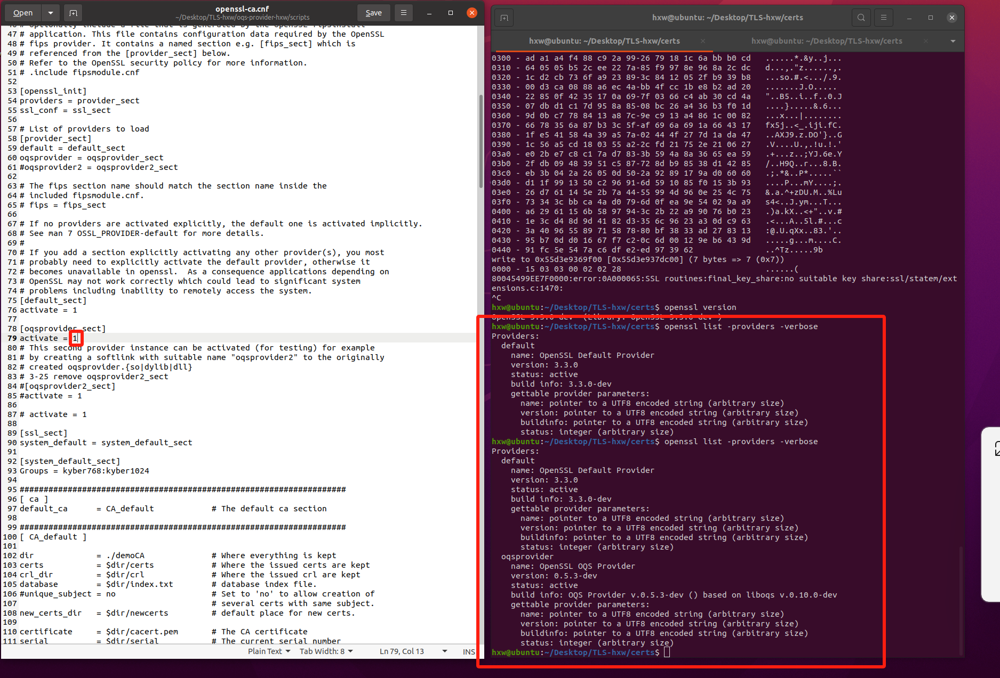


进一步地，修改opnessl-ca.cnf文件，使得优先支持添加的后量子算法。
```bash
[openssl_init]
ssl_conf = ssl_sect

[ssl_sect]
system_default = system_default_sect

[system_default_sect]
Groups = kyber768:kyber1024:ctruprime653
```
'''bash
hxw@ubuntu:~/Desktop/TLS-hxw/benchmark-platform/emulation-exp/code/kex$ sudo ip netns exec cli_ns bash
root@ubuntu:/home/hxw/Desktop/TLS-hxw/benchmark-platform/emulation-exp/code/kex# source /etc/profile
root@ubuntu:/home/hxw/Desktop/TLS-hxw/benchmark-platform/emulation-exp/code/kex# ./s_timer ctruprime653 10
hxw set kex_alg success
hxw set_verify success
[hxw] start do tls handshake
BIO new success
[In kem.c] Try to new ctruprime653
[In OQS_KEM_ctruprime_653_new] start new ctruprime 653
try to connect to ssl
[hxw] start do tls handshake
BIO new success
[In kem.c] Try to new ctruprime653
[In OQS_KEM_ctruprime_653_new] start new ctruprime 653
try to connect to ssl
[hxw] start do tls handshake
BIO new success
[In kem.c] Try to new ctruprime653
[In OQS_KEM_ctruprime_653_new] start new ctruprime 653
try to connect to ssl
[hxw] start do tls handshake
BIO new success
[In kem.c] Try to new ctruprime653
[In OQS_KEM_ctruprime_653_new] start new ctruprime 653
try to connect to ssl
[hxw] start do tls handshake
BIO new success
[In kem.c] Try to new ctruprime653
[In OQS_KEM_ctruprime_653_new] start new ctruprime 653
try to connect to ssl
[hxw] start do tls handshake
BIO new success
[In kem.c] Try to new ctruprime653
[In OQS_KEM_ctruprime_653_new] start new ctruprime 653
try to connect to ssl
[hxw] start do tls handshake
BIO new success
[In kem.c] Try to new ctruprime653
[In OQS_KEM_ctruprime_653_new] start new ctruprime 653
try to connect to ssl
[hxw] start do tls handshake
BIO new success
[In kem.c] Try to new ctruprime653
[In OQS_KEM_ctruprime_653_new] start new ctruprime 653
try to connect to ssl
[hxw] start do tls handshake
BIO new success
[In kem.c] Try to new ctruprime653
[In OQS_KEM_ctruprime_653_new] start new ctruprime 653
try to connect to ssl
[hxw] start do tls handshake
BIO new success
[In kem.c] Try to new ctruprime653
[In OQS_KEM_ctruprime_653_new] start new ctruprime 653
try to connect to ssl
32.329436,24.411342,33.276950,29.356331,28.010750,28.600439,27.900367,27.400522,29.151252,29.639813root@ubuntu:/home/hxw/Desktop/TLS-hxw/benchmark-platform/emulation-exp/code/kex# 

```
成功啦，撒花花！！！
> 总结：40错误是由于服务端的配置造成的，而在nginx中，是无法直接配置服务端支持的kem算法的，这需要使用openssl的conf文件来进行配置(由环境变量中的OPENSSL_CONF来进行指定)

存在的问题是，在liboqs集成的过程中，输出了一些信息，导致了将输出转化为测量值的错误
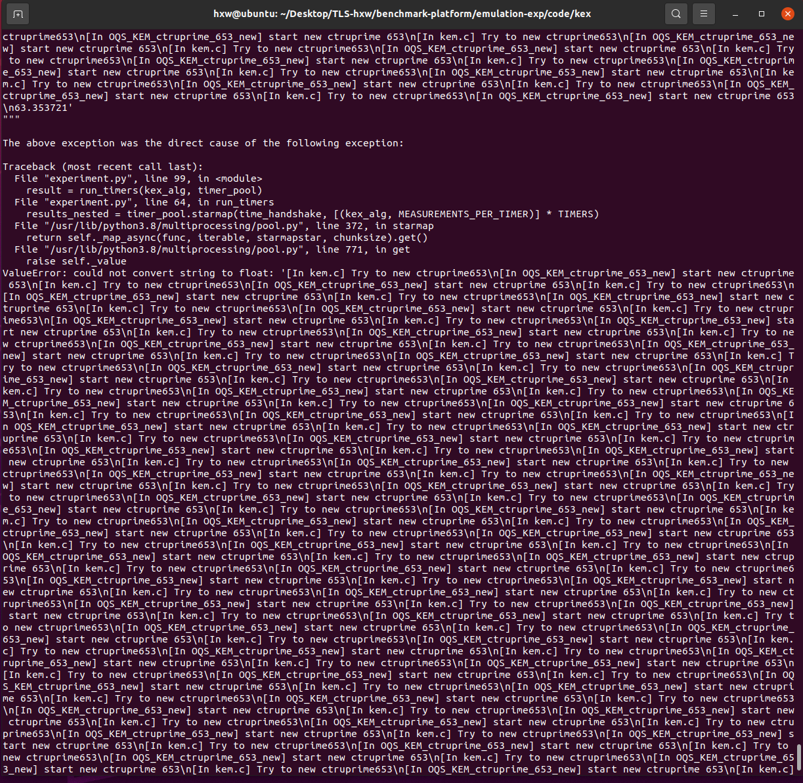