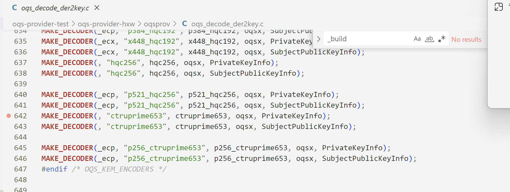

## 2024-2-23
TODO:寻找ssl协议中关于指定协商算法的位置

related-codes\oqs-tls\openssl-master\ssl中存放了tls相关协议的流程

related-codes\oqs-tls\openssl-master\demos\http3展示了一个示例

从handshake入手
bio_ssl.c中给出了诸如ssl_read等的实现函数

在ssl_local.h中，给出了CLIENTHELLO_MSG的相关结构体

``` cpp
typedef struct {
    unsigned int isv2;
    unsigned int legacy_version;
    unsigned char random[SSL3_RANDOM_SIZE];
    size_t session_id_len;
    unsigned char session_id[SSL_MAX_SSL_SESSION_ID_LENGTH];
    size_t dtls_cookie_len;
    unsigned char dtls_cookie[DTLS1_COOKIE_LENGTH];
    PACKET ciphersuites;
    size_t compressions_len;
    unsigned char compressions[MAX_COMPRESSIONS_SIZE];
    PACKET extensions;
    size_t pre_proc_exts_len;
    RAW_EXTENSION *pre_proc_exts;
} CLIENTHELLO_MSG;
```


函数 [SSL_CTX_set_ciphersuites](https://www.openssl.org/docs/manmaster/man3/SSL_CTX_set_ciphersuites.html)和 [SSL_CTX_set_cipher_list](https://www.openssl.org/docs/manmaster/man3/SSL_CTX_set_cipher_list.html)仅仅只是指定了记录层使用到的加密算法的密码套件的类型，而不是kem的

注释掉connect.cnf的第一个配置后，出现如下所示的报错

然后把accept.cnf中的第一个配置也给注释掉


``` bash
hxw@LAPTOP-QFLFNNQO:~/exp/demos/bio$ ./client-conf
Error connecting to server
140042944201344:error:14094410:SSL routines:ssl3_read_bytes:sslv3 alert handshake failure:../ssl/record/rec_layer_s3.c:1543:SSL alert number 40

hxw@LAPTOP-QFLFNNQO:~/exp/demos/bio$ ./server-conf
[Stage 1]
[Stage 2]In for
[Stage 3]In for i=-1
140062391857792:error:14201076:SSL routines:tls_choose_sigalg:no suitable signature algorithm:../ssl/t1_lib.c:2750:
```

尝试修改对应的编译选项，仍然会出现上面的报错

翻阅上述报错在ssl中对应的源码，服务端的看不太懂，客户端的指示存在握手的错误


根据服务端的报错，不支持对应的签名算法，那么看一下非conf版本的代码


在注释掉对于签名算法的要求之后，发现能够使用，但是通过tcpdump无法抓包成功

开始在vm虚拟机上安装wireshark，企图正确抓包并进行分析

在1.更改了系统环境变量2.安装wireshark的情况下，能够抓到正确的包


[对TLS包进行分析的博客](https://blog.csdn.net/simonchi/article/details/107563574)

# 2024-2-25
1.通过配置文件来修改默认的密钥协商方式

[SSL_CONF_cmd](https://www.openssl.org/docs/man3.0/man3/SSL_CONF_cmd.html)重要信息提取：
(1)命令行参数:
-serverpref
Use server and not client preference order when determining which **cipher suite**, **signature algorithm** or **elliptic curve** to use for an incoming connection. 
-sigalgs
用于设置服务端或者客户端支持哪些签名算法
在未设置的情况下，默认为Openssl库支持的所有算法
设置的语法规则:
The algs argument should be a colon separated list of signature algorithms in order of decreasing preference of the form algorithm+hash or signature_scheme. algorithm is one of RSA, DSA or ECDSA and hash is a supported algorithm OID short name such as SHA1, SHA224, SHA256, SHA384 of SHA512. Note: algorithm and hash names are case sensitive. signature_scheme is one of the signature schemes defined in TLSv1.3, specified using the IETF name, e.g., ecdsa_secp256r1_sha256, ed25519, or rsa_pss_pss_sha256.

-groups:
用于决定签名和kex使用的group
Currently supported groups for TLSv1.3 are P-256, P-384, P-521, X25519, X448, ffdhe2048, ffdhe3072, ffdhe4096, ffdhe6144, ffdhe8192.

-ciphersuites:
用于设置TLS1.3的密码套件
[密码套件的格式IANA](https://www.iana.org/assignments/tls-parameters/tls-parameters.xhtml#tls-parameters-4):以冒号分隔(没什么用，仅仅只是列出了一些描述对应的参考文档)

[具体的格式 CIPHER LIST FORMAT](https://www.openssl.org/docs/man3.0/man1/openssl-ciphers.html):
可以使用SHA来代表整个SHA族的算法；可以使用逻辑表达式的形式，+代表逻辑与，!代表非等(例如 openssl ciphers -s -v 'ALL:@SECLEVEL=2' 用于列出所有安全等级为2的密码套件)，来对默认支持的算法列表进行操作


[openssl-ciphers命令](https://www.openssl.org/docs/manmaster/man1/openssl-ciphers.html)
``` bash
hxw@LAPTOP-QFLFNNQO:~/exp$ openssl ciphers -s
TLS_AES_256_GCM_SHA384:TLS_CHACHA20_POLY1305_SHA256:TLS_AES_128_GCM_SHA256:ECDHE-ECDSA-AES256-GCM-SHA384:ECDHE-RSA-AES256-GCM-SHA384:DHE-RSA-AES256-GCM-SHA384:ECDHE-ECDSA-CHACHA20-POLY1305:ECDHE-RSA-CHACHA20-POLY1305:DHE-RSA-CHACHA20-POLY1305:ECDHE-ECDSA-AES128-GCM-SHA256:ECDHE-RSA-AES128-GCM-SHA256:DHE-RSA-AES128-GCM-SHA256:ECDHE-ECDSA-AES256-SHA384:ECDHE-RSA-AES256-SHA384:DHE-RSA-AES256-SHA256:ECDHE-ECDSA-AES128-SHA256:ECDHE-RSA-AES128-SHA256:DHE-RSA-AES128-SHA256:ECDHE-ECDSA-AES256-SHA:ECDHE-RSA-AES256-SHA:DHE-RSA-AES256-SHA:ECDHE-ECDSA-AES128-SHA:ECDHE-RSA-AES128-SHA:DHE-RSA-AES128-SHA:AES256-GCM-SHA384:AES128-GCM-SHA256:AES256-SHA256:AES128-SHA256:AES256-SHA:AES128-SHA

openssl ciphers -ciphersuites TLS_AES_256_GCM_SHA384

```

> 总结:在密码套件中确实指定了kex的方式，但是似乎默认的kex中并没有kem的部分，基本上都是RSA、ECDH之类的这种，具体可以参照openssl-ciphers这个网址

还没找到具体的格式进行对应，还没有显示oqsprovider的作用


> Openssl OID name:prime256v1

(2) 配置文件参数
-Ciphersuites:
TLS1.3支持的参数

-SignatureAlgorithm:
客户端和服务端代表支持的签名算法
The value argument should be a colon separated list of signature algorithms in order of decreasing preference of the form ****algorithm+hash or signature_scheme**. **algorithm is one of RSA, DSA or ECDSA** and **hash is a supported algorithm OID short name such as SHA1, SHA224, SHA256, SHA384 of SHA512**. Note: algorithm and hash names are case sensitive. signature_scheme is one of the signature schemes defined in TLSv1.3, specified using the IETF name, e.g., ecdsa_secp256r1_sha256, ed25519, or rsa_pss_pss_sha256.

>为什么在实验的过程中显示不支持该签名算法呢？

-Groups/Curves
用于设置签名和kex的椭圆曲线组

-VerifyMode
用于设置对于客户端的认证方式

-ClientCAFile ClientCAPath
服务端指定的对于客户端的证书的要求

(3)编程示例
设置支持的签名算法
``` cpp
SSL_CONF_cmd(ctx, "SignatureAlgorithms", "ECDSA+SHA256:RSA+SHA256:DSA+SHA256");
```

> 总结:可以通过配置文件、命令行以及编程的方式来设置最初的handshake过程中需要交换的信息，但是还没有找到一个通用的方式来进行设置

(4) 编程实战
修改支持的签名算法后，观察到wireshark中仅仅支持自己指定的签名算法

但是可能是出于服务端的证书的原因，导致服务端报错无法支持现有的签名算法
同时，并没有相关的证书的信息

观察了csdn上对于某一次交互过程的解析，发现博客上的交互过程和自己截取到的不太一样，不存在证书的交换等过程


2.观察截取的报文
发现里面添加了新的后量子的密码


TODO:去看一下openssl-oqs里面是如何定义对于后量子密码的支持的

[OpenSSL Strategic Architecture](https://www.openssl.org/docs/OpenSSLStrategicArchitecture.html)

[OpenSSL1.1.0中关于后量子密码的支持](https://github.com/open-quantum-safe/openssl/blob/OQS-OpenSSL_1_1_1-stable/README.md)

按照论文里的内容，应该是已经实现了对于后量子密码的支持了的


基于[oqs provider中的示例](https://github.com/open-quantum-safe/oqs-provider/blob/main/USAGE.md#running-a-client-to-interact-with-quantum-safe-kem-algorithms)，尝试使用后量子密码进行交互，但是抓包抓不到，而且似乎密码套件并没有引入诸如kyber等后量子密码的信息

后量子的签名倒是可以找到相关的信息


对于group选项给出一些奇怪的东西，是能够正确识别的，但是在抓包的过程中就是无法正确地进行识别


> TODO:

1.liboqs中的通用密码套件接口是什么？

2.openssl的server命令行中是否真正使用了kyber，论文里基本上都是使用的密码套件的形式来进行，但是这里却仅仅指定了kex

3.代码的server是否对于配置文件中的内容有新的支持？

# 2024-2-26
1.TLS的handshake过程最后是否会发送finished呢？
2.报错40似乎是因为[TLS的报错机制](https://www.rfc-editor.org/rfc/rfc8446#section-6)


3.TLS协议的再学习

在kex阶段之后，后续的阶段都是被加密了的

client hello和Server hello决定了最终的共享密钥，双方的临时密钥应该放在key_share拓展中


serverhello后面的application data应该都是被加密过了的


# 2024-2-27
1.阅读论文 Benchmarking Post-Quantum Cryptography in TLS

TLS进行密钥交换时，会在supported groups中指明自己支持的组，然后在keyshare中给出待交换的值

kem替代TLS一般的密钥交换时，会clienthello替换keyshare为自己的kem公钥，serverhello替换keyshare为使用kem公钥分装后的临时密钥

混合模式下，openssl（修改了ssl目录）会调用libcrypto下的ECDH算法，以及liboqs下的后量子KEM算法


> TODO:oqs-openssl中到底有没有修改ssl目录来支持进行kem密钥交换呢？

2.阅读论文 Prototyping post-quantum and hybrid key exchange and authentication in TLS and SSH

**每个密码套件包含的信息**


liboqs的**通用密码套件**存在的局限:无法适用于真实的场景中

同时，在论文Post-Quantum Key Exchange for the Internet and the Open Quantum Safe Project中，也提到了liboqs的通用密码套件，其指出，通过在编译时确定liboqs支持的套件中的算法内容，可以只修改liboqs而无需修改ssl目录


**在TLS1.3中集成后量子密码:**
两种协商的方式:1.分别协商单独的算法2.作为一个组合来进行协商（第二种方式往往会引起多余的往返延迟）
> Clienthello的shared_key中允许多个公钥的存在，但是Serverhello中仅仅只允许一个

openssl1.1.1通过**supported groups来定义支持的kex方法**，仅后量子的算法是通过新的标识符来进行协商的，而混合模式的算法则是通过没有结构的标识符来进行协商的

但是，在后面却说到TLS1.3中使用的是点菜式的方法来进行混合(从而避免了组合爆炸的问题)


但是，似乎在新的openssl 1.1.1中，为每一个后量子密码都集成了一个新的标识符


**oqs-openssl的后量子kem调用结构:**
原先的DH调用逻辑是在TLS层调用generate key和generate messae API到crypto层。但是由于KEM方案需要标识客户端和服务端，因此oqs不能仅在crypto层提供kem算法，而需要修改TLS层，来将对于后量子密码方案的调用转移到OQS中


**openssl的应用tip:** 使用装配了oqs-openssl的nginx服务器和s_client完成了新的测试


**新的后量子密码套件的集成思路**:首先加入到liboqs中，根据下面的这段话，再加入到liboqs之后，应该便可以直接使用了。


3.论文阅读 [Post-quantum confidentiality for TLS](https://www.imperialviolet.org/2018/04/11/pqconftls.html)

根据下述文字，在TLS1.2中，客户端和服务端先协商需要使用的密码套件，然后服务端选择其中的一个并发送对应的公钥，而客户端将再使用一个消息来完成密钥的交换；然而在TLS1.3中，客户端会先发送完所有支持的后量子公钥，然后服务端再选择其中的一个进行返回

在TLS1.3中，客户端可以先声明自己支持某个算法，然后服务端再发送额外的消息来让客户端发送对应的公钥


> TODO:验证一下是否符合和真实的TLS1.2和TLS1.3协议的交互流程相一致

kem情况下的密钥交换流程


4.论文阅读 Frodo: Take off the Ring! Practical, Quantum-Secure Key Exchange from LWE


# 2024-2-28

TODO:

1.oqs-openssl中到底有没有修改ssl目录来支持进行kem密钥交换呢？

2.tls 1.3是使用组合的方式来完成kex的嘛

3.验证一下是否符合和真实的TLS1.2和TLS1.3协议的交互流程相一致


**TASK1:调研kem的使用方式**
1.使用命令行中的-groups选项
2.使用C API
[ssl_set1_groups_list](https://www.openssl.org/docs/manmaster/man3/SSL_set1_groups_list.html)用于设置服务端或者客户端支持的组
3.使用openssl.cnf文件来进行配置

再次尝试使用官方文档中生成证书并调用openssl s_server的例子

``` bash
hxw@LAPTOP-QFLFNNQO:~/exp$ openssl s_client -groups frodo640shake
Connecting to ::1
CONNECTED(00000003)
depth=0 CN=test server
verify error:num=20:unable to get local issuer certificate
verify return:1
depth=0 CN=test server
verify error:num=21:unable to verify the first certificate
verify return:1
depth=0 CN=test server
verify return:1
---
Certificate chain
 0 s:CN=test server
   i:CN=test CA
   a:PKEY: UNDEF, 192 (bit); sigalg: dilithium3
   v:NotBefore: Feb 28 02:42:37 2024 GMT; NotAfter: Feb 27 02:42:37 2025 GMT
---
Server certificate
-----BEGIN CERTIFICATE-----
MIIVZzCCCHKgAwIBAgIUY0RronV9pPRgsmAkpEJ5017O5NwwDQYLKwYBBAECggsH
BgUwEjEQMA4GA1UEAwwHdGVzdCBDQTAeFw0yNDAyMjgwMjQyMzdaFw0yNTAyMjcw
MjQyMzdaMBYxFDASBgNVBAMMC3Rlc3Qgc2VydmVyMIIHtDANBgsrBgEEAQKCCwcG
BQOCB6EAx4iAhJwJroENfOflFR6N1zrgp5q83RCq80YNDOXCL/WZXMBsFX91Gjzy
EKvR/GDo8HWvW62/c8Tft1u9kfhu1DBUQZmvbqdOGIrHqGhR1I7kTl2YJlHeuUYh
L7JJpiG+Jt/ScgYvXJ3Quje8PECPAkwfVrLsfNES5YrIxFIvVlzzCsl34B8NLoNw
2C4CJAA1Ko1qtl3AtJp0h9qk277/pUdbwFBypfWQp3E6+VVssbUnNLi6SsUYcL56
zdWgM8Eu1PH6Ory83wPGaml4BMdSKbzfQVDyYt79ZY6WI6RcBpRhXqKOyjDAydjw
kju3ahmeAvRpaI+zVLC871enLGsrIl74oXAMMJOFm65Xrdgf0aXvE53o3547IM9O
3W4H38VNRuN4BNHMSvmNp5GdkNhZ3iQSPzwiEd84fP2/XWqBR9hSGFnxQypDUDcs
/RyyRo6iqC9ObsMYq5uZmFI55cu7kZtJxMlWNsnigmgXN8L2v+7TVz2qdHWUPHm4
G8MevjAMR0deX8uejNZfk59phPhdkVB3kzij+LUVwatxeFEVxD3RtA698wxIY3Wr
2hwokuEldup0xsR0TTGgTagBebbftJpISLOA/YlgJiSRPRxiDfYMh6h7kq7AqUZp
bM5geqEhiIxX3ABxLCUrqFIeiLS7mgNWHv9IpBV25mAIuNOSb40qEpAwIuLstuzW
UnFhzWkr5zTr+3m7vmgLz5xYY5m7GiCOdrgKrAHCaKTv7EMgOWoA/5oPQsIXDQhR
uXqAQMf/6UsdXsGqIz8zNppXWn4T0M5f7JB2eaAe2aerpfDB7QGg6AAP9HORILsW
B5s0Hnjy0uoXJ+FEeeEFZFA6xAdYwzRTnC1IiEp+qXqo+SNgHS9fJdz24jmSsivS
Fih3OMoC00aNITUpVbsoLRBgPSoZgNwOnjUWSEJ/HKzW7/0rP7j5rO/2IavgeHX+
3DWFQnKO2vhw6u9gzj+yP/m/qxVD66VOcQw0TLbxnuT+qibGXuWTaUPKhMATrjdh
2OQ/fVpy7qL39hCUhmvMvp2PzfZg5lgpJ7CV2pCNonBx3BwU3wW4yfhz0LQym7eQ
MrKbi0KYzuQWdKiCVOsm1rmN7UAqVCiIWosUshehfyxmdARDnNONU3ealHmo8aWl
ZtWWLpq7Y3CRfICaHSgipStVEbq6znpScrIz8xEMdodhVwYA5Fnlyf2n3pDwJS9Y
i5v6MeTyRRg04t9abbtJPZBEcBjkgxIQWwqlIkJtdsag8sGn8rWRJaM53+bE2Wjs
LmJt8mRJpClKQ29Hg1V2TBkfYMJeQ8Bzt4Ks3htQnHReP0YhcXHoNL858EgLrEuR
7uLI+if4SZwoNFTn/F7ZRjTFQMIAfanqcTXvMzrQVbjdPStkfqhYtaWSFGBM1xCX
rdRk8UlncTTTeTsecclbLBonbk9DRPoY+0T86dodBHNJG00e7ifeuUY3n4DSyDmF
sGPhvUMwHoBEtnPrj0LHmshuh5fIOC6sl6qi2EnlBdWH7XWnor3rnGoX1/gC7NhF
+FdkIp+cu605khA4WihyR6us9MJkRpwAt4X5dFmo3NS0znFOL/95DgZ+t9U1my7i
/8CVhTuMkYwzrwAX4p5nfPXUDdeYgUPDILtkdDyGiXI3vrcBF5oSNA3KSTyDI9a1
hYAAl+ackXkAgjT6yhtYuryVLkR1e/lwJRYXr5H7jLAInyumC15sj0DSyNxypv1D
LaOwSsMKVZP3i2dn3d5tNON9jldzuS9/AtAVpQQD+iz9FQ+bXYUkakcNECp5EhBj
zRBcqaZYejska2uG2Sqr03QzRhh4hWRus5L+gTEuJmu2mmbKCQQ+1v741LI1dKpX
wEhOo8rWDwWL50Z8mCd/h/EchOxmJgXyL2UKsdHIAprFf6UgJLJiCSyL/+KnfQPl
ZRv0CW4DM3esnZCpipxvafcBjHMJ6Ln9fyLwt36fzVQsXQ4sRXaILaf9nHdb5f7u
FYm8YU/CSVFf8solc0wtUxIanvqiyDMOzvVXf0ilZqziUWszKP1ZmbedyN0AfcVQ
Tdeb60GcAJb/Ztn6KbXgrcWazgY9juWOBSsDFytdfhtZNYS+86tGd9A/99XbUws5
IHZS9Wth//BE2v8FmJPB3KC7gzGBPt7Pr7MXkuG6Vja9fIXO4mCZl3VgsL1Odiq6
HShBD1cRHY3zwB/YrYbgqOzCviGd7y6hXQDcQzCoSKBvUOBSIFbjvXdCJmDtFOv1
CnPOn8K5/UpjqdWqfAv6Q/GHSm4VZUGnr7fbEMq+0qUdxVp9Uc5pio3aj53Bb7G2
wkm1xiFV80TKkhNeSwrsXJiUS9UzaLR2YExRSr2ehVAv0L7sCIr9q4O5SmyehLeF
wxRwmzjG663lb6MyGe5V4klNrGPkpehZy+PSmUomBBbAIcHKDUCqzsFLAhBst/dp
rWmUCUeyCheehDUoxfOuqKrBAkDCaxQ5WsESrB8lcrjRFR4Y3yy1i0QGsAR7hmcd
DQj+ESdEpApslmDl7sIF51VXELz0lz6hx0vZSUFkGTodWdMSqFrZon84QDgVlbjR
69keLH57N0PEk7KvVDmmrAQr6ZE0K5gaHR+Y1PEU6xFSc94sVlOjQjBAMB0GA1Ud
DgQWBBSkLgGoID/BSqX/8iSHO49r/XhguDAfBgNVHSMEGDAWgBSy9/QOWcTtL+h9
7sUwLGLtwnUgMDANBgsrBgEEAQKCCwcGBQOCDN4AS8buX93HeXtnBfdXHbwry5ot
LVlWNlb7N5VwOql1MxvHUyet25xzgyflgDMEU+feaPPJ4bSn45vB8gF+dgmnKfRs
RO3zZxZ2vsP0p8ThUnOIfIP4GdS0J/CiLTwgZsBjC53ilQ9sPzZRdEQzbP3xVpYe
PZynTCHxk+2IZ8zo5wFwi4XyBcvHsq7FaUDMtcvEOdJe888UpiHrOHncb0N6VELO
bjsWk5DRjnh4FaZcdHO5zt4Aw+WZN/u/kRvDE/+ZqB5hE+qBCpv+0CMID85Btkfk
/Q3NuJEukVazBYefiuKJRvwMgxrp8pxrrr32O2WuEo7vqThQVK6XBWWasHi52OE8
ITWwzlvM/U/ugHZ4Bz/PdnjBNd7f0KvqxckOJhNC0x3qoE1uGJT0PsnktGYyOSJW
zvn6dtrPHfIEorVt2szopqkPFrp0mJ93V1oAGhnf4B0SnILyJcD+qhJwgBosIwAL
pW+zZA93/jmtzPiRDTKLsvTr5DM+Lks2ZPjdJIDrpfnWqxX7a8u296KSxLyMljOw
GQ6b6VZne+Szpkxz8pNH9DM1j7uffJplMDI4a/to6Kx7GuH/jJTPPcsF5OMWaIex
ErlRjN8qeE832exHexxdnb5fQ4KmFmArTJtlS/VAvOCnvNkW5HVkDJ+D0MM89Sr+
VjfecIsN21/XZi/gF69yqKgvypRCh9nTHIPZFhwR61t+Eg9mvTV8SYJnJtn0jfy0
1bsEThb5EkDKwoISrawPLWBpRMQalUK37qSJe+onPqg6EymGISWxIAa/pPNMnRI8
Sucn08oCnvMY+FFXI/wktFyAFuVbcrkBiDOAqGDgirAls+TWJt4EEvRnhW5uNg6E
QRmETLCgezTYJJrrK8XQ1OgKzPWFPoRZ6aLpa0z00oGrVC8xRSQR/Qaipn7YcRml
2VhVmRaJ5yqgOJme+wr/P/ZC1PrdTelANcni7SpgqBfanZR6JjpmzrZMJRStHSze
hGCvv9FmeY0lvvH/GiOOeD1QoaOkMmgNU77WszjekzikV7fQCi/aAxs8bkXCe6/v
RKk8cdYn6pFnU6mDxeEZwclq9Szd2Lx+lTjRcoqTeFjwiPkR75oisuUV6sP0WfQF
lmgBjNaHE70DYT8LwtbGUz5rvqw6x0nTgGNKRjY63Cc+pzE8AP4zPBuIZqU+kvxk
dp6E0QlASaXy5+nZi7ZOPkyVo7JSqu1dwzIvEe6zy14G7P+onchZQjXMvix9TnMM
Nz/3p5PXlqcMbjwK1sbSDJLR5gm9+Pf8VyqfVIDXG7DYxGLgN72AXxZsNYJfiRPv
TQ5OikPkOoMrPly2Vcm+Plm5+KfSYu92G1nPKbCGqxFszMz/EQMMthMQ0pSBm0dK
O0D+9WDXsBt7w8FCMiGXy+LPlRH7tmWGNlUoweKbEGJiMuwnEkjKC0jNVZdrGwRo
TF1qifZ2Phi77ei2xiGoo0cQsxCxkTTQchB9HQy3A2vZqf1PNR1Ay7pjEemPL7n/
Azris27cbol7CrlORlRmrvZYjqOnEFmpwt/NUMTiP4f4Dh8EZVsMut7t2bwZCdg7
IB0GXszk6snlBMA32ZO5cElHKDh3I56DgKarYJpVTw7mIsS81JnwvDhxfyP5C+ai
8Son2B9XJBI4WK7zQ+SDIu4dnUu/SZTily0guQIRRQPezkIcaX1eNVtoNscnqJSr
/VHO3+inL99fxQAL2ZXxp4l9QvOyITW7xWBXWubzx13pkjdcbJufgzrzVBPqEUqP
bu3yu2oNPLLJ2/V3WCSldmm5ykgpFVnMtGw+gwLkRBK8ngT8amhGqDZn3Amlm2Xj
xFIbifrlPPapkIfiGT7RJ/UMtW/Vb7nxIZiPCPNMzaYwEirNJVg5q4P66Oy8/F3z
goK8FtIbrcHGLNr8uJDYdiEBUpJADfLl9xvK9RoioWNBugcgcEDkGL/vXJl+z/r5
bOKNnG+LtIZLydLOxnRoT9U0FSU3XLcpQz8wn2yAHqyRSmOzk+fc0/KOil3FQjw9
1eHevuoKhl2tFAsYG4OmJx8+LU77R5sW1gSxiPTtUtbNWIkRdljy1sPqt46mPhlE
UM3LZZupCDf8bcK5eeT8h/qTCmz8vvxqCkom5I+Ro7sAH5OXMAQjbmq0Inh6cbLj
aHi/kZhYz7tClAjJcs5WvzCAJO6rnLx9SxlzbhJiexJVYxPd4dlYKIPK7YZtTldv
u1uZYC/kYnksYET4kKuW+rk85SR7VQvzizvow4l/1E8/fcv8qvcJHRjXEuemppol
EABlYFe2neo+j/5gFwaqRxD1zTZAWRQnJ4PC3EeIidxigLnoGdF+oOzfNNc0y3Yt
Af7T4KtEmdYNNl4EI5YiP9I1T2W/EqepMmHMB6UoRPBxX373yDlj8wRKXxS+5Ijt
vQh4C9vyHsBALAq2JK4nDALc9+jszHF6TW9zkzw1mAnQ0ewP03hCPuDSXcJ2fYf9
BXHCOiPBo7q8HKdKB0ap42l4/0rNtiBCAJmNODh4CAcPvI032rIqHid/Z/mdjDLS
YCWg4oSLH9mAtPXxX9l5NEI3Kyp2dvBUDNTkpIBRIyAko4MWalBsGR/wUdMsVTYF
Iudeg9JCEqk9Poxr/qeYK6gPTuRYaeYD4MIjvHj8ofyo3x4cMJ504RS5HFp3cKbu
z55B4Sw3TlUbXnFN1ayHV38c7iHLZPWu5BnKsRrwY1iDhi4tywc9jkK8d9a3UXPi
7GsamMUO8hookjF+fqb8P+0GTKkjaB6PZm52k7MGop7QyxYeMg9hUur4JRO1ZjUF
QPL6eUjspi7ZpHiv9SjI5AYKuZH1XAm7ggU8nxMKfQp4xz49aH9t+X6Zrdj5Xgih
78kvCowNCh0zqb6gcsST7on59XiRYlmiA1+iehlRcA4KPzI8q1aEH4cbbsvswFj3
zDbbPzefP/y8DVIkG3cdzLGGPp2G2TwvmDx+f3dzUzzmP6/hMFh55c2Kihk5xzdU
kADe2CJR6NL3leAf+S6ulikc2I7FXlEyRXS7d2dXex+9TxhhrdtPn5yqGUIFZO3E
S9dSPwWcApFPKHyi6+1MTr8T4GEJxVm5nTmDuimh1B2O8zSyrF2Ul5l5wnFr60/J
vj73LLsqaRWeO7QugwpyPa80ctVlrO9Lbp9CNGXFX51LzwD30ZNXrM+5iph1lToW
I/xP0er2Gq1KOhNX1CpkK/OgihZK9huM6adMy7VoUx0hqQe5uHTLDhB8dtbaP43a
geq2fBAQ8NaCc8amHTU51N2qYbBkMr55Uk6yQBrEcVyYClIITvLtuM/fWmggKVVH
vMDosbDgBHei6rmpwGIgz+v5SbCckyb0PdzzaNbU/ip6AfPw1ACqgaN0lOrQTPp0
YZkmUCtTekBUkO0rcikiu4ZqDfwe2Jb15g+EK9OP4Zo7aanYS5XCOCLZvg7S2ZRo
RRlNXcsImEDOHA9NHqGhf1M/FKIsEqzTarvyFAoBJzbNi/kjm5IW5nineH8nxxxx
/pEcbHobsPlpDoiG1P5Jn/EkbyM4nT80kaVet4TX2PbiYhgY07FXSXqeKR5V3Q3L
dOgMW5YvCnDzrtnXykaEGBSzFDaYnoV73PpddDdVCYK1863kRaMvzFTx1anjt71B
5+ebAEkaGSmeunSDpy2yPfIcsjJCf8nlBzil2hcZDaFUhpN3A0Wvc/d5Qqn9a/7r
cRZtkyjDjSLTlEuGNtfCN063QpkuH6m7fIYQ6kHVZU0vfCSPX+HNYBT4UmSsrDxX
9VZjp+Luwxk4EAZA1FK7SGdg+R/R/nR415EeWDaNQfOekzOMPYf5A5P2m0v4tKdo
zUCLiwFKWudoMQSkmG+xbmQPeOQSwKiwX7l6398xhDdJnXhCUrlG3QgIcr5YnVsQ
wEFRi25U1wKLVjRGGsiCiSviPRZY6xdygKA+TbuUCQxDDY3vJUKST1226jfUP/6n
1aUT1FGdRVpWa34Q0t2395xWN3+N+2Wlt3pqsZIwhcEO1jjwvcHqgIkJIXpDhCea
Cvf8Wm8r5mk1FAxaJA8B2ZnskjT7ymGTzhWfxnLCOIVpxKiJagWtOgV4hPU0U/7S
Y4ludC9+GU5YbL1o6EBnYYh+dJypg+soi268FgabPev2hm1PSWVt6Lenfxc889lZ
XabMr3tMdaMtqKXCDzze6fquu5WBhpd0iXaflhCSNQ4kIPInQsF3lMAPr/fF5l8T
rmDVQUUFpDcAiyD5Y/1IrbnDVx/AWqNkewWtj2jx3f8uYF3k3q01pWGLfE1/nUXX
Xm6V4pCBW9aizifC11Tesl1tjL/P5rn7Ek8lfBEs49kYFXsD6EOJ27GJjH6NF66y
CjE6PEFPWnGJztAFBxgaKj6JjavyAEBGYnOfvdTW6SNCdKLg4/UABClHYW2os7oA
AAAAAAACDRchKDE=
-----END CERTIFICATE-----
subject=CN=test server
issuer=CN=test CA
---
No client certificate CA names sent
**Peer signature type: dilithium3**
---
SSL handshake has read 18774 bytes and written 10001 bytes
**Verification error: unable to verify the first certificate**
---
New, TLSv1.3, Cipher is **TLS_AES_256_GCM_SHA384**
Server public key is 192 bit
This TLS version forbids renegotiation.
Compression: NONE
Expansion: NONE
No ALPN negotiated
Early data was not sent
Verify return code: 21 (unable to verify the first certificate)
---
---
Post-Handshake New Session Ticket arrived:
SSL-Session:
    Protocol  : TLSv1.3
    Cipher    : TLS_AES_256_GCM_SHA384
    Session-ID: A923167F90203A4488998EFC3BA95C40F1E465ED41FD189A6EEF5F24D9D4700D
    Session-ID-ctx: 
    Resumption PSK: 4967084FC519A21F95E5D8EEF8454D48C7668C78FD8A48CD1293C48228133510E6969E693DC4D67FFB7E167E8CE0F87B
    PSK identity: None
    PSK identity hint: None
    SRP username: None
    TLS session ticket lifetime hint: 7200 (seconds)
    TLS session ticket:
    0000 - b4 c3 00 08 4c 40 e6 e7-d5 82 c3 92 a1 f4 65 8a   ....L@........e.
    0010 - e1 67 6d dd 91 82 fa 4d-a1 39 b6 54 c6 8d 93 66   .gm....M.9.T...f
    0020 - 64 01 98 0d 54 57 78 67-43 7e 63 f2 4a 96 56 0b   d...TWxgC~c.J.V.
    0030 - 60 79 53 2a ef 7a ab 2d-f8 ae e3 33 bb 38 ed aa   `yS*.z.-...3.8..
    0040 - cb 09 4f d3 a5 5f c4 c6-22 8d 40 40 82 2d 91 ac   ..O.._..".@@.-..
    0050 - 26 99 59 78 bc ec 17 80-ca c7 c5 02 bb 8a 3b 21   &.Yx..........;!
    0060 - 8b 35 d8 1d af a4 97 f3-44 bf cf f1 16 66 84 59   .5......D....f.Y
    0070 - c8 8c 26 7b 99 34 20 90-f5 82 62 42 08 c4 a8 cc   ..&{.4 ...bB....
    0080 - aa bd ef a5 d0 74 6a 92-18 d6 5d d8 04 39 52 ef   .....tj...]..9R.
    0090 - b2 74 a1 09 7e 73 41 22-39 ea 12 db a1 4b 43 51   .t..~sA"9....KCQ
    00a0 - 5c da bb 82 2a bf 37 db-e4 85 ab 01 70 01 6c 98   \...*.7.....p.l.
    00b0 - c1 1f 67 ab bf fc b3 53-d7 30 43 4d a1 2d 82 f1   ..g....S.0CM.-..
    00c0 - 46 cf 25 59 8d 9a f2 e5-14 fd 2d 28 10 6a 83 ca   F.%Y......-(.j..

    Start Time: 1709088201
    Timeout   : 7200 (sec)
    Verify return code: 21 (unable to verify the first certificate)
    Extended master secret: no
    Max Early Data: 0
---
read R BLOCK
---
Post-Handshake New Session Ticket arrived:
SSL-Session:
    Protocol  : TLSv1.3
    Cipher    : TLS_AES_256_GCM_SHA384
    Session-ID: 366F83D7AD98813ADE274F2FD8E113B9E27A3F2662577D93862FC84F33E93E48
    Session-ID-ctx: 
    Resumption PSK: C5B3D5AAE06A4948A3C0B3BA4EB7804A59CE9A884A50322270FFBC38C57385E1BA34A27E3AD3B02DE92D0482B51783D5
    PSK identity: None
    PSK identity hint: None
    SRP username: None
    TLS session ticket lifetime hint: 7200 (seconds)
    TLS session ticket:
    0000 - b4 c3 00 08 4c 40 e6 e7-d5 82 c3 92 a1 f4 65 8a   ....L@........e.
    0010 - f1 98 8c 04 3e 06 a2 1b-e7 1b 2c a3 69 db c7 9d   ....>.....,.i...
    0020 - bc ee ab 19 ed 9e 93 30-fc 72 3a fa 0d c0 3a 7b   .......0.r:...:{
    0030 - a1 2c e0 f8 88 d7 6f d4-2c 09 95 02 a7 99 dc 67   .,....o.,......g
    0040 - 1d 22 08 30 a8 e3 70 94-b0 40 78 22 83 44 1e 49   .".0..p..@x".D.I
    0050 - df 5c 67 30 7b c6 d7 5d-10 39 d4 27 bb 0a 1d 17   .\g0{..].9.'....
    0060 - 28 1c 8f f2 61 27 19 fc-f4 3c ca 8c 7f 81 4b c0   (...a'...<....K.
    0070 - 76 92 b1 c1 39 0b 88 ac-c4 ca 06 83 ee 4a 51 a2   v...9........JQ.
    0080 - f9 39 68 7c 9d 2e f0 c4-c3 60 98 73 cc 7d da ef   .9h|.....`.s.}..
    0090 - 80 82 dc 75 4a 6a 94 d1-37 f9 72 3b 21 f2 00 50   ...uJj..7.r;!..P
    00a0 - a6 de ca a8 76 5a 72 67-16 aa 1a 12 ac a0 9a 5a   ....vZrg.......Z
    00b0 - 0d 14 31 2d f1 5f a6 38-a1 bb ed fd dd ec 9d 5f   ..1-._.8......._
    00c0 - 9d 41 c1 93 4b 22 21 ac-d4 18 c2 d0 36 9a af 53   .A..K"!.....6..S

    Start Time: 1709088201
    Timeout   : 7200 (sec)
    Verify return code: 21 (unable to verify the first certificate)
    Extended master secret: no
    Max Early Data: 0
---
read R BLOCK
GET /
HTTP/1.0 200 ok
Content-type: text/html

<HTML><BODY BGCOLOR="#ffffff">
<pre>

s_server -cert dilithium3_srv.crt -key dilithium3_srv.key -www -tls1_3 -groups kyber768:frodo640shake 
This TLS version forbids renegotiation.

服务端支持的密码套件
Ciphers supported in s_server binary
TLSv1.3    :TLS_AES_256_GCM_SHA384    TLSv1.3    :TLS_CHACHA20_POLY1305_SHA256 
TLSv1.3    :TLS_AES_128_GCM_SHA256    TLSv1.2    :ECDHE-ECDSA-AES256-GCM-SHA384 
TLSv1.2    :ECDHE-RSA-AES256-GCM-SHA384 TLSv1.2    :DHE-RSA-AES256-GCM-SHA384 
TLSv1.2    :ECDHE-ECDSA-CHACHA20-POLY1305 TLSv1.2    :ECDHE-RSA-CHACHA20-POLY1305 
TLSv1.2    :DHE-RSA-CHACHA20-POLY1305 TLSv1.2    :ECDHE-ECDSA-AES128-GCM-SHA256 
TLSv1.2    :ECDHE-RSA-AES128-GCM-SHA256 TLSv1.2    :DHE-RSA-AES128-GCM-SHA256 
TLSv1.2    :ECDHE-ECDSA-AES256-SHA384 TLSv1.2    :ECDHE-RSA-AES256-SHA384   
TLSv1.2    :DHE-RSA-AES256-SHA256     TLSv1.2    :ECDHE-ECDSA-AES128-SHA256 
TLSv1.2    :ECDHE-RSA-AES128-SHA256   TLSv1.2    :DHE-RSA-AES128-SHA256     
TLSv1.0    :ECDHE-ECDSA-AES256-SHA    TLSv1.0    :ECDHE-RSA-AES256-SHA      
SSLv3      :DHE-RSA-AES256-SHA        TLSv1.0    :ECDHE-ECDSA-AES128-SHA    
TLSv1.0    :ECDHE-RSA-AES128-SHA      SSLv3      :DHE-RSA-AES128-SHA        
TLSv1.2    :RSA-PSK-AES256-GCM-SHA384 TLSv1.2    :DHE-PSK-AES256-GCM-SHA384 
TLSv1.2    :RSA-PSK-CHACHA20-POLY1305 TLSv1.2    :DHE-PSK-CHACHA20-POLY1305 
TLSv1.2    :ECDHE-PSK-CHACHA20-POLY1305 TLSv1.2    :AES256-GCM-SHA384         
TLSv1.2    :PSK-AES256-GCM-SHA384     TLSv1.2    :PSK-CHACHA20-POLY1305     
TLSv1.2    :RSA-PSK-AES128-GCM-SHA256 TLSv1.2    :DHE-PSK-AES128-GCM-SHA256 
TLSv1.2    :AES128-GCM-SHA256         TLSv1.2    :PSK-AES128-GCM-SHA256     
TLSv1.2    :AES256-SHA256             TLSv1.2    :AES128-SHA256             
TLSv1.0    :ECDHE-PSK-AES256-CBC-SHA384 TLSv1.0    :ECDHE-PSK-AES256-CBC-SHA  
SSLv3      :SRP-RSA-AES-256-CBC-SHA   SSLv3      :SRP-AES-256-CBC-SHA       
TLSv1.0    :RSA-PSK-AES256-CBC-SHA384 TLSv1.0    :DHE-PSK-AES256-CBC-SHA384 
SSLv3      :RSA-PSK-AES256-CBC-SHA    SSLv3      :DHE-PSK-AES256-CBC-SHA    
SSLv3      :AES256-SHA                TLSv1.0    :PSK-AES256-CBC-SHA384     
SSLv3      :PSK-AES256-CBC-SHA        TLSv1.0    :ECDHE-PSK-AES128-CBC-SHA256 
TLSv1.0    :ECDHE-PSK-AES128-CBC-SHA  SSLv3      :SRP-RSA-AES-128-CBC-SHA   
SSLv3      :SRP-AES-128-CBC-SHA       TLSv1.0    :RSA-PSK-AES128-CBC-SHA256 
TLSv1.0    :DHE-PSK-AES128-CBC-SHA256 SSLv3      :RSA-PSK-AES128-CBC-SHA    
SSLv3      :DHE-PSK-AES128-CBC-SHA    SSLv3      :AES128-SHA                
TLSv1.0    :PSK-AES128-CBC-SHA256     SSLv3      :PSK-AES128-CBC-SHA        
---
双方共同支持的密码套件
Ciphers common between both SSL end points:
TLS_AES_256_GCM_SHA384     TLS_CHACHA20_POLY1305_SHA256 TLS_AES_128_GCM_SHA256    
ECDHE-ECDSA-AES256-GCM-SHA384 ECDHE-RSA-AES256-GCM-SHA384 DHE-RSA-AES256-GCM-SHA384 
ECDHE-ECDSA-CHACHA20-POLY1305 ECDHE-RSA-CHACHA20-POLY1305 DHE-RSA-CHACHA20-POLY1305 
ECDHE-ECDSA-AES128-GCM-SHA256 ECDHE-RSA-AES128-GCM-SHA256 DHE-RSA-AES128-GCM-SHA256 
ECDHE-ECDSA-AES256-SHA384  ECDHE-RSA-AES256-SHA384    DHE-RSA-AES256-SHA256     
ECDHE-ECDSA-AES128-SHA256  ECDHE-RSA-AES128-SHA256    DHE-RSA-AES128-SHA256     
ECDHE-ECDSA-AES256-SHA     ECDHE-RSA-AES256-SHA       DHE-RSA-AES256-SHA        
ECDHE-ECDSA-AES128-SHA     ECDHE-RSA-AES128-SHA       DHE-RSA-AES128-SHA        
AES256-GCM-SHA384          AES128-GCM-SHA256          AES256-SHA256             
AES128-SHA256              AES256-SHA                 AES128-SHA
支持的签名算法:
Signature Algorithms: ECDSA+SHA256:ECDSA+SHA384:ECDSA+SHA512:Ed25519:Ed448:ECDSA+SHA256:ECDSA+SHA384:ECDSA+SHA512:RSA-PSS+SHA256:RSA-PSS+SHA384:RSA-PSS+SHA512:RSA-PSS+SHA256:RSA-PSS+SHA384:RSA-PSS+SHA512:RSA+SHA256:RSA+SHA384:RSA+SHA512:ECDSA+SHA224:RSA+SHA224:DSA+SHA224:DSA+SHA256:DSA+SHA384:DSA+SHA512:dilithium2:p256_dilithium2:rsa3072_dilithium2:dilithium3:p384_dilithium3:dilithium5:p521_dilithium5:falcon512:p256_falcon512:rsa3072_falcon512:falcon1024:p521_falcon1024:sphincssha2128fsimple:p256_sphincssha2128fsimple:rsa3072_sphincssha2128fsimple:sphincssha2128ssimple:p256_sphincssha2128ssimple:rsa3072_sphincssha2128ssimple:sphincssha2192fsimple:p384_sphincssha2192fsimple:sphincsshake128fsimple:p256_sphincsshake128fsimple:rsa3072_sphincsshake128fsimple
双方共同支持的签名算法:
Shared Signature Algorithms: ECDSA+SHA256:ECDSA+SHA384:ECDSA+SHA512:Ed25519:Ed448:ECDSA+SHA256:ECDSA+SHA384:ECDSA+SHA512:RSA-PSS+SHA256:RSA-PSS+SHA384:RSA-PSS+SHA512:RSA-PSS+SHA256:RSA-PSS+SHA384:RSA-PSS+SHA512:RSA+SHA256:RSA+SHA384:RSA+SHA512:ECDSA+SHA224:RSA+SHA224:dilithium2:p256_dilithium2:rsa3072_dilithium2:dilithium3:p384_dilithium3:dilithium5:p521_dilithium5:falcon512:p256_falcon512:rsa3072_falcon512:falcon1024:p521_falcon1024:sphincssha2128fsimple:p256_sphincssha2128fsimple:rsa3072_sphincssha2128fsimple:sphincssha2128ssimple:p256_sphincssha2128ssimple:rsa3072_sphincssha2128ssimple:sphincssha2192fsimple:p384_sphincssha2192fsimple:sphincsshake128fsimple:p256_sphincsshake128fsimple:rsa3072_sphincsshake128fsimple
**支持的kex方法:
Supported groups: frodo640shake
双方共同支持的kex方法：
Shared groups: frodo640shake** 
注意:当将客户端支持的算法换成kyber768之后，这里会变成对应的kyber768
---
New, TLSv1.3, Cipher is TLS_AES_256_GCM_SHA384
SSL-Session:
    Protocol  : TLSv1.3
    Cipher    : TLS_AES_256_GCM_SHA384
    Session-ID: A608866A89EEDE7710B91AD476CC61D2E986ABAEAFA5CEB361C946A19FBFC23C
    Session-ID-ctx: 01000000
    Resumption PSK: C5B3D5AAE06A4948A3C0B3BA4EB7804A59CE9A884A50322270FFBC38C57385E1BA34A27E3AD3B02DE92D0482B51783D5
    PSK identity: None
    PSK identity hint: None
    SRP username: None
    Start Time: 1709088201
    Timeout   : 7200 (sec)
    Verify return code: 0 (ok)
    Extended master secret: no
    Max Early Data: 0
---
   0 items in the session cache
   0 client connects (SSL_connect())
   0 client renegotiates (SSL_connect())
   0 client connects that finished
   1 server accepts (SSL_accept())
   0 server renegotiates (SSL_accept())
   1 server accepts that finished
   0 session cache hits
   0 session cache misses
   0 session cache timeouts
   0 callback cache hits
   0 cache full overflows (128 allowed)
---
no client certificate available
</pre></BODY></HTML>

closed
```

尝试在命令行使用ctruprime653

客户端的情况如下:
``` bash
hxw@LAPTOP-QFLFNNQO:~/exp$ openssl s_client -groups ctruprime653
Connecting to ::1
CONNECTED(00000003)
[In kem.c] Try to new ctruprime653
[In OQS_KEM_ctruprime_653_new] start new ctruprime 653
1
2
3
[In OQS_KEM_ctruprime_653_new] new ctruprime 653 success,start return!
80B4AE63E37F0000:error:0A000119:SSL routines:tls_get_more_records:decryption failed or bad record mac:ssl/record/methods/tls_common.c:858:
80B4AE63E37F0000:error:0A000139:SSL routines::record layer failure:ssl/record/rec_layer_s3.c:643:
---
no peer certificate available
---
No client certificate CA names sent
---
SSL handshake has read 1039 bytes and written 1306 bytes
Verification: OK
---
New, TLSv1.3, Cipher is TLS_AES_256_GCM_SHA384
This TLS version forbids renegotiation.
Compression: NONE
Expansion: NONE
No ALPN negotiated
Early data was not sent
Verify return code: 0 (ok)
---
hxw@LAPTOP-QFLFNNQO:~/exp$ openssl s_client -groups ctrupri
Call to SSL_CONF_cmd(-groups, ctrupri) failed
802420A4DA7F0000:error:0A080106:SSL routines:gid_cb:passed invalid argument:ssl/t1_lib.c:1065:group 'ctrupri' cannot be set
```
服务端的情况如下:
```bash
hxw@LAPTOP-QFLFNNQO:~/exp$ openssl s_client -groups ctruprime653
Connecting to ::1
CONNECTED(00000003)
[In kem.c] Try to new ctruprime653
[In OQS_KEM_ctruprime_653_new] start new ctruprime 653
1
2
3
[In OQS_KEM_ctruprime_653_new] new ctruprime 653 success,start return!
80B4AE63E37F0000:error:0A000119:SSL routines:tls_get_more_records:decryption failed or bad record mac:ssl/record/methods/tls_common.c:858:
80B4AE63E37F0000:error:0A000139:SSL routines::record layer failure:ssl/record/rec_layer_s3.c:643:
---
no peer certificate available
---
No client certificate CA names sent
---
SSL handshake has read 1039 bytes and written 1306 bytes
Verification: OK
---
New, TLSv1.3, Cipher is TLS_AES_256_GCM_SHA384
This TLS version forbids renegotiation.
Compression: NONE
Expansion: NONE
No ALPN negotiated
Early data was not sent
Verify return code: 0 (ok)
---
hxw@LAPTOP-QFLFNNQO:~/exp$ openssl s_client -groups ctrupri
Call to SSL_CONF_cmd(-groups, ctrupri) failed
802420A4DA7F0000:error:0A080106:SSL routines:gid_cb:passed invalid argument:ssl/t1_lib.c:1065:group 'ctrupri' cannot be set
```
> 能够识别出ctruprime653，但是却报错mac认证错误。猜测可能是因为ctruprime653的协商出的密钥有问题导致的，因为在调用openssl的kem测试过程中，总是说ctruprime653的测试结果是失败的。所以现在的思路是，确认进行了ctruprime653的协商即可。那么需要寻找能够记录整个协商过程的方式。

尝试使用**sslkeylog**来记录整个过程中使用到的密钥，通过添加SSLKEYLOGFILE环境变量的方式，但是最终并没有输出相应的结果。

[sslkeylog的介绍网址](https://sslkeylog.readthedocs.io/en/latest/index.html)指出，sslkeylog要配合浏览器进行使用，因此可能无法真正得到密钥协商的结果


尝试使用tcpdump来进行抓包，使用下述命令能够记录得到正确抓取的结果
``` bash
sudo tcpdump -i lo -s 0 -w tls13_handshake2.pcap 'tcp port 4433'
```
将抓取形成的pcap文件拷贝到本地主机中，然后使用wireshark查看


对比正常交互过程中的结果
对于frodo640shake,在client hello的key share的拓展中，公钥的长度和声称的是一致的

对于ctruprime653,在client hello的key_share的拓展中，也是一致的


对于ctruprime653,在server hello的key_share的拓展中，也是一致的


目前猜测完成了正确的kex，存在的问题可能是最终得到的kem结果是不一样的

因此，下面再调用liboqs中的内容重新进行测试


在多次的测试结果中，发现最终共享密钥总是不相等，猜测是因为长度的问题

现在的想法是，重新编译一边liboqs，然后进行安装

#### 修改liboqs


在wsl虚拟机上重新安装liboqs,出现如下所示的报错
``` bash
[1186/1216] Linking C executable tests/test_aes
FAILED: tests/test_aes 
: && /usr/bin/cc   -Wl,-z,noexecstack src/common/sha3/xkcp_low/CMakeFiles/xkcp_low_keccakp_1600_plain64.dir/KeccakP-1600/plain-64bits/KeccakP-1600-opt64.c.o src/common/sha3/xkcp_low/CMakeFiles/xkcp_low_keccakp_1600times4_serial.dir/KeccakP-1600times4/serial/KeccakP-1600-times4-on1.c.o src/common/sha3/xkcp_low/CMakeFiles/xkcp_low_keccakp_1600_avx2.dir/KeccakP-1600/avx2/KeccakP-1600-AVX2.S.o src/common/sha3/xkcp_low/CMakeFiles/xkcp_low_keccakp_1600times4_avx2.dir/KeccakP-1600times4/avx2/KeccakP-1600-times4-SIMD256.c.o src/common/CMakeFiles/common.dir/aes/aes.c.o src/common/CMakeFiles/common.dir/aes/aes_c.c.o src/common/CMakeFiles/common.dir/aes/aes128_ni.c.o src/common/CMakeFiles/common.dir/aes/aes256_ni.c.o src/common/CMakeFiles/common.dir/sha2/sha2_ossl.c.o src/common/CMakeFiles/common.dir/sha3/xkcp_sha3.c.o src/common/CMakeFiles/common.dir/sha3/xkcp_sha3x4.c.o src/common/CMakeFiles/common.dir/ossl_helpers.c.o src/common/CMakeFiles/common.dir/common.c.o src/common/CMakeFiles/common.dir/pqclean_shims/nistseedexpander.c.o src/common/CMakeFiles/common.dir/pqclean_shims/fips202.c.o src/common/CMakeFiles/common.dir/pqclean_shims/fips202x4.c.o src/common/CMakeFiles/common.dir/rand/rand.c.o src/common/CMakeFiles/common.dir/rand/rand_nist.c.o tests/CMakeFiles/test_aes.dir/test_aes.c.o  -o tests/test_aes  /usr/lib/x86_64-linux-gnu/libcrypto.so  -lm  -pthread && :
/usr/bin/ld: src/common/CMakeFiles/common.dir/ossl_helpers.c.o: in function `oqs_fetch_ossl_objects':
ossl_helpers.c:(.text.oqs_fetch_ossl_objects+0x14): undefined reference to `EVP_MD_fetch'
/usr/bin/ld: ossl_helpers.c:(.text.oqs_fetch_ossl_objects+0x2b): undefined reference to `EVP_MD_fetch'
/usr/bin/ld: ossl_helpers.c:(.text.oqs_fetch_ossl_objects+0x42): undefined reference to `EVP_MD_fetch'
/usr/bin/ld: ossl_helpers.c:(.text.oqs_fetch_ossl_objects+0x59): undefined reference to `EVP_MD_fetch'
/usr/bin/ld: ossl_helpers.c:(.text.oqs_fetch_ossl_objects+0x70): undefined reference to `EVP_MD_fetch'
/usr/bin/ld: src/common/CMakeFiles/common.dir/ossl_helpers.c.o:ossl_helpers.c:(.text.oqs_fetch_ossl_objects+0x87): more undefined references to `EVP_MD_fetch' follow
/usr/bin/ld: src/common/CMakeFiles/common.dir/ossl_helpers.c.o: in function `oqs_fetch_ossl_objects':
ossl_helpers.c:(.text.oqs_fetch_ossl_objects+0xcc): undefined reference to `EVP_CIPHER_fetch'
/usr/bin/ld: ossl_helpers.c:(.text.oqs_fetch_ossl_objects+0xe3): undefined reference to `EVP_CIPHER_fetch'
/usr/bin/ld: ossl_helpers.c:(.text.oqs_fetch_ossl_objects+0xfa): undefined reference to `EVP_CIPHER_fetch'
/usr/bin/ld: src/common/CMakeFiles/common.dir/ossl_helpers.c.o: in function `oqs_free_ossl_objects':
ossl_helpers.c:(.text.oqs_free_ossl_objects+0x10): undefined reference to `EVP_MD_free'
/usr/bin/ld: ossl_helpers.c:(.text.oqs_free_ossl_objects+0x1c): undefined reference to `EVP_MD_free'
/usr/bin/ld: ossl_helpers.c:(.text.oqs_free_ossl_objects+0x28): undefined reference to `EVP_MD_free'
/usr/bin/ld: ossl_helpers.c:(.text.oqs_free_ossl_objects+0x34): undefined reference to `EVP_MD_free'
/usr/bin/ld: ossl_helpers.c:(.text.oqs_free_ossl_objects+0x40): undefined reference to `EVP_MD_free'
/usr/bin/ld: src/common/CMakeFiles/common.dir/ossl_helpers.c.o:ossl_helpers.c:(.text.oqs_free_ossl_objects+0x4c): more undefined references to `EVP_MD_free' follow
/usr/bin/ld: src/common/CMakeFiles/common.dir/ossl_helpers.c.o: in function `oqs_free_ossl_objects':
ossl_helpers.c:(.text.oqs_free_ossl_objects+0x70): undefined reference to `EVP_CIPHER_free'
/usr/bin/ld: ossl_helpers.c:(.text.oqs_free_ossl_objects+0x7c): undefined reference to `EVP_CIPHER_free'
/usr/bin/ld: ossl_helpers.c:(.text.oqs_free_ossl_objects+0x8c): undefined reference to `EVP_CIPHER_free'
collect2: error: ld returned 1 exit status
[1191/1216] Linking C executable tests/test_hash
FAILED: tests/test_hash 
: && /usr/bin/cc   -Wl,-z,noexecstack src/common/sha3/xkcp_low/CMakeFiles/xkcp_low_keccakp_1600_plain64.dir/KeccakP-1600/plain-64bits/KeccakP-1600-opt64.c.o src/common/sha3/xkcp_low/CMakeFiles/xkcp_low_keccakp_1600times4_serial.dir/KeccakP-1600times4/serial/KeccakP-1600-times4-on1.c.o src/common/sha3/xkcp_low/CMakeFiles/xkcp_low_keccakp_1600_avx2.dir/KeccakP-1600/avx2/KeccakP-1600-AVX2.S.o src/common/sha3/xkcp_low/CMakeFiles/xkcp_low_keccakp_1600times4_avx2.dir/KeccakP-1600times4/avx2/KeccakP-1600-times4-SIMD256.c.o src/common/CMakeFiles/common.dir/aes/aes.c.o src/common/CMakeFiles/common.dir/aes/aes_c.c.o src/common/CMakeFiles/common.dir/aes/aes128_ni.c.o src/common/CMakeFiles/common.dir/aes/aes256_ni.c.o src/common/CMakeFiles/common.dir/sha2/sha2_ossl.c.o src/common/CMakeFiles/common.dir/sha3/xkcp_sha3.c.o src/common/CMakeFiles/common.dir/sha3/xkcp_sha3x4.c.o src/common/CMakeFiles/common.dir/ossl_helpers.c.o src/common/CMakeFiles/common.dir/common.c.o src/common/CMakeFiles/common.dir/pqclean_shims/nistseedexpander.c.o src/common/CMakeFiles/common.dir/pqclean_shims/fips202.c.o src/common/CMakeFiles/common.dir/pqclean_shims/fips202x4.c.o src/common/CMakeFiles/common.dir/rand/rand.c.o src/common/CMakeFiles/common.dir/rand/rand_nist.c.o tests/CMakeFiles/test_hash.dir/test_hash.c.o  -o tests/test_hash  /usr/lib/x86_64-linux-gnu/libcrypto.so  -lm  -pthread && :
/usr/bin/ld: src/common/CMakeFiles/common.dir/ossl_helpers.c.o: in function `oqs_fetch_ossl_objects':
ossl_helpers.c:(.text.oqs_fetch_ossl_objects+0x14): undefined reference to `EVP_MD_fetch'
/usr/bin/ld: ossl_helpers.c:(.text.oqs_fetch_ossl_objects+0x2b): undefined reference to `EVP_MD_fetch'
/usr/bin/ld: ossl_helpers.c:(.text.oqs_fetch_ossl_objects+0x42): undefined reference to `EVP_MD_fetch'
/usr/bin/ld: ossl_helpers.c:(.text.oqs_fetch_ossl_objects+0x59): undefined reference to `EVP_MD_fetch'
/usr/bin/ld: ossl_helpers.c:(.text.oqs_fetch_ossl_objects+0x70): undefined reference to `EVP_MD_fetch'
/usr/bin/ld: src/common/CMakeFiles/common.dir/ossl_helpers.c.o:ossl_helpers.c:(.text.oqs_fetch_ossl_objects+0x87): more undefined references to `EVP_MD_fetch' follow
/usr/bin/ld: src/common/CMakeFiles/common.dir/ossl_helpers.c.o: in function `oqs_fetch_ossl_objects':
ossl_helpers.c:(.text.oqs_fetch_ossl_objects+0xcc): undefined reference to `EVP_CIPHER_fetch'
/usr/bin/ld: ossl_helpers.c:(.text.oqs_fetch_ossl_objects+0xe3): undefined reference to `EVP_CIPHER_fetch'
/usr/bin/ld: ossl_helpers.c:(.text.oqs_fetch_ossl_objects+0xfa): undefined reference to `EVP_CIPHER_fetch'
/usr/bin/ld: src/common/CMakeFiles/common.dir/ossl_helpers.c.o: in function `oqs_free_ossl_objects':
ossl_helpers.c:(.text.oqs_free_ossl_objects+0x10): undefined reference to `EVP_MD_free'
/usr/bin/ld: ossl_helpers.c:(.text.oqs_free_ossl_objects+0x1c): undefined reference to `EVP_MD_free'
/usr/bin/ld: ossl_helpers.c:(.text.oqs_free_ossl_objects+0x28): undefined reference to `EVP_MD_free'
/usr/bin/ld: ossl_helpers.c:(.text.oqs_free_ossl_objects+0x34): undefined reference to `EVP_MD_free'
/usr/bin/ld: ossl_helpers.c:(.text.oqs_free_ossl_objects+0x40): undefined reference to `EVP_MD_free'
/usr/bin/ld: src/common/CMakeFiles/common.dir/ossl_helpers.c.o:ossl_helpers.c:(.text.oqs_free_ossl_objects+0x4c): more undefined references to `EVP_MD_free' follow
/usr/bin/ld: src/common/CMakeFiles/common.dir/ossl_helpers.c.o: in function `oqs_free_ossl_objects':
ossl_helpers.c:(.text.oqs_free_ossl_objects+0x70): undefined reference to `EVP_CIPHER_free'
/usr/bin/ld: ossl_helpers.c:(.text.oqs_free_ossl_objects+0x7c): undefined reference to `EVP_CIPHER_free'
/usr/bin/ld: ossl_helpers.c:(.text.oqs_free_ossl_objects+0x8c): undefined reference to `EVP_CIPHER_free'
collect2: error: ld returned 1 exit status
[1202/1216] Building C object src/sig/falcon/CMakeFiles/falcon_512_avx2.dir/pqclean_falcon-512_avx2/keygen.c.o
ninja: build stopped: subcommand failed.
```

似乎在直接使用oqs-provider-hxw进行安装的过程中，也会出现类似的错误

## 2024-3-1
感觉上述错误应该是由于没有找到对应的openssl引起的。
根据以前的报错，应该是openssl的版本问题的错误。


通过指定openssl_root_dir来使得liboqs针对具体的openssl版本进行安装
``` bash
cmake -GNinja .. -DOPENSSL_ROOT_DIR=/home/hxw/oqs-provider-hxw/.local/
```

调整并编译成功后，得到了正确的ctruprime653的结果
```bash
hxw@LAPTOP-QFLFNNQO:~/exp/liboqs-test/liboqs-hxw/build/tests$ ./test_kem ctruprime653
Testing KEM algorithms using liboqs version 0.10.0-dev
Configuration info
==================
Target platform:  x86_64-Linux-5.10.16.3-microsoft-standard-WSL2
Compiler:         gcc (9.4.0)
Compile options:  [-Wa,--noexecstack;-O3;-fomit-frame-pointer;-fdata-sections;-ffunction-sections;-Wl,--gc-sections;-Wbad-function-cast]
OQS version:      0.10.0-dev
Git commit:       
OpenSSL enabled:  Yes (OpenSSL 3.3.0-dev )
AES:              NI
SHA-2:            OpenSSL
SHA-3:            C
OQS build flags:  OQS_DIST_BUILD OQS_OPT_TARGET=generic CMAKE_BUILD_TYPE=Release 
CPU exts active:  ADX AES AVX AVX2 BMI1 BMI2 PCLMULQDQ POPCNT SSE SSE2 SSE3
[In kem.c] Try to new ctruprime653
[In OQS_KEM_ctruprime_653_new] start new ctruprime 653
================================================================================
Sample computation for KEM Ctruprime653
================================================================================
shared secrets are equal
```

**重新安装一遍oqs_provider**
首先修改命令，使得对于openssl版本的检测失效，来重新安装新的openssl


在安装过程中，出现如下所示的报错
```bash
[1216/1216] Linking C executable tests/kat_kem
[0/1] Install the project...
-- Install configuration: ""
-- Installing: /home/hxw/exp/oqs-provider-test/oqs-provider-hxw/scripts/.local/lib/cmake/liboqs/liboqsConfig.cmake
-- Installing: /home/hxw/exp/oqs-provider-test/oqs-provider-hxw/scripts/.local/lib/cmake/liboqs/liboqsConfigVersion.cmake
-- Installing: /home/hxw/exp/oqs-provider-test/oqs-provider-hxw/scripts/.local/lib/pkgconfig/liboqs.pc
-- Installing: /home/hxw/exp/oqs-provider-test/oqs-provider-hxw/scripts/.local/lib/liboqs.a
-- Installing: /home/hxw/exp/oqs-provider-test/oqs-provider-hxw/scripts/.local/lib/cmake/liboqs/liboqsTargets.cmake
-- Installing: /home/hxw/exp/oqs-provider-test/oqs-provider-hxw/scripts/.local/lib/cmake/liboqs/liboqsTargets-noconfig.cmake
-- Installing: /home/hxw/exp/oqs-provider-test/oqs-provider-hxw/scripts/.local/include/oqs/oqs.h
-- Installing: /home/hxw/exp/oqs-provider-test/oqs-provider-hxw/scripts/.local/include/oqs/common.h
-- Installing: /home/hxw/exp/oqs-provider-test/oqs-provider-hxw/scripts/.local/include/oqs/rand.h
-- Installing: /home/hxw/exp/oqs-provider-test/oqs-provider-hxw/scripts/.local/include/oqs/aes.h
-- Installing: /home/hxw/exp/oqs-provider-test/oqs-provider-hxw/scripts/.local/include/oqs/sha2.h
-- Installing: /home/hxw/exp/oqs-provider-test/oqs-provider-hxw/scripts/.local/include/oqs/sha3.h
-- Installing: /home/hxw/exp/oqs-provider-test/oqs-provider-hxw/scripts/.local/include/oqs/sha3x4.h
-- Installing: /home/hxw/exp/oqs-provider-test/oqs-provider-hxw/scripts/.local/include/oqs/kem.h
-- Installing: /home/hxw/exp/oqs-provider-test/oqs-provider-hxw/scripts/.local/include/oqs/sig.h
-- Installing: /home/hxw/exp/oqs-provider-test/oqs-provider-hxw/scripts/.local/include/oqs/kem_bike.h
-- Installing: /home/hxw/exp/oqs-provider-test/oqs-provider-hxw/scripts/.local/include/oqs/kem_frodokem.h
-- Installing: /home/hxw/exp/oqs-provider-test/oqs-provider-hxw/scripts/.local/include/oqs/kem_ntruprime.h
-- Installing: /home/hxw/exp/oqs-provider-test/oqs-provider-hxw/scripts/.local/include/oqs/kem_classic_mceliece.h
-- Installing: /home/hxw/exp/oqs-provider-test/oqs-provider-hxw/scripts/.local/include/oqs/kem_hqc.h
-- Installing: /home/hxw/exp/oqs-provider-test/oqs-provider-hxw/scripts/.local/include/oqs/kem_kyber.h
-- Installing: /home/hxw/exp/oqs-provider-test/oqs-provider-hxw/scripts/.local/include/oqs/kem_ctruprime.h
-- Installing: /home/hxw/exp/oqs-provider-test/oqs-provider-hxw/scripts/.local/include/oqs/sig_dilithium.h
-- Installing: /home/hxw/exp/oqs-provider-test/oqs-provider-hxw/scripts/.local/include/oqs/sig_falcon.h
-- Installing: /home/hxw/exp/oqs-provider-test/oqs-provider-hxw/scripts/.local/include/oqs/sig_sphincs.h
-- Installing: /home/hxw/exp/oqs-provider-test/oqs-provider-hxw/scripts/.local/include/oqs/oqsconfig.h
oqsprovider (_build/lib/oqsprovider.so) not built: Building...
openssl install type
CMake Error: The source directory "/home/hxw/exp/oqs-provider-test/oqs-provider-hxw/scripts" does not appear to contain CMakeLists.txt.
Specify --help for usage, or press the help button on the CMake GUI.
before cmake
Error: /home/hxw/exp/oqs-provider-test/oqs-provider-hxw/scripts/_build is not a directory
provider build failed. Exiting.
```

发现错误的原因在于安装的位置错误，不应该在scripts文件夹下，而应该在最外面的文件夹下。在修改了这个问题之后，正确编译成功。

**下面尝试修改环境变量，来将openssl指向新编译成功的版本**
首先记录一下修改之前的环境变量值
``` sh
export OPENSSL_PATH=/home/hxw/oqs-provider-hxw/.local/bin
export PATH=$OPENSSL_PATH:$PATH
export LD_LIBRARY_PATH=/home/hxw/oqs-provider-hxw/.local/lib64
export OPENSSL_APP=/home/hxw/oqs-provider-hxw/openssl/apps/openssl
export OPENSSL_CONF=/home/hxw/oqs-provider-hxw/scripts/openssl-ca.cnf
export OPENSSL_MODULES=/home/hxw/oqs-provider-hxw/_build/lib
export C_INCLUDE_PATH=$C_INCLUDE_PATH:/home/hxw/oqs-provider-hxw/.local/include
```

修改后的系统环境变量如下所示
``` sh
export OPENSSL_PATH=~/exp/oqs-provider-test/oqs-provider-hxw/.local/bin
export PATH=$OPENSSL_PATH:$PATH
export LD_LIBRARY_PATH=/home/hxw/oqs-provider-hxw/.local/lib64
export OPENSSL_APP=~/exp/oqs-provider-test/oqs-provider-hxw/openssl/apps/openssl
export OPENSSL_CONF=~/exp/oqs-provider-test/oqs-provider-hxw/scripts/openssl-ca.cnf
export OPENSSL_MODULES=/home/hxw/oqs-provider-hxw/_build/lib
export C_INCLUDE_PATH=$C_INCLUDE_PATH:/home/hxw/oqs-provider-hxw/.local/include
```

但是修改了之后，还是没有转变对应的版本
``` bash
hxw@LAPTOP-QFLFNNQO:~/exp$ openssl version -d
OPENSSLDIR: "/home/hxw/oqs-provider-hxw/.local/ssl"
```
注:此时使用openssl的s_server和s_client进行验证，并没有损坏原先安装好的openssl

在老虚拟机上，记录下的对于系统环境变量设置的思考


猜测是因为PATH中没有删除掉原先的环境变量，但是通过查看PATH的值，发现并不存在这个问题
``` bash
hxw@LAPTOP-QFLFNNQO:~/exp/certs$ printenv PATH | grep /home/hxw/oqs-provider-hxw/.local/bin
hxw@LAPTOP-QFLFNNQO:~/exp/certs$ printenv PATH | grep ~/exp/oqs-provider-test/oqs-provider-hxw/.local/bin
/home/hxw/.vscode-server/bin/903b1e9d8990623e3d7da1df3d33db3e42d80eda/bin/remote-cli:/home/hxw/exp/oqs-provider-test/oqs-provider-hxw/.local/bin:/usr/local/sbin:/usr/local/bin:/usr/sbin:/usr/bin:/sbin:/bin:/usr/games:/usr/local/games:/usr/lib/wsl/lib:/mnt/e/VMware/bin/:/mnt/c/Windows/system32:/mnt/c/Windows:/mnt/c/Windows/System32/Wbem:/mnt/c/Windows/System32/WindowsPowerShell/v1.0/:/mnt/c/Windows/System32/OpenSSH/:/mnt/e/Git/bin/:/mnt/c/Users/Lenovo/AppData/Local/Microsoft/WindowsApps:/mnt/e/VsCode/Microsoft VS Code/bin:/snap/bin
```
通过直接在openssl命令前面加上路径来使用对应的openssl
```bash
hxw@LAPTOP-QFLFNNQO:~/exp/certs$ /home/hxw/exp/oqs-provider-test/oqs-provider-hxw/.local/bin/openssl s_client -groups ctruprime653
Connecting to ::1
CONNECTED(00000003)
[In kem.c] Try to new ctruprime653
[In OQS_KEM_ctruprime_653_new] start new ctruprime 653
1
2
3
[In OQS_KEM_ctruprime_653_new] new ctruprime 653 success,start return!
8064F5D0A17F0000:error:0A000119:SSL routines:tls_get_more_records:decryption failed or bad record mac:ssl/record/methods/tls_common.c:858:
8064F5D0A17F0000:error:0A000139:SSL routines::record layer failure:ssl/record/rec_layer_s3.c:643:
---
no peer certificate available
---
No client certificate CA names sent
---
SSL handshake has read 1037 bytes and written 1306 bytes
Verification: OK
---
New, TLSv1.3, Cipher is TLS_AES_256_GCM_SHA384
This TLS version forbids renegotiation.
Compression: NONE
Expansion: NONE
No ALPN negotiated
Early data was not sent
Verify return code: 0 (ok)
---
```
但是仍然报错，根据输出的ctruprime信息，观察到在调用liboqs库的过程中，仍然使用的是老版本的liboqs，猜测是和liboqs指定的路径有关


晚上回来进行检查，发现可能当时自己看错了？直接调用新版openssl中bin的命令并不能解决版本调用的问题
``` bash
hxw@LAPTOP-QFLFNNQO:~/exp/oqs-provider-test/oqs-provider-hxw/.local/bin$ ./openssl version -d
OPENSSLDIR: "/home/hxw/oqs-provider-hxw/.local/ssl"
```

在尝试修改环境变量OPENSSLDIR的情况下也是如此
``` bash
hxw@LAPTOP-QFLFNNQO:~/exp/oqs-provider-test/oqs-provider-hxw/.local/bin$ openssl version -d
OPENSSLDIR: "/home/hxw/oqs-provider-hxw/.local/ssl"
hxw@LAPTOP-QFLFNNQO:~/exp/oqs-provider-test/oqs-provider-hxw/.local/bin$ printenv OPENSSLDIR
/home/hxw/exp/oqs-provider-test/oqs-provider-hxw/.local/ssl
```
TODO:找到能够修改已知openssl使用版本的方法，并测试修改后的ctruprime是否有用

# 2024-3-3
通过which openssl命令，得到似乎会调用新的openssl
``` bash
which openssl
/home/hxw/exp/oqs-provider-test/oqs-provider-hxw/.local/bin/openssl
```
此时修改系统环境变量如下所示
```bash
export OPENSSL_PATH=/home/hxw/exp/oqs-provider-test/oqs-provider-hxw/.local/bin
export PATH=$OPENSSL_PATH:$PATH
export LD_LIBRARY_PATH=/home/hxw/exp/oqs-provider-test/oqs-provider-hxw/.local/lib64
export OPENSSL_APP=/home/hxw/exp/oqs-provider-test/oqs-provider-hxw/openssl/apps/openssl
export OPENSSL_CONF=/home/hxw/exp/oqs-provider-test/oqs-provider-hxw/scripts/openssl-ca.cnf
export OPENSSL_MODULES=/home/hxw/exp/oqs-provider-test/oqs-provider-hxw/_build/lib
export C_INCLUDE_PATH=$C_INCLUDE_PATH:/home/hxw/exp/oqs-provider-test/oqs-provider-hxw/.local/include

export OPENSSLDIR=/home/hxw/exp/oqs-provider-test/oqs-provider-hxw/.local/ssl
```

再次重新运行命令如下所示
```bash
hxw@LAPTOP-QFLFNNQO:~/exp$ openssl version -d
OPENSSLDIR: "/home/hxw/exp/oqs-provider-test/oqs-provider-hxw/.local/ssl"
```

此时，却发现并没有将ctruprime653安装到oqsprovider中
``` bash
hxw@LAPTOP-QFLFNNQO:~/exp/certs$ openssl list -kem-algorithms -provider oqsprovider | grep ctruprime653
```

在liboqs-hxw中，存在ctruprime.h头文件


在openssl的include文件夹下，存在kem_ctruprime.h文件


**首先确定liboqs中已经集成了ctruprime653**
``` bash
/_build/tests$ ./test_kem ctruprime653
Testing KEM algorithms using liboqs version 0.10.0-dev
Configuration info
==================
Target platform:  x86_64-Linux-5.10.16.3-microsoft-standard-WSL2
Compiler:         gcc (9.4.0)
Compile options:  [-Wa,--noexecstack;-O3;-fomit-frame-pointer;-fdata-sections;-ffunction-sections;-Wl,--gc-sections;-Wbad-function-cast]
OQS version:      0.10.0-dev
Git commit:       
OpenSSL enabled:  Yes (OpenSSL 3.3.0-dev )
AES:              NI
SHA-2:            OpenSSL
SHA-3:            C
OQS build flags:  OQS_DIST_BUILD OQS_OPT_TARGET=generic CMAKE_BUILD_TYPE=Release 
CPU exts active:  ADX AES AVX AVX2 BMI1 BMI2 PCLMULQDQ POPCNT SSE SSE2 SSE3
[In kem.c] Try to new ctruprime653
[In OQS_KEM_ctruprime_653_new] start new ctruprime 653
================================================================================
Sample computation for KEM Ctruprime653
================================================================================
shared secrets are equal
```

**检查oqsprovider**的接入
首先检查fullbuild.sh中是否调用了generate.py文件

检查oqsprovider中关于nid定义部分


查看在vm虚拟机上的版本，发现可能是通过运行什么文件导致了oqsprov文件的修改


重新运行python3 
```bash
hxw@LAPTOP-QFLFNNQO:~/exp/oqs-provider-test/oqs-provider-hxw$ python3 ./oqs-template/generate.py
load_config
file_get_contents
get_tmp_kem_oid
get_tmp_kem_oid
get_tmp_kem_oid
get_tmp_kem_oid
get_tmp_kem_oid
get_tmp_kem_oid
get_tmp_kem_oid
get_tmp_kem_oid
get_tmp_kem_oid
get_tmp_kem_oid
get_tmp_kem_oid
complete_config
get_kem_nistlevel {'family': 'FrodoKEM', 'name_group': 'frodo640aes', 'nid': '0x0200', 'nid_hybrid': '0x2F00', 'oqs_alg': 'OQS_KEM_alg_frodokem_640_aes', 'extra_nids': {'current': [{'hybrid_group': 'x25519', 'nid': '0x2F80', 'bit_security': 128, 'hybrid_oid': '1.3.9999.99.1'}]}, 'hybrids': [{'hybrid_group': 'x25519', 'nid': '0x2F80', 'bit_security': 128, 'hybrid_oid': '1.3.9999.99.1'}]}
file_get_contents
nist_to_bits
get_tmp_kem_oid
get_tmp_kem_oid
get_kem_nistlevel {'family': 'FrodoKEM', 'name_group': 'frodo640shake', 'nid': '0x0201', 'nid_hybrid': '0x2F01', 'oqs_alg': 'OQS_KEM_alg_frodokem_640_shake', 'extra_nids': {'current': [{'hybrid_group': 'x25519', 'nid': '0x2F81', 'bit_security': 128, 'hybrid_oid': '1.3.9999.99.2'}]}, 'hybrids': [{'hybrid_group': 'x25519', 'nid': '0x2F81', 'bit_security': 128, 'hybrid_oid': '1.3.9999.99.2'}]}
file_get_contents
nist_to_bits
get_tmp_kem_oid
get_tmp_kem_oid
get_kem_nistlevel {'family': 'FrodoKEM', 'name_group': 'frodo976aes', 'nid': '0x0202', 'nid_hybrid': '0x2F02', 'oqs_alg': 'OQS_KEM_alg_frodokem_976_aes', 'extra_nids': {'current': [{'hybrid_group': 'x448', 'nid': '0x2F82', 'bit_security': 192, 'hybrid_oid': '1.3.9999.99.3'}]}, 'hybrids': [{'hybrid_group': 'x448', 'nid': '0x2F82', 'bit_security': 192, 'hybrid_oid': '1.3.9999.99.3'}]}
file_get_contents
nist_to_bits
get_tmp_kem_oid
get_tmp_kem_oid
get_kem_nistlevel {'family': 'FrodoKEM', 'name_group': 'frodo976shake', 'nid': '0x0203', 'nid_hybrid': '0x2F03', 'oqs_alg': 'OQS_KEM_alg_frodokem_976_shake', 'extra_nids': {'current': [{'hybrid_group': 'x448', 'nid': '0x2F83', 'bit_security': 192, 'hybrid_oid': '1.3.9999.99.4'}]}, 'hybrids': [{'hybrid_group': 'x448', 'nid': '0x2F83', 'bit_security': 192, 'hybrid_oid': '1.3.9999.99.4'}]}
file_get_contents
nist_to_bits
get_tmp_kem_oid
get_tmp_kem_oid
get_kem_nistlevel {'family': 'FrodoKEM', 'name_group': 'frodo1344aes', 'nid': '0x0204', 'nid_hybrid': '0x2F04', 'oqs_alg': 'OQS_KEM_alg_frodokem_1344_aes', 'hybrids': []}
file_get_contents
nist_to_bits
get_tmp_kem_oid
get_tmp_kem_oid
get_kem_nistlevel {'family': 'FrodoKEM', 'name_group': 'frodo1344shake', 'nid': '0x0205', 'nid_hybrid': '0x2F05', 'oqs_alg': 'OQS_KEM_alg_frodokem_1344_shake', 'hybrids': []}
file_get_contents
nist_to_bits
get_tmp_kem_oid
get_tmp_kem_oid
get_kem_nistlevel {'family': 'CRYSTALS-Kyber', 'name_group': 'kyber512', 'nid': '0x023A', 'oid': '1.3.6.1.4.1.22554.5.6.1', 'nid_hybrid': '0x2F3A', 'hybrid_oid': '1.3.6.1.4.1.22554.5.7.1', 'oqs_alg': 'OQS_KEM_alg_kyber_512', 'extra_nids': {'current': [{'hybrid_group': 'x25519', 'hybrid_oid': '1.3.6.1.4.1.22554.5.8.1', 'nid': '0x2F39', 'bit_security': 128}], 'old': [{'implementation_version': 'NIST Round 2 submission', 'nist-round': 2, 'nid': '0x020F'}, {'implementation_version': 'NIST Round 2 submission', 'nist-round': 2, 'hybrid_group': 'secp256_r1', 'nid': '0x2F0F'}, {'implementation_version': 'NIST Round 2 submission', 'nist-round': 2, 'hybrid_group': 'x25519', 'nid': '0x2F26'}]}, 'hybrids': [{'hybrid_group': 'x25519', 'hybrid_oid': '1.3.6.1.4.1.22554.5.8.1', 'nid': '0x2F39', 'bit_security': 128}]}
file_get_contents
nist_to_bits
get_kem_nistlevel {'family': 'CRYSTALS-Kyber', 'name_group': 'kyber768', 'nid': '0x023C', 'oid': '1.3.6.1.4.1.22554.5.6.2', 'nid_hybrid': '0x2F3C', 'extra_nids': {'current': [{'hybrid_group': 'x448', 'nid': '0x2F90', 'bit_security': 192, 'hybrid_oid': '1.3.9999.99.5'}, {'hybrid_group': 'x25519', 'nid': '0x6399', 'bit_security': 128, 'hybrid_oid': '1.3.9999.99.6'}, {'hybrid_group': 'p256', 'nid': '0x639A', 'bit_security': 128, 'hybrid_oid': '1.3.9999.99.7'}], 'old': [{'implementation_version': 'NIST Round 2 submission', 'nist-round': 2, 'nid': '0x0210'}, {'implementation_version': 'NIST Round 2 submission', 'nist-round': 2, 'hybrid_group': 'secp384_r1', 'nid': '0x2F10'}]}, 'oqs_alg': 'OQS_KEM_alg_kyber_768', 'hybrids': [{'hybrid_group': 'x448', 'nid': '0x2F90', 'bit_security': 192, 'hybrid_oid': '1.3.9999.99.5'}, {'hybrid_group': 'x25519', 'nid': '0x6399', 'bit_security': 128, 'hybrid_oid': '1.3.9999.99.6'}, {'hybrid_group': 'p256', 'nid': '0x639A', 'bit_security': 128, 'hybrid_oid': '1.3.9999.99.7'}]}
file_get_contents
nist_to_bits
get_tmp_kem_oid
get_kem_nistlevel {'family': 'CRYSTALS-Kyber', 'name_group': 'kyber1024', 'nid': '0x023D', 'oid': '1.3.6.1.4.1.22554.5.6.3', 'nid_hybrid': '0x2F3D', 'extra_nids': {'old': [{'implementation_version': 'NIST Round 2 submission', 'nist-round': 2, 'nid': '0x0211'}, {'implementation_version': 'NIST Round 2 submission', 'nist-round': 2, 'hybrid_group': 'secp521_r1', 'nid': '0x2F11'}]}, 'oqs_alg': 'OQS_KEM_alg_kyber_1024', 'hybrids': []}
file_get_contents
nist_to_bits
get_tmp_kem_oid
get_kem_nistlevel {'family': 'BIKE', 'name_group': 'bikel1', 'implementation_version': '5.1', 'nid': '0x0241', 'nid_hybrid': '0x2F41', 'oqs_alg': 'OQS_KEM_alg_bike_l1', 'extra_nids': {'current': [{'hybrid_group': 'x25519', 'nid': '0x2FAE', 'bit_security': 128, 'hybrid_oid': '1.3.9999.99.8'}], 'old': [{'implementation_version': 'NIST Round 3 submission', 'nist-round': 3, 'nid': '0x0238'}, {'implementation_version': 'NIST Round 3 submission', 'nist-round': 3, 'hybrid_group': 'x25519', 'nid': '0x2F37'}, {'implementation_version': 'NIST Round 3 submission', 'nist-round': 3, 'hybrid_group': 'secp256_r1', 'nid': '0x2F38'}]}, 'hybrids': [{'hybrid_group': 'x25519', 'nid': '0x2FAE', 'bit_security': 128, 'hybrid_oid': '1.3.9999.99.8'}]}
file_get_contents
nist_to_bits
get_tmp_kem_oid
get_tmp_kem_oid
get_kem_nistlevel {'family': 'BIKE', 'name_group': 'bikel3', 'implementation_version': '5.1', 'nid': '0x0242', 'nid_hybrid': '0x2F42', 'oqs_alg': 'OQS_KEM_alg_bike_l3', 'extra_nids': {'current': [{'hybrid_group': 'x448', 'nid': '0x2FAF', 'bit_security': 192, 'hybrid_oid': '1.3.9999.99.9'}], 'old': [{'implementation_version': 'NIST Round 3 submission', 'nist-round': 3, 'nid': '0x023B'}, {'implementation_version': 'NIST Round 3 submission', 'nist-round': 3, 'hybrid_group': 'secp384_r1', 'nid': '0x2F3B'}]}, 'hybrids': [{'hybrid_group': 'x448', 'nid': '0x2FAF', 'bit_security': 192, 'hybrid_oid': '1.3.9999.99.9'}]}
file_get_contents
nist_to_bits
get_tmp_kem_oid
get_tmp_kem_oid
get_kem_nistlevel {'family': 'BIKE', 'name_group': 'bikel5', 'implementation_version': '5.1', 'nid': '0x0243', 'nid_hybrid': '0x2F43', 'oqs_alg': 'OQS_KEM_alg_bike_l5', 'hybrids': []}
file_get_contents
nist_to_bits
get_tmp_kem_oid
get_tmp_kem_oid
get_kem_nistlevel {'family': 'HQC', 'name_group': 'hqc128', 'nid': '0x0244', 'nid_hybrid': '0x2F44', 'oqs_alg': 'OQS_KEM_alg_hqc_128', 'extra_nids': {'current': [{'hybrid_group': 'x25519', 'nid': '0x2FB0', 'bit_security': 128, 'hybrid_oid': '1.3.9999.99.10'}], 'old': [{'implementation_version': 'NIST Round 3 submission', 'nist-round': 3, 'nid': '0x022C'}, {'implementation_version': 'NIST Round 3 submission', 'nist-round': 3, 'hybrid_group': 'secp256_r1', 'nid': '0x2F2C'}, {'implementation_version': 'NIST Round 3 submission', 'nist-round': 3, 'hybrid_group': 'x25519', 'nid': '0x2FAC'}]}, 'hybrids': [{'hybrid_group': 'x25519', 'nid': '0x2FB0', 'bit_security': 128, 'hybrid_oid': '1.3.9999.99.10'}]}
file_get_contents
nist_to_bits
get_tmp_kem_oid
get_tmp_kem_oid
get_kem_nistlevel {'family': 'HQC', 'name_group': 'hqc192', 'nid': '0x0245', 'nid_hybrid': '0x2F45', 'oqs_alg': 'OQS_KEM_alg_hqc_192', 'extra_nids': {'current': [{'hybrid_group': 'x448', 'nid': '0x2FB1', 'bit_security': 192, 'hybrid_oid': '1.3.9999.99.11'}], 'old': [{'implementation_version': 'NIST Round 3 submission', 'nist-round': 3, 'nid': '0x022D'}, {'implementation_version': 'NIST Round 3 submission', 'nist-round': 3, 'hybrid_group': 'secp384_r1', 'nid': '0x2F2D'}, {'implementation_version': 'NIST Round 3 submission', 'nist-round': 3, 'hybrid_group': 'x448', 'nid': '0x2FAD'}]}, 'hybrids': [{'hybrid_group': 'x448', 'nid': '0x2FB1', 'bit_security': 192, 'hybrid_oid': '1.3.9999.99.11'}]}
file_get_contents
nist_to_bits
get_tmp_kem_oid
get_tmp_kem_oid
get_kem_nistlevel {'family': 'HQC', 'name_group': 'hqc256', 'nid': '0x0246', 'nid_hybrid': '0x2F46', 'oqs_alg': 'OQS_KEM_alg_hqc_256', 'extra_nids': {'old': [{'implementation_version': 'NIST Round 3 submission', 'nist-round': 3, 'nid': '0x022E'}, {'implementation_version': 'NIST Round 3 submission', 'nist-round': 3, 'hybrid_group': 'secp521_r1', 'nid': '0x2F2E'}]}, 'hybrids': []}
file_get_contents
nist_to_bits
get_tmp_kem_oid
get_tmp_kem_oid
get_kem_nistlevel {'family': 'ctruprime', 'name_group': 'ctruprime653', 'nid': '0x0247', 'nid_hybrid': '0x2F47', 'oqs_alg': 'OQS_KEM_alg_ctruprime_653', 'hybrids': []}
file_get_contents
nist_to_bits
get_tmp_kem_oid
get_tmp_kem_oid
get_sig_nistlevel
file_get_contents
nist_to_bits
get_sig_nistlevel
file_get_contents
nist_to_bits
get_sig_nistlevel
file_get_contents
nist_to_bits
get_sig_nistlevel
file_get_contents
nist_to_bits
get_sig_nistlevel
file_get_contents
nist_to_bits
get_sig_nistlevel
file_get_contents
nist_to_bits
get_sig_nistlevel
file_get_contents
nist_to_bits
get_sig_nistlevel
file_get_contents
nist_to_bits
get_sig_nistlevel
file_get_contents
nist_to_bits
populate
file_get_contents
file_put_contents
populate
file_get_contents
file_put_contents
populate
file_get_contents
file_put_contents
populate
file_get_contents
file_put_contents
populate
file_get_contents
file_put_contents
populate
file_get_contents
file_put_contents
populate
file_get_contents
file_put_contents
populate
file_get_contents
file_put_contents
populate
file_get_contents
file_put_contents
populate
file_get_contents
file_put_contents
load_config
file_get_contents
get_tmp_kem_oid
get_tmp_kem_oid
get_tmp_kem_oid
get_tmp_kem_oid
get_tmp_kem_oid
get_tmp_kem_oid
get_tmp_kem_oid
get_tmp_kem_oid
get_tmp_kem_oid
get_tmp_kem_oid
get_tmp_kem_oid
complete_config
get_kem_nistlevel {'family': 'FrodoKEM', 'name_group': 'frodo640aes', 'nid': '0x0200', 'nid_hybrid': '0x2F00', 'oqs_alg': 'OQS_KEM_alg_frodokem_640_aes', 'extra_nids': {'current': [{'hybrid_group': 'x25519', 'nid': '0x2F80', 'bit_security': 128, 'hybrid_oid': '1.3.9999.99.40'}]}, 'hybrids': [{'hybrid_group': 'x25519', 'nid': '0x2F80', 'bit_security': 128, 'hybrid_oid': '1.3.9999.99.40'}]}
file_get_contents
nist_to_bits
get_tmp_kem_oid
get_tmp_kem_oid
get_kem_nistlevel {'family': 'FrodoKEM', 'name_group': 'frodo640shake', 'nid': '0x0201', 'nid_hybrid': '0x2F01', 'oqs_alg': 'OQS_KEM_alg_frodokem_640_shake', 'extra_nids': {'current': [{'hybrid_group': 'x25519', 'nid': '0x2F81', 'bit_security': 128, 'hybrid_oid': '1.3.9999.99.41'}]}, 'hybrids': [{'hybrid_group': 'x25519', 'nid': '0x2F81', 'bit_security': 128, 'hybrid_oid': '1.3.9999.99.41'}]}
file_get_contents
nist_to_bits
get_tmp_kem_oid
get_tmp_kem_oid
get_kem_nistlevel {'family': 'FrodoKEM', 'name_group': 'frodo976aes', 'nid': '0x0202', 'nid_hybrid': '0x2F02', 'oqs_alg': 'OQS_KEM_alg_frodokem_976_aes', 'extra_nids': {'current': [{'hybrid_group': 'x448', 'nid': '0x2F82', 'bit_security': 192, 'hybrid_oid': '1.3.9999.99.42'}]}, 'hybrids': [{'hybrid_group': 'x448', 'nid': '0x2F82', 'bit_security': 192, 'hybrid_oid': '1.3.9999.99.42'}]}
file_get_contents
nist_to_bits
get_tmp_kem_oid
get_tmp_kem_oid
get_kem_nistlevel {'family': 'FrodoKEM', 'name_group': 'frodo976shake', 'nid': '0x0203', 'nid_hybrid': '0x2F03', 'oqs_alg': 'OQS_KEM_alg_frodokem_976_shake', 'extra_nids': {'current': [{'hybrid_group': 'x448', 'nid': '0x2F83', 'bit_security': 192, 'hybrid_oid': '1.3.9999.99.43'}]}, 'hybrids': [{'hybrid_group': 'x448', 'nid': '0x2F83', 'bit_security': 192, 'hybrid_oid': '1.3.9999.99.43'}]}
file_get_contents
nist_to_bits
get_tmp_kem_oid
get_tmp_kem_oid
get_kem_nistlevel {'family': 'FrodoKEM', 'name_group': 'frodo1344aes', 'nid': '0x0204', 'nid_hybrid': '0x2F04', 'oqs_alg': 'OQS_KEM_alg_frodokem_1344_aes', 'hybrids': []}
file_get_contents
nist_to_bits
get_tmp_kem_oid
get_tmp_kem_oid
get_kem_nistlevel {'family': 'FrodoKEM', 'name_group': 'frodo1344shake', 'nid': '0x0205', 'nid_hybrid': '0x2F05', 'oqs_alg': 'OQS_KEM_alg_frodokem_1344_shake', 'hybrids': []}
file_get_contents
nist_to_bits
get_tmp_kem_oid
get_tmp_kem_oid
get_kem_nistlevel {'family': 'CRYSTALS-Kyber', 'name_group': 'kyber512', 'nid': '0x023A', 'oid': '1.3.6.1.4.1.22554.5.6.1', 'nid_hybrid': '0x2F3A', 'hybrid_oid': '1.3.6.1.4.1.22554.5.7.1', 'oqs_alg': 'OQS_KEM_alg_kyber_512', 'extra_nids': {'current': [{'hybrid_group': 'x25519', 'hybrid_oid': '1.3.6.1.4.1.22554.5.8.1', 'nid': '0x2F39', 'bit_security': 128}], 'old': [{'implementation_version': 'NIST Round 2 submission', 'nist-round': 2, 'nid': '0x020F'}, {'implementation_version': 'NIST Round 2 submission', 'nist-round': 2, 'hybrid_group': 'secp256_r1', 'nid': '0x2F0F'}, {'implementation_version': 'NIST Round 2 submission', 'nist-round': 2, 'hybrid_group': 'x25519', 'nid': '0x2F26'}]}, 'hybrids': [{'hybrid_group': 'x25519', 'hybrid_oid': '1.3.6.1.4.1.22554.5.8.1', 'nid': '0x2F39', 'bit_security': 128}]}
file_get_contents
nist_to_bits
get_kem_nistlevel {'family': 'CRYSTALS-Kyber', 'name_group': 'kyber768', 'nid': '0x023C', 'oid': '1.3.6.1.4.1.22554.5.6.2', 'nid_hybrid': '0x2F3C', 'extra_nids': {'current': [{'hybrid_group': 'x448', 'nid': '0x2F90', 'bit_security': 192, 'hybrid_oid': '1.3.9999.99.44'}, {'hybrid_group': 'x25519', 'nid': '0x6399', 'bit_security': 128, 'hybrid_oid': '1.3.9999.99.45'}, {'hybrid_group': 'p256', 'nid': '0x639A', 'bit_security': 128, 'hybrid_oid': '1.3.9999.99.46'}], 'old': [{'implementation_version': 'NIST Round 2 submission', 'nist-round': 2, 'nid': '0x0210'}, {'implementation_version': 'NIST Round 2 submission', 'nist-round': 2, 'hybrid_group': 'secp384_r1', 'nid': '0x2F10'}]}, 'oqs_alg': 'OQS_KEM_alg_kyber_768', 'hybrids': [{'hybrid_group': 'x448', 'nid': '0x2F90', 'bit_security': 192, 'hybrid_oid': '1.3.9999.99.44'}, {'hybrid_group': 'x25519', 'nid': '0x6399', 'bit_security': 128, 'hybrid_oid': '1.3.9999.99.45'}, {'hybrid_group': 'p256', 'nid': '0x639A', 'bit_security': 128, 'hybrid_oid': '1.3.9999.99.46'}]}
file_get_contents
nist_to_bits
get_tmp_kem_oid
get_kem_nistlevel {'family': 'CRYSTALS-Kyber', 'name_group': 'kyber1024', 'nid': '0x023D', 'oid': '1.3.6.1.4.1.22554.5.6.3', 'nid_hybrid': '0x2F3D', 'extra_nids': {'old': [{'implementation_version': 'NIST Round 2 submission', 'nist-round': 2, 'nid': '0x0211'}, {'implementation_version': 'NIST Round 2 submission', 'nist-round': 2, 'hybrid_group': 'secp521_r1', 'nid': '0x2F11'}]}, 'oqs_alg': 'OQS_KEM_alg_kyber_1024', 'hybrids': []}
file_get_contents
nist_to_bits
get_tmp_kem_oid
get_kem_nistlevel {'family': 'BIKE', 'name_group': 'bikel1', 'implementation_version': '5.1', 'nid': '0x0241', 'nid_hybrid': '0x2F41', 'oqs_alg': 'OQS_KEM_alg_bike_l1', 'extra_nids': {'current': [{'hybrid_group': 'x25519', 'nid': '0x2FAE', 'bit_security': 128, 'hybrid_oid': '1.3.9999.99.47'}], 'old': [{'implementation_version': 'NIST Round 3 submission', 'nist-round': 3, 'nid': '0x0238'}, {'implementation_version': 'NIST Round 3 submission', 'nist-round': 3, 'hybrid_group': 'x25519', 'nid': '0x2F37'}, {'implementation_version': 'NIST Round 3 submission', 'nist-round': 3, 'hybrid_group': 'secp256_r1', 'nid': '0x2F38'}]}, 'hybrids': [{'hybrid_group': 'x25519', 'nid': '0x2FAE', 'bit_security': 128, 'hybrid_oid': '1.3.9999.99.47'}]}
file_get_contents
nist_to_bits
get_tmp_kem_oid
get_tmp_kem_oid
get_kem_nistlevel {'family': 'BIKE', 'name_group': 'bikel3', 'implementation_version': '5.1', 'nid': '0x0242', 'nid_hybrid': '0x2F42', 'oqs_alg': 'OQS_KEM_alg_bike_l3', 'extra_nids': {'current': [{'hybrid_group': 'x448', 'nid': '0x2FAF', 'bit_security': 192, 'hybrid_oid': '1.3.9999.99.48'}], 'old': [{'implementation_version': 'NIST Round 3 submission', 'nist-round': 3, 'nid': '0x023B'}, {'implementation_version': 'NIST Round 3 submission', 'nist-round': 3, 'hybrid_group': 'secp384_r1', 'nid': '0x2F3B'}]}, 'hybrids': [{'hybrid_group': 'x448', 'nid': '0x2FAF', 'bit_security': 192, 'hybrid_oid': '1.3.9999.99.48'}]}
file_get_contents
nist_to_bits
get_tmp_kem_oid
get_tmp_kem_oid
get_kem_nistlevel {'family': 'BIKE', 'name_group': 'bikel5', 'implementation_version': '5.1', 'nid': '0x0243', 'nid_hybrid': '0x2F43', 'oqs_alg': 'OQS_KEM_alg_bike_l5', 'hybrids': []}
file_get_contents
nist_to_bits
get_tmp_kem_oid
get_tmp_kem_oid
get_kem_nistlevel {'family': 'HQC', 'name_group': 'hqc128', 'nid': '0x0244', 'nid_hybrid': '0x2F44', 'oqs_alg': 'OQS_KEM_alg_hqc_128', 'extra_nids': {'current': [{'hybrid_group': 'x25519', 'nid': '0x2FB0', 'bit_security': 128, 'hybrid_oid': '1.3.9999.99.49'}], 'old': [{'implementation_version': 'NIST Round 3 submission', 'nist-round': 3, 'nid': '0x022C'}, {'implementation_version': 'NIST Round 3 submission', 'nist-round': 3, 'hybrid_group': 'secp256_r1', 'nid': '0x2F2C'}, {'implementation_version': 'NIST Round 3 submission', 'nist-round': 3, 'hybrid_group': 'x25519', 'nid': '0x2FAC'}]}, 'hybrids': [{'hybrid_group': 'x25519', 'nid': '0x2FB0', 'bit_security': 128, 'hybrid_oid': '1.3.9999.99.49'}]}
file_get_contents
nist_to_bits
get_tmp_kem_oid
get_tmp_kem_oid
get_kem_nistlevel {'family': 'HQC', 'name_group': 'hqc192', 'nid': '0x0245', 'nid_hybrid': '0x2F45', 'oqs_alg': 'OQS_KEM_alg_hqc_192', 'extra_nids': {'current': [{'hybrid_group': 'x448', 'nid': '0x2FB1', 'bit_security': 192, 'hybrid_oid': '1.3.9999.99.50'}], 'old': [{'implementation_version': 'NIST Round 3 submission', 'nist-round': 3, 'nid': '0x022D'}, {'implementation_version': 'NIST Round 3 submission', 'nist-round': 3, 'hybrid_group': 'secp384_r1', 'nid': '0x2F2D'}, {'implementation_version': 'NIST Round 3 submission', 'nist-round': 3, 'hybrid_group': 'x448', 'nid': '0x2FAD'}]}, 'hybrids': [{'hybrid_group': 'x448', 'nid': '0x2FB1', 'bit_security': 192, 'hybrid_oid': '1.3.9999.99.50'}]}
file_get_contents
nist_to_bits
get_tmp_kem_oid
get_tmp_kem_oid
get_kem_nistlevel {'family': 'HQC', 'name_group': 'hqc256', 'nid': '0x0246', 'nid_hybrid': '0x2F46', 'oqs_alg': 'OQS_KEM_alg_hqc_256', 'extra_nids': {'old': [{'implementation_version': 'NIST Round 3 submission', 'nist-round': 3, 'nid': '0x022E'}, {'implementation_version': 'NIST Round 3 submission', 'nist-round': 3, 'hybrid_group': 'secp521_r1', 'nid': '0x2F2E'}]}, 'hybrids': []}
file_get_contents
nist_to_bits
get_tmp_kem_oid
get_tmp_kem_oid
get_kem_nistlevel {'family': 'ctruprime', 'name_group': 'ctruprime653', 'nid': '0x0247', 'nid_hybrid': '0x2F47', 'oqs_alg': 'OQS_KEM_alg_ctruprime_653', 'hybrids': []}
file_get_contents
nist_to_bits
get_tmp_kem_oid
get_tmp_kem_oid
get_sig_nistlevel
file_get_contents
nist_to_bits
get_sig_nistlevel
file_get_contents
nist_to_bits
get_sig_nistlevel
file_get_contents
nist_to_bits
get_sig_nistlevel
file_get_contents
nist_to_bits
get_sig_nistlevel
file_get_contents
nist_to_bits
get_sig_nistlevel
file_get_contents
nist_to_bits
get_sig_nistlevel
file_get_contents
nist_to_bits
get_sig_nistlevel
file_get_contents
nist_to_bits
get_sig_nistlevel
file_get_contents
nist_to_bits
get_sig_nistlevel
file_get_contents
nist_to_bits
get_sig_nistlevel
file_get_contents
nist_to_bits
get_sig_nistlevel
file_get_contents
nist_to_bits
get_sig_nistlevel
file_get_contents
nist_to_bits
get_sig_nistlevel
file_get_contents
nist_to_bits
get_sig_nistlevel
file_get_contents
nist_to_bits
get_sig_nistlevel
file_get_contents
nist_to_bits
get_sig_nistlevel
file_get_contents
nist_to_bits
populate
file_get_contents
file_put_contents
populate
file_get_contents
file_put_contents
All files generated
Written oqs-kem-info.md
Written oqs-sig-info.md
```

此时上述并未出现ctruprime653的文件中都出现了对应的文件


此时重新进行fullbuild.sh
```bash
hxw@LAPTOP-QFLFNNQO:~/exp/oqs-provider-test/oqs-provider-hxw$ ./scripts/fullbuild.sh 
```
使用list kem能够观察到ctruprime653


此时再次运行服务端和客户端，运行的结果分别如下所示
```bash
hxw@LAPTOP-QFLFNNQO:~/exp/certs$ openssl s_server -cert dilithium3_srv.crt -key dilithium3_srv.key -www -tls1_3 -groups kyber768:ctruprime653
Using default temp DH parameters
ACCEPT
[In kem.c] Try to new ctruprime653
[In OQS_KEM_ctruprime_653_new] start new ctruprime 653
^C
```

```bash
hxw@LAPTOP-QFLFNNQO:~/exp$ openssl s_client -groups ctruprime653
Connecting to ::1
CONNECTED(00000003)
[In kem.c] Try to new ctruprime653
[In OQS_KEM_ctruprime_653_new] start new ctruprime 653
depth=0 CN=test server
verify error:num=20:unable to get local issuer certificate
verify return:1
depth=0 CN=test server
verify error:num=21:unable to verify the first certificate
verify return:1
depth=0 CN=test server
verify return:1
---
Certificate chain
 0 s:CN=test server
   i:CN=test CA
   a:PKEY: UNDEF, 192 (bit); sigalg: dilithium3
   v:NotBefore: Feb 28 02:42:37 2024 GMT; NotAfter: Feb 27 02:42:37 2025 GMT
---
Server certificate
-----BEGIN CERTIFICATE-----
MIIVZzCCCHKgAwIBAgIUY0RronV9pPRgsmAkpEJ5017O5NwwDQYLKwYBBAECggsH
BgUwEjEQMA4GA1UEAwwHdGVzdCBDQTAeFw0yNDAyMjgwMjQyMzdaFw0yNTAyMjcw
MjQyMzdaMBYxFDASBgNVBAMMC3Rlc3Qgc2VydmVyMIIHtDANBgsrBgEEAQKCCwcG
BQOCB6EAx4iAhJwJroENfOflFR6N1zrgp5q83RCq80YNDOXCL/WZXMBsFX91Gjzy
EKvR/GDo8HWvW62/c8Tft1u9kfhu1DBUQZmvbqdOGIrHqGhR1I7kTl2YJlHeuUYh
L7JJpiG+Jt/ScgYvXJ3Quje8PECPAkwfVrLsfNES5YrIxFIvVlzzCsl34B8NLoNw
2C4CJAA1Ko1qtl3AtJp0h9qk277/pUdbwFBypfWQp3E6+VVssbUnNLi6SsUYcL56
zdWgM8Eu1PH6Ory83wPGaml4BMdSKbzfQVDyYt79ZY6WI6RcBpRhXqKOyjDAydjw
kju3ahmeAvRpaI+zVLC871enLGsrIl74oXAMMJOFm65Xrdgf0aXvE53o3547IM9O
3W4H38VNRuN4BNHMSvmNp5GdkNhZ3iQSPzwiEd84fP2/XWqBR9hSGFnxQypDUDcs
/RyyRo6iqC9ObsMYq5uZmFI55cu7kZtJxMlWNsnigmgXN8L2v+7TVz2qdHWUPHm4
G8MevjAMR0deX8uejNZfk59phPhdkVB3kzij+LUVwatxeFEVxD3RtA698wxIY3Wr
2hwokuEldup0xsR0TTGgTagBebbftJpISLOA/YlgJiSRPRxiDfYMh6h7kq7AqUZp
bM5geqEhiIxX3ABxLCUrqFIeiLS7mgNWHv9IpBV25mAIuNOSb40qEpAwIuLstuzW
UnFhzWkr5zTr+3m7vmgLz5xYY5m7GiCOdrgKrAHCaKTv7EMgOWoA/5oPQsIXDQhR
uXqAQMf/6UsdXsGqIz8zNppXWn4T0M5f7JB2eaAe2aerpfDB7QGg6AAP9HORILsW
B5s0Hnjy0uoXJ+FEeeEFZFA6xAdYwzRTnC1IiEp+qXqo+SNgHS9fJdz24jmSsivS
Fih3OMoC00aNITUpVbsoLRBgPSoZgNwOnjUWSEJ/HKzW7/0rP7j5rO/2IavgeHX+
3DWFQnKO2vhw6u9gzj+yP/m/qxVD66VOcQw0TLbxnuT+qibGXuWTaUPKhMATrjdh
2OQ/fVpy7qL39hCUhmvMvp2PzfZg5lgpJ7CV2pCNonBx3BwU3wW4yfhz0LQym7eQ
MrKbi0KYzuQWdKiCVOsm1rmN7UAqVCiIWosUshehfyxmdARDnNONU3ealHmo8aWl
ZtWWLpq7Y3CRfICaHSgipStVEbq6znpScrIz8xEMdodhVwYA5Fnlyf2n3pDwJS9Y
i5v6MeTyRRg04t9abbtJPZBEcBjkgxIQWwqlIkJtdsag8sGn8rWRJaM53+bE2Wjs
LmJt8mRJpClKQ29Hg1V2TBkfYMJeQ8Bzt4Ks3htQnHReP0YhcXHoNL858EgLrEuR
7uLI+if4SZwoNFTn/F7ZRjTFQMIAfanqcTXvMzrQVbjdPStkfqhYtaWSFGBM1xCX
rdRk8UlncTTTeTsecclbLBonbk9DRPoY+0T86dodBHNJG00e7ifeuUY3n4DSyDmF
sGPhvUMwHoBEtnPrj0LHmshuh5fIOC6sl6qi2EnlBdWH7XWnor3rnGoX1/gC7NhF
+FdkIp+cu605khA4WihyR6us9MJkRpwAt4X5dFmo3NS0znFOL/95DgZ+t9U1my7i
/8CVhTuMkYwzrwAX4p5nfPXUDdeYgUPDILtkdDyGiXI3vrcBF5oSNA3KSTyDI9a1
hYAAl+ackXkAgjT6yhtYuryVLkR1e/lwJRYXr5H7jLAInyumC15sj0DSyNxypv1D
LaOwSsMKVZP3i2dn3d5tNON9jldzuS9/AtAVpQQD+iz9FQ+bXYUkakcNECp5EhBj
zRBcqaZYejska2uG2Sqr03QzRhh4hWRus5L+gTEuJmu2mmbKCQQ+1v741LI1dKpX
wEhOo8rWDwWL50Z8mCd/h/EchOxmJgXyL2UKsdHIAprFf6UgJLJiCSyL/+KnfQPl
ZRv0CW4DM3esnZCpipxvafcBjHMJ6Ln9fyLwt36fzVQsXQ4sRXaILaf9nHdb5f7u
FYm8YU/CSVFf8solc0wtUxIanvqiyDMOzvVXf0ilZqziUWszKP1ZmbedyN0AfcVQ
Tdeb60GcAJb/Ztn6KbXgrcWazgY9juWOBSsDFytdfhtZNYS+86tGd9A/99XbUws5
IHZS9Wth//BE2v8FmJPB3KC7gzGBPt7Pr7MXkuG6Vja9fIXO4mCZl3VgsL1Odiq6
HShBD1cRHY3zwB/YrYbgqOzCviGd7y6hXQDcQzCoSKBvUOBSIFbjvXdCJmDtFOv1
CnPOn8K5/UpjqdWqfAv6Q/GHSm4VZUGnr7fbEMq+0qUdxVp9Uc5pio3aj53Bb7G2
wkm1xiFV80TKkhNeSwrsXJiUS9UzaLR2YExRSr2ehVAv0L7sCIr9q4O5SmyehLeF
wxRwmzjG663lb6MyGe5V4klNrGPkpehZy+PSmUomBBbAIcHKDUCqzsFLAhBst/dp
rWmUCUeyCheehDUoxfOuqKrBAkDCaxQ5WsESrB8lcrjRFR4Y3yy1i0QGsAR7hmcd
DQj+ESdEpApslmDl7sIF51VXELz0lz6hx0vZSUFkGTodWdMSqFrZon84QDgVlbjR
69keLH57N0PEk7KvVDmmrAQr6ZE0K5gaHR+Y1PEU6xFSc94sVlOjQjBAMB0GA1Ud
DgQWBBSkLgGoID/BSqX/8iSHO49r/XhguDAfBgNVHSMEGDAWgBSy9/QOWcTtL+h9
7sUwLGLtwnUgMDANBgsrBgEEAQKCCwcGBQOCDN4AS8buX93HeXtnBfdXHbwry5ot
LVlWNlb7N5VwOql1MxvHUyet25xzgyflgDMEU+feaPPJ4bSn45vB8gF+dgmnKfRs
RO3zZxZ2vsP0p8ThUnOIfIP4GdS0J/CiLTwgZsBjC53ilQ9sPzZRdEQzbP3xVpYe
PZynTCHxk+2IZ8zo5wFwi4XyBcvHsq7FaUDMtcvEOdJe888UpiHrOHncb0N6VELO
bjsWk5DRjnh4FaZcdHO5zt4Aw+WZN/u/kRvDE/+ZqB5hE+qBCpv+0CMID85Btkfk
/Q3NuJEukVazBYefiuKJRvwMgxrp8pxrrr32O2WuEo7vqThQVK6XBWWasHi52OE8
ITWwzlvM/U/ugHZ4Bz/PdnjBNd7f0KvqxckOJhNC0x3qoE1uGJT0PsnktGYyOSJW
zvn6dtrPHfIEorVt2szopqkPFrp0mJ93V1oAGhnf4B0SnILyJcD+qhJwgBosIwAL
pW+zZA93/jmtzPiRDTKLsvTr5DM+Lks2ZPjdJIDrpfnWqxX7a8u296KSxLyMljOw
GQ6b6VZne+Szpkxz8pNH9DM1j7uffJplMDI4a/to6Kx7GuH/jJTPPcsF5OMWaIex
ErlRjN8qeE832exHexxdnb5fQ4KmFmArTJtlS/VAvOCnvNkW5HVkDJ+D0MM89Sr+
VjfecIsN21/XZi/gF69yqKgvypRCh9nTHIPZFhwR61t+Eg9mvTV8SYJnJtn0jfy0
1bsEThb5EkDKwoISrawPLWBpRMQalUK37qSJe+onPqg6EymGISWxIAa/pPNMnRI8
Sucn08oCnvMY+FFXI/wktFyAFuVbcrkBiDOAqGDgirAls+TWJt4EEvRnhW5uNg6E
QRmETLCgezTYJJrrK8XQ1OgKzPWFPoRZ6aLpa0z00oGrVC8xRSQR/Qaipn7YcRml
2VhVmRaJ5yqgOJme+wr/P/ZC1PrdTelANcni7SpgqBfanZR6JjpmzrZMJRStHSze
hGCvv9FmeY0lvvH/GiOOeD1QoaOkMmgNU77WszjekzikV7fQCi/aAxs8bkXCe6/v
RKk8cdYn6pFnU6mDxeEZwclq9Szd2Lx+lTjRcoqTeFjwiPkR75oisuUV6sP0WfQF
lmgBjNaHE70DYT8LwtbGUz5rvqw6x0nTgGNKRjY63Cc+pzE8AP4zPBuIZqU+kvxk
dp6E0QlASaXy5+nZi7ZOPkyVo7JSqu1dwzIvEe6zy14G7P+onchZQjXMvix9TnMM
Nz/3p5PXlqcMbjwK1sbSDJLR5gm9+Pf8VyqfVIDXG7DYxGLgN72AXxZsNYJfiRPv
TQ5OikPkOoMrPly2Vcm+Plm5+KfSYu92G1nPKbCGqxFszMz/EQMMthMQ0pSBm0dK
O0D+9WDXsBt7w8FCMiGXy+LPlRH7tmWGNlUoweKbEGJiMuwnEkjKC0jNVZdrGwRo
TF1qifZ2Phi77ei2xiGoo0cQsxCxkTTQchB9HQy3A2vZqf1PNR1Ay7pjEemPL7n/
Azris27cbol7CrlORlRmrvZYjqOnEFmpwt/NUMTiP4f4Dh8EZVsMut7t2bwZCdg7
IB0GXszk6snlBMA32ZO5cElHKDh3I56DgKarYJpVTw7mIsS81JnwvDhxfyP5C+ai
8Son2B9XJBI4WK7zQ+SDIu4dnUu/SZTily0guQIRRQPezkIcaX1eNVtoNscnqJSr
/VHO3+inL99fxQAL2ZXxp4l9QvOyITW7xWBXWubzx13pkjdcbJufgzrzVBPqEUqP
bu3yu2oNPLLJ2/V3WCSldmm5ykgpFVnMtGw+gwLkRBK8ngT8amhGqDZn3Amlm2Xj
xFIbifrlPPapkIfiGT7RJ/UMtW/Vb7nxIZiPCPNMzaYwEirNJVg5q4P66Oy8/F3z
goK8FtIbrcHGLNr8uJDYdiEBUpJADfLl9xvK9RoioWNBugcgcEDkGL/vXJl+z/r5
bOKNnG+LtIZLydLOxnRoT9U0FSU3XLcpQz8wn2yAHqyRSmOzk+fc0/KOil3FQjw9
1eHevuoKhl2tFAsYG4OmJx8+LU77R5sW1gSxiPTtUtbNWIkRdljy1sPqt46mPhlE
UM3LZZupCDf8bcK5eeT8h/qTCmz8vvxqCkom5I+Ro7sAH5OXMAQjbmq0Inh6cbLj
aHi/kZhYz7tClAjJcs5WvzCAJO6rnLx9SxlzbhJiexJVYxPd4dlYKIPK7YZtTldv
u1uZYC/kYnksYET4kKuW+rk85SR7VQvzizvow4l/1E8/fcv8qvcJHRjXEuemppol
EABlYFe2neo+j/5gFwaqRxD1zTZAWRQnJ4PC3EeIidxigLnoGdF+oOzfNNc0y3Yt
Af7T4KtEmdYNNl4EI5YiP9I1T2W/EqepMmHMB6UoRPBxX373yDlj8wRKXxS+5Ijt
vQh4C9vyHsBALAq2JK4nDALc9+jszHF6TW9zkzw1mAnQ0ewP03hCPuDSXcJ2fYf9
BXHCOiPBo7q8HKdKB0ap42l4/0rNtiBCAJmNODh4CAcPvI032rIqHid/Z/mdjDLS
YCWg4oSLH9mAtPXxX9l5NEI3Kyp2dvBUDNTkpIBRIyAko4MWalBsGR/wUdMsVTYF
Iudeg9JCEqk9Poxr/qeYK6gPTuRYaeYD4MIjvHj8ofyo3x4cMJ504RS5HFp3cKbu
z55B4Sw3TlUbXnFN1ayHV38c7iHLZPWu5BnKsRrwY1iDhi4tywc9jkK8d9a3UXPi
7GsamMUO8hookjF+fqb8P+0GTKkjaB6PZm52k7MGop7QyxYeMg9hUur4JRO1ZjUF
QPL6eUjspi7ZpHiv9SjI5AYKuZH1XAm7ggU8nxMKfQp4xz49aH9t+X6Zrdj5Xgih
78kvCowNCh0zqb6gcsST7on59XiRYlmiA1+iehlRcA4KPzI8q1aEH4cbbsvswFj3
zDbbPzefP/y8DVIkG3cdzLGGPp2G2TwvmDx+f3dzUzzmP6/hMFh55c2Kihk5xzdU
kADe2CJR6NL3leAf+S6ulikc2I7FXlEyRXS7d2dXex+9TxhhrdtPn5yqGUIFZO3E
S9dSPwWcApFPKHyi6+1MTr8T4GEJxVm5nTmDuimh1B2O8zSyrF2Ul5l5wnFr60/J
vj73LLsqaRWeO7QugwpyPa80ctVlrO9Lbp9CNGXFX51LzwD30ZNXrM+5iph1lToW
I/xP0er2Gq1KOhNX1CpkK/OgihZK9huM6adMy7VoUx0hqQe5uHTLDhB8dtbaP43a
geq2fBAQ8NaCc8amHTU51N2qYbBkMr55Uk6yQBrEcVyYClIITvLtuM/fWmggKVVH
vMDosbDgBHei6rmpwGIgz+v5SbCckyb0PdzzaNbU/ip6AfPw1ACqgaN0lOrQTPp0
YZkmUCtTekBUkO0rcikiu4ZqDfwe2Jb15g+EK9OP4Zo7aanYS5XCOCLZvg7S2ZRo
RRlNXcsImEDOHA9NHqGhf1M/FKIsEqzTarvyFAoBJzbNi/kjm5IW5nineH8nxxxx
/pEcbHobsPlpDoiG1P5Jn/EkbyM4nT80kaVet4TX2PbiYhgY07FXSXqeKR5V3Q3L
dOgMW5YvCnDzrtnXykaEGBSzFDaYnoV73PpddDdVCYK1863kRaMvzFTx1anjt71B
5+ebAEkaGSmeunSDpy2yPfIcsjJCf8nlBzil2hcZDaFUhpN3A0Wvc/d5Qqn9a/7r
cRZtkyjDjSLTlEuGNtfCN063QpkuH6m7fIYQ6kHVZU0vfCSPX+HNYBT4UmSsrDxX
9VZjp+Luwxk4EAZA1FK7SGdg+R/R/nR415EeWDaNQfOekzOMPYf5A5P2m0v4tKdo
zUCLiwFKWudoMQSkmG+xbmQPeOQSwKiwX7l6398xhDdJnXhCUrlG3QgIcr5YnVsQ
wEFRi25U1wKLVjRGGsiCiSviPRZY6xdygKA+TbuUCQxDDY3vJUKST1226jfUP/6n
1aUT1FGdRVpWa34Q0t2395xWN3+N+2Wlt3pqsZIwhcEO1jjwvcHqgIkJIXpDhCea
Cvf8Wm8r5mk1FAxaJA8B2ZnskjT7ymGTzhWfxnLCOIVpxKiJagWtOgV4hPU0U/7S
Y4ludC9+GU5YbL1o6EBnYYh+dJypg+soi268FgabPev2hm1PSWVt6Lenfxc889lZ
XabMr3tMdaMtqKXCDzze6fquu5WBhpd0iXaflhCSNQ4kIPInQsF3lMAPr/fF5l8T
rmDVQUUFpDcAiyD5Y/1IrbnDVx/AWqNkewWtj2jx3f8uYF3k3q01pWGLfE1/nUXX
Xm6V4pCBW9aizifC11Tesl1tjL/P5rn7Ek8lfBEs49kYFXsD6EOJ27GJjH6NF66y
CjE6PEFPWnGJztAFBxgaKj6JjavyAEBGYnOfvdTW6SNCdKLg4/UABClHYW2os7oA
AAAAAAACDRchKDE=
-----END CERTIFICATE-----
subject=CN=test server
issuer=CN=test CA
---
No client certificate CA names sent
Peer signature type: dilithium3
---
SSL handshake has read 9952 bytes and written 1379 bytes
Verification error: unable to verify the first certificate
---
New, TLSv1.3, Cipher is TLS_AES_256_GCM_SHA384
Server public key is 192 bit
This TLS version forbids renegotiation.
Compression: NONE
Expansion: NONE
No ALPN negotiated
Early data was not sent
Verify return code: 21 (unable to verify the first certificate)
---
---
Post-Handshake New Session Ticket arrived:
SSL-Session:
    Protocol  : TLSv1.3
    Cipher    : TLS_AES_256_GCM_SHA384
    Session-ID: 4ABFA73A35BECB17323803102028E7232C81A1A1A657714FA7E338451F1DD128
    Session-ID-ctx: 
    Resumption PSK: 259473D55CAC23C346C1527516D22C8949E4BE9EA0746DA602583C018302F52BD551B404F7AE0FB8018F0812C615E398
    PSK identity: None
    PSK identity hint: None
    SRP username: None
    TLS session ticket lifetime hint: 7200 (seconds)
    TLS session ticket:
    0000 - 8c e1 6f 2c 5c 55 08 51-fa fd aa 77 69 b2 24 5a   ..o,\U.Q...wi.$Z
    0010 - 29 1e 6b 50 b3 f5 17 14-09 d1 8c 20 a4 93 f8 b4   ).kP....... ....
    0020 - c9 9c c5 fb 74 d5 e3 dc-35 4a 00 71 0e 53 ea 53   ....t...5J.q.S.S
    0030 - c2 c8 f6 d1 15 e7 94 12-56 48 85 39 bf b9 f9 b5   ........VH.9....
    0040 - 8d 7b 3b 0b 25 e9 37 3a-26 7b 62 d8 8b 75 bd f1   .{;.%.7:&{b..u..
    0050 - e7 1c b4 6a ff 17 47 d6-b9 a6 50 23 f4 ef ae 7a   ...j..G...P#...z
    0060 - 7c 07 d6 f1 66 b9 0d 0f-62 9a 50 ea d0 d2 72 ca   |...f...b.P...r.
    0070 - 11 8d d8 ce 69 34 73 69-94 13 68 33 a7 0a 98 97   ....i4si..h3....
    0080 - 74 a3 f8 a2 71 3f 92 1b-3f a3 e6 53 49 37 61 ba   t...q?..?..SI7a.
    0090 - 56 3e 71 6e 3a 66 6e 01-57 2b 96 a0 b9 5f 20 e0   V>qn:fn.W+..._ .
    00a0 - bf 67 1b 90 ab fb 24 b2-37 bb 36 a1 ba fa 9e 11   .g....$.7.6.....
    00b0 - 00 b4 4a b9 34 6f aa 9f-39 a9 07 06 a1 65 b6 c9   ..J.4o..9....e..
    00c0 - 85 b1 eb b4 b2 47 1c 70-1d f9 8f 78 bb 0c 4e e6   .....G.p...x..N.

    Start Time: 1709439485
    Timeout   : 7200 (sec)
    Verify return code: 21 (unable to verify the first certificate)
    Extended master secret: no
    Max Early Data: 0
---
read R BLOCK
---
Post-Handshake New Session Ticket arrived:
SSL-Session:
    Protocol  : TLSv1.3
    Cipher    : TLS_AES_256_GCM_SHA384
    Session-ID: CC987B6116959994975F355DFC981E1383A160DFA940718C775A16BD8D47BFD3
    Session-ID-ctx: 
    Resumption PSK: AD2C1F24197F431EB032B5141145B652F611FD673EEFAB9E04B39859C6B27D811205F8D73B8FF6F002EFCABEDBF7A10D
    PSK identity: None
    PSK identity hint: None
    SRP username: None
    TLS session ticket lifetime hint: 7200 (seconds)
    TLS session ticket:
    0000 - 8c e1 6f 2c 5c 55 08 51-fa fd aa 77 69 b2 24 5a   ..o,\U.Q...wi.$Z
    0010 - a4 7d df e7 0c 18 87 96-62 f4 9b a6 e8 11 02 41   .}......b......A
    0020 - f3 6e b5 28 fb aa b3 7c-ad 36 4a d1 df a5 d9 ed   .n.(...|.6J.....
    0030 - 9b 32 2e 06 c2 54 59 bb-fd b0 e5 53 ce 8a 31 c4   .2...TY....S..1.
    0040 - 18 62 74 71 a7 b5 a6 bf-89 48 43 0e 38 1b 22 28   .btq.....HC.8."(
    0050 - b0 06 c1 4e da ac e1 2b-bd 55 c6 5c da b9 0e 22   ...N...+.U.\..."
    0060 - 88 d0 e5 6b 6c 9b 61 e0-5f 67 97 7a 94 fc 66 9f   ...kl.a._g.z..f.
    0070 - dd f4 89 4c 1c d8 1e 85-4c 73 b4 60 66 a3 97 70   ...L....Ls.`f..p
    0080 - e4 03 40 19 29 81 7a 4f-3f fe c9 c6 c0 d0 aa b0   ..@.).zO?.......
    0090 - f4 1d a2 4b 9c 27 2e bb-c3 00 37 6f d9 e9 a6 1c   ...K.'....7o....
    00a0 - fb 7d a9 76 67 5c 77 e8-0f 4b 01 ce e9 77 59 49   .}.vg\w..K...wYI
    00b0 - a0 8c 63 78 60 85 6f 0d-66 e3 7a 3d 41 7d d4 5d   ..cx`.o.f.z=A}.]
    00c0 - b1 a5 b3 60 85 52 11 ad-b4 c4 6b d2 d7 26 0d e4   ...`.R....k..&..

    Start Time: 1709439485
    Timeout   : 7200 (sec)
    Verify return code: 21 (unable to verify the first certificate)
    Extended master secret: no
    Max Early Data: 0
---
read R BLOCK
GET /
HTTP/1.0 200 ok
Content-type: text/html

<HTML><BODY BGCOLOR="#ffffff">
<pre>

s_server -cert dilithium3_srv.crt -key dilithium3_srv.key -www -tls1_3 -groups kyber768:ctruprime653 
This TLS version forbids renegotiation.
Ciphers supported in s_server binary
TLSv1.3    :TLS_AES_256_GCM_SHA384    TLSv1.3    :TLS_CHACHA20_POLY1305_SHA256 
TLSv1.3    :TLS_AES_128_GCM_SHA256    TLSv1.2    :ECDHE-ECDSA-AES256-GCM-SHA384 
TLSv1.2    :ECDHE-RSA-AES256-GCM-SHA384 TLSv1.2    :DHE-RSA-AES256-GCM-SHA384 
TLSv1.2    :ECDHE-ECDSA-CHACHA20-POLY1305 TLSv1.2    :ECDHE-RSA-CHACHA20-POLY1305 
TLSv1.2    :DHE-RSA-CHACHA20-POLY1305 TLSv1.2    :ECDHE-ECDSA-AES128-GCM-SHA256 
TLSv1.2    :ECDHE-RSA-AES128-GCM-SHA256 TLSv1.2    :DHE-RSA-AES128-GCM-SHA256 
TLSv1.2    :ECDHE-ECDSA-AES256-SHA384 TLSv1.2    :ECDHE-RSA-AES256-SHA384   
TLSv1.2    :DHE-RSA-AES256-SHA256     TLSv1.2    :ECDHE-ECDSA-AES128-SHA256 
TLSv1.2    :ECDHE-RSA-AES128-SHA256   TLSv1.2    :DHE-RSA-AES128-SHA256     
TLSv1.0    :ECDHE-ECDSA-AES256-SHA    TLSv1.0    :ECDHE-RSA-AES256-SHA      
SSLv3      :DHE-RSA-AES256-SHA        TLSv1.0    :ECDHE-ECDSA-AES128-SHA    
TLSv1.0    :ECDHE-RSA-AES128-SHA      SSLv3      :DHE-RSA-AES128-SHA        
TLSv1.2    :RSA-PSK-AES256-GCM-SHA384 TLSv1.2    :DHE-PSK-AES256-GCM-SHA384 
TLSv1.2    :RSA-PSK-CHACHA20-POLY1305 TLSv1.2    :DHE-PSK-CHACHA20-POLY1305 
TLSv1.2    :ECDHE-PSK-CHACHA20-POLY1305 TLSv1.2    :AES256-GCM-SHA384         
TLSv1.2    :PSK-AES256-GCM-SHA384     TLSv1.2    :PSK-CHACHA20-POLY1305     
TLSv1.2    :RSA-PSK-AES128-GCM-SHA256 TLSv1.2    :DHE-PSK-AES128-GCM-SHA256 
TLSv1.2    :AES128-GCM-SHA256         TLSv1.2    :PSK-AES128-GCM-SHA256     
TLSv1.2    :AES256-SHA256             TLSv1.2    :AES128-SHA256             
TLSv1.0    :ECDHE-PSK-AES256-CBC-SHA384 TLSv1.0    :ECDHE-PSK-AES256-CBC-SHA  
SSLv3      :SRP-RSA-AES-256-CBC-SHA   SSLv3      :SRP-AES-256-CBC-SHA       
TLSv1.0    :RSA-PSK-AES256-CBC-SHA384 TLSv1.0    :DHE-PSK-AES256-CBC-SHA384 
SSLv3      :RSA-PSK-AES256-CBC-SHA    SSLv3      :DHE-PSK-AES256-CBC-SHA    
SSLv3      :AES256-SHA                TLSv1.0    :PSK-AES256-CBC-SHA384     
SSLv3      :PSK-AES256-CBC-SHA        TLSv1.0    :ECDHE-PSK-AES128-CBC-SHA256 
TLSv1.0    :ECDHE-PSK-AES128-CBC-SHA  SSLv3      :SRP-RSA-AES-128-CBC-SHA   
SSLv3      :SRP-AES-128-CBC-SHA       TLSv1.0    :RSA-PSK-AES128-CBC-SHA256 
TLSv1.0    :DHE-PSK-AES128-CBC-SHA256 SSLv3      :RSA-PSK-AES128-CBC-SHA    
SSLv3      :DHE-PSK-AES128-CBC-SHA    SSLv3      :AES128-SHA                
TLSv1.0    :PSK-AES128-CBC-SHA256     SSLv3      :PSK-AES128-CBC-SHA        
---
Ciphers common between both SSL end points:
TLS_AES_256_GCM_SHA384     TLS_CHACHA20_POLY1305_SHA256 TLS_AES_128_GCM_SHA256    
ECDHE-ECDSA-AES256-GCM-SHA384 ECDHE-RSA-AES256-GCM-SHA384 DHE-RSA-AES256-GCM-SHA384 
ECDHE-ECDSA-CHACHA20-POLY1305 ECDHE-RSA-CHACHA20-POLY1305 DHE-RSA-CHACHA20-POLY1305 
ECDHE-ECDSA-AES128-GCM-SHA256 ECDHE-RSA-AES128-GCM-SHA256 DHE-RSA-AES128-GCM-SHA256 
ECDHE-ECDSA-AES256-SHA384  ECDHE-RSA-AES256-SHA384    DHE-RSA-AES256-SHA256     
ECDHE-ECDSA-AES128-SHA256  ECDHE-RSA-AES128-SHA256    DHE-RSA-AES128-SHA256     
ECDHE-ECDSA-AES256-SHA     ECDHE-RSA-AES256-SHA       DHE-RSA-AES256-SHA        
ECDHE-ECDSA-AES128-SHA     ECDHE-RSA-AES128-SHA       DHE-RSA-AES128-SHA        
AES256-GCM-SHA384          AES128-GCM-SHA256          AES256-SHA256             
AES128-SHA256              AES256-SHA                 AES128-SHA
Signature Algorithms: ECDSA+SHA256:ECDSA+SHA384:ECDSA+SHA512:Ed25519:Ed448:ECDSA+SHA256:ECDSA+SHA384:ECDSA+SHA512:RSA-PSS+SHA256:RSA-PSS+SHA384:RSA-PSS+SHA512:RSA-PSS+SHA256:RSA-PSS+SHA384:RSA-PSS+SHA512:RSA+SHA256:RSA+SHA384:RSA+SHA512:ECDSA+SHA224:RSA+SHA224:DSA+SHA224:DSA+SHA256:DSA+SHA384:DSA+SHA512:dilithium2:p256_dilithium2:rsa3072_dilithium2:dilithium3:p384_dilithium3:dilithium5:p521_dilithium5:falcon512:p256_falcon512:rsa3072_falcon512:falcon1024:p521_falcon1024:sphincssha2128fsimple:p256_sphincssha2128fsimple:rsa3072_sphincssha2128fsimple:sphincssha2128ssimple:p256_sphincssha2128ssimple:rsa3072_sphincssha2128ssimple:sphincssha2192fsimple:p384_sphincssha2192fsimple:sphincsshake128fsimple:p256_sphincsshake128fsimple:rsa3072_sphincsshake128fsimple
Shared Signature Algorithms: ECDSA+SHA256:ECDSA+SHA384:ECDSA+SHA512:Ed25519:Ed448:ECDSA+SHA256:ECDSA+SHA384:ECDSA+SHA512:RSA-PSS+SHA256:RSA-PSS+SHA384:RSA-PSS+SHA512:RSA-PSS+SHA256:RSA-PSS+SHA384:RSA-PSS+SHA512:RSA+SHA256:RSA+SHA384:RSA+SHA512:ECDSA+SHA224:RSA+SHA224:dilithium2:p256_dilithium2:rsa3072_dilithium2:dilithium3:p384_dilithium3:dilithium5:p521_dilithium5:falcon512:p256_falcon512:rsa3072_falcon512:falcon1024:p521_falcon1024:sphincssha2128fsimple:p256_sphincssha2128fsimple:rsa3072_sphincssha2128fsimple:sphincssha2128ssimple:p256_sphincssha2128ssimple:rsa3072_sphincssha2128ssimple:sphincssha2192fsimple:p384_sphincssha2192fsimple:sphincsshake128fsimple:p256_sphincsshake128fsimple:rsa3072_sphincsshake128fsimple
Supported groups: ctruprime653
Shared groups: ctruprime653
---
New, TLSv1.3, Cipher is TLS_AES_256_GCM_SHA384
SSL-Session:
    Protocol  : TLSv1.3
    Cipher    : TLS_AES_256_GCM_SHA384
    Session-ID: 7FB4C7D84855939AEBA12A7A198B45AB14BC11B952BE74A408B94A9810C23E14
    Session-ID-ctx: 01000000
    Resumption PSK: AD2C1F24197F431EB032B5141145B652F611FD673EEFAB9E04B39859C6B27D811205F8D73B8FF6F002EFCABEDBF7A10D
    PSK identity: None
    PSK identity hint: None
    SRP username: None
    Start Time: 1709439485
    Timeout   : 7200 (sec)
    Verify return code: 0 (ok)
    Extended master secret: no
    Max Early Data: 0
---
   0 items in the session cache
   0 client connects (SSL_connect())
   0 client renegotiates (SSL_connect())
   0 client connects that finished
   1 server accepts (SSL_accept())
   0 server renegotiates (SSL_accept())
   1 server accepts that finished
   0 session cache hits
   0 session cache misses
   0 session cache timeouts
   0 callback cache hits
   0 cache full overflows (128 allowed)
---
no client certificate available
</pre></BODY></HTML>

closed
```

观察抓的包，能够验证已经成功使用ctruprime653完成了kem


**现在需要修改.fullbuild文件，使得能够正确运行generate文件**

首先存档当前的系统环境变量文件

``` sh
export OPENSSL_PATH=/home/hxw/exp/oqs-provider-test2/oqs-provider-hxw/.local/bin
export PATH=$OPENSSL_PATH:$PATH
export LD_LIBRARY_PATH=/home/hxw/exp/oqs-provider-test2/oqs-provider-hxw/.local/lib64
export OPENSSL_APP=/home/hxw/exp/oqs-provider-test2/oqs-provider-hxw/openssl/apps/openssl
export OPENSSL_CONF=/home/hxw/exp/oqs-provider-test2/oqs-provider-hxw/scripts/openssl-ca.cnf
export OPENSSL_MODULES=/home/hxw/exp/oqs-provider-test2/oqs-provider-hxw/_build/lib
export C_INCLUDE_PATH=$C_INCLUDE_PATH:/home/hxw/exp/oqs-provider-test2/oqs-provider-hxw/.local/include

export OPENSSLDIR=/home/hxw/exp/oqs-provider-test2/oqs-provider-hxw/.local/ssl
```

> 总结:
> 
> 1.注意环境变量的配置来使得版本的正确
> 
> ```bash 
>export OPENSSL_PATH=/home/hxw/exp/oqs-provider-test2/oqs-provider-hxw/.local/bin
>export PATH=$OPENSSL_PATH:$PATH
>export LD_LIBRARY_PATH=/home/hxw/exp/oqs-provider-test2/oqs-provider-hxw/.local/lib64
>export OPENSSL_APP=/home/hxw/exp/oqs-provider-test2/oqs-provider-hxw/openssl/apps/openssl
>export OPENSSL_CONF=/home/hxw/exp/oqs-provider-test2/oqs-provider-hxw/scripts/openssl-ca.cnf
>export OPENSSL_MODULES=/home/hxw/exp/oqs-provider-test2/oqs-provider-hxw/_build/lib
>export C_INCLUDE_PATH=$C_INCLUDE_PATH:/home/hxw/exp/oqs-provider-test2/oqs-provider-hxw/.local/include
>export OPENSSLDIR=/home/hxw/exp/oqs-provider-test2/oqs-provider-hxw/.local/ssl
> ```
> 2.注意在完成liboqs集成后，一般需要调用generate.py文件来完成oqs-provider的调用(已经写入了fullbuild.sh文件中)

